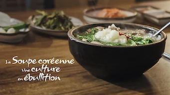
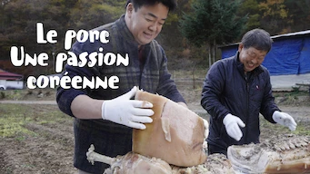
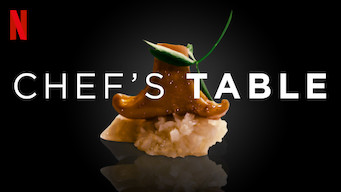
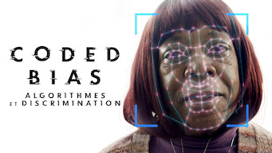

title: Documentaires

# Les Documentaires
_(par pays et par ordre alphabétique)_

## Corée du Sud

Affiche|Information
:---:|:---
 |Documentaire : **La Soupe coréenne : Une culture en ébullition** Origine: **Corée du Sud** Note: :material-star:{.gold .heart}:material-star:{.gold .heart}:material-star-half-full:{.gold .heart}:material-star-outline:{.grey }:material-star-outline:{.grey } Sortie en **2022** Nb. épisodes: **3** :kr: sous-titres en coréens  _Intéressant vis-à-vis de la culture culinaire coréenne._
 |Documentaire : **Le porc : Une passion coréenne / 삼겹살 랩소디** Origine: **Corée du Sud** Note: :material-star:{.gold .heart}:material-star:{.gold .heart}:material-star-half-full:{.gold .heart}:material-star-outline:{.grey }:material-star-outline:{.grey } Sortie en **2020** Nb. épisodes: **2** :kr: sous-titres en coréens  _Documentaire sur la cuisine coréenne. Pour les amateurs de bonne chair, vegan s'abstenir._

## Etats-Unis

Affiche|Information
:---:|:---
 |Documentaire : **Chef's Table** Origine: **Etats-Unis** Note: :material-star:{.gold .heart}:material-star:{.gold .heart}:material-star:{.gold .heart}:material-star:{.gold .heart}:material-star:{.gold .heart} Sortie en **2019** Nb. épisodes: **1**  _Très bien. Je n'ai vu que l'épisode (S3E01) qui m'intéressait sur la nonne bouddhiste Coréenne (il y a 30 épisodes disponibles)_
 |Documentaire : **Coded Bias : Algorithmes et discrimination** Origine: **Etats-Unis** Note: :material-star:{.gold .heart}:material-star:{.gold .heart}:material-star:{.gold .heart}:material-star-outline:{.grey }:material-star-outline:{.grey } Sortie en **2020** Nb. épisodes: **1**  _Bon documentaire sur la dérive provoquée par les algorithmes en intelligence artificielle, principalement sur la reconnaissance faciale._
 |Documentaire : **The Game Changers** Origine: **Etats-Unis** Note: :material-star:{.gold .heart}:material-star:{.gold .heart}:material-star:{.gold .heart}:material-star:{.gold .heart}:material-star-outline:{.grey } Sortie en **2018** Nb. épisodes: **1**  _Contrairement à une idée reçue, l'homme le plus fort du monde est végan, tout comme de plus en plus d'athlètes de haut niveau. Même Schwarzi est devenu végan. Ce documentaire vous explique pourquoi être végan est bon pour le corps, et comment l'industrie de la viande nous enfume depuis des décennies._
