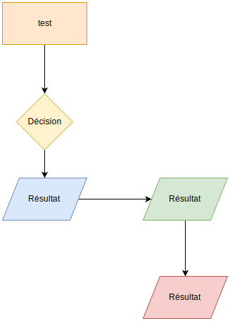
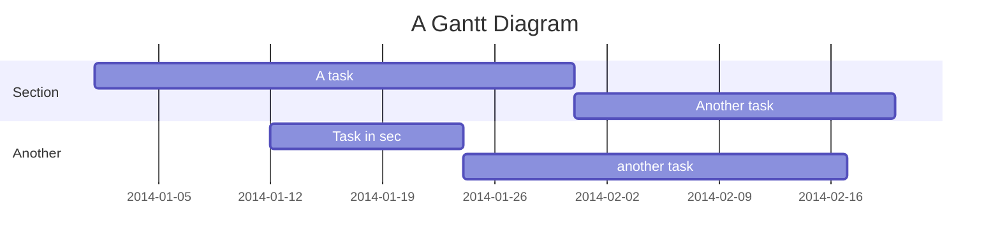

title: Exemple

# Exemple d'utilisation

## Bar d'avancement

MAJ du document

[=65% "65%"]

<!-- [=85%]{: .thin} -->

## Texte

Ecrire en __gras__ ou en _italic_ !

Vous pouvez barrer du texte quand ~~celui-ci est faux~~.

Ou créer des [liens][1] entre les pages (basé sur le fichier en .md).

[1]: index.md

---

lignes de séparation du texte

---

Lorem ipsum[^1] dolor sit amet, consectetur adipiscing elit.[^2]

[^1]: Lorem ipsum dolor sit amet, consectetur adipiscing elit.
[^2]:
    Lorem ipsum dolor sit amet, consectetur adipiscing elit. Nulla et euismod
    nulla. Curabitur feugiat, tortor non consequat finibus, justo purus auctor
    massa, nec semper lorem quam in massa.

> Bloc de texte
> sur plusieurs lignes
>> Incluant un autre bloc !

## Code

```python
import tensorflow as tf

def fonction:
    return 'hrello word'
```

---

```python hl_lines="4"
import tensorflow as tf

def fonction:
    return 'hrello word'
```
__(ou)__

    :::python hl_lines="3 4" linenums="1"
    """ Bubble sort """
    def bubble_sort(items):
        for i in range(len(items)):
            for j in range(len(items) - 1 - i):
                if items[j] > items[j + 1]:
                    items[j], items[j + 1] = items[j + 1], items[j]

### Multiple

```Bash tab='Linux shell'
#!/bin/bash
STR="Hello World!"
echo $STR
```

```C tab=
#include

int main(void) {
  printf("hello, world\n");
}
```

```C++ tab=
#include <iostream>

int main() {
  std::cout << "Hello, world!\n";
  return 0;
}
```

```C# tab='C Sharp'
using System;

class Program {
  static void Main(string[] args) {
    Console.WriteLine("Hello, world!");
  }
}
```

## Boîtes

!!! note
    Lorem ipsum `dolor sit amet`, consectetur adipiscing elit.

!!! tip

!!! abstract

!!! summary

!!! tldr

!!! info

!!! todo

!!! tip

!!! hint

!!! important

!!! success

!!! check

!!! done

!!! question

!!! help

!!! faq

!!! warning

!!! caution

!!! attention

!!! failure

!!! fail

!!! missing

!!! danger

!!! error

!!! bug

!!! example

!!! snippet

!!! quote

!!! cite

!!! warning "Citation"
    _Si vis pacem, para bellum_

    !!! note "Traduction"
        Qui veut la paix prépare la guerre (proverbe romain)

??? danger "Boite masquée..."
    Hello world !

## Liste de tâches

- [x] item 1
  - [x] item A
  - [ ] item B
        more text
    - [x] item a
    - [ ] item b
    - [x] item c
  - [x] item C
- [ ] item 2
- [ ] item 3

## Images SVG




## Mermaid

NE FONCTIONNE PAS !



## Workflow

NE FONCTIONNE PAS !

```flow
  st=>start: Start:>http://www.google.com[blank]
  e=>end:>http://www.google.com
  op1=>operation: My Operation
  sub1=>subroutine: My Subroutine
  cond=>condition: Yes
  or No?:>http://www.google.com
  io=>inputoutput: catch something...

  st->op1->cond
  cond(yes)->io->e
  cond(no)->sub1(right)->op1
```
