title: Films

# Les Films
_(par pays et par ordre alphabétique)_

## Allemagne

Affiche|Information
:---:|:---
 

:material-star:{.gold .heart}:material-star:{.gold .heart}:material-star:{.gold .heart}:material-star-outline:{.grey }:material-star-outline:{.grey }|Film : **Der Medicus / L'oracle** Origine: **Allemagne** Sortie en **2014**  _La médecine au Moyen-Âge, des vérités historiques assez légères pour un ensemble des plus classiques._

## Australie

Affiche|Information
:---:|:---
 

:material-star-half-full:{.gold .heart}:material-star-outline:{.grey }:material-star-outline:{.grey }:material-star-outline:{.grey }:material-star-outline:{.grey }|Film : **Interceptor** Origine: **Australie** Sortie en **2022**  _C'est du déjà vu, rien de nouveau. Le niveau zéro du film d'action._

## Chine

Affiche|Information
:---:|:---
 

:material-star:{.gold .heart}:material-star:{.gold .heart}:material-star:{.gold .heart}:material-star-outline:{.grey }:material-star-outline:{.grey }|Film : **Crouching Tiger, Hidden Dragon: Sword of Destiny** Origine: **Chine** Sortie en **2016**  _Film d'arts martiaux chinois classic du genre._
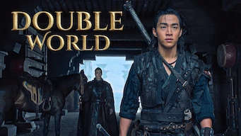 

:material-star:{.gold .heart}:material-star:{.gold .heart}:material-star-half-full:{.gold .heart}:material-star-outline:{.grey }:material-star-outline:{.grey }|Film : **Double World** Origine: **Chine** Sortie en **2020**  _Film de héroïque fantasy chinois, classique du genre, les combats étant toujours surdimensionné._
 

:material-star:{.gold .heart}:material-star:{.gold .heart}:material-star:{.gold .heart}:material-star-outline:{.grey }:material-star-outline:{.grey }|Film : **The Great Wall / La Grande Muraille / 長城** Origine: **Chine** Sortie en **2016**  _Une réinvention de l'utilité de la grande muraille de Chine pour en faire un film de SF, ou comment transformer les invasions mongoles en invasion de monstres._
 

:material-star:{.gold .heart}:material-star:{.gold .heart}:material-star:{.gold .heart}:material-star-outline:{.grey }:material-star-outline:{.grey }|Film : **My Best Friend's Wedding** Origine: **Chine** Sortie en **2016**  _Le mariage de son meilleur ami, déjà traité mais plutôt bien fait._
 

:material-star:{.gold .heart}:material-star-half-full:{.gold .heart}:material-star-outline:{.grey }:material-star-outline:{.grey }:material-star-outline:{.grey }|Film : **Shanghai Fortress** Origine: **Chine** Sortie en **2019**  _Beaucoup d'effets spéciaux mais pour un résultat somme toute modeste dû à un scénario pauvre._
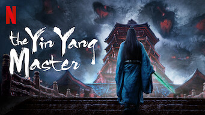 

:material-star:{.gold .heart}:material-star:{.gold .heart}:material-star:{.gold .heart}:material-star-outline:{.grey }:material-star-outline:{.grey }|Film : **The Yin Yang Master** Origine: **Chine** Sortie en **2021**  _Un compte chinois plutôt réussi mais somme toute assez classique._
 

:material-star:{.gold .heart}:material-star:{.gold .heart}:material-star-outline:{.grey }:material-star-outline:{.grey }:material-star-outline:{.grey }|Film : **The Yin-Yang Master: Dream Of Eternity** Origine: **Chine** Sortie en **2021**  _Rien à voir avec l'autre film du même nom (sans l'extension), bien moins intéressant et uniquement basé sur les effets spéciaux._
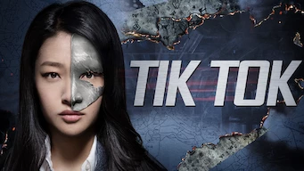 

Retiré de Netflix le 30/06/2021 :material-star:{.gold .heart}:material-star:{.gold .heart}:material-star-half-full:{.gold .heart}:material-star-outline:{.grey }:material-star-outline:{.grey }|Film : **Tik Tok** Origine: **Chine** Sortie en **2016**  _Film chinois réalisé en Corée. Scénario classique de style américain, sans grande surprise. Les démineurs et les policiers ne sont pas très futés._

## Corée du Sud

Affiche|Information
:---:|:---
 

:material-star:{.gold .heart}:material-star:{.gold .heart}:material-star-half-full:{.gold .heart}:material-star-outline:{.grey }:material-star-outline:{.grey }|Film : **26 Years / 26년** Origine: **Corée du Sud** Sortie en **2012**  _Politique-fiction basé sur un fait réel. Bonne réalisation mais l'ensemble est confus._
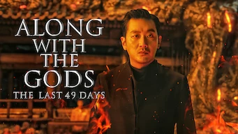 

:material-star:{.gold .heart}:material-star:{.gold .heart}:material-star:{.gold .heart}:material-star-half-full:{.gold .heart}:material-star-outline:{.grey }|Film : **Along with the Gods: The Last 49 Days / 신과함께: 인과 연** Origine: **Corée du Sud** Sortie en **2018** :kr: sous-titres en coréens  _Suite du premier film, qu'il faut avoir vu pour comprendre celui-ci, l'ensemble restant quand même assez décousu._
 

:material-star:{.gold .heart}:material-star:{.gold .heart}:material-star:{.gold .heart}:material-star-half-full:{.gold .heart}:material-star-outline:{.grey }|Film : **Along with the Gods: The Two Worlds / 신과함께: 죄와벌** Origine: **Corée du Sud** Sortie en **2017** :kr: sous-titres en coréens  _Les 7 jugements  en 49 jours après sa mort, un film avec énormément d'effets spéciaux._
 

:material-star:{.gold .heart}:material-star:{.gold .heart}:material-star:{.gold .heart}:material-star:{.gold .heart}:material-star-outline:{.grey }|Film : **Ballerina / 발레리나** Origine: **Corée du Sud** Sortie en **2023** :kr: sous-titres en coréens  _Film d'action, bataille entre garde du corps et crime organisé, très bien filmé._
 

:material-star:{.gold .heart}:material-star-half-full:{.gold .heart}:material-star-outline:{.grey }:material-star-outline:{.grey }:material-star-outline:{.grey }|Film : **Carter / 카터** Origine: **Corée du Sud** Sortie en **2022** :kr: sous-titres en coréens  _Course poursuite sans fin et sans intérêt, la façon dont c'est filmé rend le film difficile à regarder. Surenchère dans les combats, abus de scène avec des câbles, abus de destruction en ton genre... que cela en devient ridicule et rend le résultat au final peu intéressant. Le bon scénario aurait mérité une meilleure réalisation moins surchargée._
 

Retiré de Netflix le 16/06/2021 :material-star:{.gold .heart}:material-star:{.gold .heart}:material-star:{.gold .heart}:material-star-half-full:{.gold .heart}:material-star-outline:{.grey }|Film : **Dernier train pour Busan / 부상행** Origine: **Corée du Sud** Sortie en **2016**  _Très bien fait pour les amateurs du genre mort-vivant, très bonne pub pour le TGV._
 

:material-star:{.gold .heart}:material-star:{.gold .heart}:material-star:{.gold .heart}:material-star:{.gold .heart}:material-star-half-full:{.gold .heart}|Film : **High Society / 상류사회** Origine: **Corée du Sud** Sortie en **2018** :kr: sous-titres en coréens  _Intrigue dans le monde de la politique coréenne, très bien fait._
 

:material-star:{.gold .heart}:material-star:{.gold .heart}:material-star-outline:{.grey }:material-star-outline:{.grey }:material-star-outline:{.grey }|Film : **Illang : La brigade des loups / 인랑** Origine: **Corée du Sud** Sortie en **2018** :kr: sous-titres en coréens  _Beaucoup de combat, il aurait mérité mieux, avec un scénario plus poussé, étant donné un excellent contexte de science-fiction._
 

:material-star:{.gold .heart}:material-star:{.gold .heart}:material-star:{.gold .heart}:material-star-outline:{.grey }:material-star-outline:{.grey }|Film : **JUNG_E / 정이** Origine: **Corée du Sud** Sortie en **2023** :kr: sous-titres en coréens  _L'avenir de l'humanité, malheureusement._
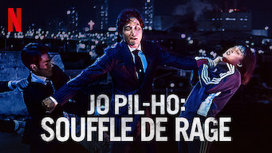 

:material-star:{.gold .heart}:material-star-outline:{.grey }:material-star-outline:{.grey }:material-star-outline:{.grey }:material-star-outline:{.grey }|Film : **Jo Pil-Ho : Souffle de rage / 악질경찰** Origine: **Corée du Sud** Sortie en **2018**  _Pas très bon, violence gratuite, scénario convenu._
 

:material-star:{.gold .heart}:material-star:{.gold .heart}:material-star:{.gold .heart}:material-star-half-full:{.gold .heart}:material-star-outline:{.grey }|Film : **Kill Bok-soon / 길복순** Origine: **Corée du Sud** Sortie en **2023** :kr: sous-titres en coréens  _Histoire de tueur à gage, avec un air de Kill Bill._
 

:material-star:{.gold .heart}:material-star:{.gold .heart}:material-star:{.gold .heart}:material-star:{.gold .heart}:material-star-half-full:{.gold .heart}|Film : **Kingdom: Ashin of the North / 킹덤: 아신전** Origine: **Corée du Sud** Sortie en **2021** :kr: sous-titres en coréens  _Cela ressemble plus à un épisode supplémentaire de la série, ce qui est très bien. En espérant que cela augure d'une 3e saison._
 

:material-star:{.gold .heart}:material-star:{.gold .heart}:material-star-half-full:{.gold .heart}:material-star-outline:{.grey }:material-star-outline:{.grey }|Film : **La Traque / 사냥 의 시간** Origine: **Corée du Sud** Sortie en **2020** :kr: sous-titres en coréens  _Dans un monde chaotique, des petites frappes, nuls au tir, essayent de faire un braquage._
 

:material-star:{.gold .heart}:material-star:{.gold .heart}:material-star:{.gold .heart}:material-star-outline:{.grey }:material-star-outline:{.grey }|Film : **Lucid Dream / 루시드 드림** Origine: **Corée du Sud** Sortie en **2017** :kr: sous-titres en coréens  _Film policier où les recherches d'indices se font dans les rêves des autres; intéressant même si certains effets spéciaux paraissent surdimensionnés._
 

:material-star:{.gold .heart}:material-star:{.gold .heart}:material-star:{.gold .heart}:material-star:{.gold .heart}:material-star-half-full:{.gold .heart}|Film : **The Handmaiden / Mademoiselle / 아가씨** Origine: **Corée du Sud** Sortie en **2016**  _Film très dénudé pour du coréen, mais l'histoire est plein de rebondissement et c'est très beau._
 

:material-star:{.gold .heart}:material-star:{.gold .heart}:material-star:{.gold .heart}:material-star:{.gold .heart}:material-star:{.gold .heart}|Film : **Miss Granny / 수상한 그녀** Origine: **Corée du Sud** Sortie en **2014** :kr: sous-titres en coréens  _Très beau conte moderne, extrêmement bien ficelé, avec des acteurs qui jouent magnifiquement bien._
 

:material-star:{.gold .heart}:material-star:{.gold .heart}:material-star:{.gold .heart}:material-star:{.gold .heart}:material-star-half-full:{.gold .heart}|Film : **Pandora / 판도라** Origine: **Corée du Sud** Sortie en **2016** :kr: sous-titres en coréens  _Excellent film catastrophe, comme la France ne saurait pas le faire._
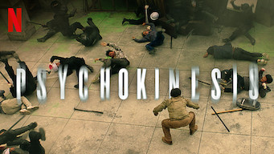 

:material-star:{.gold .heart}:material-star:{.gold .heart}:material-star:{.gold .heart}:material-star:{.gold .heart}:material-star-outline:{.grey }|Film : **Psychokinesis** Origine: **Corée du Sud** Sortie en **2018**  _Les effets spéciaux sont bien fait, dommage que cela ne soit qu'un film et pas une série._
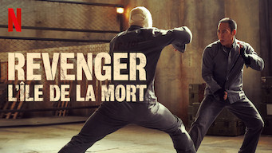 

:material-star:{.gold .heart}:material-star:{.gold .heart}:material-star:{.gold .heart}:material-star-outline:{.grey }:material-star-outline:{.grey }|Film : **Revenger : L'île de la mort / 리벤져** Origine: **Corée du Sud** Sortie en **2018** :kr: sous-titres en coréens  _Entre Mad Max et NY1999, une belle chorégraphie de combats mais avec un scénario pauvre._
 

Retiré de Netflix le 14/12/2021 :material-star:{.gold .heart}:material-star:{.gold .heart}:material-star:{.gold .heart}:material-star:{.gold .heart}:material-star-half-full:{.gold .heart}|Film : **Seoul Searching** Origine: **Corée du Sud** Sortie en **2015**  _Un film sur les Coréens expatriés suite à la guerre de Corée et sur une jeunesse qui revient chercher ses racines en Corée; très bien fait, aborde bien les problématiques de cette jeunesse expatriée._
 

:material-star:{.gold .heart}:material-star:{.gold .heart}:material-star:{.gold .heart}:material-star:{.gold .heart}:material-star-outline:{.grey }|Film : **Silenced / 도가니** Origine: **Corée du Sud** Sortie en **2011** :kr: sous-titres en coréens  _Sujet difficile puisque cela concerne des enfants malentendants, mais le scénario est crédible._
 

:material-star:{.gold .heart}:material-star:{.gold .heart}:material-star:{.gold .heart}:material-star:{.gold .heart}:material-star-outline:{.grey }|Film : **Space Sweepers** Origine: **Corée du Sud** Sortie en **2021**  _Très bon film de SF, les effets spéciaux sont excellents._
 

:material-star:{.gold .heart}:material-star:{.gold .heart}:material-star:{.gold .heart}:material-star:{.gold .heart}:material-star:{.gold .heart}|Film : **Steel Rain / 강철비** Origine: **Corée du Sud** Sortie en **2018**  _Thriller politico-espionnage très bien réalisé._
 

:material-star:{.gold .heart}:material-star:{.gold .heart}:material-star:{.gold .heart}:material-star-outline:{.grey }:material-star-outline:{.grey }|Film : **Svaha: The Sixth Finger / 사바하** Origine: **Corée du Sud** Sortie en **2019**  _Film à suspense avec religion et des mots, bizarre et intéressant à la fois._
 

:material-star:{.gold .heart}:material-star:{.gold .heart}:material-star:{.gold .heart}:material-star-half-full:{.gold .heart}:material-star-outline:{.grey }|Film : **The Bros / 부라더** Origine: **Corée du Sud** Sortie en **2017**  _Des excellents acteurs, il faut attendre la fin du film pour pleinement l'apprécier._
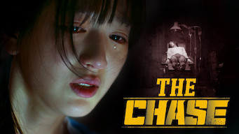 

:material-star:{.gold .heart}:material-star:{.gold .heart}:material-star:{.gold .heart}:material-star-outline:{.grey }:material-star-outline:{.grey }|Film : **The Chase / 반드시 잡는다** Origine: **Corée du Sud** Sortie en **2017**  _Un bon policier, mené par des acteurs connus._
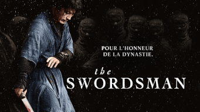 

:material-star:{.gold .heart}:material-star:{.gold .heart}:material-star:{.gold .heart}:material-star-outline:{.grey }:material-star-outline:{.grey }|Film : **The Swordsman / 검객** Origine: **Corée du Sud** Sortie en **2020**  _Film historique plutôt bien réalisé, beaucoup de combat mais un peu trop larmoyant._
 

:material-star:{.gold .heart}:material-star-outline:{.grey }:material-star-outline:{.grey }:material-star-outline:{.grey }:material-star-outline:{.grey }|Film : **What Happened to Mr. Cha?** Origine: **Corée du Sud** Sortie en **2021**  _Ennuyeux_
 

:material-star:{.gold .heart}:material-star:{.gold .heart}:material-star:{.gold .heart}:material-star-outline:{.grey }:material-star-outline:{.grey }|Film : **Par la voix des airs / Wish You / 위시유** Origine: **Corée du Sud** Sortie en **2021** :kr: sous-titres en coréens  _Film sur fond d'histoire un peu LGBT dans le monde de la musique, plutôt bien réalisé, même les personnages secondaires sont aussi intéressants._
 

:material-star:{.gold .heart}:material-star:{.gold .heart}:material-star:{.gold .heart}:material-star:{.gold .heart}:material-star-outline:{.grey }|Film : **Yaksha, un démon en mission / 야차** Origine: **Corée du Sud** Sortie en **2022** :kr: sous-titres en coréens  _Film d'espionnage plutôt orienté action, assez bien fait._

## Etats-Unis

Affiche|Information
:---:|:---
 

:material-star:{.gold .heart}:material-star:{.gold .heart}:material-star-half-full:{.gold .heart}:material-star-outline:{.grey }:material-star-outline:{.grey }|Film : **Agent Stone** Origine: **Etats-Unis** Sortie en **2023**  _Film d'action sans surprise._
 

:material-star:{.gold .heart}:material-star:{.gold .heart}:material-star-half-full:{.gold .heart}:material-star-outline:{.grey }:material-star-outline:{.grey }|Film : **Aquaman** Origine: **Etats-Unis** Sortie en **2018**  _Scénario classique, dans la surenchère permanente, uniquement basé sur des effets spéciaux, l'aspect aquatique étant la seule différence avec les autres films de super-héros du même genre._
 

:material-star:{.gold .heart}:material-star-half-full:{.gold .heart}:material-star-outline:{.grey }:material-star-outline:{.grey }:material-star-outline:{.grey }|Film : **Ava** Origine: **Etats-Unis** Sortie en **2020**  _Ennuyeux, prévisible; les combats et les situations sont totalement irréalistes, ce qui enlève tout intérêt pour un film de ce type._
 

:material-star:{.gold .heart}:material-star-outline:{.grey }:material-star-outline:{.grey }:material-star-outline:{.grey }:material-star-outline:{.grey }|Film : **Blue Bayou** Origine: **Etats-Unis** Sortie en **2021**  _Pas intéressant, trop prévisible, trop classique, trop monotone._
 

:material-star:{.gold .heart}:material-star:{.gold .heart}:material-star-half-full:{.gold .heart}:material-star-outline:{.grey }:material-star-outline:{.grey }|Film : **What Men Want / Ce Que Veulent Les Hommes** Origine: **Etats-Unis** Sortie en **2019**  _Un scénario plutôt léger, bien loin de l'original._
 

:material-star:{.gold .heart}:material-star:{.gold .heart}:material-star-outline:{.grey }:material-star-outline:{.grey }:material-star-outline:{.grey }|Film : **Cinquante Nuances de Grey** Origine: **Etats-Unis** Sortie en **2015**  _Sujet mal abordé, scénario trop basique, peu crédible._
 

:material-star:{.gold .heart}:material-star:{.gold .heart}:material-star-outline:{.grey }:material-star-outline:{.grey }:material-star-outline:{.grey }|Film : **Fifty Shades Freed / Cinquante nuances plus claires** Origine: **Etats-Unis** Sortie en **2018**  _Un scénario bien trop basique et sans surprise._
 

:material-star:{.gold .heart}:material-star:{.gold .heart}:material-star:{.gold .heart}:material-star:{.gold .heart}:material-star-outline:{.grey }|Film : **Don't Look Up : Déni cosmique** Origine: **Etats-Unis** Sortie en **2021**  _Le monde politico-médiatique tel qu'il est._
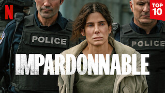 

:material-star:{.gold .heart}:material-star:{.gold .heart}:material-star-outline:{.grey }:material-star-outline:{.grey }:material-star-outline:{.grey }|Film : **Impardonnable** Origine: **Etats-Unis** Sortie en **2021**  _Un scénario malheureusement sans surprise, même si les acteurs sont excellents._
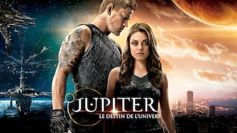 

Retiré de Netflix le 04/02/2022 :material-star:{.gold .heart}:material-star-outline:{.grey }:material-star-outline:{.grey }:material-star-outline:{.grey }:material-star-outline:{.grey }|Film : **Jupiter : le destin de l'univers** Origine: **Etats-Unis** Sortie en **2015**  _Surenchère d'effets spéciaux sur un scénario d'une platitude absolue._
 

:material-star:{.gold .heart}:material-star:{.gold .heart}:material-star-outline:{.grey }:material-star-outline:{.grey }:material-star-outline:{.grey }|Film : **Random Hearts / L'ombre d'un soupçon** Origine: **Etats-Unis** Sortie en **1999**  _Un crétin rencontre une imbécile dans une situation improbable ce qui  provoque  d'autres situations improbables._
 

:material-star:{.gold .heart}:material-star:{.gold .heart}:material-star:{.gold .heart}:material-star-half-full:{.gold .heart}:material-star-outline:{.grey }|Film : **DamSel / La Demoiselle et le dragon** Origine: **Etats-Unis** Sortie en **2024**  _Proche d'un conte, assez classique mais bien fait._
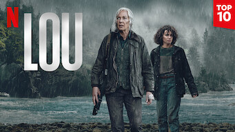 

:material-star:{.gold .heart}:material-star:{.gold .heart}:material-star-half-full:{.gold .heart}:material-star-outline:{.grey }:material-star-outline:{.grey }|Film : **Lou** Origine: **Etats-Unis** Sortie en **2022**  _Scénario à l'américaine assez classique d'une chasse à l'homme. Déjà vu._
 

:material-star:{.gold .heart}:material-star:{.gold .heart}:material-star:{.gold .heart}:material-star-outline:{.grey }:material-star-outline:{.grey }|Film : **Mission: Impossible - Fallout** Origine: **Etats-Unis** Sortie en **2018**  _Classique, mais bon dans ce genre._
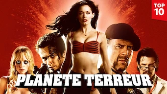 

:material-star-outline:{.grey }:material-star-outline:{.grey }:material-star-outline:{.grey }:material-star-outline:{.grey }:material-star-outline:{.grey }|Film : **Planète terreur** Origine: **Etats-Unis** Sortie en **2007**  _Sans intérêt, pseudo-tentative de faire quelques choses de décalé, totalement loupé._
 

:material-star:{.gold .heart}:material-star:{.gold .heart}:material-star-half-full:{.gold .heart}:material-star-outline:{.grey }:material-star-outline:{.grey }|Film : **Hidden Strike / Project X-Traction / 狂怒沙暴** Origine: **Etats-Unis** Sortie en **2023**  _Film d'action chino-américain avec Jackie Chan, classique du genre._
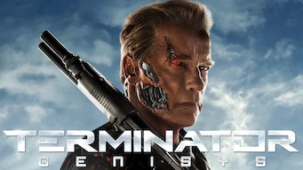 

:material-star:{.gold .heart}:material-star:{.gold .heart}:material-star-half-full:{.gold .heart}:material-star-outline:{.grey }:material-star-outline:{.grey }|Film : **Terminator Genisys** Origine: **Etats-Unis** Sortie en **2015**  _Course poursuite interminable, classique du genre; même si c'est très bien fait, rien de nouveau dans la série de terminator._
 

:material-star:{.gold .heart}:material-star:{.gold .heart}:material-star:{.gold .heart}:material-star-outline:{.grey }:material-star-outline:{.grey }|Film : **The Big Short** Origine: **Etats-Unis** Sortie en **2015**  _La crise des subprimes de 2008 pour les nulls. Edifiant !_
 

:material-star:{.gold .heart}:material-star-half-full:{.gold .heart}:material-star-outline:{.grey }:material-star-outline:{.grey }:material-star-outline:{.grey }|Film : **The Gray Man** Origine: **Etats-Unis** Sortie en **2022**  _Chasse à l'homme des plus classiques sur fond d'espionnage de la CIA. Malheureusement la crédibilité des actions est quasiment nul._
 

:material-star:{.gold .heart}:material-star:{.gold .heart}:material-star-half-full:{.gold .heart}:material-star-outline:{.grey }:material-star-outline:{.grey }|Film : **The Killer** Origine: **Etats-Unis** Sortie en **2023**  _Un tueur des plus classique._
 

:material-star:{.gold .heart}:material-star:{.gold .heart}:material-star:{.gold .heart}:material-star-outline:{.grey }:material-star-outline:{.grey }|Film : **The Old Guard** Origine: **Etats-Unis** Sortie en **2020**  _Une idée originale, mais un scénario à l'américaine toujours aussi pauvre._
 

Retiré de Netflix le 18/03/2022 :material-star:{.gold .heart}:material-star:{.gold .heart}:material-star:{.gold .heart}:material-star-outline:{.grey }:material-star-outline:{.grey }|Film : **Wonder Woman** Origine: **Etats-Unis** Sortie en **2018**  _Plutôt bien fait, mais un peu trop dans l'américanade de base, malgré certains efforts sur le contexte mythique qui reste mal développé._
 

:material-star:{.gold .heart}:material-star:{.gold .heart}:material-star-outline:{.grey }:material-star-outline:{.grey }:material-star-outline:{.grey }|Film : **Wonder Woman 1984** Origine: **Etats-Unis** Sortie en **2020**  _Uniquement basé sur les effets spéciaux._
 

:material-star:{.gold .heart}:material-star-half-full:{.gold .heart}:material-star-outline:{.grey }:material-star-outline:{.grey }:material-star-outline:{.grey }|Film : **Wu Assassins** Origine: **Etats-Unis** Sortie en **2019**  _Le scénario part un peu dans tous les sens, les flashback sont mal venus, l'ensemble est assez confus. Seuls les combats sont bien fait._
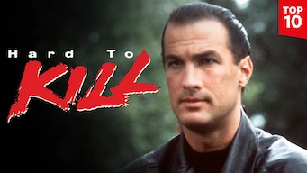 

:material-star:{.gold .heart}:material-star-outline:{.grey }:material-star-outline:{.grey }:material-star-outline:{.grey }:material-star-outline:{.grey }|Film : **Hard to kill / Échec et mort** Origine: **Etats-Unis** Sortie en **1990**  _Série B classique américaine._

## France

Affiche|Information
:---:|:---
 

:material-star:{.gold .heart}:material-star:{.gold .heart}:material-star-outline:{.grey }:material-star-outline:{.grey }:material-star-outline:{.grey }|Film : **8 Rue de l’Humanité** Origine: **France** Sortie en **2021**  _Un film sur le confinement dû au covid, mais beaucoup trop poussif._
 

:material-star:{.gold .heart}:material-star:{.gold .heart}:material-star-outline:{.grey }:material-star-outline:{.grey }:material-star-outline:{.grey }|Film : **AKA** Origine: **France** Sortie en **2023**  _Film d'action, avec une approche très basique._
 

:material-star:{.gold .heart}:material-star:{.gold .heart}:material-star:{.gold .heart}:material-star-outline:{.grey }:material-star-outline:{.grey }|Film : **Au nom de ma fille** Origine: **France** Sortie en **2016**  _Histoire policière basée sur des faits réels._
 

:material-star:{.gold .heart}:material-star:{.gold .heart}:material-star:{.gold .heart}:material-star-outline:{.grey }:material-star-outline:{.grey }|Film : **Balle perdue** Origine: **France** Sortie en **2020**  _un policier français assez classique mais plutôt bien réalisé._
 

:material-star:{.gold .heart}:material-star:{.gold .heart}:material-star:{.gold .heart}:material-star-outline:{.grey }:material-star-outline:{.grey }|Film : **Balle perdue 2** Origine: **France** Sortie en **2022**  _Equivalent au premier film._
 

:material-star:{.gold .heart}:material-star:{.gold .heart}:material-star-half-full:{.gold .heart}:material-star-outline:{.grey }:material-star-outline:{.grey }|Film : **Bigbug** Origine: **France** Sortie en **2022**  _Le futur avec les robots, bien fait mais la mayonnaise ne prend pas._
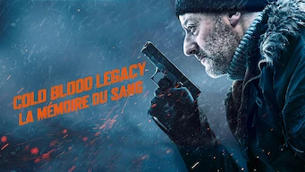 

:material-star:{.gold .heart}:material-star:{.gold .heart}:material-star:{.gold .heart}:material-star-outline:{.grey }:material-star-outline:{.grey }|Film : **Cold Blood Legacy - La mémoire du sang** Origine: **France** Sortie en **2019**  _Histoire de tueur à gage avec Jean Reno, l'histoire est pas mal mais le scénario trop léger._
 

:material-star:{.gold .heart}:material-star:{.gold .heart}:material-star:{.gold .heart}:material-star:{.gold .heart}:material-star-outline:{.grey }|Film : **Colombiana** Origine: **France** Sortie en **2011**  _Sénario bien fait, qui s'enchaine bien._
 

:material-star:{.gold .heart}:material-star:{.gold .heart}:material-star-half-full:{.gold .heart}:material-star-outline:{.grey }:material-star-outline:{.grey }|Film : **Entre Amis** Origine: **France** Sortie en **2015**  _Film comique bien réalisé, mais "déjà vu"._
 

:material-star:{.gold .heart}:material-star:{.gold .heart}:material-star:{.gold .heart}:material-star-outline:{.grey }:material-star-outline:{.grey }|Film : **Erreur de la Banque en Votre Faveur** Origine: **France** Sortie en **2009**  _Les magouilles d'une banque, détournées au profit des petites gens, classique mais bien fait._
 

:material-star:{.gold .heart}:material-star:{.gold .heart}:material-star:{.gold .heart}:material-star:{.gold .heart}:material-star-outline:{.grey }|Film : **L'Intervention** Origine: **France** Sortie en **2019**  _Les débuts du groupe d'intervention de la gendarmerie nationale._
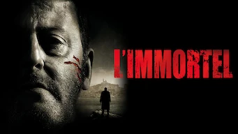 

:material-star:{.gold .heart}:material-star:{.gold .heart}:material-star:{.gold .heart}:material-star-outline:{.grey }:material-star-outline:{.grey }|Film : **L'immortel** Origine: **France** Sortie en **2010**  _Histoire de truands à Marseille, policier classique français._
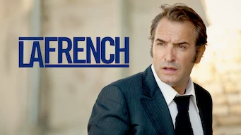 

:material-star:{.gold .heart}:material-star:{.gold .heart}:material-star:{.gold .heart}:material-star-outline:{.grey }:material-star-outline:{.grey }|Film : **La French** Origine: **France** Sortie en **2014**  _Histoire de la french-connection, baséesur des faits réels._
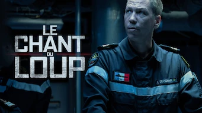 

:material-star:{.gold .heart}:material-star:{.gold .heart}:material-star:{.gold .heart}:material-star-outline:{.grey }:material-star-outline:{.grey }|Film : **Le Chant du Loup** Origine: **France** Sortie en **2019**  _Le contexte de l'histoire est pas mal, mais certains détails clochent et surtout c'est un peu trop surjouer._
 

:material-star:{.gold .heart}:material-star:{.gold .heart}:material-star-half-full:{.gold .heart}:material-star-outline:{.grey }:material-star-outline:{.grey }|Film : **Le grand partage** Origine: **France** Sortie en **2015**  _Le sens du partage en France, une notion pas si politique, finalement._
 

:material-star-half-full:{.gold .heart}:material-star-outline:{.grey }:material-star-outline:{.grey }:material-star-outline:{.grey }:material-star-outline:{.grey }|Film : **Les municipaux - Trop c'est trop** Origine: **France** Sortie en **2022**  _Null, même les blagues tombent à plat._
 

:material-star:{.gold .heart}:material-star:{.gold .heart}:material-star-half-full:{.gold .heart}:material-star-outline:{.grey }:material-star-outline:{.grey }|Film : **Let's Dance** Origine: **France** Sortie en **2019**  _Il y a des idées mais le scénario est un peu trop basique._
 

:material-star:{.gold .heart}:material-star-half-full:{.gold .heart}:material-star-outline:{.grey }:material-star-outline:{.grey }:material-star-outline:{.grey }|Film : **Loin du périph** Origine: **France** Sortie en **2022**  _Policier français des plus classiques; à noter la très mauvaise qualité du son._
 

:material-star:{.gold .heart}:material-star-half-full:{.gold .heart}:material-star-outline:{.grey }:material-star-outline:{.grey }:material-star-outline:{.grey }|Film : **Sentinelle** Origine: **France** Sortie en **2021**  _Pas du tout crédible._
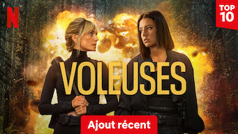 

:material-star:{.gold .heart}:material-star:{.gold .heart}:material-star:{.gold .heart}:material-star:{.gold .heart}:material-star:{.gold .heart}|Film : **Voleuses** Origine: **France** Sortie en **2023**  _Ça démarre vite et c'est bien fait._

## Hollande

Affiche|Information
:---:|:---
 

:material-star:{.gold .heart}:material-star:{.gold .heart}:material-star:{.gold .heart}:material-star-outline:{.grey }:material-star-outline:{.grey }|Film : **The Takeover** Origine: **Hollande** Sortie en **2022**  _Une enquête policière avec le hacking en base de fond. Le scénario est pas mal mais les phases de hacking sont complètement bidon, certains diraient vulgariser._

## Japon

Affiche|Information
:---:|:---
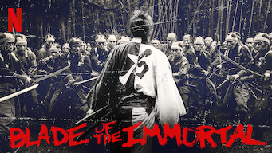 

:material-star:{.gold .heart}:material-star:{.gold .heart}:material-star-half-full:{.gold .heart}:material-star-outline:{.grey }:material-star-outline:{.grey }|Film : **Blade of the Immortal** Origine: **Japon** Sortie en **2017**  _Cela relève plus de la BD que du film de samouraï. Trop de surenchère._
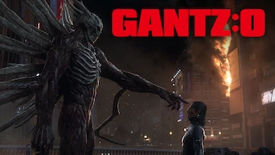 

:material-star:{.gold .heart}:material-star:{.gold .heart}:material-star-outline:{.grey }:material-star-outline:{.grey }:material-star-outline:{.grey }|Film : **GANTZ: O** Origine: **Japon** Sortie en **2016**  _Série animée plutôt bien fait, mais avec un scénario style jeux vidéo pas terrible._
 

:material-star:{.gold .heart}:material-star:{.gold .heart}:material-star-outline:{.grey }:material-star-outline:{.grey }:material-star-outline:{.grey }|Film : **In Love and Deep Water** Origine: **Japon** Sortie en **2023**  _Malgré la légèreté du scénario, il aurait pu tenir la route s'il n'y avait pas eu trop de choses invraisemblable._
 

:material-star:{.gold .heart}:material-star-half-full:{.gold .heart}:material-star-outline:{.grey }:material-star-outline:{.grey }:material-star-outline:{.grey }|Film : **Kenshin : L’achèvement** Origine: **Japon** Sortie en **2021**  _Bien moins bon que le premier film, tiens plus du manga, les combats ne sont absolument pas réalistes._
 

:material-star:{.gold .heart}:material-star:{.gold .heart}:material-star:{.gold .heart}:material-star:{.gold .heart}:material-star-outline:{.grey }|Film : **Kingdom** Origine: **Japon** Sortie en **2019**  _Film qui reprend de façon assez poussé le manga du même nom._
 

:material-star:{.gold .heart}:material-star:{.gold .heart}:material-star:{.gold .heart}:material-star:{.gold .heart}:material-star-outline:{.grey }|Film : **Kingdom 2 : En terre lointaine** Origine: **Japon** Sortie en **2022**  _Film qui reprend de façon assez poussé le manga du même nom._
 

:material-star:{.gold .heart}:material-star:{.gold .heart}:material-star:{.gold .heart}:material-star:{.gold .heart}:material-star-outline:{.grey }|Film : **Kingdom 3 : La flamme du destin** Origine: **Japon** Sortie en **2023**  _L'histoire suit bien la même trame que le dessin animé, et c'est très bien._
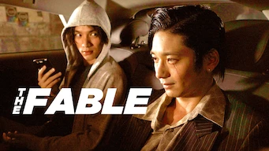 

:material-star:{.gold .heart}:material-star:{.gold .heart}:material-star-outline:{.grey }:material-star-outline:{.grey }:material-star-outline:{.grey }|Film : **The Fable: The Killer Who Doesn't Kill / THE FABLE** Origine: **Japon** Sortie en **2019**  _Style manga, beaucoup de combats et quelques parties un peu fun._
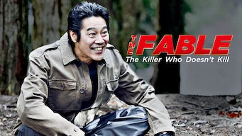 

:material-star:{.gold .heart}:material-star:{.gold .heart}:material-star:{.gold .heart}:material-star-outline:{.grey }:material-star-outline:{.grey }|Film : **The Fable / The Fable: The Killer Who Doesn't Kill** Origine: **Japon** Sortie en **2021**  _Suite du premier film, assez bien fait, et les combats sont moins surréalistes (ou alors on s'y habitue)._
 

:material-star:{.gold .heart}:material-star:{.gold .heart}:material-star:{.gold .heart}:material-star-outline:{.grey }:material-star-outline:{.grey }|Film : **The Door into Summer / Une porte sur l'été** Origine: **Japon** Sortie en **2021**  _Film de science-fiction futuriste, basé sur une bonne idée, mais qui part un peu trop dans une boucle._
 

:material-star:{.gold .heart}:material-star-half-full:{.gold .heart}:material-star-outline:{.grey }:material-star-outline:{.grey }:material-star-outline:{.grey }|Film : **Violence Action** Origine: **Japon** Sortie en **2022**  _Film qui porte bien son nom, mais le second degré ne fonctionne pas avec ce manga._

## Royaume-Uni

Affiche|Information
:---:|:---
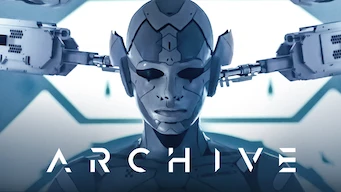 

:material-star:{.gold .heart}:material-star:{.gold .heart}:material-star-outline:{.grey }:material-star-outline:{.grey }:material-star-outline:{.grey }|Film : **Archive** Origine: **Royaume-Uni** Sortie en **2020**  _Film de science-fiction basé sur la robotique et ses travers, le résultat est toutefois assez ennuyeux._
 

:material-star:{.gold .heart}:material-star:{.gold .heart}:material-star:{.gold .heart}:material-star-outline:{.grey }:material-star-outline:{.grey }|Film : **Enola Holmes** Origine: **Royaume-Uni** Sortie en **2020**  _Classique du genre, sans surprise._
 

:material-star:{.gold .heart}:material-star:{.gold .heart}:material-star:{.gold .heart}:material-star-outline:{.grey }:material-star-outline:{.grey }|Film : **Enola Holmes 2** Origine: **Royaume-Uni** Sortie en **2022**  _Bien fait, le Londres historique et son atmosphère sont bien reconstituées. Par contre on ne comprend pas que le personnage principal mette autant de temps à faire le lien entre certains composants de l'intrigue._
 

:material-star:{.gold .heart}:material-star:{.gold .heart}:material-star:{.gold .heart}:material-star-half-full:{.gold .heart}:material-star-outline:{.grey }|Film : **The Last Kingdom : Seven Kings Must Die / The Last Kingdom : Sept rois doivent mourir** Origine: **Royaume-Uni** Sortie en **2023**  _Suite de la série, et fin._

## Russie

Affiche|Information
:---:|:---
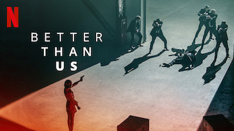 

:material-star:{.gold .heart}:material-star:{.gold .heart}:material-star:{.gold .heart}:material-star-outline:{.grey }:material-star-outline:{.grey }|Film : **Better Than Us** Origine: **Russie** Sortie en **2019**  _Les robots chez les russes, plutôt bien fait et bien construit, avec un scénario qui tient la route._

## Tchéquie

Affiche|Information
:---:|:---
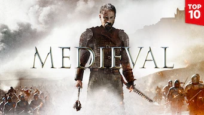 

:material-star:{.gold .heart}:material-star:{.gold .heart}:material-star:{.gold .heart}:material-star-outline:{.grey }:material-star-outline:{.grey }|Film : **Medieval** Origine: **Tchéquie** Sortie en **2022**  _Film historique avec beaucoup de combat plutôt bien fait._

## Thaïlande

Affiche|Information
:---:|:---
 

:material-star:{.gold .heart}:material-star:{.gold .heart}:material-star-half-full:{.gold .heart}:material-star-outline:{.grey }:material-star-outline:{.grey }|Film : **AI Love You** Origine: **Thaïlande** Sortie en **2022**  _Petit film avec de bons trucages sur l'intelligence artificielle, au sens robotique._
