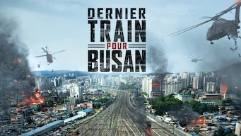

title: Films

#Les Films
_(par pays et par ordre alphabétique)_

##Chine

Affiche|Information
:---:|:---
 :material-netflix:{ .rouge }Retiré de Netflix le 30/06/2021|Film : **Tik Tok** Origine: **Chine** Note: :material-star:{.gold }:material-star:{.gold }:material-star-half-full:{.gold .heart}:material-star:{.grey }:material-star:{.grey } Sortie en **2016**  _Film chinois réalisé en Corée. Scénario classique de style américain, sans grande surprise. Les démineurs et les policiers ne sont pas très futés._

##Corée du Sud

Affiche|Information
:---:|:---
 |Film : **26 Years / 26년** Origine: **Corée du Sud** Note: :material-star:{.gold }:material-star:{.gold }:material-star-half-full:{.gold .heart}:material-star:{.grey }:material-star:{.grey } Sortie en **2012**  _Politique-fiction basé sur un fait réel. Bonne réalisation mais l'ensemble est confus._
 :material-netflix:{ .rouge }Retiré de Netflix le 16/06/2021|Film : **Dernier train pour Busan / 부상행** Origine: **Corée du Sud** Note: :material-star:{.gold }:material-star:{.gold }:material-star:{.gold }:material-star-half-full:{.gold .heart}:material-star:{.grey } Sortie en **2016**  _Très bien fait pour les amateurs du genre mort-vivant, très bonne pub pour le TGV._
 |Film : **Illang : La brigade des loups / 인랑** Origine: **Corée du Sud** Note: :material-star:{.gold }:material-star:{.gold .heart}:material-star:{.grey }:material-star:{.grey }:material-star:{.grey } Sortie en **2018** :kr: sous-titres en coréens  _Beaucoup de combat, il aurait mérité mieux, avec un scénario plus poussé, étant donné un excellent contexte de science-fiction._
 |Film : **Jo Pil-Ho : Souffle de rage / 악질경찰** Origine: **Corée du Sud** Note: :material-star:{.gold .heart}:material-star:{.grey }:material-star:{.grey }:material-star:{.grey }:material-star:{.grey } Sortie en **2018**  _Pas très bon, violence gratuite, scénario convenu._
 |Film : **Kingdom: Ashin of the North / 킹덤: 아신전** Origine: **Corée du Sud** Note: :material-star:{.gold }:material-star:{.gold }:material-star:{.gold }:material-star:{.gold }:material-star-half-full:{.gold .heart} Sortie en **2021** :kr: sous-titres en coréens  _Cela ressemble plus à un épisode supplémentaire de la série, ce qui est très bien. En espérant que cela augure d'une 3e saison._
 |Film : **Psychokinesis** Origine: **Corée du Sud** Note: :material-star:{.gold }:material-star:{.gold }:material-star:{.gold }:material-star:{.gold .heart}:material-star:{.grey } Sortie en **2018**  _Les effets spéciaux sont bien fait, dommage que cela ne soit qu'un film et pas une série._
 |Film : **Space Sweepers** Origine: **Corée du Sud** Note: :material-star:{.gold }:material-star:{.gold }:material-star:{.gold }:material-star:{.gold .heart}:material-star:{.grey } Sortie en **2021**  _Très bon film de SF, les effets spéciaux sont excellents._
 |Film : **Steel Rain / 강철비** Origine: **Corée du Sud** Note: :material-star:{.gold }:material-star:{.gold }:material-star:{.gold }:material-star:{.gold }:material-star:{.gold .heart} Sortie en **2018**  _Thriller politico-espionnage très bien réalisé._
 |Film : **The Bros / 부라더** Origine: **Corée du Sud** Note: :material-star:{.gold }:material-star:{.gold }:material-star:{.gold }:material-star-half-full:{.gold .heart}:material-star:{.grey } Sortie en **2017**  _Des excellents acteurs, il faut attendre la fin du film pour pleinement l'apprécier._
 |Film : **What Happened to Mr. Cha?** Origine: **Corée du Sud** Note: :material-star:{.gold .heart}:material-star:{.grey }:material-star:{.grey }:material-star:{.grey }:material-star:{.grey } Sortie en **2021**  _Ennuyeux_

##Etats-Unis

Affiche|Information
:---:|:---
 |Film : **Cinquante Nuances de Grey** Origine: **Etats-Unis** Note: :material-star:{.gold }:material-star:{.gold .heart}:material-star:{.grey }:material-star:{.grey }:material-star:{.grey } Sortie en **2015**  _Sujet mal abordé, scénario trop basique, peu crédible._
 |Film : **Fifty Shades Freed / Cinquante nuances plus claires** Origine: **Etats-Unis** Note: :material-star:{.gold }:material-star:{.gold .heart}:material-star:{.grey }:material-star:{.grey }:material-star:{.grey } Sortie en **2018**  _Un scénario bien trop basique, sans surprise._

##France

Affiche|Information
:---:|:---
 |Film : **Colombiana** Origine: **France** Note: :material-star:{.gold }:material-star:{.gold }:material-star:{.gold }:material-star:{.gold .heart}:material-star:{.grey } Sortie en **2011**  _Sénario bien fait._

##Japon

Affiche|Information
:---:|:---
 |Film : **Blade of the Immortal** Origine: **Japon** Note: :material-star:{.gold }:material-star:{.gold }:material-star-half-full:{.gold .heart}:material-star:{.grey }:material-star:{.grey } Sortie en **2017**  _Cela relève plus de la BD que du film de samouraï. Trop de surenchère._
 |Film : **Kenshin : L’achèvement** Origine: **Japon** Note: :material-star:{.gold }:material-star-half-full:{.gold .heart}:material-star:{.grey }:material-star:{.grey }:material-star:{.grey } Sortie en **2021**  _Bien moins bon que le premier film, tiens plus du manga, les combats ne sont absolument pas réalistes._
