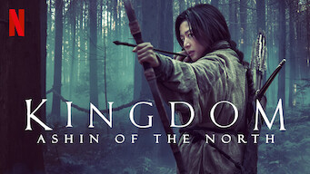
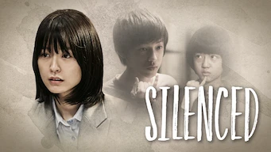
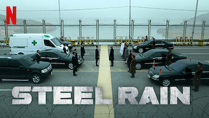
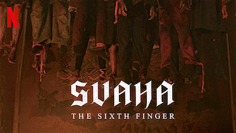

title: Films

# Les Films
_(par pays et par ordre alphabétique)_

## Chine

Affiche|Information
:---:|:---
 :material-netflix:{ .rouge }Retiré de Netflix le 30/06/2021|Film : **Tik Tok** Origine: **Chine** Note: :material-star:{.gold .heart}:material-star:{.gold .heart}:material-star-half-full:{.gold .heart}:material-star-outline:{.grey }:material-star-outline:{.grey } Sortie en **2016**  _Film chinois réalisé en Corée. Scénario classique de style américain, sans grande surprise. Les démineurs et les policiers ne sont pas très futés._

## Corée du Sud

Affiche|Information
:---:|:---
 |Film : **26 Years / 26년** Origine: **Corée du Sud** Note: :material-star:{.gold .heart}:material-star:{.gold .heart}:material-star-half-full:{.gold .heart}:material-star-outline:{.grey }:material-star-outline:{.grey } Sortie en **2012**  _Politique-fiction basé sur un fait réel. Bonne réalisation mais l'ensemble est confus._
 |Film : **Along with the Gods: The Last 49 Days / 신과함께: 인과 연** Origine: **Corée du Sud** Note: :material-star:{.gold .heart}:material-star:{.gold .heart}:material-star:{.gold .heart}:material-star-half-full:{.gold .heart}:material-star-outline:{.grey } Sortie en **2018** :kr: sous-titres en coréens  _Suite du premier film, qu'il faut avoir vu pour comprendre celui-ci, l'ensemble restant quand même assez décousu._
 |Film : **Along with the Gods: The Two Worlds / 신과함께: 죄와벌** Origine: **Corée du Sud** Note: :material-star:{.gold .heart}:material-star:{.gold .heart}:material-star:{.gold .heart}:material-star-half-full:{.gold .heart}:material-star-outline:{.grey } Sortie en **2017** :kr: sous-titres en coréens  _Les 7 jugements  en 49 jours après sa mort, un film avec énormément d'effets spéciaux._
 :material-netflix:{ .rouge }Retiré de Netflix le 16/06/2021|Film : **Dernier train pour Busan / 부상행** Origine: **Corée du Sud** Note: :material-star:{.gold .heart}:material-star:{.gold .heart}:material-star:{.gold .heart}:material-star-half-full:{.gold .heart}:material-star-outline:{.grey } Sortie en **2016**  _Très bien fait pour les amateurs du genre mort-vivant, très bonne pub pour le TGV._
 |Film : **High Society / 상류사회** Origine: **Corée du Sud** Note: :material-star:{.gold .heart}:material-star:{.gold .heart}:material-star:{.gold .heart}:material-star:{.gold .heart}:material-star-half-full:{.gold .heart} Sortie en **2018** :kr: sous-titres en coréens  _Intrigue dans le monde de la politique coréenne, très bien fait._
 |Film : **Illang : La brigade des loups / 인랑** Origine: **Corée du Sud** Note: :material-star:{.gold .heart}:material-star:{.gold .heart}:material-star-outline:{.grey }:material-star-outline:{.grey }:material-star-outline:{.grey } Sortie en **2018** :kr: sous-titres en coréens  _Beaucoup de combat, il aurait mérité mieux, avec un scénario plus poussé, étant donné un excellent contexte de science-fiction._
 |Film : **Jo Pil-Ho : Souffle de rage / 악질경찰** Origine: **Corée du Sud** Note: :material-star:{.gold .heart}:material-star-outline:{.grey }:material-star-outline:{.grey }:material-star-outline:{.grey }:material-star-outline:{.grey } Sortie en **2018**  _Pas très bon, violence gratuite, scénario convenu._
 |Film : **Kingdom: Ashin of the North / 킹덤: 아신전** Origine: **Corée du Sud** Note: :material-star:{.gold .heart}:material-star:{.gold .heart}:material-star:{.gold .heart}:material-star:{.gold .heart}:material-star-half-full:{.gold .heart} Sortie en **2021** :kr: sous-titres en coréens  _Cela ressemble plus à un épisode supplémentaire de la série, ce qui est très bien. En espérant que cela augure d'une 3e saison._
 |Film : **Miss Granny / 수상한 그녀** Origine: **Corée du Sud** Note: :material-star:{.gold .heart}:material-star:{.gold .heart}:material-star:{.gold .heart}:material-star:{.gold .heart}:material-star:{.gold .heart} Sortie en **2014** :kr: sous-titres en coréens  _Très beau conte moderne, extrêmement bien ficelé, avec des acteurs qui jouent magnifiquement bien._
 |Film : **Pandora / 판도라** Origine: **Corée du Sud** Note: :material-star:{.gold .heart}:material-star:{.gold .heart}:material-star:{.gold .heart}:material-star:{.gold .heart}:material-star-half-full:{.gold .heart} Sortie en **2016** :kr: sous-titres en coréens  _Excellent film catastrophe, comme la France ne saurait pas le faire._
 |Film : **Psychokinesis** Origine: **Corée du Sud** Note: :material-star:{.gold .heart}:material-star:{.gold .heart}:material-star:{.gold .heart}:material-star:{.gold .heart}:material-star-outline:{.grey } Sortie en **2018**  _Les effets spéciaux sont bien fait, dommage que cela ne soit qu'un film et pas une série._
 :material-netflix:{ .rouge }Retiré de Netflix le 14/12/2021|Film : **Seoul Searching** Origine: **Corée du Sud** Note: :material-star:{.gold .heart}:material-star:{.gold .heart}:material-star:{.gold .heart}:material-star:{.gold .heart}:material-star-half-full:{.gold .heart} Sortie en **2015**  _Un film sur les Coréens expatriés suite à la guerre de Corée et sur une jeunesse qui revient chercher ses racines en Corée; très bien fait, aborde bien les problématiques de cette jeunesse expatriée._
 |Film : **Silenced / 도가니** Origine: **Corée du Sud** Note: :material-star:{.gold .heart}:material-star:{.gold .heart}:material-star:{.gold .heart}:material-star:{.gold .heart}:material-star-outline:{.grey } Sortie en **2011** :kr: sous-titres en coréens  _Sujet difficile puisque cela concerne des enfants malentendants, mais le scénario est crédible._
 |Film : **Space Sweepers** Origine: **Corée du Sud** Note: :material-star:{.gold .heart}:material-star:{.gold .heart}:material-star:{.gold .heart}:material-star:{.gold .heart}:material-star-outline:{.grey } Sortie en **2021**  _Très bon film de SF, les effets spéciaux sont excellents._
 |Film : **Steel Rain / 강철비** Origine: **Corée du Sud** Note: :material-star:{.gold .heart}:material-star:{.gold .heart}:material-star:{.gold .heart}:material-star:{.gold .heart}:material-star:{.gold .heart} Sortie en **2018**  _Thriller politico-espionnage très bien réalisé._
 |Film : **Svaha: The Sixth Finger / 사바하** Origine: **Corée du Sud** Note: :material-star:{.gold .heart}:material-star:{.gold .heart}:material-star:{.gold .heart}:material-star-outline:{.grey }:material-star-outline:{.grey } Sortie en **2019**  _Film à suspense avec religion et des mots, bizarre et intéressant à la fois._
 |Film : **The Bros / 부라더** Origine: **Corée du Sud** Note: :material-star:{.gold .heart}:material-star:{.gold .heart}:material-star:{.gold .heart}:material-star-half-full:{.gold .heart}:material-star-outline:{.grey } Sortie en **2017**  _Des excellents acteurs, il faut attendre la fin du film pour pleinement l'apprécier._
 |Film : **The Chase / 반드시 잡는다** Origine: **Corée du Sud** Note: :material-star:{.gold .heart}:material-star:{.gold .heart}:material-star:{.gold .heart}:material-star-outline:{.grey }:material-star-outline:{.grey } Sortie en **2017**  _Un bon policier, mené par des acteurs connus._
 |Film : **What Happened to Mr. Cha?** Origine: **Corée du Sud** Note: :material-star:{.gold .heart}:material-star-outline:{.grey }:material-star-outline:{.grey }:material-star-outline:{.grey }:material-star-outline:{.grey } Sortie en **2021**  _Ennuyeux_
 |Film : **Par la voix des airs / Wish You / 위시유** Origine: **Corée du Sud** Note: :material-star:{.gold .heart}:material-star:{.gold .heart}:material-star:{.gold .heart}:material-star-outline:{.grey }:material-star-outline:{.grey } Sortie en **2021** :kr: sous-titres en coréens  _Film sur fond d'histoire un peu LGBT dans le monde de la musique, plutôt bien réalisé, même les personnages secondaires sont aussi intéressants._

## Etats-Unis

Affiche|Information
:---:|:---
 |Film : **Aquaman** Origine: **Etats-Unis** Note: :material-star:{.gold .heart}:material-star:{.gold .heart}:material-star-half-full:{.gold .heart}:material-star-outline:{.grey }:material-star-outline:{.grey } Sortie en **2018**  _Scénario classique, dans la surenchère permanente, uniquement basé sur des effets spéciaux, l'aspect aquatique étant la seule différence avec les autres films de super-héros du même genre._
 |Film : **Cinquante Nuances de Grey** Origine: **Etats-Unis** Note: :material-star:{.gold .heart}:material-star:{.gold .heart}:material-star-outline:{.grey }:material-star-outline:{.grey }:material-star-outline:{.grey } Sortie en **2015**  _Sujet mal abordé, scénario trop basique, peu crédible._
 |Film : **Fifty Shades Freed / Cinquante nuances plus claires** Origine: **Etats-Unis** Note: :material-star:{.gold .heart}:material-star:{.gold .heart}:material-star-outline:{.grey }:material-star-outline:{.grey }:material-star-outline:{.grey } Sortie en **2018**  _Un scénario bien trop basique, sans surprise._
 |Film : **Don't Look Up : Déni cosmique** Origine: **Etats-Unis** Note: :material-star:{.gold .heart}:material-star:{.gold .heart}:material-star:{.gold .heart}:material-star:{.gold .heart}:material-star-outline:{.grey } Sortie en **2021**  _Le monde politico-médiatique tel qu'il est._
 :material-netflix:{ .rouge }Retiré de Netflix le 04/02/2022|Film : **Jupiter : le destin de l'univers** Origine: **Etats-Unis** Note: :material-star:{.gold .heart}:material-star-outline:{.grey }:material-star-outline:{.grey }:material-star-outline:{.grey }:material-star-outline:{.grey } Sortie en **2015**  _Surenchère d'effets spéciaux sur un scénario d'une platitude absolue._
 |Film : **Planète terreur** Origine: **Etats-Unis** Note: :material-star-outline:{.grey }:material-star-outline:{.grey }:material-star-outline:{.grey }:material-star-outline:{.grey }:material-star-outline:{.grey } Sortie en **2007**  _Sans intérêt, pseudo-tentative de faire quelques choses de décalé, totalement loupé._
 |Film : **Terminator Genisys** Origine: **Etats-Unis** Note: :material-star:{.gold .heart}:material-star:{.gold .heart}:material-star-half-full:{.gold .heart}:material-star-outline:{.grey }:material-star-outline:{.grey } Sortie en **2015**  _Course poursuite interminable, classique du genre; même si c'est très bien fait, rien de nouveau dans la série de terminator._
 :material-netflix:{ .rouge }Retiré de Netflix le 18/03/2022|Film : **Wonder Woman** Origine: **Etats-Unis** Note: :material-star:{.gold .heart}:material-star:{.gold .heart}:material-star:{.gold .heart}:material-star-outline:{.grey }:material-star-outline:{.grey } Sortie en **2018**  _Plutôt bien fait, mais un peu trop dans l'américanade de base, malgré certains efforts sur le contexte mythique qui reste mal développé._
 |Film : **Hard to kill / Échec et mort** Origine: **Etats-Unis** Note: :material-star:{.gold .heart}:material-star-outline:{.grey }:material-star-outline:{.grey }:material-star-outline:{.grey }:material-star-outline:{.grey } Sortie en **1990**  _Série B classique américaine._

## France

Affiche|Information
:---:|:---
 |Film : **Colombiana** Origine: **France** Note: :material-star:{.gold .heart}:material-star:{.gold .heart}:material-star:{.gold .heart}:material-star:{.gold .heart}:material-star-outline:{.grey } Sortie en **2011**  _Sénario bien fait, qui s'enchaine bien._
 |Film : **Le Chant du Loup** Origine: **France** Note: :material-star:{.gold .heart}:material-star:{.gold .heart}:material-star:{.gold .heart}:material-star-outline:{.grey }:material-star-outline:{.grey } Sortie en **2019**  _Le contexte de l'histoire est pas mal, mais certains détails clochent et surtout c'est un peu trop surjouer._
 |Film : **Sentinelle** Origine: **France** Note: :material-star:{.gold .heart}:material-star-half-full:{.gold .heart}:material-star-outline:{.grey }:material-star-outline:{.grey }:material-star-outline:{.grey } Sortie en **2021**  _Pas du tout crédible._

## Japon

Affiche|Information
:---:|:---
 |Film : **Blade of the Immortal** Origine: **Japon** Note: :material-star:{.gold .heart}:material-star:{.gold .heart}:material-star-half-full:{.gold .heart}:material-star-outline:{.grey }:material-star-outline:{.grey } Sortie en **2017**  _Cela relève plus de la BD que du film de samouraï. Trop de surenchère._
 |Film : **GANTZ: O** Origine: **Japon** Note: :material-star:{.gold .heart}:material-star:{.gold .heart}:material-star-outline:{.grey }:material-star-outline:{.grey }:material-star-outline:{.grey } Sortie en **2016**  _Série animée plutôt bien fait, mais avec un scénario style jeux vidéo pas terrible._
 |Film : **Kenshin : L’achèvement** Origine: **Japon** Note: :material-star:{.gold .heart}:material-star-half-full:{.gold .heart}:material-star-outline:{.grey }:material-star-outline:{.grey }:material-star-outline:{.grey } Sortie en **2021**  _Bien moins bon que le premier film, tiens plus du manga, les combats ne sont absolument pas réalistes._
 |Film : **The Fable: The Killer Who Doesn't Kill / THE FABLE** Origine: **Japon** Note: :material-star:{.gold .heart}:material-star:{.gold .heart}:material-star-outline:{.grey }:material-star-outline:{.grey }:material-star-outline:{.grey } Sortie en **2019**  _Style manga, beaucoup de combats et quelques parties un peu fun._
 |Film : **The Fable / The Fable: The Killer Who Doesn't Kill** Origine: **Japon** Note: :material-star:{.gold .heart}:material-star:{.gold .heart}:material-star:{.gold .heart}:material-star-outline:{.grey }:material-star-outline:{.grey } Sortie en **2021**  _Suite du premier film, assez bien fait, et les combats sont moins surréalistes (ou alors on s'y habitue)._

## Royaume-Uni

Affiche|Information
:---:|:---
 |Film : **Enola Holmes** Origine: **Royaume-Uni** Note: :material-star:{.gold .heart}:material-star:{.gold .heart}:material-star-half-full:{.gold .heart}:material-star-outline:{.grey }:material-star-outline:{.grey } Sortie en **2020**  _Classique du genre, sans surprise._

## Thaïlande

Affiche|Information
:---:|:---
 |Film : **AI Love You** Origine: **Thaïlande** Note: :material-star:{.gold .heart}:material-star:{.gold .heart}:material-star-half-full:{.gold .heart}:material-star-outline:{.grey }:material-star-outline:{.grey } Sortie en **2022**  _Petit film avec de bons trucages sur l'intelligence artificielle, au sens robotique._
