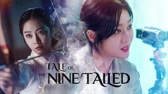

title: Accueil

# Accueil

## Derniers vus

Affiche|Information
:---:|:---
 

:material-star:{.gold .heart}:material-star:{.gold .heart}:material-star-half-full:{.gold .heart}:material-star-outline:{.grey }:material-star-outline:{.grey }|Série : **Tale of the Nine Tailed / 구미호뎐** Origine: **Corée du Sud** Sortie en **2020** Nb. épisodes: **16**  _Histoire se passant dans un monde moderne mais où sont présents certaines divinités asiatiques, la série est agréable à regarder, bourré d'idée, mais elle laisse un goût de superficiel._
 

:material-star:{.gold .heart}:material-star:{.gold .heart}:material-star-half-full:{.gold .heart}:material-star-outline:{.grey }:material-star-outline:{.grey }|Film : **La Traque / 사냥 의 시간** Origine: **Corée du Sud** Sortie en **2020** :kr: sous-titres en coréens  _Dans un monde chaotique, des petites frappes, nuls au tir, essayent de faire un braquage._
 

:material-star:{.gold .heart}:material-star:{.gold .heart}:material-star:{.gold .heart}:material-star:{.gold .heart}:material-star:{.gold .heart}|Film : **Voleuses** Origine: **France** Sortie en **2023**  _Ça démarre vite et c'est bien fait._
 

:material-star:{.gold .heart}:material-star:{.gold .heart}:material-star-half-full:{.gold .heart}:material-star-outline:{.grey }:material-star-outline:{.grey }|Film : **The Killer** Origine: **Etats-Unis** Sortie en **2023**  _Un tueur des plus classique._
 

:material-star:{.gold .heart}:material-star:{.gold .heart}:material-star:{.gold .heart}:material-star-outline:{.grey }:material-star-outline:{.grey }|Film : **Revenger : L'île de la mort / 리벤져** Origine: **Corée du Sud** Sortie en **2018** :kr: sous-titres en coréens  _Entre Mad Max et NY1999, une belle chorégraphie de combats mais avec un scénario pauvre._
 

:material-star:{.gold .heart}:material-star:{.gold .heart}:material-star-half-full:{.gold .heart}:material-star-outline:{.grey }:material-star-outline:{.grey }|Animé : **Le Pavillon des hommes** Origine: **Japon** Sortie de la 1° et dernière saison en **2023** Nb. épisodes: **10**  _Dans le Japon féodal, suite à une épidémie, ce sont les femmes qui dirigent: ensemble un peu décousu même si le sujet est plutôt bien traité._
 

:material-star:{.gold .heart}:material-star:{.gold .heart}:material-star:{.gold .heart}:material-star:{.gold .heart}:material-star-outline:{.grey }|Série : **La Diva naufragée / 무인도의 디바** Origine: **Corée du Sud** Sortie en **2023** Nb. épisodes: **12** :kr: sous-titres en coréens  _Le sujet est bien traité et bien réalisé, mais reste un peu convenu._
 

:material-star:{.gold .heart}:material-star:{.gold .heart}:material-star:{.gold .heart}:material-star:{.gold .heart}:material-star-outline:{.grey }|Série : **Daily Dose of Sunshine / 정신병동에도 아침이 와요** Origine: **Corée du Sud** Sortie en **2023** Nb. épisodes: **12** :kr: sous-titres en coréens  _Le sujet diffcile de la psychiatrie abordé avec talent._
 

:material-star:{.gold .heart}:material-star:{.gold .heart}:material-star:{.gold .heart}:material-star:{.gold .heart}:material-star:{.gold .heart}|Animé : **Blue Eye Samurai** Origine: **Etats-Unis** Sortie de la 1° et dernière saison en **2023** Nb. épisodes: **8**  _Série animée dont le thème est la vengeance, et le graphisme est magnifique. Œuvre d'art._
 

:material-star:{.gold .heart}:material-star:{.gold .heart}:material-star-half-full:{.gold .heart}:material-star-outline:{.grey }:material-star-outline:{.grey }|Série : **The Real Has Come!  / Rattrapés par la réalité ! / 진짜가 나타났다!** Origine: **Corée du Sud** Sortie en **2023** Nb. épisodes: **50**  _Une histoire familiale avec un scénario beaucoup trop imbriqué et au final peu crédible, avec des personnages trop naïfs et des situations  habituelles et prévisibles._

## En cours...

Affiche|Information
:---:|:---
 

|Série : **Be Melodramatic / 멜로가 체질** Origine: **Corée du Sud** Sortie en **2019** Nb. épisodes: **16**  _Démarrage difficile ..._
 

|Série : **Le Livre de notre destin / 이 연애는 불가항력** Origine: **Corée du Sud** Sortie en **2023** Nb. épisodes: **16** :kr: sous-titres en coréens  _Très bon démarrage ..._
 

|Série : **Lovestruck in the City / 도시남녀의 사랑법** Origine: **Corée du Sud** Sortie en **2020** Nb. épisodes: **17** :kr: sous-titres en coréens  _Pour l'instant, léger ..._
 

|Série : **Borgen : Le pouvoir et la gloire** Origine: **Danemark** Sortie en **2022** Nb. épisodes: **8**  _La politique au Danemark ..._
 

|Série : **Alice in Borderland** Origine: **Japon** Sortie de la 2° et dernière saison en **2022** Nb. épisodes: **16**  _A commencer ..._

## Top 10

Affiche|Information
:---:|:---
:material-numeric-1-circle:{.num_gold}  

:material-star:{.gold .heart}:material-star:{.gold .heart}:material-star:{.gold .heart}:material-star:{.gold .heart}:material-star:{.gold .heart}|Série : **Something in the Rain / 밥 잘 사주는 예쁜 누나** Origine: **Corée du Sud** Sortie en **2018** Nb. épisodes: **16**  _Excellent, aborde à la fois le monde du travail et un des tabous de la société coréenne._
:material-numeric-2-circle:{.num_silver}  

:material-star:{.gold .heart}:material-star:{.gold .heart}:material-star:{.gold .heart}:material-star:{.gold .heart}:material-star:{.gold .heart}|Série : **It's Okay to Not Be Okay** Origine: **Corée du Sud** Sortie en **2020** Nb. épisodes: **16** :kr: sous-titres en coréens  _Bizarre au premier abord, on tombe vite sous le charme des personnages._
:material-numeric-3-circle:{.num_copper}  

:material-star:{.gold .heart}:material-star:{.gold .heart}:material-star:{.gold .heart}:material-star:{.gold .heart}:material-star:{.gold .heart}|Série : **Crash Landing on You** Origine: **Corée du Sud** Sortie en **2019** Nb. épisodes: **16** :kr: sous-titres en coréens  _Très bon scénario, les acteurs sont excellents et la réalisation paufinée. Ca mériterait une saison 2 !_
:material-numeric-4-circle:  

:material-star:{.gold .heart}:material-star:{.gold .heart}:material-star:{.gold .heart}:material-star:{.gold .heart}:material-star:{.gold .heart}|Série : **My Mister** Origine: **Corée du Sud** Sortie en **2018** Nb. épisodes: **16**  _Comment ne pas tomber sous le charme de IU ! On a envie que la série ne s'arrête jamais._
:material-numeric-5-circle:  

:material-star:{.gold .heart}:material-star:{.gold .heart}:material-star:{.gold .heart}:material-star:{.gold .heart}:material-star:{.gold .heart}|Série : **One Spring Night** Origine: **Corée du Sud** Sortie en **2019** Nb. épisodes: **16** :kr: sous-titres en coréens  _Excellent, bonne description de la société coréennes et de certains de ses travers._
:material-numeric-6-circle:  

:material-star:{.gold .heart}:material-star:{.gold .heart}:material-star:{.gold .heart}:material-star:{.gold .heart}:material-star:{.gold .heart}|Série : **My Secret Terrius** Origine: **Corée du Sud** Sortie en **2018** Nb. épisodes: **16**  _Très bon scénario d'espionnage, les acteurs sont impeccables._
:material-numeric-7-circle:  

:material-star:{.gold .heart}:material-star:{.gold .heart}:material-star:{.gold .heart}:material-star:{.gold .heart}:material-star:{.gold .heart}|Série : **Pinocchio** Origine: **Corée du Sud** Sortie en **2014** Nb. épisodes: **20**  _Bon scénario sur les journalistes en Corée, même s'il faut quelques épisodes de description avant son démarrage._
:material-numeric-8-circle:  

:material-star:{.gold .heart}:material-star:{.gold .heart}:material-star:{.gold .heart}:material-star:{.gold .heart}:material-star:{.gold .heart}|Série : **Misaeng** Origine: **Corée du Sud** Sortie en **2014** Nb. épisodes: **20** :kr: sous-titres en coréens  _La vie en entreprise en Corée. Très bon scénario, nombreuses situations intéressantes._
:material-numeric-9-circle:  

:material-star:{.gold .heart}:material-star:{.gold .heart}:material-star:{.gold .heart}:material-star:{.gold .heart}:material-star:{.gold .heart}|Série : **Love, Marriage and Divorce / 결혼작사 이혼작곡** Origine: **Corée du Sud** Sortie de la 2° et dernière saison en **2021** Nb. épisodes: **32** :kr: sous-titres en coréens  _Un excellent scénario sur les relations homme-femme, avec de nombreux cas de figure mais toujours très juste._
:material-numeric-10-circle:  

:material-star:{.gold .heart}:material-star:{.gold .heart}:material-star:{.gold .heart}:material-star:{.gold .heart}:material-star:{.gold .heart}|Série : **Designated Survivor: 60 Days** Origine: **Corée du Sud** Sortie en **2019** Nb. épisodes: **16** :kr: sous-titres en coréens  _Bien plus intéressant que la version américaine, le contexte politique de la Corée du sud est bien plus crédible._
