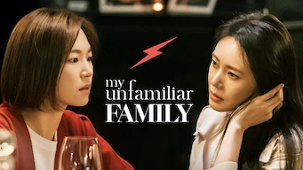

title: Accueil

# Accueil

## Derniers vus

Affiche|Information
:---:|:---
 

:material-star:{.gold .heart}:material-star:{.gold .heart}:material-star:{.gold .heart}:material-star:{.gold .heart}:material-star-outline:{.grey }|Série : **Celebrity / 셀러브리티** Origine: **Corée du Sud** Sortie en **2023** Nb. épisodes: **12** :kr: sous-titres en coréens  _Cette série aurait plutôt dû s'appeler "influenceuse", ce sujet étant particulièrement bien abordé, avec ses débordements._
 

:material-star:{.gold .heart}:material-star:{.gold .heart}:material-star:{.gold .heart}:material-star-outline:{.grey }:material-star-outline:{.grey }|Série : **Move to Heaven / 무브 투 헤븐** Origine: **Corée du Sud** Sortie en **2021** Nb. épisodes: **10** :kr: sous-titres en coréens  _L'art du nettoyage poussé dans ses limites, mais en dehors du contexte cela reste classique._
 

:material-star:{.gold .heart}:material-star:{.gold .heart}:material-star:{.gold .heart}:material-star:{.gold .heart}:material-star-half-full:{.gold .heart}|Série : **Song of the Bandits / 도적 칼의 소리** Origine: **Corée du Sud** Sortie en **2023** Nb. épisodes: **9** :kr: sous-titres en coréens  _Survivre à l'occupation japonaise, série d'action plutôt bien faite, un peu courte._
 

Retiré de Netflix le 14/06/2024 :material-star:{.gold .heart}:material-star:{.gold .heart}:material-star-half-full:{.gold .heart}:material-star-outline:{.grey }:material-star-outline:{.grey }|Série : **When My Love Blooms / 화양연화 - 삶이 꽃이 되는 순간** Origine: **Corée du Sud** Sortie en **2020** Nb. épisodes: **16**  _Comédie romantique, plutôt intéressante, mais avec un scénario bien trop lent et beaucoup trop de clichés._
 

:material-star:{.gold .heart}:material-star:{.gold .heart}:material-star-half-full:{.gold .heart}:material-star-outline:{.grey }:material-star-outline:{.grey }|Film : **Code 8 : Partie II** Origine: **Etats-Unis** Sortie en **2024**  _Suite de la première partie, sans aucune surprise._
 

:material-star:{.gold .heart}:material-star:{.gold .heart}:material-star-outline:{.grey }:material-star-outline:{.grey }:material-star-outline:{.grey }|Film : **Badland Hunters / 황야** Origine: **Corée du Sud** Sortie en **2024** :kr: sous-titres en coréens  _Dans un monde post-apocalyptique, un scénario bien trop basique et prévisible._
 

:material-star:{.gold .heart}:material-star:{.gold .heart}:material-star:{.gold .heart}:material-star:{.gold .heart}:material-star-half-full:{.gold .heart}|Série : **La casa de papel** Origine: **Espagne** Sortie de la 5° saison en **2021** Nb. épisodes: **48**  _Braquages à l'espagnol, un premier braquage très bien réalisé, un deuxième avec malheureusement pas mal d'approximation._
 

:material-star:{.gold .heart}:material-star:{.gold .heart}:material-star:{.gold .heart}:material-star:{.gold .heart}:material-star-half-full:{.gold .heart}|Série : **Under the Queen's Umbrella / 슈룹** Origine: **Corée du Sud** Sortie en **2022** Nb. épisodes: **16** :kr: sous-titres en coréens  _Excellent scénario basé sur des intrigues de Palais, où tout s'enchaînent vite et bien._
 

:material-star:{.gold .heart}:material-star:{.gold .heart}:material-star:{.gold .heart}:material-star:{.gold .heart}:material-star-outline:{.grey }|Série : **Anthracite** Origine: **France** Sortie en **2024** Nb. épisodes: **6**  _Un policier bien anthracite et bien ficellé._
 

:material-star:{.gold .heart}:material-star:{.gold .heart}:material-star:{.gold .heart}:material-star-outline:{.grey }:material-star-outline:{.grey }|Série : **Bienvenidos a Edén** Origine: **Espagne** Sortie de la 2° saison en **2022** Nb. épisodes: **16**  _Un environnement bizarre et détonnant, plutôt bien construit mais moins bon que Squid Game, surtout avec des réactions où les protagonistes sont totalement passifs et incompétents.
Saison 1 : 3,5, Saison 2: 2,5_

## En cours...

Affiche|Information
:---:|:---
 

|Série : **Love, Marriage and Divorce / 결혼작사 이혼작곡** Origine: **Corée du Sud** Sortie de la 3° saison en **2022** Nb. épisodes: **48** :kr: sous-titres en coréens  _Un excellent scénario sur les relations homme-femme, avec de nombreux cas de figure mais toujours très juste. Malheureusement une 3e saison moins subtile, dont certains acteurs et surtout réalisateurs ont changé, vient gâcher l'ambiance._
 

|Série : **Lovestruck in the City / 도시남녀의 사랑법** Origine: **Corée du Sud** Sortie en **2020** Nb. épisodes: **17** :kr: sous-titres en coréens  _Pour l'instant, léger ..._
 

|Série : **My First First Love / 첫사랑은 처음이라서** Origine: **Corée du Sud** Sortie de la 2° saison en **2019** Nb. épisodes: **16**  _1ers épisodes un peu lourds. A suivre..._
 

 ATTENTION ! - Dernier jour sur Netflix le 21/07/2024|Série : **My Unfamiliar Family / (아는 건 별로 없지만) 가족입니다** Origine: **Corée du Sud** Sortie en **2020** Nb. épisodes: **16**  _nan_
 

|Série : **Thirty-Nine / 서른아홉** Origine: **Corée du Sud** Sortie en **2022** Nb. épisodes: **12** :kr: sous-titres en coréens  _3 femmes font le point sur leur vie et leur futur ..._
 

|Série : **Atelier** Origine: **Japon** Sortie en **2015** Nb. épisodes: **13**  _nan_
 

|Série : **Tiger and Dragon** Origine: **Japon** Sortie en **2005** Nb. épisodes: **12**  _nan_
 

|Série : **The Crown** Origine: **Royaume-Uni** Sortie de la 6° saison en **2023** Nb. épisodes: **60**  _nan_

## Top 10

Affiche|Information
:---:|:---
:material-numeric-1-circle:{.num_gold}  

:material-star:{.gold .heart}:material-star:{.gold .heart}:material-star:{.gold .heart}:material-star:{.gold .heart}:material-star:{.gold .heart}|Série : **Something in the Rain / 밥 잘 사주는 예쁜 누나** Origine: **Corée du Sud** Sortie en **2018** Nb. épisodes: **16**  _Excellent, aborde à la fois le monde du travail et un des tabous de la société coréenne._
:material-numeric-2-circle:{.num_silver}  

:material-star:{.gold .heart}:material-star:{.gold .heart}:material-star:{.gold .heart}:material-star:{.gold .heart}:material-star:{.gold .heart}|Série : **It's Okay to Not Be Okay** Origine: **Corée du Sud** Sortie en **2020** Nb. épisodes: **16** :kr: sous-titres en coréens  _Bizarre au premier abord, on tombe vite sous le charme des personnages._
:material-numeric-3-circle:{.num_copper}  

:material-star:{.gold .heart}:material-star:{.gold .heart}:material-star:{.gold .heart}:material-star:{.gold .heart}:material-star:{.gold .heart}|Série : **Crash Landing on You** Origine: **Corée du Sud** Sortie en **2019** Nb. épisodes: **16** :kr: sous-titres en coréens  _Très bon scénario, les acteurs sont excellents et la réalisation paufinée. Ca mériterait une saison 2 !_
:material-numeric-4-circle:  

:material-star:{.gold .heart}:material-star:{.gold .heart}:material-star:{.gold .heart}:material-star:{.gold .heart}:material-star:{.gold .heart}|Série : **My Mister** Origine: **Corée du Sud** Sortie en **2018** Nb. épisodes: **16**  _Comment ne pas tomber sous le charme de IU ! On a envie que la série ne s'arrête jamais._
:material-numeric-5-circle:  

:material-star:{.gold .heart}:material-star:{.gold .heart}:material-star:{.gold .heart}:material-star:{.gold .heart}:material-star:{.gold .heart}|Série : **One Spring Night** Origine: **Corée du Sud** Sortie en **2019** Nb. épisodes: **16** :kr: sous-titres en coréens  _Excellent, bonne description de la société coréennes et de certains de ses travers._
:material-numeric-6-circle:  

:material-star:{.gold .heart}:material-star:{.gold .heart}:material-star:{.gold .heart}:material-star:{.gold .heart}:material-star:{.gold .heart}|Série : **My Secret Terrius** Origine: **Corée du Sud** Sortie en **2018** Nb. épisodes: **16**  _Très bon scénario d'espionnage, les acteurs sont impeccables._
:material-numeric-7-circle:  

:material-star:{.gold .heart}:material-star:{.gold .heart}:material-star:{.gold .heart}:material-star:{.gold .heart}:material-star:{.gold .heart}|Série : **Pinocchio** Origine: **Corée du Sud** Sortie en **2014** Nb. épisodes: **20**  _Bon scénario sur les journalistes en Corée, même s'il faut quelques épisodes de description avant son démarrage._
:material-numeric-8-circle:  

:material-star:{.gold .heart}:material-star:{.gold .heart}:material-star:{.gold .heart}:material-star:{.gold .heart}:material-star:{.gold .heart}|Série : **Misaeng** Origine: **Corée du Sud** Sortie en **2014** Nb. épisodes: **20** :kr: sous-titres en coréens  _La vie en entreprise en Corée. Très bon scénario, nombreuses situations intéressantes._
:material-numeric-9-circle:  

:material-star:{.gold .heart}:material-star:{.gold .heart}:material-star:{.gold .heart}:material-star:{.gold .heart}:material-star:{.gold .heart}|Série : **La Reine des larmes / 눈물의 여왕** Origine: **Corée du Sud** Sortie en **2024** Nb. épisodes: **16** :kr: sous-titres en coréens  _Jeux d'intrigues et rebondissement autour du thème d'un mariage qui bas de l'aile._
:material-numeric-10-circle:  

:material-star:{.gold .heart}:material-star:{.gold .heart}:material-star:{.gold .heart}:material-star:{.gold .heart}:material-star:{.gold .heart}|Série : **Designated Survivor: 60 Days** Origine: **Corée du Sud** Sortie en **2019** Nb. épisodes: **16** :kr: sous-titres en coréens  _Bien plus intéressant que la version américaine, le contexte politique de la Corée du sud est bien plus crédible._
