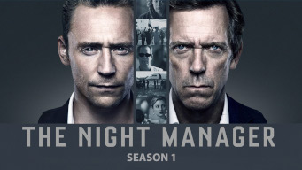

title: Accueil

# Accueil

## Derniers vus

Affiche|Information
:---:|:---
 

|Film : **Der Medicus / L'oracle** Origine: **Allemagne** Note: :material-star:{.gold .heart}:material-star:{.gold .heart}:material-star:{.gold .heart}:material-star-outline:{.grey }:material-star-outline:{.grey } Sortie en **2014**  _La médecine au Moyen-Âge, des vérités historiques assez légères pour un ensemble des plus classiques._
 

|Série : **Behind Your Touch / Enquêtes tactiles / 힙하게 hip** Origine: **Corée du Sud** Note: :material-star:{.gold .heart}:material-star:{.gold .heart}:material-star:{.gold .heart}:material-star-outline:{.grey }:material-star-outline:{.grey } Sortie de la dernière saison en **2023** Nb. épisodes: **16** :kr: sous-titres en coréens  _Enquête policière avec un mélange de fantastique et de comique._
 

|Série : **Lupin** Origine: **France** Note: :material-star:{.gold .heart}:material-star:{.gold .heart}:material-star-outline:{.grey }:material-star-outline:{.grey }:material-star-outline:{.grey } Sortie de la dernière saison en **2021** Nb. épisodes: **17**  _Bon 1er épisode, mais bien moins bon après. Il y a aussi de nombreuses d'incohérence dans le script, un comble pour du Arsène Lupin._
 

|Série : **Doom at Your Service / 어느 날 우리 집 현관으로 멸망이 들어왔다** Origine: **Corée du Sud** Note: :material-star:{.gold .heart}:material-star:{.gold .heart}:material-star-outline:{.grey }:material-star-outline:{.grey }:material-star-outline:{.grey } Sortie de la dernière saison en **2021** Nb. épisodes: **16**  _Malgré quelques bons passages, on n'arrive pas à s'intéresser aux relations entre ces soi-disants dieux et ces humains._
 

|Film : **Wonder Woman 1984** Origine: **Etats-Unis** Note: :material-star:{.gold .heart}:material-star:{.gold .heart}:material-star-outline:{.grey }:material-star-outline:{.grey }:material-star-outline:{.grey } Sortie en **2020**  _Uniquement basé sur les effets spéciaux._
 

|Série : **Ragnarök** Origine: **Norvège** Note: :material-star:{.gold .heart}:material-star:{.gold .heart}:material-star:{.gold .heart}:material-star-half-full:{.gold .heart}:material-star-outline:{.grey } Sortie de la dernière saison en **2021** Nb. épisodes: **18**  _Transposition des légendes nordiques à l'époque actuelle. Dommage que cela ne soit pas mieux exploité !_
 

|Série : **Seven Seconds** Origine: **Etats-Unis** Note: :material-star:{.gold .heart}:material-star:{.gold .heart}:material-star-outline:{.grey }:material-star-outline:{.grey }:material-star-outline:{.grey } Sortie de la dernière saison en **2018** Nb. épisodes: **10**  _Les plus mauvais flics de New York mènent l'enquête._
 

|Série : **Who is Erin Carter?** Origine: **Royaume-Uni** Note: :material-star:{.gold .heart}:material-star:{.gold .heart}:material-star:{.gold .heart}:material-star-outline:{.grey }:material-star-outline:{.grey } Sortie de la dernière saison en **2023** Nb. épisodes: **7**  _Policier britannique de bonne facture._
 

|Série : **The Night Manager** Origine: **Royaume-Uni** Note: :material-star:{.gold .heart}:material-star:{.gold .heart}:material-star:{.gold .heart}:material-star:{.gold .heart}:material-star-outline:{.grey } Sortie de la dernière saison en **2016** Nb. épisodes: **6**  _Espionnage et trafic d'armes sont le thème de cette bonne série britannique._
 

|Film : **Mission: Impossible - Fallout** Origine: **Etats-Unis** Note: :material-star:{.gold .heart}:material-star:{.gold .heart}:material-star:{.gold .heart}:material-star-outline:{.grey }:material-star-outline:{.grey } Sortie en **2018**  _Classique, mais bon dans ce genre._

## En cours...

Affiche|Information
:---:|:---
 

|Série : **Be Melodramatic / 멜로가 체질** Origine: **Corée du Sud** Sortie de la dernière saison en **2019** Nb. épisodes: **16**  _nan_
 

|Série : **Lovestruck in the City / 도시남녀의 사랑법** Origine: **Corée du Sud** Sortie de la dernière saison en **2020** Nb. épisodes: **17** :kr: sous-titres en coréens  _nan_
 

|Série : **Rattrapés par la réalité ! / 진짜가 나타났다!** Origine: **Corée du Sud** Sortie de la dernière saison en **2023** Nb. épisodes: **46**  _nan_
 

|Série : **Borgen : Le pouvoir et la gloire** Origine: **Danemark** Sortie de la dernière saison en **2022** Nb. épisodes: **8**  _La politique au Danemark ..._
 

|Série : **Alice in Borderland** Origine: **Japon** Sortie de la dernière saison en **2022** Nb. épisodes: **16**  _nan_

## Top 10

Affiche|Information
:---:|:---
 

|Palmarès: :material-numeric-1-circle:{.num_gold} Série : **Something in the Rain / 밥 잘 사주는 예쁜 누나** Origine: **Corée du Sud** Note: :material-star:{.gold .heart}:material-star:{.gold .heart}:material-star:{.gold .heart}:material-star:{.gold .heart}:material-star:{.gold .heart} Sortie de la dernière saison en **2018** Nb. épisodes: **16**  _Excellent, aborde à la fois le monde du travail et un des tabous de la société coréenne._
 

|Palmarès: :material-numeric-2-circle:{.num_silver} Série : **It's Okay to Not Be Okay** Origine: **Corée du Sud** Note: :material-star:{.gold .heart}:material-star:{.gold .heart}:material-star:{.gold .heart}:material-star:{.gold .heart}:material-star:{.gold .heart} Sortie de la dernière saison en **2020** Nb. épisodes: **16** :kr: sous-titres en coréens  _Bizarre au premier abord, on tombe vite sous le charme des personnages._
 

|Palmarès: :material-numeric-3-circle:{.num_copper} Série : **Crash Landing on You** Origine: **Corée du Sud** Note: :material-star:{.gold .heart}:material-star:{.gold .heart}:material-star:{.gold .heart}:material-star:{.gold .heart}:material-star:{.gold .heart} Sortie de la dernière saison en **2019** Nb. épisodes: **16** :kr: sous-titres en coréens  _Très bon scénario, les acteurs sont excellents et la réalisation paufinée. Ca mériterait une saison 2 !_
 

|Palmarès: :material-numeric-4-circle: Série : **My Mister** Origine: **Corée du Sud** Note: :material-star:{.gold .heart}:material-star:{.gold .heart}:material-star:{.gold .heart}:material-star:{.gold .heart}:material-star:{.gold .heart} Sortie de la dernière saison en **2018** Nb. épisodes: **16**  _Comment ne pas tomber sous le charme de IU ! On a envie que la série ne s'arrête jamais._
 

|Palmarès: :material-numeric-5-circle: Série : **One Spring Night** Origine: **Corée du Sud** Note: :material-star:{.gold .heart}:material-star:{.gold .heart}:material-star:{.gold .heart}:material-star:{.gold .heart}:material-star:{.gold .heart} Sortie de la dernière saison en **2019** Nb. épisodes: **16** :kr: sous-titres en coréens  _Excellent, bonne description de la société coréennes et de certains de ses travers._
 

|Palmarès: :material-numeric-6-circle: Série : **My Secret Terrius** Origine: **Corée du Sud** Note: :material-star:{.gold .heart}:material-star:{.gold .heart}:material-star:{.gold .heart}:material-star:{.gold .heart}:material-star:{.gold .heart} Sortie de la dernière saison en **2018** Nb. épisodes: **16**  _Très bon scénario d'espionnage, les acteurs sont impeccables._
 

|Palmarès: :material-numeric-7-circle: Série : **Pinocchio** Origine: **Corée du Sud** Note: :material-star:{.gold .heart}:material-star:{.gold .heart}:material-star:{.gold .heart}:material-star:{.gold .heart}:material-star:{.gold .heart} Sortie de la dernière saison en **2014** Nb. épisodes: **20**  _Bon scénario sur les journalistes en Corée, même s'il faut quelques épisodes de description avant son démarrage._
 

|Palmarès: :material-numeric-8-circle: Série : **Misaeng** Origine: **Corée du Sud** Note: :material-star:{.gold .heart}:material-star:{.gold .heart}:material-star:{.gold .heart}:material-star:{.gold .heart}:material-star:{.gold .heart} Sortie de la dernière saison en **2014** Nb. épisodes: **20** :kr: sous-titres en coréens  _La vie en entreprise en Corée. Très bon scénario, nombreuses situations intéressantes._
 

|Palmarès: :material-numeric-9-circle: Série : **Love, Marriage and Divorce / 결혼작사 이혼작곡** Origine: **Corée du Sud** Note: :material-star:{.gold .heart}:material-star:{.gold .heart}:material-star:{.gold .heart}:material-star:{.gold .heart}:material-star:{.gold .heart} Sortie de la dernière saison en **2021** Nb. épisodes: **32** :kr: sous-titres en coréens  _Un excellent scénario sur les relations homme-femme, avec de nombreux cas de figure mais toujours très juste._
 

|Palmarès: :material-numeric-10-circle: Série : **Designated Survivor: 60 Days** Origine: **Corée du Sud** Note: :material-star:{.gold .heart}:material-star:{.gold .heart}:material-star:{.gold .heart}:material-star:{.gold .heart}:material-star:{.gold .heart} Sortie de la dernière saison en **2019** Nb. épisodes: **16** :kr: sous-titres en coréens  _Bien plus intéressant que la version américaine, le contexte politique de la Corée du sud est bien plus crédible._
