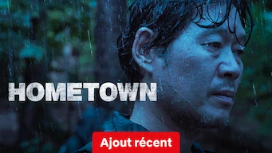

title: Accueil

# Accueil

## Derniers vus

Affiche|Information
:---:|:---
 

:material-star:{.gold .heart}:material-star:{.gold .heart}:material-star:{.gold .heart}:material-star-outline:{.grey }:material-star-outline:{.grey }|Film : **Bad Lands** Origine: **Japon** Sortie en **2023**  _Le monde du yakuza par une bande de bras cassés._
 

:material-star:{.gold .heart}:material-star:{.gold .heart}:material-star:{.gold .heart}:material-star-outline:{.grey }:material-star-outline:{.grey }|Série : **Furies** Origine: **France** Sortie en **2024** Nb. épisodes: **8**  _Série française assez violente sur le grand banditisme à Paris, mais de façon totalement imaginaire._
 

:material-star:{.gold .heart}:material-star:{.gold .heart}:material-star:{.gold .heart}:material-star:{.gold .heart}:material-star-half-full:{.gold .heart}|Série : **Our Blues /  우리들의 블루스** Origine: **Corée du Sud** Sortie en **2022** Nb. épisodes: **20**  _Une série sur l'amitié et la famille, sur l'île de Jeju, avec un casting impressionnant !_
 

:material-star:{.gold .heart}:material-star:{.gold .heart}:material-star:{.gold .heart}:material-star-outline:{.grey }:material-star-outline:{.grey }|Film : **Boîte Noire** Origine: **France** Sortie en **2021**  _Un scénario somme toute très classique pour un film qui décrit bien ce monde de l'aéronautique._
 

:material-star:{.gold .heart}:material-star:{.gold .heart}:material-star:{.gold .heart}:material-star-outline:{.grey }:material-star-outline:{.grey }|Film : **Leave the World Behind / Le Monde après nous** Origine: **Etats-Unis** Sortie en **2023**  _Film qui porte bien son nom en version américaine, intéressant malgré quelques lenteurs._
 

:material-star:{.gold .heart}:material-star:{.gold .heart}:material-star-outline:{.grey }:material-star-outline:{.grey }:material-star-outline:{.grey }|Série : **Fermat's Cuisine / Fermat Kitchen / フェルマーの料理** Origine: **Japon** Sortie en **2023** Nb. épisodes: **10**  _La cuisine française au Japon, en faisant un parallèle avec les mathématiques, mais l'ensemble est malheureusement trop caricatural._
 

:material-star:{.gold .heart}:material-star:{.gold .heart}:material-star:{.gold .heart}:material-star-half-full:{.gold .heart}:material-star-outline:{.grey }|Film : **The Fortress / 남한산성** Origine: **Corée du Sud** Sortie en **2017**  _Film historique de bonne facture, les débats d'idées entre les conseillers du roi étant de haut vol._
 

:material-star:{.gold .heart}:material-star:{.gold .heart}:material-star:{.gold .heart}:material-star:{.gold .heart}:material-star-outline:{.grey }|Série : **Be Melodramatic / 멜로가 체질** Origine: **Corée du Sud** Sortie en **2019** Nb. épisodes: **16**  _Les déboires de trois femmes colocataires dans le monde des médias,  avec un point de vue très féminin, à la fois étrange, surtout au début, et très accès sur des dialogues interminables..._
 

:material-star:{.gold .heart}:material-star:{.gold .heart}:material-star-half-full:{.gold .heart}:material-star-outline:{.grey }:material-star-outline:{.grey }|Série : **Hometown / 홈타운** Origine: **Corée du Sud** Sortie en **2021** Nb. épisodes: **12**  _Enquête policière plutôt lugubre avec un scénario peut convaincant._
 

:material-star:{.gold .heart}:material-star:{.gold .heart}:material-star:{.gold .heart}:material-star-half-full:{.gold .heart}:material-star-outline:{.grey }|Film : **DamSel / La Demoiselle et le dragon** Origine: **Etats-Unis** Sortie en **2024**  _Proche d'un conte, assez classique mais bien fait._

## En cours...

Affiche|Information
:---:|:---
 

|Série : **Aux grands maux… / 닥터 슬럼프** Origine: **Corée du Sud** Sortie en **2024** Nb. épisodes: **16** :kr: sous-titres en coréens  _Un drama au dialogue bien trop caricatural qui dessert une histoire somme toute cohérente._
 

|Série : **Lovestruck in the City / 도시남녀의 사랑법** Origine: **Corée du Sud** Sortie en **2020** Nb. épisodes: **17** :kr: sous-titres en coréens  _Pour l'instant, léger ..._
 

|Série : **My First First Love / 첫사랑은 처음이라서** Origine: **Corée du Sud** Sortie de la 2° saison en **2019** Nb. épisodes: **16**  _1ers épisodes un peu lourds. A suivre..._
 

|Série : **Thirty-Nine / 서른아홉** Origine: **Corée du Sud** Sortie en **2022** Nb. épisodes: **12** :kr: sous-titres en coréens  _3 femmes font le point sur leur vie et leur futur ..._
 

|Série : **Would You Like a Cup of Coffee? / 커피 한잔 할까요?** Origine: **Corée du Sud** Sortie en **2021** Nb. épisodes: **12** :kr: sous-titres en coréens  _Le dur métier de barista au travers d'histoires brèves._
 

|Série : **Alice in Borderland / 今際の国のアリス** Origine: **Japon** Sortie de la 2° saison en **2022** Nb. épisodes: **16**  _A commencer ..._

## Top 10

Affiche|Information
:---:|:---
:material-numeric-1-circle:{.num_gold}  

:material-star:{.gold .heart}:material-star:{.gold .heart}:material-star:{.gold .heart}:material-star:{.gold .heart}:material-star:{.gold .heart}|Série : **Something in the Rain / 밥 잘 사주는 예쁜 누나** Origine: **Corée du Sud** Sortie en **2018** Nb. épisodes: **16**  _Excellent, aborde à la fois le monde du travail et un des tabous de la société coréenne._
:material-numeric-2-circle:{.num_silver}  

:material-star:{.gold .heart}:material-star:{.gold .heart}:material-star:{.gold .heart}:material-star:{.gold .heart}:material-star:{.gold .heart}|Série : **It's Okay to Not Be Okay** Origine: **Corée du Sud** Sortie en **2020** Nb. épisodes: **16** :kr: sous-titres en coréens  _Bizarre au premier abord, on tombe vite sous le charme des personnages._
:material-numeric-3-circle:{.num_copper}  

:material-star:{.gold .heart}:material-star:{.gold .heart}:material-star:{.gold .heart}:material-star:{.gold .heart}:material-star:{.gold .heart}|Série : **Crash Landing on You** Origine: **Corée du Sud** Sortie en **2019** Nb. épisodes: **16** :kr: sous-titres en coréens  _Très bon scénario, les acteurs sont excellents et la réalisation paufinée. Ca mériterait une saison 2 !_
:material-numeric-4-circle:  

:material-star:{.gold .heart}:material-star:{.gold .heart}:material-star:{.gold .heart}:material-star:{.gold .heart}:material-star:{.gold .heart}|Série : **My Mister** Origine: **Corée du Sud** Sortie en **2018** Nb. épisodes: **16**  _Comment ne pas tomber sous le charme de IU ! On a envie que la série ne s'arrête jamais._
:material-numeric-5-circle:  

:material-star:{.gold .heart}:material-star:{.gold .heart}:material-star:{.gold .heart}:material-star:{.gold .heart}:material-star:{.gold .heart}|Série : **One Spring Night** Origine: **Corée du Sud** Sortie en **2019** Nb. épisodes: **16** :kr: sous-titres en coréens  _Excellent, bonne description de la société coréennes et de certains de ses travers._
:material-numeric-6-circle:  

:material-star:{.gold .heart}:material-star:{.gold .heart}:material-star:{.gold .heart}:material-star:{.gold .heart}:material-star:{.gold .heart}|Série : **My Secret Terrius** Origine: **Corée du Sud** Sortie en **2018** Nb. épisodes: **16**  _Très bon scénario d'espionnage, les acteurs sont impeccables._
:material-numeric-7-circle:  

:material-star:{.gold .heart}:material-star:{.gold .heart}:material-star:{.gold .heart}:material-star:{.gold .heart}:material-star:{.gold .heart}|Série : **Pinocchio** Origine: **Corée du Sud** Sortie en **2014** Nb. épisodes: **20**  _Bon scénario sur les journalistes en Corée, même s'il faut quelques épisodes de description avant son démarrage._
:material-numeric-8-circle:  

:material-star:{.gold .heart}:material-star:{.gold .heart}:material-star:{.gold .heart}:material-star:{.gold .heart}:material-star:{.gold .heart}|Série : **Misaeng** Origine: **Corée du Sud** Sortie en **2014** Nb. épisodes: **20** :kr: sous-titres en coréens  _La vie en entreprise en Corée. Très bon scénario, nombreuses situations intéressantes._
:material-numeric-9-circle:  

:material-star:{.gold .heart}:material-star:{.gold .heart}:material-star:{.gold .heart}:material-star:{.gold .heart}:material-star:{.gold .heart}|Série : **Love, Marriage and Divorce / 결혼작사 이혼작곡** Origine: **Corée du Sud** Sortie de la 2° saison en **2021** Nb. épisodes: **32** :kr: sous-titres en coréens  _Un excellent scénario sur les relations homme-femme, avec de nombreux cas de figure mais toujours très juste._
:material-numeric-10-circle:  

:material-star:{.gold .heart}:material-star:{.gold .heart}:material-star:{.gold .heart}:material-star:{.gold .heart}:material-star:{.gold .heart}|Série : **Designated Survivor: 60 Days** Origine: **Corée du Sud** Sortie en **2019** Nb. épisodes: **16** :kr: sous-titres en coréens  _Bien plus intéressant que la version américaine, le contexte politique de la Corée du sud est bien plus crédible._
