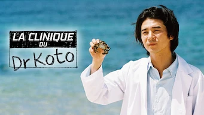

title: Accueil

# Accueil

## Derniers vus

Affiche|Information
:---:|:---
 

:material-star:{.gold .heart}:material-star:{.gold .heart}:material-star-outline:{.grey }:material-star-outline:{.grey }:material-star-outline:{.grey }|Série : **Citadel** Origine: **Etats-Unis** Sortie de la 2° saison en **2026** Nb. épisodes: **13**  _Espionnage à la sauce américaine, principalement basé sur les flashback et l'action, d'un intérêt plus que mitigé car déjà vu 1000 fois._
 

:material-star:{.gold .heart}:material-star:{.gold .heart}:material-star:{.gold .heart}:material-star-outline:{.grey }:material-star-outline:{.grey }|Série : **Femme au foyer en fuite / The Full-Time Wife Escapist / 逃げるは恥だが役に立つ** Origine: **Japon** Sortie de la 2° saison en **2021** Nb. épisodes: **12** :jp: sous-titres en japonais  _La contractualisation du mariage plutôt que l'amour: une bonne idée, mais le traitement est un peu léger._
 

:material-star:{.gold .heart}:material-star:{.gold .heart}:material-star:{.gold .heart}:material-star:{.gold .heart}:material-star-outline:{.grey }|Série : **Fallout** Origine: **Etats-Unis** Sortie de la 2° saison en **2025** Nb. épisodes: **16**  _Le monde tel qu'il aurait pu l'être, sorte de monde à la Jules Vernes post-apocalystique, très disruptif avec un bon scénario basé sur le jeu vidéo du même nom._
 

:material-star:{.gold .heart}:material-star:{.gold .heart}:material-star:{.gold .heart}:material-star-outline:{.grey }:material-star-outline:{.grey }|Série : **Mon amour au paradis / 천국보다 아름다운** Origine: **Corée du Sud** Sortie en **2025** Nb. épisodes: **12** :kr: sous-titres en coréen  _Une histoire tordue au paradis, qui malgré de bonnes idées, reste dans l’ensemble confus et lent._
 

:material-star:{.gold .heart}:material-star:{.gold .heart}:material-star:{.gold .heart}:material-star-outline:{.grey }:material-star-outline:{.grey }|Série : **The 19th Medical Chart / Le 19e Spécialiste / 19番目のカルテ 徳重晃の問診** Origine: **Japon** Sortie en **2025** Nb. épisodes: **8** :jp: sous-titres en japonais  _Être médecin généraliste dans un hôpital au Japon. Une approche intéressante, mais un peu court._
 

:material-star:{.gold .heart}:material-star:{.gold .heart}:material-star-outline:{.grey }:material-star-outline:{.grey }:material-star-outline:{.grey }|Film : **Apex** Origine: **Etats-Unis** Sortie en **2026**  _Courses poursuites entre une égocentrique et un assassin, seuls les paysages sont beaux._
 

:material-star:{.gold .heart}:material-star:{.gold .heart}:material-star:{.gold .heart}:material-star-outline:{.grey }:material-star-outline:{.grey }|Série : **Phantom Lawyer / 신이랑 법률사무소** Origine: **Corée du Sud** Sortie en **2026** Nb. épisodes: **16** :kr: sous-titres en coréen  _Quand un avocat voit des fantômes et qu'il leur rend justice. un bon ensemble mais sans réelles surprises._
 

:material-star:{.gold .heart}:material-star:{.gold .heart}:material-star:{.gold .heart}:material-star-outline:{.grey }:material-star-outline:{.grey }|Série : **La Clinique du Dr Koto / Dr.コトー診療所** Origine: **Japon** Sortie de la 2° saison en **2006** Nb. épisodes: **22**  _Les déboires d'un médecin de campagne, un scénario bien construit mais trop convenu._
 

:material-star:{.gold .heart}:material-star:{.gold .heart}:material-star:{.gold .heart}:material-star-outline:{.grey }:material-star-outline:{.grey }|Série : **Ichikei’s Crow – The Criminal Court Judges / イチケイのカラス** Origine: **Japon** Sortie en **2021** Nb. épisodes: **11**  _Juge à Tokyo, de bonnes intrigues mais un ensemble trop convenu._
 

:material-star:{.gold .heart}:material-star:{.gold .heart}:material-star:{.gold .heart}:material-star-outline:{.grey }:material-star-outline:{.grey }|Série : **Cupidon Mon Amour / 내 남자는 큐피드** Origine: **Corée du Sud** Sortie en **2023** Nb. épisodes: **16** :kr: sous-titres en coréen  _Un Ange avec un arc tombe amoureux, un peu tordu._

## En cours...

Affiche|Information
:---:|:---
 

|Série : **A Love So Beautiful (Korean) / 아름다웠던 우리에게** Origine: **Corée du Sud** Sortie en **2020** Nb. épisodes: **24** :kr: sous-titres en coréen  _Les amourettes obsessionnelles d’une étudiante._
 

|Série : **La Vie rêvée de M. Kim / 서울 자가에 대기업 다니는 김 부장 이야기** Origine: **Corée du Sud** Sortie en **2025** Nb. épisodes: **12** :kr: sous-titres en coréen  _nan_
 

|Série : **The WONDERfools / 원더풀스** Origine: **Corée du Sud** Sortie en **2026** Nb. épisodes: **8** :kr: sous-titres en coréen  _Super héros par erreur, bien fait avec un bon rythme. Vivement la saison 2 !_
 

|Série : **Unnatural / アンナチュラル** Origine: **Japon** Sortie en **2018** Nb. épisodes: **10** :jp: sous-titres en japonais  _nan_
 

|Série : **Dans l’ombre des tudors / Wolf Hall** Origine: **Royaume-Uni** Sortie de la 2° saison en **2015** Nb. épisodes: **12**  _Au XVIe siècle, l’ascension de Thomas Cromwell sous le règne d’Henri VIII, entre politiques et manipulation._

## Top 10

Affiche|Information
:---:|:---
:material-numeric-1-circle:{.num_gold}  

:material-star:{.gold .heart}:material-star:{.gold .heart}:material-star:{.gold .heart}:material-star:{.gold .heart}:material-star:{.gold .heart}|Série : **Something in the Rain / 밥 잘 사주는 예쁜 누나** Origine: **Corée du Sud** Sortie en **2018** Nb. épisodes: **16**  _Excellent, aborde à la fois le monde du travail et un des tabous de la société coréenne._
:material-numeric-2-circle:{.num_silver}  

:material-star:{.gold .heart}:material-star:{.gold .heart}:material-star:{.gold .heart}:material-star:{.gold .heart}:material-star:{.gold .heart}|Série : **It's Okay to Not Be Okay** Origine: **Corée du Sud** Sortie en **2020** Nb. épisodes: **16** :kr: sous-titres en coréen  _Bizarre au premier abord, on tombe vite sous le charme des personnages._
:material-numeric-3-circle:{.num_copper}  

:material-star:{.gold .heart}:material-star:{.gold .heart}:material-star:{.gold .heart}:material-star:{.gold .heart}:material-star:{.gold .heart}|Série : **Crash Landing on You** Origine: **Corée du Sud** Sortie en **2019** Nb. épisodes: **16** :kr: sous-titres en coréen  _Très bon scénario, les acteurs sont excellents et la réalisation paufinée. Ca mériterait une saison 2 !_
:material-numeric-4-circle:  

:material-star:{.gold .heart}:material-star:{.gold .heart}:material-star:{.gold .heart}:material-star:{.gold .heart}:material-star:{.gold .heart}|Série : **My Mister** Origine: **Corée du Sud** Sortie en **2018** Nb. épisodes: **16**  _Comment ne pas tomber sous le charme de IU ! On a envie que la série ne s'arrête jamais._
:material-numeric-5-circle:  

:material-star:{.gold .heart}:material-star:{.gold .heart}:material-star:{.gold .heart}:material-star:{.gold .heart}:material-star:{.gold .heart}|Série : **One Spring Night** Origine: **Corée du Sud** Sortie en **2019** Nb. épisodes: **16** :kr: sous-titres en coréen  _Excellent, bonne description de la société coréennes et de certains de ses travers._
:material-numeric-6-circle:  

:material-star:{.gold .heart}:material-star:{.gold .heart}:material-star:{.gold .heart}:material-star:{.gold .heart}:material-star:{.gold .heart}|Série : **My Secret Terrius** Origine: **Corée du Sud** Sortie en **2018** Nb. épisodes: **16**  _Très bon scénario d'espionnage, les acteurs sont impeccables._
:material-numeric-7-circle:  

:material-star:{.gold .heart}:material-star:{.gold .heart}:material-star:{.gold .heart}:material-star:{.gold .heart}:material-star:{.gold .heart}|Série : **Pinocchio** Origine: **Corée du Sud** Sortie en **2014** Nb. épisodes: **20**  _Bon scénario sur les journalistes en Corée, même s'il faut quelques épisodes de description avant son démarrage._
:material-numeric-8-circle:  

:material-star:{.gold .heart}:material-star:{.gold .heart}:material-star:{.gold .heart}:material-star:{.gold .heart}:material-star:{.gold .heart}|Série : **Misaeng** Origine: **Corée du Sud** Sortie en **2014** Nb. épisodes: **20** :kr: sous-titres en coréen  _La vie en entreprise en Corée. Très bon scénario, nombreuses situations intéressantes._
:material-numeric-9-circle:  

:material-star:{.gold .heart}:material-star:{.gold .heart}:material-star:{.gold .heart}:material-star:{.gold .heart}:material-star:{.gold .heart}|Série : **La Reine des larmes / 눈물의 여왕** Origine: **Corée du Sud** Sortie en **2024** Nb. épisodes: **16** :kr: sous-titres en coréen  _Jeux d'intrigues et rebondissement autour du thème d'un mariage qui bas de l'aile._
:material-numeric-10-circle:  

:material-star:{.gold .heart}:material-star:{.gold .heart}:material-star:{.gold .heart}:material-star:{.gold .heart}:material-star:{.gold .heart}|Série : **Designated Survivor: 60 Days** Origine: **Corée du Sud** Sortie en **2019** Nb. épisodes: **16** :kr: sous-titres en coréen  _Bien plus intéressant que la version américaine, le contexte politique de la Corée du sud est bien plus crédible._
