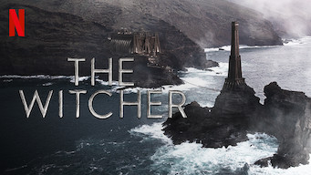

title: Accueil

# Accueil

## Derniers vus

Affiche|Information
:---:|:---
 

:material-star:{.gold .heart}:material-star:{.gold .heart}:material-star:{.gold .heart}:material-star-half-full:{.gold .heart}:material-star-outline:{.grey }|Série : **Dept. Q / Les Dossiers oubliés** Origine: **Royaume-Uni** Sortie en **2025** Nb. épisodes: **9**  _En quête de police en écosse du côté d’Edimbour, un peu long mais les personnages sont attachants._
 

:material-star:{.gold .heart}:material-star:{.gold .heart}:material-star:{.gold .heart}:material-star-half-full:{.gold .heart}:material-star-outline:{.grey }|Série : **Elementary** Origine: **Etats-Unis** Sortie de la 7° saison en **2019** Nb. épisodes: **154**  _Enquête policière à New York du plus bristish des détective._
 

:material-star:{.gold .heart}:material-star:{.gold .heart}:material-star:{.gold .heart}:material-star-outline:{.grey }:material-star-outline:{.grey }|Film : **A HOUSE OF DYNAMITE** Origine: **Etats-Unis** Sortie en **2025**  _Ainsi démarre la 3e guerre mondiale, assez prenant mais reste assez classique même si  l'on dénonce les risques._
 

:material-star:{.gold .heart}:material-star:{.gold .heart}:material-star:{.gold .heart}:material-star-half-full:{.gold .heart}:material-star-outline:{.grey }|Film : **La Disparue de la cabine 10** Origine: **Etats-Unis** Sortie en **2025**  _Une enquête dans le style Agatha Christie, un peu trop classique._
 

:material-star:{.gold .heart}:material-star:{.gold .heart}:material-star:{.gold .heart}:material-star-half-full:{.gold .heart}:material-star-outline:{.grey }|Série : **The Witcher** Origine: **Etats-Unis** Sortie de la 4° saison en **2025** Nb. épisodes: **32**  _Scénario original et ambiance assez proche de celle du jeu. Très bien, même si les couleurs sont trop sombres en saison 2, on ne voit rien sur certains passages. La saison 4 change l’acteur principal et le scénario est mauvais. Dommage._
 

:material-star:{.gold .heart}:material-star:{.gold .heart}:material-star-half-full:{.gold .heart}:material-star-outline:{.grey }:material-star-outline:{.grey }|Série : **Haruko, reine du bureau** Origine: **Japon** Sortie de la 2° saison en **2020** Nb. épisodes: **18** :kr: sous-titres en coréens  _La dure vie des intérimaires au Japon, traité avec beaucoup de légèreté._
 

Retiré de Netflix le 09/11/2025 :material-star:{.gold .heart}:material-star:{.gold .heart}:material-star:{.gold .heart}:material-star-outline:{.grey }:material-star-outline:{.grey }|Film : **Cry Macho** Origine: **Etats-Unis** Sortie en **2021**  _Du Clint Eastwood avec Clint Eastwood._
 

:material-star:{.gold .heart}:material-star:{.gold .heart}:material-star:{.gold .heart}:material-star-half-full:{.gold .heart}:material-star-outline:{.grey }|Série : **Les Combattantes** Origine: **France** Sortie en **2022** Nb. épisodes: **8**  _Le rôle des femmes pendant la première guerre mondiale, filmé dans les Vosges avec d'excellentes acteurs et un bon scénario._
 

:material-star:{.gold .heart}:material-star:{.gold .heart}:material-star:{.gold .heart}:material-star-outline:{.grey }:material-star-outline:{.grey }|Série : **The Diplomat / La Diplomate** Origine: **Etats-Unis** Sortie de la 3° saison en **2023** Nb. épisodes: **22**  _La diplomatie à l'américaine, plutôt bien traité mais irréaliste, de partie pris et au fur et à mesure des saisons, le scénario est peu crédible et palie ces manques par la précipitation._
 

:material-star:{.gold .heart}:material-star:{.gold .heart}:material-star:{.gold .heart}:material-star-outline:{.grey }:material-star-outline:{.grey }|Série : **Romantics Anonymous / 匿名の恋人たち** Origine: **Japon** Sortie en **2025** Nb. épisodes: **8** :kr: sous-titres en coréens  _Une histoire de chocolat et de phobies, des plus classiques._

## En cours...

Affiche|Information
:---:|:---
 

|Série : **A Love So Beautiful (Korean) / 아름다웠던 우리에게** Origine: **Corée du Sud** Sortie en **2020** Nb. épisodes: **24** :kr: sous-titres en coréens  _Les amourettes obsessionnelles d’une étudiante._
 

|Série : **Des vœux pour un génie / 다 이루어질지니** Origine: **Corée du Sud** Sortie en **2025** Nb. épisodes: **13** :kr: sous-titres en coréens  _Rencontre entre un génie sorti de sa lampe et une psychopathe._
 

|Série : **The Whirlwind / Déferlante / 돌풍** Origine: **Corée du Sud** Sortie en **2024** Nb. épisodes: **12** :kr: sous-titres en coréens  _Manœuvres politiques entre corruption et bons sentiments._
 

|Série : **Goodbye Earth / 종말의 바보** Origine: **Corée du Sud** Sortie en **2024** Nb. épisodes: **12** :kr: sous-titres en coréens  _Un astéroïde va percuter la terre, tout part en vrille._
 

|Série : **Mon amour au paradis / 천국보다 아름다운** Origine: **Corée du Sud** Sortie en **2025** Nb. épisodes: **12** :kr: sous-titres en coréens  _On fait quoi au paradis, vaste programme._
 

|Série : **Legenden / The Asset** Origine: **Danemark** Sortie en **2025** Nb. épisodes: **6**  _nan_
 :material-television:|Série : **Dans l’ombre des tudors / Wolf Hall** Origine: **Royaume-Uni** Sortie de la 2° saison en **2015** Nb. épisodes: **12**  _L’ascension de Thomas Cromwell sous le règne d’Henri VIII._

## Top 10

Affiche|Information
:---:|:---
:material-numeric-1-circle:{.num_gold}  

:material-star:{.gold .heart}:material-star:{.gold .heart}:material-star:{.gold .heart}:material-star:{.gold .heart}:material-star:{.gold .heart}|Série : **Something in the Rain / 밥 잘 사주는 예쁜 누나** Origine: **Corée du Sud** Sortie en **2018** Nb. épisodes: **16**  _Excellent, aborde à la fois le monde du travail et un des tabous de la société coréenne._
:material-numeric-2-circle:{.num_silver}  

:material-star:{.gold .heart}:material-star:{.gold .heart}:material-star:{.gold .heart}:material-star:{.gold .heart}:material-star:{.gold .heart}|Série : **It's Okay to Not Be Okay** Origine: **Corée du Sud** Sortie en **2020** Nb. épisodes: **16** :kr: sous-titres en coréens  _Bizarre au premier abord, on tombe vite sous le charme des personnages._
:material-numeric-3-circle:{.num_copper}  

:material-star:{.gold .heart}:material-star:{.gold .heart}:material-star:{.gold .heart}:material-star:{.gold .heart}:material-star:{.gold .heart}|Série : **Crash Landing on You** Origine: **Corée du Sud** Sortie en **2019** Nb. épisodes: **16** :kr: sous-titres en coréens  _Très bon scénario, les acteurs sont excellents et la réalisation paufinée. Ca mériterait une saison 2 !_
:material-numeric-4-circle:  

:material-star:{.gold .heart}:material-star:{.gold .heart}:material-star:{.gold .heart}:material-star:{.gold .heart}:material-star:{.gold .heart}|Série : **My Mister** Origine: **Corée du Sud** Sortie en **2018** Nb. épisodes: **16**  _Comment ne pas tomber sous le charme de IU ! On a envie que la série ne s'arrête jamais._
:material-numeric-5-circle:  

:material-star:{.gold .heart}:material-star:{.gold .heart}:material-star:{.gold .heart}:material-star:{.gold .heart}:material-star:{.gold .heart}|Série : **One Spring Night** Origine: **Corée du Sud** Sortie en **2019** Nb. épisodes: **16** :kr: sous-titres en coréens  _Excellent, bonne description de la société coréennes et de certains de ses travers._
:material-numeric-6-circle:  

:material-star:{.gold .heart}:material-star:{.gold .heart}:material-star:{.gold .heart}:material-star:{.gold .heart}:material-star:{.gold .heart}|Série : **My Secret Terrius** Origine: **Corée du Sud** Sortie en **2018** Nb. épisodes: **16**  _Très bon scénario d'espionnage, les acteurs sont impeccables._
:material-numeric-7-circle:  

:material-star:{.gold .heart}:material-star:{.gold .heart}:material-star:{.gold .heart}:material-star:{.gold .heart}:material-star:{.gold .heart}|Série : **Pinocchio** Origine: **Corée du Sud** Sortie en **2014** Nb. épisodes: **20**  _Bon scénario sur les journalistes en Corée, même s'il faut quelques épisodes de description avant son démarrage._
:material-numeric-8-circle:  

:material-star:{.gold .heart}:material-star:{.gold .heart}:material-star:{.gold .heart}:material-star:{.gold .heart}:material-star:{.gold .heart}|Série : **Misaeng** Origine: **Corée du Sud** Sortie en **2014** Nb. épisodes: **20** :kr: sous-titres en coréens  _La vie en entreprise en Corée. Très bon scénario, nombreuses situations intéressantes._
:material-numeric-9-circle:  

:material-star:{.gold .heart}:material-star:{.gold .heart}:material-star:{.gold .heart}:material-star:{.gold .heart}:material-star:{.gold .heart}|Série : **La Reine des larmes / 눈물의 여왕** Origine: **Corée du Sud** Sortie en **2024** Nb. épisodes: **16** :kr: sous-titres en coréens  _Jeux d'intrigues et rebondissement autour du thème d'un mariage qui bas de l'aile._
:material-numeric-10-circle:  

:material-star:{.gold .heart}:material-star:{.gold .heart}:material-star:{.gold .heart}:material-star:{.gold .heart}:material-star:{.gold .heart}|Série : **Designated Survivor: 60 Days** Origine: **Corée du Sud** Sortie en **2019** Nb. épisodes: **16** :kr: sous-titres en coréens  _Bien plus intéressant que la version américaine, le contexte politique de la Corée du sud est bien plus crédible._
