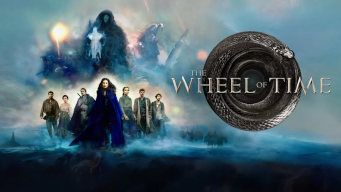

title: Accueil

# Accueil

## Derniers vus

Affiche|Information
:---:|:---
 

:material-star:{.gold .heart}:material-star:{.gold .heart}:material-star:{.gold .heart}:material-star:{.gold .heart}:material-star-outline:{.grey }|Animé : **Astérix & Obélix : Le Combat des Chefs** Origine: **France** Sortie en **2025** Nb. épisodes: **5**  _Respecte l'esprit des auteurs de la BD, avec quelques mises à jour bien venues._
 

:material-star:{.gold .heart}:material-star:{.gold .heart}:material-star:{.gold .heart}:material-star-outline:{.grey }:material-star-outline:{.grey }|Série : **Glitch / 글리치** Origine: **Corée du Sud** Sortie en **2022** Nb. épisodes: **10** :kr: sous-titres en coréens  _histoire d'OVNI et de secte, difficile à suivre mais la fin est bien faite._
 

:material-star:{.gold .heart}:material-star:{.gold .heart}:material-star:{.gold .heart}:material-star:{.gold .heart}:material-star-half-full:{.gold .heart}|Film : **Bullet Train Explosion** Origine: **Japon** Sortie en **2025** :kr: sous-titres en coréens  _Un train à grande vitesse prit en otage, très bien réalisé et plutôt réaliste._
 

:material-star:{.gold .heart}:material-star:{.gold .heart}:material-star:{.gold .heart}:material-star-outline:{.grey }:material-star-outline:{.grey }|Film : **Exterritorial** Origine: **Allemagne** Sortie en **2025**  _Enlèvement dans un consultat, action assez classique et surdimensionnée._
 

:material-star:{.gold .heart}:material-star:{.gold .heart}:material-star-half-full:{.gold .heart}:material-star-outline:{.grey }:material-star-outline:{.grey }|Série : **A Time Called You / 너의 시간 속으로** Origine: **Corée du Sud** Sortie en **2023** Nb. épisodes: **12** :kr: sous-titres en coréens  _Un retour vers le futur à la mode coréenne, mais malheureusement le montage est mauvais, c'est tellement emmêlée qu'on ne comprend  plus rien à l'histoire._
 

:material-star:{.gold .heart}:material-star:{.gold .heart}:material-star:{.gold .heart}:material-star-outline:{.grey }:material-star-outline:{.grey }|Série : **Galileo** Origine: **Japon** Sortie de la 2° saison en **2013** Nb. épisodes: **21**  _Policier basé sur le thème de la science._
 

:material-star:{.gold .heart}:material-star:{.gold .heart}:material-star:{.gold .heart}:material-star-outline:{.grey }:material-star-outline:{.grey }|Série : **Iron Family / 다리미 패밀리** Origine: **Corée du Sud** Sortie en **2024** Nb. épisodes: **36**  _Une famille prise dans la tourmente du manque d'argent._
 

:material-star:{.gold .heart}:material-star:{.gold .heart}:material-star:{.gold .heart}:material-star-outline:{.grey }:material-star-outline:{.grey }|Animé : **Ghost in the Shell: SAC_2045 Sustainable War** Origine: **Japon** Sortie en **2021** Nb. épisodes: **1**  _Film d'animation de science-fiction japonais dans un monde complexe._
 

:material-star:{.gold .heart}:material-star:{.gold .heart}:material-star:{.gold .heart}:material-star-outline:{.grey }:material-star-outline:{.grey }|Série : **The Wheel of Time / La roue du temps** Origine: **Etats-Unis** Sortie de la 3° saison en **2025** Nb. épisodes: **24**  _Héroïque fantasie des plus classiques, dans le style des Terres du Milieu._
 

:material-star:{.gold .heart}:material-star:{.gold .heart}:material-star:{.gold .heart}:material-star-half-full:{.gold .heart}:material-star-outline:{.grey }|Série : **Outlander** Origine: **Etats-Unis** Sortie de la 7° saison en **2024** Nb. épisodes: **91**  _Très bonne idée, plutôt bien réalisé, mais les dernières saisons sont un peu trop larmoyantes._

## En cours...

Affiche|Information
:---:|:---
 

|Série : **J'irai te voir dans ma prochaine vie / 이번생도 잘부탁해** Origine: **Corée du Sud** Sortie en **2023** Nb. épisodes: **12** :kr: sous-titres en coréens  _nan_
 

|Série : **Love Alarm / 종아하면 울리는** Origine: **Corée du Sud** Sortie de la 2° saison en **2019** Nb. épisodes: **14** :kr: sous-titres en coréens  _Compatibilité amoureuse..._
 

|Série : **Lost** Origine: **Etats-Unis** Sortie de la 6° saison en **2010** Nb. épisodes: **120**  _Un avion s'écrase sur une île finalement pas si déserte que cela._

## Top 10

Affiche|Information
:---:|:---
:material-numeric-1-circle:{.num_gold}  

:material-star:{.gold .heart}:material-star:{.gold .heart}:material-star:{.gold .heart}:material-star:{.gold .heart}:material-star:{.gold .heart}|Série : **Something in the Rain / 밥 잘 사주는 예쁜 누나** Origine: **Corée du Sud** Sortie en **2018** Nb. épisodes: **16**  _Excellent, aborde à la fois le monde du travail et un des tabous de la société coréenne._
:material-numeric-2-circle:{.num_silver}  

:material-star:{.gold .heart}:material-star:{.gold .heart}:material-star:{.gold .heart}:material-star:{.gold .heart}:material-star:{.gold .heart}|Série : **It's Okay to Not Be Okay** Origine: **Corée du Sud** Sortie en **2020** Nb. épisodes: **16** :kr: sous-titres en coréens  _Bizarre au premier abord, on tombe vite sous le charme des personnages._
:material-numeric-3-circle:{.num_copper}  

:material-star:{.gold .heart}:material-star:{.gold .heart}:material-star:{.gold .heart}:material-star:{.gold .heart}:material-star:{.gold .heart}|Série : **Crash Landing on You** Origine: **Corée du Sud** Sortie en **2019** Nb. épisodes: **16** :kr: sous-titres en coréens  _Très bon scénario, les acteurs sont excellents et la réalisation paufinée. Ca mériterait une saison 2 !_
:material-numeric-4-circle:  

:material-star:{.gold .heart}:material-star:{.gold .heart}:material-star:{.gold .heart}:material-star:{.gold .heart}:material-star:{.gold .heart}|Série : **My Mister** Origine: **Corée du Sud** Sortie en **2018** Nb. épisodes: **16**  _Comment ne pas tomber sous le charme de IU ! On a envie que la série ne s'arrête jamais._
:material-numeric-5-circle:  

:material-star:{.gold .heart}:material-star:{.gold .heart}:material-star:{.gold .heart}:material-star:{.gold .heart}:material-star:{.gold .heart}|Série : **One Spring Night** Origine: **Corée du Sud** Sortie en **2019** Nb. épisodes: **16** :kr: sous-titres en coréens  _Excellent, bonne description de la société coréennes et de certains de ses travers._
:material-numeric-6-circle:  

:material-star:{.gold .heart}:material-star:{.gold .heart}:material-star:{.gold .heart}:material-star:{.gold .heart}:material-star:{.gold .heart}|Série : **My Secret Terrius** Origine: **Corée du Sud** Sortie en **2018** Nb. épisodes: **16**  _Très bon scénario d'espionnage, les acteurs sont impeccables._
:material-numeric-7-circle:  

:material-star:{.gold .heart}:material-star:{.gold .heart}:material-star:{.gold .heart}:material-star:{.gold .heart}:material-star:{.gold .heart}|Série : **Pinocchio** Origine: **Corée du Sud** Sortie en **2014** Nb. épisodes: **20**  _Bon scénario sur les journalistes en Corée, même s'il faut quelques épisodes de description avant son démarrage._
:material-numeric-8-circle:  

:material-star:{.gold .heart}:material-star:{.gold .heart}:material-star:{.gold .heart}:material-star:{.gold .heart}:material-star:{.gold .heart}|Série : **Misaeng** Origine: **Corée du Sud** Sortie en **2014** Nb. épisodes: **20** :kr: sous-titres en coréens  _La vie en entreprise en Corée. Très bon scénario, nombreuses situations intéressantes._
:material-numeric-9-circle:  

:material-star:{.gold .heart}:material-star:{.gold .heart}:material-star:{.gold .heart}:material-star:{.gold .heart}:material-star:{.gold .heart}|Série : **La Reine des larmes / 눈물의 여왕** Origine: **Corée du Sud** Sortie en **2024** Nb. épisodes: **16** :kr: sous-titres en coréens  _Jeux d'intrigues et rebondissement autour du thème d'un mariage qui bas de l'aile._
:material-numeric-10-circle:  

:material-star:{.gold .heart}:material-star:{.gold .heart}:material-star:{.gold .heart}:material-star:{.gold .heart}:material-star:{.gold .heart}|Série : **Designated Survivor: 60 Days** Origine: **Corée du Sud** Sortie en **2019** Nb. épisodes: **16** :kr: sous-titres en coréens  _Bien plus intéressant que la version américaine, le contexte politique de la Corée du sud est bien plus crédible._
