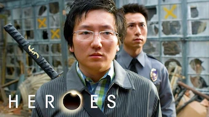

title: Accueil

# Accueil

## Derniers vus

Affiche|Information
:---:|:---
 

:material-star:{.gold .heart}:material-star:{.gold .heart}:material-star:{.gold .heart}:material-star:{.gold .heart}:material-star-half-full:{.gold .heart}|Série : **Reboot / リブート** Origine: **Japon** Sortie en **2026** Nb. épisodes: **10** :jp: sous-titres en japonais  _Un scénario sans erreur pour ce policier de haut vol._
 

:material-star:{.gold .heart}:material-star:{.gold .heart}:material-star:{.gold .heart}:material-star-outline:{.grey }:material-star-outline:{.grey }|Série : **The Apartment Job / Syndic de choc / 아파트** Origine: **Corée du Sud** Sortie en **2026** Nb. épisodes: **12** :kr: sous-titres en coréen  _La corruption à tous les étages dans ces immeubles gérés par des syndics, un bon scénario met des passages un peu trop léger._
 

:material-star:{.gold .heart}:material-star:{.gold .heart}:material-star-outline:{.grey }:material-star-outline:{.grey }:material-star-outline:{.grey }|Série : **GIGN** Origine: **France** Sortie en **2026** Nb. épisodes: **6**  _Un scénario de bien piètre facture, digne d'une série B, avec une bande de cowboys bien éloignés de la réalité du GIGN. C'est bien dommage._
 

:material-star:{.gold .heart}:material-star:{.gold .heart}:material-star:{.gold .heart}:material-star:{.gold .heart}:material-star-outline:{.grey }|Série : **Spooky in Love / 오싹한 연애** Origine: **Corée du Sud** Sortie en **2026** Nb. épisodes: **12** :kr: sous-titres en coréen  _La justice des disparus provoque beaucoup d'équivoque._
 

:material-star:{.gold .heart}:material-star:{.gold .heart}:material-star:{.gold .heart}:material-star-outline:{.grey }:material-star-outline:{.grey }|Série : **Rabudo Wan / LOVED ONE / ラブドワン** Origine: **Japon** Sortie en **2026** Nb. épisodes: **11** :jp: sous-titres en japonais  _Quand la médécine légale au japon permet de résoudre des crimes._
 

:material-star:{.gold .heart}:material-star:{.gold .heart}:material-star:{.gold .heart}:material-star-outline:{.grey }:material-star-outline:{.grey }|Série : **Our Sticky Love / 이런 엿같은 사랑** Origine: **Corée du Sud** Sortie en **2026** Nb. épisodes: **12** :kr: sous-titres en coréen  _Quand la représentante de la justice a perdu la mémoire, une bonne idée mais servie par un mauvais scénario bourré d'incohérences._
 :material-television::material-star:{.gold .heart}:material-star:{.gold .heart}:material-star:{.gold .heart}:material-star-half-full:{.gold .heart}:material-star-outline:{.grey }|Série : **Shōgun** Origine: **Etats-Unis** Sortie en **2024** Nb. épisodes: **10**  _Remake de la série Shogun, avec malheureusement des scénes qui tombent à plat et des surcharges non historiques inutiles._
 

:material-star:{.gold .heart}:material-star:{.gold .heart}:material-star:{.gold .heart}:material-star-half-full:{.gold .heart}:material-star-outline:{.grey }|Série : **Perdiendo el juicio / Trouble du jugement** Origine: **Espagne** Sortie en **2026** Nb. épisodes: **10**  _Comment être avocat avec des tocs, la chute est pas mal._
 

:material-star:{.gold .heart}:material-star:{.gold .heart}:material-star:{.gold .heart}:material-star-half-full:{.gold .heart}:material-star-outline:{.grey }|Film : **Tigre et dragon** Origine: **Taïwan** Sortie en **2000**  _Le film qui a lancé le genre, ça a un peu vieilli mais les actrices sont toujours aussi jolies._
 

:material-star:{.gold .heart}:material-star:{.gold .heart}:material-star:{.gold .heart}:material-star-outline:{.grey }:material-star-outline:{.grey }|Série : **Agent Kim Reactiv/ated / Agent Kim Reactivated / 김부장** Origine: **Corée du Sud** Sortie en **2026** Nb. épisodes: **10** :kr: sous-titres en coréen  _Dommage, histoire intéressante mais un scénario  avec trop de situation peu cohérente prétexte à des combats._

## En cours...

Affiche|Information
:---:|:---
 

|Emission : **Quotidien** Origine: **France** Sortie en **2026** Nb. épisodes: **16**  _nan_
 

|Série : **De l'ombre à la puissance** Origine: **Chine** Sortie en **2026** Nb. épisodes: **24**  _Complot au sommet dans la chine médiévale._
 

|Série : **A Love So Beautiful (Korean) / 아름다웠던 우리에게** Origine: **Corée du Sud** Sortie en **2020** Nb. épisodes: **24** :kr: sous-titres en coréen  _Les amourettes obsessionnelles d’une étudiante._
 

|Série : **La Vie rêvée de M. Kim / 서울 자가에 대기업 다니는 김 부장 이야기** Origine: **Corée du Sud** Sortie en **2025** Nb. épisodes: **12** :kr: sous-titres en coréen  _Un cadre, aussi père et mari, se sent dépassé dans sa vie personnelle et professionnelle._
 

|Série : **Heroes** Origine: **Etats-Unis** Sortie de la 4° saison en **2009** Nb. épisodes: **78**  _nan_
 

|Série : **Fauda** Origine: **Israël** Sortie de la 5° saison en **2023** Nb. épisodes: **60**  _Fête foraine en territoire palestinien, la contextualisation est bien, mais complètement pro israelien, les négociations et les filatures ne sont pas crédibles. 2,5_
 

|Série : **Gokusen / ごくせん** Origine: **Japon** Sortie de la 3° saison en **2008** Nb. épisodes: **34**  _Une fille de Yakuza veut devenir professeur et changer de vie, sans doute tiré d’une BD, avec un ton légé et humoristique. Beaucoup trop répétitif, les 3 saisons sont basés sur le même scénario._
 

|Série : **What Will You Do, Ieyasu?** Origine: **Japon** Sortie en **2023** Nb. épisodes: **48**  _nan_

## Top 10

Affiche|Information
:---:|:---
:material-numeric-1-circle:{.num_gold}  

:material-star:{.gold .heart}:material-star:{.gold .heart}:material-star:{.gold .heart}:material-star:{.gold .heart}:material-star:{.gold .heart}|Série : **Something in the Rain / 밥 잘 사주는 예쁜 누나** Origine: **Corée du Sud** Sortie en **2018** Nb. épisodes: **16**  _Excellent, aborde à la fois le monde du travail et un des tabous de la société coréenne._
:material-numeric-2-circle:{.num_silver}  

:material-star:{.gold .heart}:material-star:{.gold .heart}:material-star:{.gold .heart}:material-star:{.gold .heart}:material-star:{.gold .heart}|Série : **It's Okay to Not Be Okay** Origine: **Corée du Sud** Sortie en **2020** Nb. épisodes: **16** :kr: sous-titres en coréen  _Bizarre au premier abord, on tombe vite sous le charme des personnages._
:material-numeric-3-circle:{.num_copper}  

:material-star:{.gold .heart}:material-star:{.gold .heart}:material-star:{.gold .heart}:material-star:{.gold .heart}:material-star:{.gold .heart}|Série : **Crash Landing on You** Origine: **Corée du Sud** Sortie en **2019** Nb. épisodes: **16** :kr: sous-titres en coréen  _Très bon scénario, les acteurs sont excellents et la réalisation paufinée. Ca mériterait une saison 2 !_
:material-numeric-4-circle:  

:material-star:{.gold .heart}:material-star:{.gold .heart}:material-star:{.gold .heart}:material-star:{.gold .heart}:material-star:{.gold .heart}|Série : **My Mister** Origine: **Corée du Sud** Sortie en **2018** Nb. épisodes: **16**  _Comment ne pas tomber sous le charme de IU ! On a envie que la série ne s'arrête jamais._
:material-numeric-5-circle:  

:material-star:{.gold .heart}:material-star:{.gold .heart}:material-star:{.gold .heart}:material-star:{.gold .heart}:material-star:{.gold .heart}|Série : **One Spring Night** Origine: **Corée du Sud** Sortie en **2019** Nb. épisodes: **16** :kr: sous-titres en coréen  _Excellent, bonne description de la société coréennes et de certains de ses travers._
:material-numeric-6-circle:  

:material-star:{.gold .heart}:material-star:{.gold .heart}:material-star:{.gold .heart}:material-star:{.gold .heart}:material-star:{.gold .heart}|Série : **My Secret Terrius** Origine: **Corée du Sud** Sortie en **2018** Nb. épisodes: **16**  _Très bon scénario d'espionnage, les acteurs sont impeccables._
:material-numeric-7-circle:  

:material-star:{.gold .heart}:material-star:{.gold .heart}:material-star:{.gold .heart}:material-star:{.gold .heart}:material-star:{.gold .heart}|Série : **Pinocchio** Origine: **Corée du Sud** Sortie en **2014** Nb. épisodes: **20**  _Bon scénario sur les journalistes en Corée, même s'il faut quelques épisodes de description avant son démarrage._
:material-numeric-8-circle:  

:material-star:{.gold .heart}:material-star:{.gold .heart}:material-star:{.gold .heart}:material-star:{.gold .heart}:material-star:{.gold .heart}|Série : **Misaeng** Origine: **Corée du Sud** Sortie en **2014** Nb. épisodes: **20** :kr: sous-titres en coréen  _La vie en entreprise en Corée. Très bon scénario, nombreuses situations intéressantes._
:material-numeric-9-circle:  

:material-star:{.gold .heart}:material-star:{.gold .heart}:material-star:{.gold .heart}:material-star:{.gold .heart}:material-star:{.gold .heart}|Série : **La Reine des larmes / 눈물의 여왕** Origine: **Corée du Sud** Sortie en **2024** Nb. épisodes: **16** :kr: sous-titres en coréen  _Jeux d'intrigues et rebondissement autour du thème d'un mariage qui bas de l'aile._
:material-numeric-10-circle:  

:material-star:{.gold .heart}:material-star:{.gold .heart}:material-star:{.gold .heart}:material-star:{.gold .heart}:material-star:{.gold .heart}|Série : **Designated Survivor: 60 Days** Origine: **Corée du Sud** Sortie en **2019** Nb. épisodes: **16** :kr: sous-titres en coréen  _Bien plus intéressant que la version américaine, le contexte politique de la Corée du sud est bien plus crédible._
