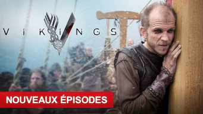
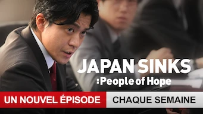

title: Accueil

# Accueil

## Derniers vus

Affiche|Information
:---:|:---
 |Série : **Tomorrow / 내일** Origine: **Corée du Sud** Note: :material-star:{.gold .heart}:material-star:{.gold .heart}:material-star-half-full:{.gold .heart}:material-star-outline:{.grey }:material-star-outline:{.grey } Sortie en **2022** Nb. épisodes: **16** :kr: sous-titres en coréens  _Brigrade anti-suicide, ou presque; original, mais les scénarios ne sont pas très bons ou mal exploités._
 |Série : **Le bœuf : Une passion coréenne / 한우 랩소디** Origine: **Corée du Sud** Note: :material-star:{.gold .heart}:material-star:{.gold .heart}:material-star:{.gold .heart}:material-star-outline:{.grey }:material-star-outline:{.grey } Sortie en **2021** Nb. épisodes: **2** :kr: sous-titres en coréens  _Pour les amateurs de bonne chair, avec un passage un peu historique intéressant._
 |Série : **Vikings** Origine: **Etats-Unis** Note: :material-star:{.gold .heart}:material-star:{.gold .heart}:material-star:{.gold .heart}:material-star-half-full:{.gold .heart}:material-star-outline:{.grey } Sortie en **2021** Nb. épisodes: **89**  _Bonne série sur les vikings. Les premières saisons sont très bien. A partir de la 4ème on est trop dans la surenchère et cela devient ridicule à la 6e._
 |Série : **Couple on the Backtrack / 고백부부** Origine: **Corée du Sud** Note: :material-star:{.gold .heart}:material-star:{.gold .heart}:material-star:{.gold .heart}:material-star:{.gold .heart}:material-star-outline:{.grey } Sortie en **2017** Nb. épisodes: **12**  _Recommencer sa vie de couple en retournant au début de celle-ci, un thème déjà vue mais traité différemment._
 |Film : **L'immortel** Origine: **France** Note: :material-star:{.gold .heart}:material-star:{.gold .heart}:material-star:{.gold .heart}:material-star-outline:{.grey }:material-star-outline:{.grey } Sortie en **2010**  _Histoire de truands à Marseille, policier classique français._
 |Série : **Japan Sinks: People of Hope** Origine: **Japon** Note: :material-star:{.gold .heart}:material-star:{.gold .heart}:material-star-half-full:{.gold .heart}:material-star-outline:{.grey }:material-star-outline:{.grey } Sortie en **2021** Nb. épisodes: **10**  _Fiction avec pour thème le réchauffement climatique et les conséquences imprévisibles que cela entraîne._
 |Série : **Graceful Friends / 우아한 친구들** Origine: **Corée du Sud** Note: :material-star:{.gold .heart}:material-star:{.gold .heart}:material-star:{.gold .heart}:material-star-half-full:{.gold .heart}:material-star-outline:{.grey } Sortie en **2020** Nb. épisodes: **17**  _Un scénario qui tient la route et pas mal d'idée; il tient néanmoins un peu trop sur une accumulation de non-dits, ce qui gâche un peu la crédibilité de l'histoire._
 |Film : **The Door into Summer / Une porte sur l'été** Origine: **Japon** Note: :material-star:{.gold .heart}:material-star:{.gold .heart}:material-star:{.gold .heart}:material-star-outline:{.grey }:material-star-outline:{.grey } Sortie en **2021**  _Film de science-fiction futuriste, basé sur une bonne idée, mais qui part un peu trop dans une boucle._
 |Série : **Peaky Blinders** Origine: **Royaume-Uni** Note: :material-star:{.gold .heart}:material-star:{.gold .heart}:material-star:{.gold .heart}:material-star:{.gold .heart}:material-star-outline:{.grey } Sortie en **2022** Nb. épisodes: **36**  _Beaucoup de violence gratuite et quelques situations peu cohérentes, mais les personnages sont plutôt sympa et recherchés._
 |Série : **Her Private Life / 그녀의 사생활** Origine: **Corée du Sud** Note: :material-star:{.gold .heart}:material-star:{.gold .heart}:material-star:{.gold .heart}:material-star-outline:{.grey }:material-star-outline:{.grey } Sortie en **2019** Nb. épisodes: **16**  _Comédie légère avec pour toile de fond les excès des fans de la K-pop._

## En cours...

Affiche|Information
:---:|:---
 |Documentaire : **La Soupe coréenne : Une culture en ébullition** Origine: **Corée du Sud** Sortie en **2022** Nb. épisodes: **3** :kr: sous-titres en coréens  _Intéressant vis-à-vis de la culture coréenne, mais pas plus._
 |Documentaire : **Les nouilles : Une passion coréenne / 냉면 랩소디** Origine: **Corée du Sud** Sortie en **2021** Nb. épisodes: **2** :kr: sous-titres en coréens  _nan_
 |Documentaire : **The Reservoir Game** Origine: **Corée du Sud** Sortie en **2017** Nb. épisodes: **1**  _Enquête sur la corruption en Corée du Sud._
 |Série : **Dear My Friends** Origine: **Corée du Sud** Sortie en **2016** Nb. épisodes: **16**  _Pour l'instant, ça démarre lentement ..._
 |Série : **She Would Never Know / 선배, 그 립스틱 바르지 마요** Origine: **Corée du Sud** Sortie en **2021** Nb. épisodes: **16**  _nan_

## Top 10

Affiche|Information
:---:|:---
 |Palmarès: :material-numeric-1-circle:{.num_gold} Série : **Something in the Rain / 밥 잘 사주는 예쁜 누나** Origine: **Corée du Sud** Note: :material-star:{.gold .heart}:material-star:{.gold .heart}:material-star:{.gold .heart}:material-star:{.gold .heart}:material-star:{.gold .heart} Sortie en **2018** Nb. épisodes: **16**  _Excellent, aborde à la fois le monde du travail et un des tabous de la société coréenne._
 |Palmarès: :material-numeric-2-circle:{.num_silver} Série : **It's Okay to Not Be Okay** Origine: **Corée du Sud** Note: :material-star:{.gold .heart}:material-star:{.gold .heart}:material-star:{.gold .heart}:material-star:{.gold .heart}:material-star:{.gold .heart} Sortie en **2020** Nb. épisodes: **16** :kr: sous-titres en coréens  _Bizarre au premier abord, on tombe vite sous le charme des personnages._
 |Palmarès: :material-numeric-3-circle:{.num_copper} Série : **Crash Landing on You** Origine: **Corée du Sud** Note: :material-star:{.gold .heart}:material-star:{.gold .heart}:material-star:{.gold .heart}:material-star:{.gold .heart}:material-star:{.gold .heart} Sortie en **2019** Nb. épisodes: **16** :kr: sous-titres en coréens  _Très bon scénario, les acteurs sont excellents et la réalisation paufinée. Ca mériterait une saison 2 !_
 |Palmarès: :material-numeric-4-circle: Série : **My Mister** Origine: **Corée du Sud** Note: :material-star:{.gold .heart}:material-star:{.gold .heart}:material-star:{.gold .heart}:material-star:{.gold .heart}:material-star:{.gold .heart} Sortie en **2018** Nb. épisodes: **16**  _Comment ne pas tomber sous le charme de IU ! On a envie que la série ne s'arrête jamais._
 |Palmarès: :material-numeric-5-circle: Série : **One Spring Night** Origine: **Corée du Sud** Note: :material-star:{.gold .heart}:material-star:{.gold .heart}:material-star:{.gold .heart}:material-star:{.gold .heart}:material-star:{.gold .heart} Sortie en **2019** Nb. épisodes: **16** :kr: sous-titres en coréens  _Excellent, bonne description de la société coréennes et de certains de ses travers._
 |Palmarès: :material-numeric-6-circle: Série : **My Secret Terrius** Origine: **Corée du Sud** Note: :material-star:{.gold .heart}:material-star:{.gold .heart}:material-star:{.gold .heart}:material-star:{.gold .heart}:material-star:{.gold .heart} Sortie en **2018** Nb. épisodes: **16**  _Très bon scénario d'espionnage, les acteurs sont impeccables._
 |Palmarès: :material-numeric-7-circle: Série : **Pinocchio** Origine: **Corée du Sud** Note: :material-star:{.gold .heart}:material-star:{.gold .heart}:material-star:{.gold .heart}:material-star:{.gold .heart}:material-star:{.gold .heart} Sortie en **2014** Nb. épisodes: **20**  _Bon scénario sur les journalistes en Corée, même s'il faut quelques épisodes de description avant son démarrage._
 |Palmarès: :material-numeric-8-circle: Série : **Misaeng** Origine: **Corée du Sud** Note: :material-star:{.gold .heart}:material-star:{.gold .heart}:material-star:{.gold .heart}:material-star:{.gold .heart}:material-star:{.gold .heart} Sortie en **2014** Nb. épisodes: **20** :kr: sous-titres en coréens  _La vie en entreprise en Corée. Très bon scénario, nombreuses situations intéressantes._
 |Palmarès: :material-numeric-9-circle: Série : **Love, Marriage and Divorce / 결혼작사 이혼작곡** Origine: **Corée du Sud** Note: :material-star:{.gold .heart}:material-star:{.gold .heart}:material-star:{.gold .heart}:material-star:{.gold .heart}:material-star:{.gold .heart} Sortie en **2021** Nb. épisodes: **32** :kr: sous-titres en coréens  _Un excellent scénario sur les relations homme-femme, avec de nombreux cas de figure mais toujours très juste._
 |Palmarès: :material-numeric-10-circle: Série : **Designated Survivor: 60 Days** Origine: **Corée du Sud** Note: :material-star:{.gold .heart}:material-star:{.gold .heart}:material-star:{.gold .heart}:material-star:{.gold .heart}:material-star:{.gold .heart} Sortie en **2019** Nb. épisodes: **16** :kr: sous-titres en coréens  _Bien plus intéressant que la version américaine, le contexte politique de la Corée du sud est bien plus crédible._
