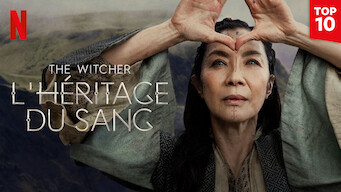
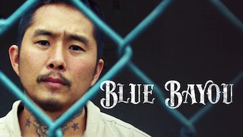
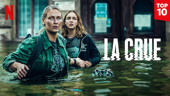

title: Accueil

# Accueil

## Derniers vus

Affiche|Information
:---:|:---
 :material-netflix:{ .rouge }|Série : **Mr. Queen / 철인왕후** Origine: **Corée du Sud** Note: :material-star:{.gold .heart}:material-star:{.gold .heart}:material-star:{.gold .heart}:material-star:{.gold .heart}:material-star-half-full:{.gold .heart} Sortie de la dernière saison en **2020** Nb. épisodes: **20**  _Excellente série, absolument pas basée sur des faits historiques et incluant une sorte de voyage dans le passé, avec un scénario sans faute et  agréable à voir._
 :material-netflix:{ .rouge }|Série : **Unlock My Boss / 사장님을 잠금해제** Origine: **Corée du Sud** Note: :material-star:{.gold .heart}:material-star:{.gold .heart}:material-star:{.gold .heart}:material-star-outline:{.grey }:material-star-outline:{.grey } Sortie de la dernière saison en **2022** Nb. épisodes: **12** :kr: sous-titres en coréens  _Basé sur une BD, c'est plutôt bien fait mais on reste un peu sur sa faim, l'intrigue étant des plus classiques._
 Amazon Prime|Série : **Fleabag** Origine: **Royaume-Uni** Note: :material-star:{.gold .heart}:material-star:{.gold .heart}:material-star:{.gold .heart}:material-star-outline:{.grey }:material-star-outline:{.grey } Sortie de la dernière saison en **2016** Nb. épisodes: **12**  _Humour très british autour du sexe dans un échange entre le personnage principal et le téléspectateur, plutôt déjanté, réussi et amusant._
 :material-netflix:{ .rouge }|Série : **The Witcher : L'héritage du sang** Origine: **Etats-Unis** Note: :material-star:{.gold .heart}:material-star:{.gold .heart}:material-star:{.gold .heart}:material-star-outline:{.grey }:material-star-outline:{.grey } Sortie de la dernière saison en **2022** Nb. épisodes: **4**  _Une sorte d'introduction au monde dans lequel évolue The Witcher._
 :material-netflix:{ .rouge }|Série : **Record of Youth / 청춘기록** Origine: **Corée du Sud** Note: :material-star:{.gold .heart}:material-star:{.gold .heart}:material-star:{.gold .heart}:material-star-half-full:{.gold .heart}:material-star-outline:{.grey } Sortie de la dernière saison en **2020** Nb. épisodes: **16** :kr: sous-titres en coréens  _La gestion de carrière des acteurs et le chao qui l'accompagne est le thème principal de cette série dispose d'un scénario complet._
 :material-netflix:{ .rouge }|Film : **Blue Bayou** Origine: **Etats-Unis** Note: :material-star:{.gold .heart}:material-star-outline:{.grey }:material-star-outline:{.grey }:material-star-outline:{.grey }:material-star-outline:{.grey } Sortie en **2021**  _Pas intéressant, trop prévisible, trop classique, trop monotone._
 :material-netflix:{ .rouge }|Série : **L'alchimie des âmes / Alchemy of Souls / 환혼** Origine: **Corée du Sud** Note: :material-star:{.gold .heart}:material-star:{.gold .heart}:material-star:{.gold .heart}:material-star-half-full:{.gold .heart}:material-star-outline:{.grey } Sortie de la dernière saison en **2023** Nb. épisodes: **30**  _Histoire de mage et de magie dans un monde féerique à la coréenne, les intrigues sont bonnes et le scénario assez riche, seul le montage est un peu compliqué et souvent anachronique._
 Amazon Prime|Série : **Hanna** Origine: **Etats-Unis** Sortie de la dernière saison en **2021** Nb. épisodes: **22**  _Beaucoup trop prévisible pour être réellement intéressant même si l'histoire de départ est basée sur le thème déjà traité de la série Dark Angel.
Saison 1: 2,5_
 Amazon Prime|Série : **Treadstone** Origine: **Etats-Unis** Note: :material-star:{.gold .heart}:material-star-half-full:{.gold .heart}:material-star-outline:{.grey }:material-star-outline:{.grey }:material-star-outline:{.grey } Sortie de la dernière saison en **2019** Nb. épisodes: **10**  _Série sur le même concept que les films de Jason Bourne, mais avec beaucoup de stéréotype et un montage très mauvais._
 :material-netflix:{ .rouge }|Série : **La Crue** Origine: **Pologne** Note: :material-star:{.gold .heart}:material-star:{.gold .heart}:material-star:{.gold .heart}:material-star-half-full:{.gold .heart}:material-star-outline:{.grey } Sortie de la dernière saison en **2022** Nb. épisodes: **6**  _Histoire vraie d'une inondation d'une ville en Pologne en 1997._

## En cours...

Affiche|Information
:---:|:---
 :material-netflix:{ .rouge }|Série : **The Glory / 더 글로리** Origine: **Corée du Sud** Sortie de la dernière saison en **2022** Nb. épisodes: **8** :kr: sous-titres en coréens  _nan_
 Amazon Prime|Série : **Carnival Row** Origine: **Etats-Unis** Sortie de la dernière saison en **2023** Nb. épisodes: **18**  _Un monde fantastique la Jules Verne, très mécanique mais avec des fées. saison 1 : 4,5_
 Amazon Prime|Série : **Hanna** Origine: **Etats-Unis** Sortie de la dernière saison en **2021** Nb. épisodes: **22**  _Beaucoup trop prévisible pour être réellement intéressant même si l'histoire de départ est basée sur le thème déjà traité de la série Dark Angel.
Saison 1: 2,5_
 Amazon Prime|Série : **Secret Diary of a Call Girl / Journal Intime d'une Call Girl** Origine: **Royaume-Uni** Sortie de la dernière saison en **2007** Nb. épisodes: **24**  _Part un peu dans tous les sens ..._

## Top 10

Affiche|Information
:---:|:---
 :material-netflix:{ .rouge }|Palmarès: :material-numeric-1-circle:{.num_gold} Série : **Something in the Rain / 밥 잘 사주는 예쁜 누나** Origine: **Corée du Sud** Note: :material-star:{.gold .heart}:material-star:{.gold .heart}:material-star:{.gold .heart}:material-star:{.gold .heart}:material-star:{.gold .heart} Sortie de la dernière saison en **2018** Nb. épisodes: **16**  _Excellent, aborde à la fois le monde du travail et un des tabous de la société coréenne._
 :material-netflix:{ .rouge }|Palmarès: :material-numeric-2-circle:{.num_silver} Série : **It's Okay to Not Be Okay** Origine: **Corée du Sud** Note: :material-star:{.gold .heart}:material-star:{.gold .heart}:material-star:{.gold .heart}:material-star:{.gold .heart}:material-star:{.gold .heart} Sortie de la dernière saison en **2020** Nb. épisodes: **16** :kr: sous-titres en coréens  _Bizarre au premier abord, on tombe vite sous le charme des personnages._
 :material-netflix:{ .rouge }|Palmarès: :material-numeric-3-circle:{.num_copper} Série : **Crash Landing on You** Origine: **Corée du Sud** Note: :material-star:{.gold .heart}:material-star:{.gold .heart}:material-star:{.gold .heart}:material-star:{.gold .heart}:material-star:{.gold .heart} Sortie de la dernière saison en **2019** Nb. épisodes: **16** :kr: sous-titres en coréens  _Très bon scénario, les acteurs sont excellents et la réalisation paufinée. Ca mériterait une saison 2 !_
 :material-netflix:{ .rouge }|Palmarès: :material-numeric-4-circle: Série : **My Mister** Origine: **Corée du Sud** Note: :material-star:{.gold .heart}:material-star:{.gold .heart}:material-star:{.gold .heart}:material-star:{.gold .heart}:material-star:{.gold .heart} Sortie de la dernière saison en **2018** Nb. épisodes: **16**  _Comment ne pas tomber sous le charme de IU ! On a envie que la série ne s'arrête jamais._
 :material-netflix:{ .rouge }|Palmarès: :material-numeric-5-circle: Série : **One Spring Night** Origine: **Corée du Sud** Note: :material-star:{.gold .heart}:material-star:{.gold .heart}:material-star:{.gold .heart}:material-star:{.gold .heart}:material-star:{.gold .heart} Sortie de la dernière saison en **2019** Nb. épisodes: **16** :kr: sous-titres en coréens  _Excellent, bonne description de la société coréennes et de certains de ses travers._
 :material-netflix:{ .rouge }|Palmarès: :material-numeric-6-circle: Série : **My Secret Terrius** Origine: **Corée du Sud** Note: :material-star:{.gold .heart}:material-star:{.gold .heart}:material-star:{.gold .heart}:material-star:{.gold .heart}:material-star:{.gold .heart} Sortie de la dernière saison en **2018** Nb. épisodes: **16**  _Très bon scénario d'espionnage, les acteurs sont impeccables._
 :material-netflix:{ .rouge }|Palmarès: :material-numeric-7-circle: Série : **Pinocchio** Origine: **Corée du Sud** Note: :material-star:{.gold .heart}:material-star:{.gold .heart}:material-star:{.gold .heart}:material-star:{.gold .heart}:material-star:{.gold .heart} Sortie de la dernière saison en **2014** Nb. épisodes: **20**  _Bon scénario sur les journalistes en Corée, même s'il faut quelques épisodes de description avant son démarrage._
 :material-netflix:{ .rouge }|Palmarès: :material-numeric-8-circle: Série : **Misaeng** Origine: **Corée du Sud** Note: :material-star:{.gold .heart}:material-star:{.gold .heart}:material-star:{.gold .heart}:material-star:{.gold .heart}:material-star:{.gold .heart} Sortie de la dernière saison en **2014** Nb. épisodes: **20** :kr: sous-titres en coréens  _La vie en entreprise en Corée. Très bon scénario, nombreuses situations intéressantes._
 :material-netflix:{ .rouge }|Palmarès: :material-numeric-9-circle: Série : **Love, Marriage and Divorce / 결혼작사 이혼작곡** Origine: **Corée du Sud** Note: :material-star:{.gold .heart}:material-star:{.gold .heart}:material-star:{.gold .heart}:material-star:{.gold .heart}:material-star:{.gold .heart} Sortie de la dernière saison en **2021** Nb. épisodes: **32** :kr: sous-titres en coréens  _Un excellent scénario sur les relations homme-femme, avec de nombreux cas de figure mais toujours très juste._
 :material-netflix:{ .rouge }|Palmarès: :material-numeric-10-circle: Série : **Designated Survivor: 60 Days** Origine: **Corée du Sud** Note: :material-star:{.gold .heart}:material-star:{.gold .heart}:material-star:{.gold .heart}:material-star:{.gold .heart}:material-star:{.gold .heart} Sortie de la dernière saison en **2019** Nb. épisodes: **16** :kr: sous-titres en coréens  _Bien plus intéressant que la version américaine, le contexte politique de la Corée du sud est bien plus crédible._
