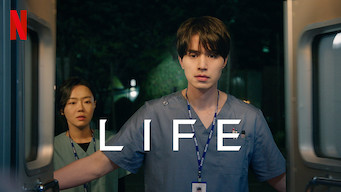
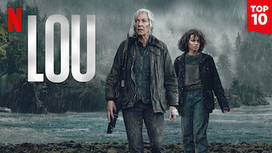

title: Accueil

# Accueil

## Derniers vus

Affiche|Information
:---:|:---
 |Série : **The Playlist** Origine: **Suède** Note: :material-star:{.gold .heart}:material-star:{.gold .heart}:material-star:{.gold .heart}:material-star-outline:{.grey }:material-star-outline:{.grey } Sortie en **2022** Nb. épisodes: **6**  _L'histoire de la création de Spotify au travers de six personnages et de six points de vue. Approche intéressante._
 |Série : **Life / 라이프** Origine: **Corée du Sud** Note: :material-star:{.gold .heart}:material-star:{.gold .heart}:material-star:{.gold .heart}:material-star-half-full:{.gold .heart}:material-star-outline:{.grey } Sortie en **2018** Nb. épisodes: **16**  _Intrigue politico-financière dans un hôpital de Séoul plutôt bien construite. Ambiance plutôt sombre dans le milieu hospitalier avec un affrontement médecine (patient) contre rentabilité (client)._
 |Série : **Le Seigneur des Anneaux : Les Anneaux de Pouvoir** Origine: **Etats-Unis** Note: :material-star:{.gold .heart}:material-star:{.gold .heart}:material-star:{.gold .heart}:material-star-outline:{.grey }:material-star-outline:{.grey } Sortie en **2022** Nb. épisodes: **8**  _Avant le Seigneur des Anneaux, un peu basé sur le silmarion mais vraiment pas du même niveau que la trilogie originale._
 |Série : **Revolutionary Sisters / 오케이 광자매** Origine: **Corée du Sud** Note: :material-star:{.gold .heart}:material-star:{.gold .heart}:material-star:{.gold .heart}:material-star-outline:{.grey }:material-star-outline:{.grey } Sortie en **2021** Nb. épisodes: **50**  _Histoire de famille .. le scénario est plutôt bien fait, mais certaines scènes sont loupées et viennent alourdir l'ensemble._
 |Série : **One the Woman / 운 더 우먼** Origine: **Corée du Sud** Note: :material-star:{.gold .heart}:material-star:{.gold .heart}:material-star:{.gold .heart}:material-star:{.gold .heart}:material-star-outline:{.grey } Sortie en **2021** Nb. épisodes: **16**  _Bon scénario, ça s'enchaîne bien, l'actrice principale est excellente, que demander de plus._
 |Documentaire : **Les nouilles : Une passion coréenne / 냉면 랩소디** Origine: **Corée du Sud** Note: :material-star:{.gold .heart}:material-star:{.gold .heart}:material-star-half-full:{.gold .heart}:material-star-outline:{.grey }:material-star-outline:{.grey } Sortie en **2021** Nb. épisodes: **2** :kr: sous-titres en coréens  _Intéressant vis-à-vis de la culture culinaire coréenne, avec parfois un aspect historique intéressant sur la provenance des différentes recettes._
 |Film : **Lou** Origine: **Etats-Unis** Note: :material-star:{.gold .heart}:material-star:{.gold .heart}:material-star-half-full:{.gold .heart}:material-star-outline:{.grey }:material-star-outline:{.grey } Sortie en **2022**  _Scénario à l'américaine assez classique d'une chasse à l'homme. Déjà vu._
 |Documentaire : **The Reservoir Game** Origine: **Corée du Sud** Note: :material-star:{.gold .heart}:material-star:{.gold .heart}:material-star:{.gold .heart}:material-star-outline:{.grey }:material-star-outline:{.grey } Sortie en **2017** Nb. épisodes: **1**  _Enquête par un journaliste sur la corruption en Corée du Sud et au Canada, qui finit paraître attaché à la maison bleue._
 |Série : **Café Minamdang / 미남당** Origine: **Corée du Sud** Note: :material-star:{.gold .heart}:material-star:{.gold .heart}:material-star:{.gold .heart}:material-star-half-full:{.gold .heart}:material-star-outline:{.grey } Sortie en **2022** Nb. épisodes: **18**  _Policier qui s'enchaine bien, sur un scénario intéressant. Malheureusement certains enchaînements "jour / nuit" et certaines scènes trop statiques viennent ternir l'ensemble._
 |Série : **Young Lady and Gentleman / 신사와 아가씨** Origine: **Corée du Sud** Note: :material-star:{.gold .heart}:material-star:{.gold .heart}:material-star-outline:{.grey }:material-star-outline:{.grey }:material-star-outline:{.grey } Sortie en **2021** Nb. épisodes: **52**  _Les deux personnages principaux sont bien trop naïfs, voir trop stupides, pour rendre le scénario crédible. Tout est cousu de fil blanc sans surprise, limite pathétique; seuls les histoires des personnages secondaires sont intéressantes._

## En cours...

Affiche|Information
:---:|:---
 |Série : **Homemade Love Story / 오! 삼광빌라! ** Origine: **Corée du Sud** Sortie en **2020** Nb. épisodes: **50**  _Histoire de famille, le scénario s'enchaîne et s'emboîte plutôt bien, les acteurs ayant des actions cohérentes._
 |Série : **The Handmaid's Tale / La Servante Écarlate** Origine: **Etats-Unis** Sortie en **2021** Nb. épisodes: **55**  _Très sombre et peut être prémonitoire !_
 |Série : **Star Trek - Picard** Origine: **Etats-Unis** Sortie en **2022** Nb. épisodes: **20**  _Part un peu dans tous les sens ..._
 |Série : **Fleabag** Origine: **Royaume-Uni** Sortie en **2016** Nb. épisodes: **12**  _Commence bien..._
 |Série : **Journal Intime d'une Call Girl** Origine: **Royaume-Uni** Sortie en **2007** Nb. épisodes: **24**  _Part un peu dans tous les sens ..._

## Top 10

Affiche|Information
:---:|:---
 |Palmarès: :material-numeric-1-circle:{.num_gold} Série : **Something in the Rain / 밥 잘 사주는 예쁜 누나** Origine: **Corée du Sud** Note: :material-star:{.gold .heart}:material-star:{.gold .heart}:material-star:{.gold .heart}:material-star:{.gold .heart}:material-star:{.gold .heart} Sortie en **2018** Nb. épisodes: **16**  _Excellent, aborde à la fois le monde du travail et un des tabous de la société coréenne._
 |Palmarès: :material-numeric-2-circle:{.num_silver} Série : **It's Okay to Not Be Okay** Origine: **Corée du Sud** Note: :material-star:{.gold .heart}:material-star:{.gold .heart}:material-star:{.gold .heart}:material-star:{.gold .heart}:material-star:{.gold .heart} Sortie en **2020** Nb. épisodes: **16** :kr: sous-titres en coréens  _Bizarre au premier abord, on tombe vite sous le charme des personnages._
 |Palmarès: :material-numeric-3-circle:{.num_copper} Série : **Crash Landing on You** Origine: **Corée du Sud** Note: :material-star:{.gold .heart}:material-star:{.gold .heart}:material-star:{.gold .heart}:material-star:{.gold .heart}:material-star:{.gold .heart} Sortie en **2019** Nb. épisodes: **16** :kr: sous-titres en coréens  _Très bon scénario, les acteurs sont excellents et la réalisation paufinée. Ca mériterait une saison 2 !_
 |Palmarès: :material-numeric-4-circle: Série : **My Mister** Origine: **Corée du Sud** Note: :material-star:{.gold .heart}:material-star:{.gold .heart}:material-star:{.gold .heart}:material-star:{.gold .heart}:material-star:{.gold .heart} Sortie en **2018** Nb. épisodes: **16**  _Comment ne pas tomber sous le charme de IU ! On a envie que la série ne s'arrête jamais._
 |Palmarès: :material-numeric-5-circle: Série : **One Spring Night** Origine: **Corée du Sud** Note: :material-star:{.gold .heart}:material-star:{.gold .heart}:material-star:{.gold .heart}:material-star:{.gold .heart}:material-star:{.gold .heart} Sortie en **2019** Nb. épisodes: **16** :kr: sous-titres en coréens  _Excellent, bonne description de la société coréennes et de certains de ses travers._
 |Palmarès: :material-numeric-6-circle: Série : **My Secret Terrius** Origine: **Corée du Sud** Note: :material-star:{.gold .heart}:material-star:{.gold .heart}:material-star:{.gold .heart}:material-star:{.gold .heart}:material-star:{.gold .heart} Sortie en **2018** Nb. épisodes: **16**  _Très bon scénario d'espionnage, les acteurs sont impeccables._
 |Palmarès: :material-numeric-7-circle: Série : **Pinocchio** Origine: **Corée du Sud** Note: :material-star:{.gold .heart}:material-star:{.gold .heart}:material-star:{.gold .heart}:material-star:{.gold .heart}:material-star:{.gold .heart} Sortie en **2014** Nb. épisodes: **20**  _Bon scénario sur les journalistes en Corée, même s'il faut quelques épisodes de description avant son démarrage._
 |Palmarès: :material-numeric-8-circle: Série : **Misaeng** Origine: **Corée du Sud** Note: :material-star:{.gold .heart}:material-star:{.gold .heart}:material-star:{.gold .heart}:material-star:{.gold .heart}:material-star:{.gold .heart} Sortie en **2014** Nb. épisodes: **20** :kr: sous-titres en coréens  _La vie en entreprise en Corée. Très bon scénario, nombreuses situations intéressantes._
 |Palmarès: :material-numeric-9-circle: Série : **Love, Marriage and Divorce / 결혼작사 이혼작곡** Origine: **Corée du Sud** Note: :material-star:{.gold .heart}:material-star:{.gold .heart}:material-star:{.gold .heart}:material-star:{.gold .heart}:material-star:{.gold .heart} Sortie en **2021** Nb. épisodes: **32** :kr: sous-titres en coréens  _Un excellent scénario sur les relations homme-femme, avec de nombreux cas de figure mais toujours très juste._
 |Palmarès: :material-numeric-10-circle: Série : **Designated Survivor: 60 Days** Origine: **Corée du Sud** Note: :material-star:{.gold .heart}:material-star:{.gold .heart}:material-star:{.gold .heart}:material-star:{.gold .heart}:material-star:{.gold .heart} Sortie en **2019** Nb. épisodes: **16** :kr: sous-titres en coréens  _Bien plus intéressant que la version américaine, le contexte politique de la Corée du sud est bien plus crédible._
