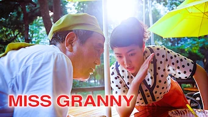
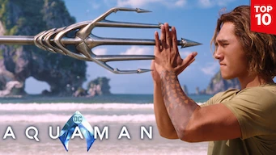

title: Accueil

# Accueil

## Derniers vus

Affiche|Information
:---:|:---
 |Film : **Silenced / 도가니** Origine: **Corée du Sud** Note: :material-star:{.gold .heart}:material-star:{.gold .heart}:material-star:{.gold .heart}:material-star:{.gold .heart}:material-star-outline:{.grey } Sortie en **2011** :kr: sous-titres en coréens  _Sujet difficile puisque cela concerne des enfants malentendants, mais le scénario est crédible._
 |Série : **Triad Princess** Origine: **Taïwan** Note: :material-star:{.gold .heart}:material-star:{.gold .heart}:material-star-half-full:{.gold .heart}:material-star-outline:{.grey }:material-star-outline:{.grey } Sortie en **2019** Nb. épisodes: **6**  _C'est gentil, plutôt bien fait mais ça reste du classique tout en restant sous-exploité._
 |Série : **Well-Intended Love** Origine: **Chine** Note: :material-star:{.gold .heart}:material-star:{.gold .heart}:material-star-half-full:{.gold .heart}:material-star-outline:{.grey }:material-star-outline:{.grey } Sortie en **2020** Nb. épisodes: **20**  _C'est gentil, le scénario tient la route mais ça ne va pas très loin._
 |Série : **Bulgasal: Immortal Souls / 불가살** Origine: **Corée du Sud** Note: :material-star:{.gold .heart}:material-star:{.gold .heart}:material-star:{.gold .heart}:material-star-outline:{.grey }:material-star-outline:{.grey } Sortie en **2021** Nb. épisodes: **16**  _On s'attend un mix de Highlander et de Kingdom, mais au final cela reste bien pâlichon avec des longueurs a des moments où l'action devrait prévaloir._
 |Documentaire : **Coded Bias : Algorithmes et discrimination** Origine: **Etats-Unis** Note: :material-star:{.gold .heart}:material-star:{.gold .heart}:material-star:{.gold .heart}:material-star-outline:{.grey }:material-star-outline:{.grey } Sortie en **2020** Nb. épisodes: **1**  _Bon documentaire sur la dérive provoquée par les algorithmes en intelligence artificielle, principalement sur la reconnaissance faciale._
 |Film : **Miss Granny / 수상한 그녀** Origine: **Corée du Sud** Note: :material-star:{.gold .heart}:material-star:{.gold .heart}:material-star:{.gold .heart}:material-star:{.gold .heart}:material-star:{.gold .heart} Sortie en **2014** :kr: sous-titres en coréens  _Très beau conte moderne, extrêmement bien ficelé, avec des acteurs qui jouent magnifiquement bien._
 |Série : **Weightlifting Fairy Kim Bok Joo / 역도 요정 김복주** Origine: **Corée du Sud** Note: :material-star:{.gold .heart}:material-star:{.gold .heart}:material-star:{.gold .heart}:material-star:{.gold .heart}:material-star-half-full:{.gold .heart} Sortie en **2016** Nb. épisodes: **16**  _Cette comédie se déroule dans une fac de sport, le scénario est de bonne qualité et c'est plaisant à voir._
 |Film : **High Society / 상류사회** Origine: **Corée du Sud** Note: :material-star:{.gold .heart}:material-star:{.gold .heart}:material-star:{.gold .heart}:material-star:{.gold .heart}:material-star-half-full:{.gold .heart} Sortie en **2018** :kr: sous-titres en coréens  _Intrigue dans le monde de la politique coréenne, très bien fait._
 |Film : **Aquaman** Origine: **Etats-Unis** Note: :material-star:{.gold .heart}:material-star:{.gold .heart}:material-star-half-full:{.gold .heart}:material-star-outline:{.grey }:material-star-outline:{.grey } Sortie en **2018**  _Scénario classique, dans la surenchère permanente, uniquement basé sur des effets spéciaux, l'aspect aquatique étant la seule différence avec les autres films de super-héros du même genre._
 |Série : **Rain or Shine / 그냥 사랑하는 사이** Origine: **Corée du Sud** Note: :material-star:{.gold .heart}:material-star:{.gold .heart}:material-star:{.gold .heart}:material-star:{.gold .heart}:material-star-outline:{.grey } Sortie en **2017** Nb. épisodes: **16**  _La reconstruction des personnes victime d'un effondrement de batiment. Sujet difficile, mais plutôt bien traité avec un scénario qui tient la route._

## En cours...

Affiche|Information
:---:|:---
 |Série : **The Devil Punisher** Origine: **Chine** Sortie en **2020** Nb. épisodes: **20**  _nan_
 |Série : **Dear My Friends** Origine: **Corée du Sud** Sortie en **2016** Nb. épisodes: **16**  _Pour l'instant, ça démarre lentement ..._
 |Série : **Hospital Playlist / 의사생활** Origine: **Corée du Sud** Sortie en **2020** Nb. épisodes: **24** :kr: sous-titres en coréens  _La vie de tous les jours dans un hôpital. Pas d'action à proprement parler, mais des tranches de vie._
 |Série : **Hotel Del Luna** Origine: **Corée du Sud** Sortie en **2019** Nb. épisodes: **16**  _Un hôtel après la vie, joue beaucoup sur la bizzarerie de la chose, à un rythme plutôt lent._
 |Série : **Arcane** Origine: **Etats-Unis** Sortie en **2021** Nb. épisodes: **9**  _nan_

## Top 10

Affiche|Information
:---:|:---
 |Palmarès: :material-numeric-1-circle:{.num_gold} Série : **Something in the Rain / 밥 잘 사주는 예쁜 누나** Origine: **Corée du Sud** Note: :material-star:{.gold .heart}:material-star:{.gold .heart}:material-star:{.gold .heart}:material-star:{.gold .heart}:material-star:{.gold .heart} Sortie en **2018** Nb. épisodes: **16**  _Excellent, aborde à la fois le monde du travail et un des tabous de la société coréenne._
 |Palmarès: :material-numeric-2-circle:{.num_silver} Série : **It's Okay to Not Be Okay** Origine: **Corée du Sud** Note: :material-star:{.gold .heart}:material-star:{.gold .heart}:material-star:{.gold .heart}:material-star:{.gold .heart}:material-star:{.gold .heart} Sortie en **2020** Nb. épisodes: **16** :kr: sous-titres en coréens  _Bizarre au premier abord, on tombe vite sous le charme des personnages._
 |Palmarès: :material-numeric-3-circle:{.num_copper} Série : **Crash Landing on You** Origine: **Corée du Sud** Note: :material-star:{.gold .heart}:material-star:{.gold .heart}:material-star:{.gold .heart}:material-star:{.gold .heart}:material-star:{.gold .heart} Sortie en **2019** Nb. épisodes: **16** :kr: sous-titres en coréens  _Très bon scénario, les acteurs sont excellents et la réalisation paufinée. Ca mériterait une saison 2 !_
 |Palmarès: :material-numeric-4-circle: Série : **My Mister** Origine: **Corée du Sud** Note: :material-star:{.gold .heart}:material-star:{.gold .heart}:material-star:{.gold .heart}:material-star:{.gold .heart}:material-star:{.gold .heart} Sortie en **2018** Nb. épisodes: **16**  _Comment ne pas tomber sous le charme de IU ! On a envie que la série ne s'arrête jamais._
 |Palmarès: :material-numeric-5-circle: Série : **One Spring Night** Origine: **Corée du Sud** Note: :material-star:{.gold .heart}:material-star:{.gold .heart}:material-star:{.gold .heart}:material-star:{.gold .heart}:material-star:{.gold .heart} Sortie en **2019** Nb. épisodes: **16** :kr: sous-titres en coréens  _Excellent, bonne description de la société coréennes et de certains de ses travers._
 |Palmarès: :material-numeric-6-circle: Série : **My Secret Terrius** Origine: **Corée du Sud** Note: :material-star:{.gold .heart}:material-star:{.gold .heart}:material-star:{.gold .heart}:material-star:{.gold .heart}:material-star:{.gold .heart} Sortie en **2018** Nb. épisodes: **16**  _Très bon scénario d'espionnage, les acteurs sont impeccables._
 |Palmarès: :material-numeric-7-circle: Série : **Pinocchio** Origine: **Corée du Sud** Note: :material-star:{.gold .heart}:material-star:{.gold .heart}:material-star:{.gold .heart}:material-star:{.gold .heart}:material-star:{.gold .heart} Sortie en **2014** Nb. épisodes: **20**  _Bon scénario sur les journalistes en Corée, même s'il faut quelques épisodes de description avant son démarrage._
 |Palmarès: :material-numeric-8-circle: Série : **Misaeng** Origine: **Corée du Sud** Note: :material-star:{.gold .heart}:material-star:{.gold .heart}:material-star:{.gold .heart}:material-star:{.gold .heart}:material-star:{.gold .heart} Sortie en **2014** Nb. épisodes: **20** :kr: sous-titres en coréens  _La vie en entreprise en Corée. Très bon scénario, nombreuses situations intéressantes._
 |Palmarès: :material-numeric-9-circle: Série : **Love, Marriage and Divorce / 결혼작사 이혼작곡** Origine: **Corée du Sud** Note: :material-star:{.gold .heart}:material-star:{.gold .heart}:material-star:{.gold .heart}:material-star:{.gold .heart}:material-star:{.gold .heart} Sortie en **2021** Nb. épisodes: **32** :kr: sous-titres en coréens  _Un excellent scénario sur les relations homme-femme, avec de nombreux cas de figure mais toujours très juste._
 |Palmarès: :material-numeric-10-circle: Série : **Designated Survivor: 60 Days** Origine: **Corée du Sud** Note: :material-star:{.gold .heart}:material-star:{.gold .heart}:material-star:{.gold .heart}:material-star:{.gold .heart}:material-star:{.gold .heart} Sortie en **2019** Nb. épisodes: **16** :kr: sous-titres en coréens  _Bien plus intéressant que la version américaine, le contexte politique de la Corée du sud est bien plus crédible._
