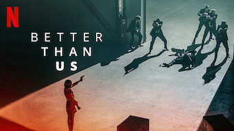

title: Accueil

# Accueil

## Derniers vus

Affiche|Information
:---:|:---
 

|Film : **The Last Kingdom : Seven Kings Must Die / The Last Kingdom : Sept rois doivent mourir** Origine: **Royaume-Uni** Note: :material-star:{.gold .heart}:material-star:{.gold .heart}:material-star:{.gold .heart}:material-star-half-full:{.gold .heart}:material-star-outline:{.grey } Sortie en **2023**  _Suite de la série, et fin._
 

|Série : **Doctor Cha / 닥터 차정숙** Origine: **Corée du Sud** Note: :material-star:{.gold .heart}:material-star:{.gold .heart}:material-star:{.gold .heart}:material-star:{.gold .heart}:material-star-outline:{.grey } Sortie de la dernière saison en **2023** Nb. épisodes: **16** :kr: sous-titres en coréens  _Reprendre le travail à 40 ans et découvrir les agissements de son mari._
 

|Film : **Archive** Origine: **Royaume-Uni** Note: :material-star:{.gold .heart}:material-star:{.gold .heart}:material-star-outline:{.grey }:material-star-outline:{.grey }:material-star-outline:{.grey } Sortie en **2020**  _Film de science-fiction basé sur la robotique et ses travers, le résultat est toutefois assez ennuyeux._
 

|Série : **Tom Clancy's Jack Ryan / Jack Ryan de Tom Clancy** Origine: **Etats-Unis** Note: :material-star:{.gold .heart}:material-star:{.gold .heart}:material-star-outline:{.grey }:material-star-outline:{.grey }:material-star-outline:{.grey } Sortie de la dernière saison en **2022** Nb. épisodes: **30**  _Série orientée service action de la CIA, les scénarios sont plutôt pas mal mais cela reste loin de la réalité, les combats ressemblant souvent à une fête foraine._
 

|Série : **Last light / La théorie des dominos** Origine: **Etats-Unis** Note: :material-star:{.gold .heart}:material-star:{.gold .heart}:material-star:{.gold .heart}:material-star-half-full:{.gold .heart}:material-star-outline:{.grey } Sortie de la dernière saison en **2022** Nb. épisodes: **5**  _Le monde sans pétrole, mais il faudrait prévenir le scénariste que l'énergie électrique est basée sur le nucléaire en France._
 

|Série : **The Diplomat / La Diplomate** Origine: **Etats-Unis** Note: :material-star:{.gold .heart}:material-star:{.gold .heart}:material-star:{.gold .heart}:material-star-half-full:{.gold .heart}:material-star-outline:{.grey } Sortie de la dernière saison en **2023** Nb. épisodes: **8**  _La diplomatie à l'américaine, plutôt bien traité mais parfois un peu tordu._
 

|Film : **Bigbug** Origine: **France** Note: :material-star:{.gold .heart}:material-star:{.gold .heart}:material-star-half-full:{.gold .heart}:material-star-outline:{.grey }:material-star-outline:{.grey } Sortie en **2022**  _Le futur avec les robots, bien fait mais la mayonnaise ne prend pas._
 

|Série : **Invisible** Origine: **Japon** Note: :material-star:{.gold .heart}:material-star:{.gold .heart}:material-star-half-full:{.gold .heart}:material-star-outline:{.grey }:material-star-outline:{.grey } Sortie de la dernière saison en **2020** Nb. épisodes: **10**  _Une série policière, plus proche du manga que d'une enquête classique, avec un démarrage intéressant, mais au final on devine trop facilement les intrigues._
 

|Film : **Better Than Us** Origine: **Russie** Note: :material-star:{.gold .heart}:material-star:{.gold .heart}:material-star:{.gold .heart}:material-star-outline:{.grey }:material-star-outline:{.grey } Sortie en **2019**  _Les robots chez les russes, plutôt bien fait et bien construit, avec un scénario qui tient la route._
 

|Série : **Tramway / 트롤리** Origine: **Corée du Sud** Note: :material-star:{.gold .heart}:material-star:{.gold .heart}:material-star:{.gold .heart}:material-star-outline:{.grey }:material-star-outline:{.grey } Sortie de la dernière saison en **2022** Nb. épisodes: **16** :kr: sous-titres en coréens  _La politique en Corée du Sud, basé sur une bonne intrigue mais avec un scénario qui à quelques lacunes et surtout un personnage principal qui aurait gagné en crédibilité à ne pas être constamment névrosé._

## En cours...

Affiche|Information
:---:|:---
 

|Série : **Be Melodramatic / 멜로가 체질** Origine: **Corée du Sud** Sortie de la dernière saison en **2019** Nb. épisodes: **16**  _nan_
 

|Série : **Doom at Your Service / 어느 날 우리 집 현관으로 멸망이 들어왔다** Origine: **Corée du Sud** Sortie de la dernière saison en **2021** Nb. épisodes: **16**  _nan_
 

|Série : **Borgen : Le pouvoir et la gloire** Origine: **Danemark** Sortie de la dernière saison en **2022** Nb. épisodes: **8**  _La politique au Danemark ..._
 

|Série : **The Last Ship** Origine: **Etats-Unis** Sortie de la dernière saison en **2014** Nb. épisodes: **66**  _Trop caricaturale, dommage._

## Top 10

Affiche|Information
:---:|:---
 

|Palmarès: :material-numeric-1-circle:{.num_gold} Série : **Something in the Rain / 밥 잘 사주는 예쁜 누나** Origine: **Corée du Sud** Note: :material-star:{.gold .heart}:material-star:{.gold .heart}:material-star:{.gold .heart}:material-star:{.gold .heart}:material-star:{.gold .heart} Sortie de la dernière saison en **2018** Nb. épisodes: **16**  _Excellent, aborde à la fois le monde du travail et un des tabous de la société coréenne._
 

|Palmarès: :material-numeric-2-circle:{.num_silver} Série : **It's Okay to Not Be Okay** Origine: **Corée du Sud** Note: :material-star:{.gold .heart}:material-star:{.gold .heart}:material-star:{.gold .heart}:material-star:{.gold .heart}:material-star:{.gold .heart} Sortie de la dernière saison en **2020** Nb. épisodes: **16** :kr: sous-titres en coréens  _Bizarre au premier abord, on tombe vite sous le charme des personnages._
 

|Palmarès: :material-numeric-3-circle:{.num_copper} Série : **Crash Landing on You** Origine: **Corée du Sud** Note: :material-star:{.gold .heart}:material-star:{.gold .heart}:material-star:{.gold .heart}:material-star:{.gold .heart}:material-star:{.gold .heart} Sortie de la dernière saison en **2019** Nb. épisodes: **16** :kr: sous-titres en coréens  _Très bon scénario, les acteurs sont excellents et la réalisation paufinée. Ca mériterait une saison 2 !_
 

|Palmarès: :material-numeric-4-circle: Série : **My Mister** Origine: **Corée du Sud** Note: :material-star:{.gold .heart}:material-star:{.gold .heart}:material-star:{.gold .heart}:material-star:{.gold .heart}:material-star:{.gold .heart} Sortie de la dernière saison en **2018** Nb. épisodes: **16**  _Comment ne pas tomber sous le charme de IU ! On a envie que la série ne s'arrête jamais._
 

|Palmarès: :material-numeric-5-circle: Série : **One Spring Night** Origine: **Corée du Sud** Note: :material-star:{.gold .heart}:material-star:{.gold .heart}:material-star:{.gold .heart}:material-star:{.gold .heart}:material-star:{.gold .heart} Sortie de la dernière saison en **2019** Nb. épisodes: **16** :kr: sous-titres en coréens  _Excellent, bonne description de la société coréennes et de certains de ses travers._
 

|Palmarès: :material-numeric-6-circle: Série : **My Secret Terrius** Origine: **Corée du Sud** Note: :material-star:{.gold .heart}:material-star:{.gold .heart}:material-star:{.gold .heart}:material-star:{.gold .heart}:material-star:{.gold .heart} Sortie de la dernière saison en **2018** Nb. épisodes: **16**  _Très bon scénario d'espionnage, les acteurs sont impeccables._
 

|Palmarès: :material-numeric-7-circle: Série : **Pinocchio** Origine: **Corée du Sud** Note: :material-star:{.gold .heart}:material-star:{.gold .heart}:material-star:{.gold .heart}:material-star:{.gold .heart}:material-star:{.gold .heart} Sortie de la dernière saison en **2014** Nb. épisodes: **20**  _Bon scénario sur les journalistes en Corée, même s'il faut quelques épisodes de description avant son démarrage._
 

|Palmarès: :material-numeric-8-circle: Série : **Misaeng** Origine: **Corée du Sud** Note: :material-star:{.gold .heart}:material-star:{.gold .heart}:material-star:{.gold .heart}:material-star:{.gold .heart}:material-star:{.gold .heart} Sortie de la dernière saison en **2014** Nb. épisodes: **20** :kr: sous-titres en coréens  _La vie en entreprise en Corée. Très bon scénario, nombreuses situations intéressantes._
 

|Palmarès: :material-numeric-9-circle: Série : **Love, Marriage and Divorce / 결혼작사 이혼작곡** Origine: **Corée du Sud** Note: :material-star:{.gold .heart}:material-star:{.gold .heart}:material-star:{.gold .heart}:material-star:{.gold .heart}:material-star:{.gold .heart} Sortie de la dernière saison en **2021** Nb. épisodes: **32** :kr: sous-titres en coréens  _Un excellent scénario sur les relations homme-femme, avec de nombreux cas de figure mais toujours très juste._
 

|Palmarès: :material-numeric-10-circle: Série : **Designated Survivor: 60 Days** Origine: **Corée du Sud** Note: :material-star:{.gold .heart}:material-star:{.gold .heart}:material-star:{.gold .heart}:material-star:{.gold .heart}:material-star:{.gold .heart} Sortie de la dernière saison en **2019** Nb. épisodes: **16** :kr: sous-titres en coréens  _Bien plus intéressant que la version américaine, le contexte politique de la Corée du sud est bien plus crédible._
