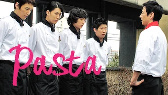
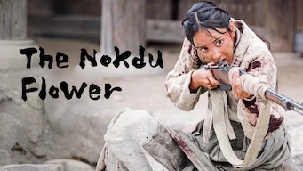
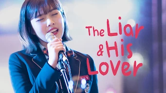

title: Accueil

#Accueil

##Derniers vus

Affiche|Information
:---:|:---
 |Film : **The Bros / 부라더** Origine: **Corée du Sud** Note: :material-star:{.gold }:material-star:{.gold }:material-star:{.gold }:material-star-half-full:{.gold .heart}:material-star:{.grey } Sortie en **2017**  _Des excellents acteurs, il faut attendre la fin du film pour pleinement l'apprécier._
 |Film : **Kenshin : L’achèvement** Origine: **Japon** Note: :material-star:{.gold }:material-star-half-full:{.gold .heart}:material-star:{.grey }:material-star:{.grey }:material-star:{.grey } Sortie en **2021**  _Bien moins bon que le premier film, tiens plus du manga, les combats ne sont absolument pas réalistes._
 |Série : **Happy And / 해피 앤드** Origine: **Corée du Sud** Note: :material-star:{.gold }:material-star:{.gold }:material-star-half-full:{.gold .heart}:material-star:{.grey }:material-star:{.grey } Sortie en **2012** Nb. épisodes: **25** :kr: sous-titres en coréens  _Enchainement de micro-série sur les femmes se retrouvant dans des situations pas possibles. Scéanarios intéressant mais la réalisation est plus ou moins bien selon les épisodes._
 |Série : **The Miracle / 미라글** Origine: **Corée du Sud** Note: :material-star:{.gold }:material-star:{.gold }:material-star-half-full:{.gold .heart}:material-star:{.grey }:material-star:{.grey } Sortie en **2016** Nb. épisodes: **12** :kr: sous-titres en coréens  _Mini série sur un scénario assez classique. Pas de véritable surprise._
 |Série : **Dream High 2 / 드림하이 2** Origine: **Corée du Sud** Note: :material-star:{.gold }:material-star:{.gold }:material-star-half-full:{.gold .heart}:material-star:{.grey }:material-star:{.grey } Sortie en **2012** Nb. épisodes: **16**  _Très teenage, un scénario très différent du premier volet, quelques longueurs, un peu poussif, globalement moyen._
 |Série : **Pasta / 파스타** Origine: **Corée du Sud** Note: :material-star:{.gold }:material-star:{.gold .heart}:material-star:{.grey }:material-star:{.grey }:material-star:{.grey } Sortie en **2010** Nb. épisodes: **20**  _Rencontre d'un imbécile misogyne et d'une idiote en cuisine. La série peine par manque de personnage crédible._
 |Série : **The Nokdu Flower / 녹두꽃** Origine: **Corée du Sud** Note: :material-star:{.gold }:material-star:{.gold }:material-star:{.gold }:material-star:{.gold }:material-star-half-full:{.gold .heart} Sortie en **2019** Nb. épisodes: **24**  _très belle fresque historique sur la Corée de la fin du 19e siècle._
 |Série : **La cinglée du quartier / Mad for Each Other / 이구역의 미친** Origine: **Corée du Sud** Note: :material-star:{.gold }:material-star:{.gold }:material-star:{.gold }:material-star:{.gold }:material-star:{.gold .heart} Sortie en **2021** Nb. épisodes: **13** :kr: sous-titres en coréens  _Excellent, très bien fait. Les acteurs sont parfaits._
 |Série : **The Liar and His Lover / 그녀는 거짓말을 너무 사랑해** Origine: **Corée du Sud** Note: :material-star:{.gold }:material-star:{.gold }:material-star:{.gold }:material-star-half-full:{.gold .heart}:material-star:{.grey } Sortie en **2017** Nb. épisodes: **16**  _Le scénario est un peu faible et les personnages un peu trop naïf. Cela se laisse néanmoins regarder._
 |Série : **Uncontrollably Fond / 함부로 애틋하게** Origine: **Corée du Sud** Note: :material-star:{.gold }:material-star:{.gold }:material-star:{.gold }:material-star:{.gold .heart}:material-star:{.grey } Sortie en **2016** Nb. épisodes: **20**  _Un bon scénario, malgré quelques petites erreurs et quelques longueurs sur la fin._

##En cours...

Affiche|Information
:---:|:---
 |Série : **The Rise of Phoenixes** Origine: **Chine** Sortie en **2018** Nb. épisodes: **70**  _Excellent scénario, les 70 épisodes passent rapidement car le suspense est maintenu tout du long._
 |Série : **Dear My Friends** Origine: **Corée du Sud** Sortie en **2016** Nb. épisodes: **16**  _Pour l'instant, n'a pas vraiment démarrer après un épisode ..._
 |Série : **Le Jardin Céleste** Origine: **Corée du Sud** Sortie en **2011** Nb. épisodes: **30** :kr: sous-titres en coréens  _Autre titre : "Heaven's Garden" Semble pas mal... plutôt orienté vie à la campagne pour l'instant_
 |Série : **Love, Marriage and Divorce / 결혼작사 이혼작곡** Origine: **Corée du Sud** Sortie en **2021** Nb. épisodes: **16**  _nan_
 |Série : **Love, Death & Robots** Origine: **Etats-Unis** Sortie en **2019** Nb. épisodes: **6**  _18 "épisodes" de 10-20 minutes soit environ l'équivalent de 6 épisodes_

##Top 10

Affiche|Information
:---:|:---
 |Palmarès: :material-numeric-1-circle:{.num_gold} Série : **Something in the Rain / 밥 잘 사주는 예쁜 누나** Origine: **Corée du Sud** Note: :material-star:{.gold }:material-star:{.gold }:material-star:{.gold }:material-star:{.gold }:material-star:{.gold .heart} Sortie en **2018** Nb. épisodes: **16**  _Excellent, aborde à la fois le monde du travail et un des tabous de la société coréenne._
 |Palmarès: :material-numeric-2-circle:{.num_silver} Série : **It's Okay to Not Be Okay** Origine: **Corée du Sud** Note: :material-star:{.gold }:material-star:{.gold }:material-star:{.gold }:material-star:{.gold }:material-star:{.gold .heart} Sortie en **2020** Nb. épisodes: **16** :kr: sous-titres en coréens  _Bizarre au premier abord, on tombe vite sous le charme des personnages._
 |Palmarès: :material-numeric-3-circle:{.num_copper} Série : **Crash Landing on You** Origine: **Corée du Sud** Note: :material-star:{.gold }:material-star:{.gold }:material-star:{.gold }:material-star:{.gold }:material-star:{.gold .heart} Sortie en **2019** Nb. épisodes: **16** :kr: sous-titres en coréens  _Très bon scénario, les acteurs sont excellents et la réalisation paufinée. Ca mériterait une saison 2 !_
 |Palmarès: :material-numeric-4-circle: Série : **My Mister** Origine: **Corée du Sud** Note: :material-star:{.gold }:material-star:{.gold }:material-star:{.gold }:material-star:{.gold }:material-star:{.gold .heart} Sortie en **2018** Nb. épisodes: **16**  _Comment ne pas tomber sous le charme de IU ! On a envie que la série ne s'arrête jamais._
 |Palmarès: :material-numeric-5-circle: Série : **One Spring Night** Origine: **Corée du Sud** Note: :material-star:{.gold }:material-star:{.gold }:material-star:{.gold }:material-star:{.gold }:material-star:{.gold .heart} Sortie en **2019** Nb. épisodes: **16** :kr: sous-titres en coréens  _Excellent, bonne description de la société coréennes et de certains de ses travers._
 |Palmarès: :material-numeric-6-circle: Série : **My Secret Terrius** Origine: **Corée du Sud** Note: :material-star:{.gold }:material-star:{.gold }:material-star:{.gold }:material-star:{.gold }:material-star:{.gold .heart} Sortie en **2018** Nb. épisodes: **16**  _Très bon scénario d'espionnage, les acteurs sont impeccables._
 |Palmarès: :material-numeric-7-circle: Série : **Pinocchio** Origine: **Corée du Sud** Note: :material-star:{.gold }:material-star:{.gold }:material-star:{.gold }:material-star:{.gold }:material-star:{.gold .heart} Sortie en **2014** Nb. épisodes: **20**  _Bon scénario sur les journalistes en Corée, même s'il faut quelques épisodes de description avant son démarrage._
 |Palmarès: :material-numeric-8-circle: Série : **Misaeng** Origine: **Corée du Sud** Note: :material-star:{.gold }:material-star:{.gold }:material-star:{.gold }:material-star:{.gold }:material-star:{.gold .heart} Sortie en **2014** Nb. épisodes: **20** :kr: sous-titres en coréens  _La vie en entreprise en Corée. Très bon scénario, nombreuses situations intéressantes._
 |Palmarès: :material-numeric-9-circle: Série : **Designated Survivor: 60 Days** Origine: **Corée du Sud** Note: :material-star:{.gold }:material-star:{.gold }:material-star:{.gold }:material-star:{.gold }:material-star:{.gold .heart} Sortie en **2019** Nb. épisodes: **16** :kr: sous-titres en coréens  _Bien plus intéressant que la version américaine, le contexte politique de la Corée du sud est bien plus crédible._
 |Palmarès: :material-numeric-10-circle: Série : **VIP** Origine: **Corée du Sud** Note: :material-star:{.gold }:material-star:{.gold }:material-star:{.gold }:material-star:{.gold }:material-star:{.gold .heart} Sortie en **2019** Nb. épisodes: **16**  _Pas mal de surprise au fur et à mesure des épisodes. Pour une fois, les relations sont plus réalistes, rare dans le genre K-Drama._
