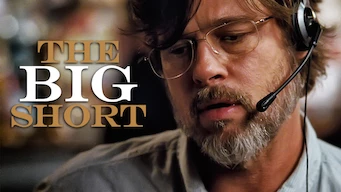

title: Accueil

# Accueil

## Derniers vus

Affiche|Information
:---:|:---
 

:material-star:{.gold .heart}:material-star:{.gold .heart}:material-star:{.gold .heart}:material-star-outline:{.grey }:material-star-outline:{.grey }|Film : **The Big Short** Origine: **Etats-Unis** Sortie en **2015**  _La crise des subprimes de 2008 pour les nulls. Edifiant !_
 

:material-star:{.gold .heart}:material-star:{.gold .heart}:material-star:{.gold .heart}:material-star:{.gold .heart}:material-star-half-full:{.gold .heart}|Série : **House of Ninjas** Origine: **Japon** Sortie en **2024** Nb. épisodes: **8**  _Très réaliste dans son approche pseudo-historique, et avec plein d'action; quelques surprises additionnelles et historiques auraient pu l'enrichir._
 

:material-star:{.gold .heart}:material-star:{.gold .heart}:material-star:{.gold .heart}:material-star-outline:{.grey }:material-star-outline:{.grey }|Série : **Secret Royal Inspector & Joy / 어사와 조이** Origine: **Corée du Sud** Sortie en **2021** Nb. épisodes: **16**  _Une intrigue bien construite, mais le burlesque alourdit le scénario._
 

:material-star:{.gold .heart}:material-star:{.gold .heart}:material-star-half-full:{.gold .heart}:material-star-outline:{.grey }:material-star-outline:{.grey }|Film : **Hidden Strike / Project X-Traction / 狂怒沙暴** Origine: **Etats-Unis** Sortie en **2023**  _Film d'action chino-américain avec Jackie Chan, classique du genre._
 

:material-star:{.gold .heart}:material-star:{.gold .heart}:material-star-outline:{.grey }:material-star-outline:{.grey }:material-star-outline:{.grey }|Documentaire : **Dans l'inconnu : Les robots tueurs** Origine: **Etats-Unis** Sortie en **2023** Nb. épisodes: **1**  _Documentaire sur l'intelligence artificielle appliquée aux drones, mais l'approche n'étant pas du tout scientifique, c'est pour les profanes._
 

:material-star:{.gold .heart}:material-star:{.gold .heart}:material-star:{.gold .heart}:material-star-half-full:{.gold .heart}:material-star-outline:{.grey }|Série : **Radieuse / The Light in Your Eyes / 눈이 부시게** Origine: **Corée du Sud** Sortie en **2019** Nb. épisodes: **12**  _Cette série est entraînante et plutôt efficace, même si elle prend des chemins détournés pour nous amener au sujet principal._
 

:material-star:{.gold .heart}:material-star-half-full:{.gold .heart}:material-star-outline:{.grey }:material-star-outline:{.grey }:material-star-outline:{.grey }|Série : **One More Time / 헤어진 다음날** Origine: **Corée du Sud** Sortie en **2016** Nb. épisodes: **8** :kr: sous-titres en coréens  _Un montage de faible qualité incluant une musique rendant les dialogues inaudibles produit un ensemble peu concluant._
 

:material-star:{.gold .heart}:material-star:{.gold .heart}:material-star:{.gold .heart}:material-star:{.gold .heart}:material-star-half-full:{.gold .heart}|Série : **Welcome to Samdalri / Retour à Samdal-ri / 웰컴투 삼달리** Origine: **Corée du Sud** Sortie en **2023** Nb. épisodes: **16** :kr: sous-titres en coréens  _Très bon scénario mélangeant modernité et tradition avec un excellent casting._
 

:material-star:{.gold .heart}:material-star:{.gold .heart}:material-star-outline:{.grey }:material-star-outline:{.grey }:material-star-outline:{.grey }|Film : **Impardonnable** Origine: **Etats-Unis** Sortie en **2021**  _Un scénario malheureusement sans surprise, même si les acteurs sont excellents._
 

:material-star:{.gold .heart}:material-star-half-full:{.gold .heart}:material-star-outline:{.grey }:material-star-outline:{.grey }:material-star-outline:{.grey }|Film : **Shanghai Fortress** Origine: **Chine** Sortie en **2019**  _Beaucoup d'effets spéciaux mais pour un résultat somme toute modeste dû à un scénario pauvre._

## En cours...

Affiche|Information
:---:|:---
 

|Série : **Be Melodramatic / 멜로가 체질** Origine: **Corée du Sud** Sortie en **2019** Nb. épisodes: **16**  _Les déboires de trois femmes colocataires dans le monde des médias,  avec un point de vue féminin, à la fois étrange, surtout au début, et très accès sur les dialogues._
 

|Série : **Lovestruck in the City / 도시남녀의 사랑법** Origine: **Corée du Sud** Sortie en **2020** Nb. épisodes: **17** :kr: sous-titres en coréens  _Pour l'instant, léger ..._
 

|Série : **My First First Love / 첫사랑은 처음이라서** Origine: **Corée du Sud** Sortie de la 2° saison en **2019** Nb. épisodes: **16**  _1ers épisodes un peu lourds. A suivre._
 

|Série : **Thirty-Nine / 서른아홉** Origine: **Corée du Sud** Sortie en **2022** Nb. épisodes: **12** :kr: sous-titres en coréens  _nan_
 

|Série : **Would You Like a Cup of Coffee?** Origine: **Corée du Sud** Sortie en **2021** Nb. épisodes: **12** :kr: sous-titres en coréens  _nan_
 

|Série : **Borgen : Le pouvoir et la gloire** Origine: **Danemark** Sortie en **2022** Nb. épisodes: **8**  _La politique au Danemark ..._
 

|Série : **Alice in Borderland / 今際の国のアリス** Origine: **Japon** Sortie de la 2° saison en **2022** Nb. épisodes: **16**  _A commencer ..._

## Top 10

Affiche|Information
:---:|:---
:material-numeric-1-circle:{.num_gold}  

:material-star:{.gold .heart}:material-star:{.gold .heart}:material-star:{.gold .heart}:material-star:{.gold .heart}:material-star:{.gold .heart}|Série : **Something in the Rain / 밥 잘 사주는 예쁜 누나** Origine: **Corée du Sud** Sortie en **2018** Nb. épisodes: **16**  _Excellent, aborde à la fois le monde du travail et un des tabous de la société coréenne._
:material-numeric-2-circle:{.num_silver}  

:material-star:{.gold .heart}:material-star:{.gold .heart}:material-star:{.gold .heart}:material-star:{.gold .heart}:material-star:{.gold .heart}|Série : **It's Okay to Not Be Okay** Origine: **Corée du Sud** Sortie en **2020** Nb. épisodes: **16** :kr: sous-titres en coréens  _Bizarre au premier abord, on tombe vite sous le charme des personnages._
:material-numeric-3-circle:{.num_copper}  

:material-star:{.gold .heart}:material-star:{.gold .heart}:material-star:{.gold .heart}:material-star:{.gold .heart}:material-star:{.gold .heart}|Série : **Crash Landing on You** Origine: **Corée du Sud** Sortie en **2019** Nb. épisodes: **16** :kr: sous-titres en coréens  _Très bon scénario, les acteurs sont excellents et la réalisation paufinée. Ca mériterait une saison 2 !_
:material-numeric-4-circle:  

:material-star:{.gold .heart}:material-star:{.gold .heart}:material-star:{.gold .heart}:material-star:{.gold .heart}:material-star:{.gold .heart}|Série : **My Mister** Origine: **Corée du Sud** Sortie en **2018** Nb. épisodes: **16**  _Comment ne pas tomber sous le charme de IU ! On a envie que la série ne s'arrête jamais._
:material-numeric-5-circle:  

:material-star:{.gold .heart}:material-star:{.gold .heart}:material-star:{.gold .heart}:material-star:{.gold .heart}:material-star:{.gold .heart}|Série : **One Spring Night** Origine: **Corée du Sud** Sortie en **2019** Nb. épisodes: **16** :kr: sous-titres en coréens  _Excellent, bonne description de la société coréennes et de certains de ses travers._
:material-numeric-6-circle:  

:material-star:{.gold .heart}:material-star:{.gold .heart}:material-star:{.gold .heart}:material-star:{.gold .heart}:material-star:{.gold .heart}|Série : **My Secret Terrius** Origine: **Corée du Sud** Sortie en **2018** Nb. épisodes: **16**  _Très bon scénario d'espionnage, les acteurs sont impeccables._
:material-numeric-7-circle:  

:material-star:{.gold .heart}:material-star:{.gold .heart}:material-star:{.gold .heart}:material-star:{.gold .heart}:material-star:{.gold .heart}|Série : **Pinocchio** Origine: **Corée du Sud** Sortie en **2014** Nb. épisodes: **20**  _Bon scénario sur les journalistes en Corée, même s'il faut quelques épisodes de description avant son démarrage._
:material-numeric-8-circle:  

:material-star:{.gold .heart}:material-star:{.gold .heart}:material-star:{.gold .heart}:material-star:{.gold .heart}:material-star:{.gold .heart}|Série : **Misaeng** Origine: **Corée du Sud** Sortie en **2014** Nb. épisodes: **20** :kr: sous-titres en coréens  _La vie en entreprise en Corée. Très bon scénario, nombreuses situations intéressantes._
:material-numeric-9-circle:  

:material-star:{.gold .heart}:material-star:{.gold .heart}:material-star:{.gold .heart}:material-star:{.gold .heart}:material-star:{.gold .heart}|Série : **Love, Marriage and Divorce / 결혼작사 이혼작곡** Origine: **Corée du Sud** Sortie de la 2° saison en **2021** Nb. épisodes: **32** :kr: sous-titres en coréens  _Un excellent scénario sur les relations homme-femme, avec de nombreux cas de figure mais toujours très juste._
:material-numeric-10-circle:  

:material-star:{.gold .heart}:material-star:{.gold .heart}:material-star:{.gold .heart}:material-star:{.gold .heart}:material-star:{.gold .heart}|Série : **Designated Survivor: 60 Days** Origine: **Corée du Sud** Sortie en **2019** Nb. épisodes: **16** :kr: sous-titres en coréens  _Bien plus intéressant que la version américaine, le contexte politique de la Corée du sud est bien plus crédible._
