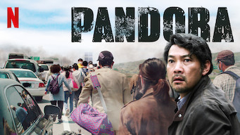
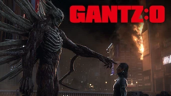
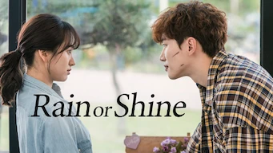

title: Accueil

# Accueil

## Derniers vus

Affiche|Information
:---:|:---
 |Série : **Touch Your Heart / 진심이 닿다** Origine: **Corée du Sud** Note: :material-star:{.gold .heart}:material-star:{.gold .heart}:material-star:{.gold .heart}:material-star:{.gold .heart}:material-star-half-full:{.gold .heart} Sortie en **2019** Nb. épisodes: **16**  _Cette série commence comme une comédie qui semble simple mais qui est bien plus construite qu'il n'y paraît. L'actrice principale est magnifique dans ce rôle, pas si simple à jouer._
 |Film : **Pandora / 판도라** Origine: **Corée du Sud** Note: :material-star:{.gold .heart}:material-star:{.gold .heart}:material-star:{.gold .heart}:material-star:{.gold .heart}:material-star-half-full:{.gold .heart} Sortie en **2016** :kr: sous-titres en coréens  _Excellent film catastrophe, comme la France ne saurait pas le faire._
 |Série : **Do You Like Brahms? / 브람스를 좋아하세요?** Origine: **Corée du Sud** Note: :material-star:{.gold .heart}:material-star:{.gold .heart}:material-star:{.gold .heart}:material-star:{.gold .heart}:material-star-outline:{.grey } Sortie en **2020** Nb. épisodes: **16**  _La musique classique tient le rôle de fond de cette série, plutôt bien réalisée avec un scénario qui tient la route._
 |Film : **Le Chant du Loup** Origine: **France** Note: :material-star:{.gold .heart}:material-star:{.gold .heart}:material-star:{.gold .heart}:material-star-outline:{.grey }:material-star-outline:{.grey } Sortie en **2019**  _Le contexte de l'histoire est pas mal, mais certains détails clochent et surtout c'est un peu trop surjouer._
 |Film : **The Chase / 반드시 잡는다** Origine: **Corée du Sud** Note: :material-star:{.gold .heart}:material-star:{.gold .heart}:material-star:{.gold .heart}:material-star-outline:{.grey }:material-star-outline:{.grey } Sortie en **2017**  _Un bon policier, mené par des acteurs connus._
 |Série : **28 Moons / 28개의 달** Origine: **Corée du Sud** Note: :material-star-half-full:{.gold .heart}:material-star-outline:{.grey }:material-star-outline:{.grey }:material-star-outline:{.grey }:material-star-outline:{.grey } Sortie en **2016** Nb. épisodes: **2** :kr: sous-titres en coréens  _Mini série qui relève plus d'un essai que d'un véritable k-drama, le montage est un exemple de ce qu'il ne faut pas faire._
 |Série : **Magic Phone / 마법의 핸드폰** Origine: **Corée du Sud** Note: :material-star-half-full:{.gold .heart}:material-star-outline:{.grey }:material-star-outline:{.grey }:material-star-outline:{.grey }:material-star-outline:{.grey } Sortie en **2016** Nb. épisodes: **2** :kr: sous-titres en coréens  _Mini série sans doute fait par des étudiants en art cinématographique. Plutôt décousu, scénario très basique à l'emporte-pièce._
 |Série : **Juvenile Justice / 소년 심판** Origine: **Corée du Sud** Note: :material-star:{.gold .heart}:material-star:{.gold .heart}:material-star:{.gold .heart}:material-star:{.gold .heart}:material-star-outline:{.grey } Sortie en **2022** Nb. épisodes: **10** :kr: sous-titres en coréens  _Les différentes histoires abordées dans cette série sont très bien construites, avec un soin particulier au niveau des dialogues._
 |Film : **Enola Holmes** Origine: **Royaume-Uni** Note: :material-star:{.gold .heart}:material-star:{.gold .heart}:material-star-half-full:{.gold .heart}:material-star-outline:{.grey }:material-star-outline:{.grey } Sortie en **2020**  _Classique du genre, sans surprise._
 |Film : **GANTZ: O** Origine: **Japon** Note: :material-star:{.gold .heart}:material-star:{.gold .heart}:material-star-outline:{.grey }:material-star-outline:{.grey }:material-star-outline:{.grey } Sortie en **2016**  _Série animée plutôt bien fait, mais avec un scénario style jeux vidéo pas terrible._

## En cours...

Affiche|Information
:---:|:---
 |Série : **Dear My Friends** Origine: **Corée du Sud** Sortie en **2016** Nb. épisodes: **16**  _Pour l'instant, ça démarre lentement ..._
 |Série : **Hospital Playlist / 의사생활** Origine: **Corée du Sud** Sortie en **2020** Nb. épisodes: **24** :kr: sous-titres en coréens  _La vie de tous les jours dans un hôpital. Pas d'action à proprement parler, mais des tranches de vie._
 |Série : **Hotel Del Luna** Origine: **Corée du Sud** Sortie en **2019** Nb. épisodes: **16**  _Un hôtel après la vie, joue beaucoup sur la bizzarerie de la chose, à un rythme plutôt lent._
 |Série : **Rain or Shine** Origine: **Corée du Sud** Sortie en **2017** Nb. épisodes: **16**  _La reconstruction des personnes victime d'un effondrement de batiment, plutôt bien construit, le scénario._
 |Série : **Weightlifting Fairy Kim Bok Joo** Origine: **Corée du Sud** Sortie en **2016** Nb. épisodes: **16**  _Commence tout juste..._
 |Série : **The Last Kingdom** Origine: **Etats-Unis** Sortie en **2022** Nb. épisodes: **46**  _Histoire des vikings chez les saxons, avec une approche différent de "vikings" et une bonne contextualisation._

## Top 10

Affiche|Information
:---:|:---
 |Palmarès: :material-numeric-1-circle:{.num_gold} Série : **Something in the Rain / 밥 잘 사주는 예쁜 누나** Origine: **Corée du Sud** Note: :material-star:{.gold .heart}:material-star:{.gold .heart}:material-star:{.gold .heart}:material-star:{.gold .heart}:material-star:{.gold .heart} Sortie en **2018** Nb. épisodes: **16**  _Excellent, aborde à la fois le monde du travail et un des tabous de la société coréenne._
 |Palmarès: :material-numeric-2-circle:{.num_silver} Série : **It's Okay to Not Be Okay** Origine: **Corée du Sud** Note: :material-star:{.gold .heart}:material-star:{.gold .heart}:material-star:{.gold .heart}:material-star:{.gold .heart}:material-star:{.gold .heart} Sortie en **2020** Nb. épisodes: **16** :kr: sous-titres en coréens  _Bizarre au premier abord, on tombe vite sous le charme des personnages._
 |Palmarès: :material-numeric-3-circle:{.num_copper} Série : **Crash Landing on You** Origine: **Corée du Sud** Note: :material-star:{.gold .heart}:material-star:{.gold .heart}:material-star:{.gold .heart}:material-star:{.gold .heart}:material-star:{.gold .heart} Sortie en **2019** Nb. épisodes: **16** :kr: sous-titres en coréens  _Très bon scénario, les acteurs sont excellents et la réalisation paufinée. Ca mériterait une saison 2 !_
 |Palmarès: :material-numeric-4-circle: Série : **My Mister** Origine: **Corée du Sud** Note: :material-star:{.gold .heart}:material-star:{.gold .heart}:material-star:{.gold .heart}:material-star:{.gold .heart}:material-star:{.gold .heart} Sortie en **2018** Nb. épisodes: **16**  _Comment ne pas tomber sous le charme de IU ! On a envie que la série ne s'arrête jamais._
 |Palmarès: :material-numeric-5-circle: Série : **One Spring Night** Origine: **Corée du Sud** Note: :material-star:{.gold .heart}:material-star:{.gold .heart}:material-star:{.gold .heart}:material-star:{.gold .heart}:material-star:{.gold .heart} Sortie en **2019** Nb. épisodes: **16** :kr: sous-titres en coréens  _Excellent, bonne description de la société coréennes et de certains de ses travers._
 |Palmarès: :material-numeric-6-circle: Série : **My Secret Terrius** Origine: **Corée du Sud** Note: :material-star:{.gold .heart}:material-star:{.gold .heart}:material-star:{.gold .heart}:material-star:{.gold .heart}:material-star:{.gold .heart} Sortie en **2018** Nb. épisodes: **16**  _Très bon scénario d'espionnage, les acteurs sont impeccables._
 |Palmarès: :material-numeric-7-circle: Série : **Pinocchio** Origine: **Corée du Sud** Note: :material-star:{.gold .heart}:material-star:{.gold .heart}:material-star:{.gold .heart}:material-star:{.gold .heart}:material-star:{.gold .heart} Sortie en **2014** Nb. épisodes: **20**  _Bon scénario sur les journalistes en Corée, même s'il faut quelques épisodes de description avant son démarrage._
 |Palmarès: :material-numeric-8-circle: Série : **Misaeng** Origine: **Corée du Sud** Note: :material-star:{.gold .heart}:material-star:{.gold .heart}:material-star:{.gold .heart}:material-star:{.gold .heart}:material-star:{.gold .heart} Sortie en **2014** Nb. épisodes: **20** :kr: sous-titres en coréens  _La vie en entreprise en Corée. Très bon scénario, nombreuses situations intéressantes._
 |Palmarès: :material-numeric-9-circle: Série : **Love, Marriage and Divorce / 결혼작사 이혼작곡** Origine: **Corée du Sud** Note: :material-star:{.gold .heart}:material-star:{.gold .heart}:material-star:{.gold .heart}:material-star:{.gold .heart}:material-star:{.gold .heart} Sortie en **2021** Nb. épisodes: **32** :kr: sous-titres en coréens  _Un excellent scénario sur les relations homme-femme, avec de nombreux cas de figure mais toujours très juste._
 |Palmarès: :material-numeric-10-circle: Série : **Designated Survivor: 60 Days** Origine: **Corée du Sud** Note: :material-star:{.gold .heart}:material-star:{.gold .heart}:material-star:{.gold .heart}:material-star:{.gold .heart}:material-star:{.gold .heart} Sortie en **2019** Nb. épisodes: **16** :kr: sous-titres en coréens  _Bien plus intéressant que la version américaine, le contexte politique de la Corée du sud est bien plus crédible._
