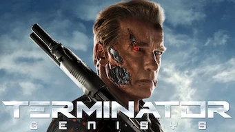
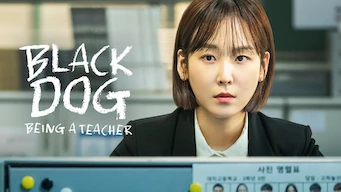

title: Accueil

# Accueil

## Derniers vus

Affiche|Information
:---:|:---
 |Série : **Terminator Genisys** Origine: **Etats-Unis** Note: :material-star:{.gold .heart}:material-star:{.gold .heart}:material-star-half-full:{.gold .heart}:material-star-outline:{.grey }:material-star-outline:{.grey } Sortie en **2015** Nb. épisodes: **1**  _Course poursuite interminable, classique du genre; même si c'est très bien fait, rien de nouveau dans la série de terminator._
 |Série : **Black Dog / 블랙독** Origine: **Corée du Sud** Note: :material-star:{.gold .heart}:material-star:{.gold .heart}:material-star:{.gold .heart}:material-star:{.gold .heart}:material-star-outline:{.grey } Sortie en **2019** Nb. épisodes: **16**  _La dur vie de prof, avec une approche orientée politique intérieure du lycée._
 |Série : **Hospital Playlist / 의사생활** Origine: **Corée du Sud** Note: :material-star:{.gold .heart}:material-star:{.gold .heart}:material-star:{.gold .heart}:material-star:{.gold .heart}:material-star-half-full:{.gold .heart} Sortie en **2020** Nb. épisodes: **24** :kr: sous-titres en coréens  _La vie de tous les jours dans un hôpital. Pas d'action à proprement parler, mais des tranches de vie._
 |Documentaire : **The Game Changers** Origine: **Etats-Unis** Note: :material-star:{.gold .heart}:material-star:{.gold .heart}:material-star:{.gold .heart}:material-star:{.gold .heart}:material-star-outline:{.grey } Sortie en **2018** Nb. épisodes: **1**  _Contrairement à une idée reçue, l'homme le plus fort du monde est végan, tout comme de plus en plus d'athlètes de haut niveau. Même Schwarzi est devenu végan. Ce documentaire vous explique pourquoi être végan est bon pour le corps, et comment l'industrie de la viande nous enfume depuis des décennies._
 |Série : **The expanse** Origine: **Etats-Unis** Note: :material-star:{.gold .heart}:material-star:{.gold .heart}:material-star:{.gold .heart}:material-star:{.gold .heart}:material-star-half-full:{.gold .heart} Sortie en **2021** Nb. épisodes: **62**  _Série de science-fiction avec des effets spéciaux très bien réalisés dans un futur imaginaire assez complexe._
 |Série : **Arcane** Origine: **France** Note: :material-star:{.gold .heart}:material-star:{.gold .heart}:material-star:{.gold .heart}:material-star:{.gold .heart}:material-star-half-full:{.gold .heart} Sortie en **2021** Nb. épisodes: **9**  _Animation très impressionnante avec un scénario plein de bonnes surprises et un graphisme splendide; à  voir absolument pour les amateurs adeptent du genre jeux vidéo._
 |Série : **Fauda** Origine: **Israël** Note: :material-star:{.gold .heart}:material-star:{.gold .heart}:material-star-outline:{.grey }:material-star-outline:{.grey }:material-star-outline:{.grey } Sortie en **2020** Nb. épisodes: **36**  _Fête foraine en territoire palestinien, la contextualisation semble pas mal mais complètement pro israelien, les négociations et les filatures ne sont pas crédibles._
 |Film : **Silenced / 도가니** Origine: **Corée du Sud** Note: :material-star:{.gold .heart}:material-star:{.gold .heart}:material-star:{.gold .heart}:material-star:{.gold .heart}:material-star-outline:{.grey } Sortie en **2011** :kr: sous-titres en coréens  _Sujet difficile puisque cela concerne des enfants malentendants, mais le scénario est crédible._
 |Série : **Le Brio** Origine: **France** Note: :material-star:{.gold .heart}:material-star:{.gold .heart}:material-star:{.gold .heart}:material-star:{.gold .heart}:material-star-outline:{.grey } Sortie en **2022** Nb. épisodes: **1**  _nan_
 |Série : **Triad Princess** Origine: **Taïwan** Note: :material-star:{.gold .heart}:material-star:{.gold .heart}:material-star-half-full:{.gold .heart}:material-star-outline:{.grey }:material-star-outline:{.grey } Sortie en **2019** Nb. épisodes: **6**  _C'est gentil, plutôt bien fait mais ça reste du classique tout en restant sous-exploité._

## En cours...

Affiche|Information
:---:|:---
 |Série : **Hotel Del Luna** Origine: **Corée du Sud** Sortie en **2019** Nb. épisodes: **16**  _Un hôtel après la vie, joue beaucoup sur la bizzarerie de la chose, à un rythme plutôt lent._
 |Série : **Welcome to Waikiki / 으라차차 와이키키** Origine: **Corée du Sud** Sortie en **2018** Nb. épisodes: **20**  _Comédie avec des grosses ficelles, ça commence comme "trois hommes et un couffin" mais cela diverge rapidement vers autre chose. Bien fait, dommage que les ficelles soient si grosses._
 |Série : **Mr. Robot** Origine: **Etats-Unis** Sortie en **2019** Nb. épisodes: **45**  _Le monde des hackers se percutant avec le monde de la finance, pour une fois bien décrit, et avec de vrais logiciel de hacking. Seule sa double personnalité et parfois pesante et vient alourdir la narration._

## Top 10

Affiche|Information
:---:|:---
 |Palmarès: :material-numeric-1-circle:{.num_gold} Série : **Something in the Rain / 밥 잘 사주는 예쁜 누나** Origine: **Corée du Sud** Note: :material-star:{.gold .heart}:material-star:{.gold .heart}:material-star:{.gold .heart}:material-star:{.gold .heart}:material-star:{.gold .heart} Sortie en **2018** Nb. épisodes: **16**  _Excellent, aborde à la fois le monde du travail et un des tabous de la société coréenne._
 |Palmarès: :material-numeric-2-circle:{.num_silver} Série : **It's Okay to Not Be Okay** Origine: **Corée du Sud** Note: :material-star:{.gold .heart}:material-star:{.gold .heart}:material-star:{.gold .heart}:material-star:{.gold .heart}:material-star:{.gold .heart} Sortie en **2020** Nb. épisodes: **16** :kr: sous-titres en coréens  _Bizarre au premier abord, on tombe vite sous le charme des personnages._
 |Palmarès: :material-numeric-3-circle:{.num_copper} Série : **Crash Landing on You** Origine: **Corée du Sud** Note: :material-star:{.gold .heart}:material-star:{.gold .heart}:material-star:{.gold .heart}:material-star:{.gold .heart}:material-star:{.gold .heart} Sortie en **2019** Nb. épisodes: **16** :kr: sous-titres en coréens  _Très bon scénario, les acteurs sont excellents et la réalisation paufinée. Ca mériterait une saison 2 !_
 |Palmarès: :material-numeric-4-circle: Série : **My Mister** Origine: **Corée du Sud** Note: :material-star:{.gold .heart}:material-star:{.gold .heart}:material-star:{.gold .heart}:material-star:{.gold .heart}:material-star:{.gold .heart} Sortie en **2018** Nb. épisodes: **16**  _Comment ne pas tomber sous le charme de IU ! On a envie que la série ne s'arrête jamais._
 |Palmarès: :material-numeric-5-circle: Série : **One Spring Night** Origine: **Corée du Sud** Note: :material-star:{.gold .heart}:material-star:{.gold .heart}:material-star:{.gold .heart}:material-star:{.gold .heart}:material-star:{.gold .heart} Sortie en **2019** Nb. épisodes: **16** :kr: sous-titres en coréens  _Excellent, bonne description de la société coréennes et de certains de ses travers._
 |Palmarès: :material-numeric-6-circle: Série : **My Secret Terrius** Origine: **Corée du Sud** Note: :material-star:{.gold .heart}:material-star:{.gold .heart}:material-star:{.gold .heart}:material-star:{.gold .heart}:material-star:{.gold .heart} Sortie en **2018** Nb. épisodes: **16**  _Très bon scénario d'espionnage, les acteurs sont impeccables._
 |Palmarès: :material-numeric-7-circle: Série : **Pinocchio** Origine: **Corée du Sud** Note: :material-star:{.gold .heart}:material-star:{.gold .heart}:material-star:{.gold .heart}:material-star:{.gold .heart}:material-star:{.gold .heart} Sortie en **2014** Nb. épisodes: **20**  _Bon scénario sur les journalistes en Corée, même s'il faut quelques épisodes de description avant son démarrage._
 |Palmarès: :material-numeric-8-circle: Série : **Misaeng** Origine: **Corée du Sud** Note: :material-star:{.gold .heart}:material-star:{.gold .heart}:material-star:{.gold .heart}:material-star:{.gold .heart}:material-star:{.gold .heart} Sortie en **2014** Nb. épisodes: **20** :kr: sous-titres en coréens  _La vie en entreprise en Corée. Très bon scénario, nombreuses situations intéressantes._
 |Palmarès: :material-numeric-9-circle: Série : **Love, Marriage and Divorce / 결혼작사 이혼작곡** Origine: **Corée du Sud** Note: :material-star:{.gold .heart}:material-star:{.gold .heart}:material-star:{.gold .heart}:material-star:{.gold .heart}:material-star:{.gold .heart} Sortie en **2021** Nb. épisodes: **32** :kr: sous-titres en coréens  _Un excellent scénario sur les relations homme-femme, avec de nombreux cas de figure mais toujours très juste._
 |Palmarès: :material-numeric-10-circle: Série : **Designated Survivor: 60 Days** Origine: **Corée du Sud** Note: :material-star:{.gold .heart}:material-star:{.gold .heart}:material-star:{.gold .heart}:material-star:{.gold .heart}:material-star:{.gold .heart} Sortie en **2019** Nb. épisodes: **16** :kr: sous-titres en coréens  _Bien plus intéressant que la version américaine, le contexte politique de la Corée du sud est bien plus crédible._
