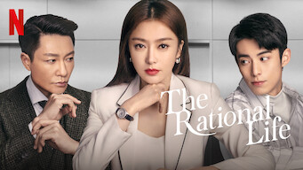
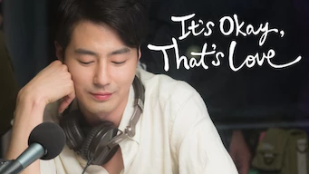
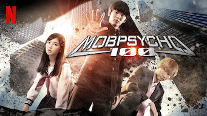
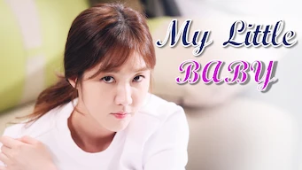

title: Accueil

#Accueil

##Derniers vus

Affiche|Information
:---:|:---
 |Série : **The Rational Life** Origine: **Chine** Note: :material-star:{.gold }:material-star:{.gold }:material-star:{.gold }:material-star:{.gold }:material-star-half-full:{.gold .heart} Sortie en **2021** Nb. épisodes: **35**  _Très bonne série romantique, les dialogues sont très poussés et cohérents, sans entrer dans les clichés habituels._
 |Série : **Save Me / 구해 줘** Origine: **Corée du Sud** Note: :material-star:{.gold }:material-star:{.gold }:material-star:{.gold }:material-star:{.gold .heart}:material-star:{.grey } Sortie en **2017** Nb. épisodes: **16**  _Très bonne description de l'emprise des sectes, mais les séquences sont un peu trop répétitives._
 |Série : **It's Okay, That's Love / 괜찮아 사랑이야** Origine: **Corée du Sud** Note: :material-star:{.gold }:material-star:{.gold }:material-star:{.gold }:material-star:{.gold .heart}:material-star:{.grey } Sortie en **2014** Nb. épisodes: **16** :kr: sous-titres en coréens  _Très bon traitement d'un sujet complexe, le scénario est bien. Quelques longueurs._
 |Série : **Resident Evil: Infinite Darkness** Origine: **Japon** Note: :material-star:{.gold }:material-star:{.gold }:material-star:{.gold .heart}:material-star:{.grey }:material-star:{.grey } Sortie en **2021** Nb. épisodes: **4**  _Mini-série d'animation japonais, réaliste, très bien fait mais avec très peu de surprise._
 |Série : **Mob Psycho 100** Origine: **Japon** Note: :material-star:{.gold }:material-star:{.gold }:material-star-half-full:{.gold .heart}:material-star:{.grey }:material-star:{.grey } Sortie en **2018** Nb. épisodes: **12**  _Très teenaged, trop répétitif mais bien fait._
 |Série : **My Little Baby / 마이 리틀 베이비** Origine: **Corée du Sud** Note: :material-star:{.gold }:material-star:{.gold }:material-star:{.gold }:material-star-half-full:{.gold .heart}:material-star:{.grey } Sortie en **2016** Nb. épisodes: **16** :kr: sous-titres en coréens  _Comédie légère sur l'éducation des enfants en base âge. Quelques bonnes surprises pour un scénario assez classique._
 |Série : **Fight for My Way / 쌈 마이웨이** Origine: **Corée du Sud** Note: :material-star:{.gold }:material-star:{.gold }:material-star:{.gold }:material-star:{.gold .heart}:material-star:{.grey } Sortie en **2017** Nb. épisodes: **16** :kr: sous-titres en coréens  _Le scénario est très bien, mais un peu compliqué car le contexte est très riche. Les acteurs sont excellents._
 |Film : **26 Years / 26년** Origine: **Corée du Sud** Note: :material-star:{.gold }:material-star:{.gold }:material-star-half-full:{.gold .heart}:material-star:{.grey }:material-star:{.grey } Sortie en **2012**  _Politique-fiction basé sur un fait réel. Bonne réalisation mais l'ensemble est confus._
 |Série : **I Can Hear Your Voice** Origine: **Corée du Sud** Note: :material-star:{.gold }:material-star:{.gold }:material-star-half-full:{.gold .heart}:material-star:{.grey }:material-star:{.grey } Sortie en **2013** Nb. épisodes: **18**  _Très mauvaise exploitation d'une idée originale. Le scénario tombe à plat, les personnages ayant des réactions stupides, transformant leur force en faiblesse trop facilement. Aucun des procès évoquées ne tiennent la route. Dommage._
 |Série : **Color of Woman / 컬러 오브 우먼** Origine: **Corée du Sud** Note: :material-star:{.gold }:material-star:{.gold }:material-star:{.gold .heart}:material-star:{.grey }:material-star:{.grey } Sortie en **2012** Nb. épisodes: **20** :kr: sous-titres en coréens  _Un peu désuet, basé sur les quiproquo, mais aussi sur un scénario qui tient la route._

##En cours...

Affiche|Information
:---:|:---
 |Série : **Dear My Friends** Origine: **Corée du Sud** Sortie en **2016** Nb. épisodes: **16**  _Pour l'instant, n'a pas vraiment démarrer après un épisode ..._
 |Série : **Le Jardin Céleste** Origine: **Corée du Sud** Sortie en **2011** Nb. épisodes: **30** :kr: sous-titres en coréens  _Autre titre : "Heaven's Garden" Semble pas mal... plutôt orienté vie à la campagne pour l'instant_
 |Série : **Mine / 마인** Origine: **Corée du Sud** Sortie en **2021** Nb. épisodes: **16** :kr: sous-titres en coréens  _Mise en contexte, nombreuses possibilités à venir..._

##Top 10

Affiche|Information
:---:|:---
 |Palmarès: :material-numeric-1-circle:{.num_gold} Série : **Something in the Rain** Origine: **Corée du Sud** Note: :material-star:{.gold }:material-star:{.gold }:material-star:{.gold }:material-star:{.gold }:material-star:{.gold .heart} Sortie en **2018** Nb. épisodes: **16**  _Excellent, aborde à la fois le monde du travail et un des tabous de la société coréenne._
 |Palmarès: :material-numeric-2-circle:{.num_silver} Série : **It's Okay to Not Be Okay** Origine: **Corée du Sud** Note: :material-star:{.gold }:material-star:{.gold }:material-star:{.gold }:material-star:{.gold }:material-star:{.gold .heart} Sortie en **2020** Nb. épisodes: **16** :kr: sous-titres en coréens  _Bizarre au premier abord, on tombe vite sous le charme des personnages._
 |Palmarès: :material-numeric-3-circle:{.num_copper} Série : **Crash Landing on You** Origine: **Corée du Sud** Note: :material-star:{.gold }:material-star:{.gold }:material-star:{.gold }:material-star:{.gold }:material-star:{.gold .heart} Sortie en **2019** Nb. épisodes: **16** :kr: sous-titres en coréens  _Très bon scénario, les acteurs sont excellents et la réalisation paufinée. Ca mériterait une saison 2 !_
 |Palmarès: :material-numeric-4-circle: Série : **My Mister** Origine: **Corée du Sud** Note: :material-star:{.gold }:material-star:{.gold }:material-star:{.gold }:material-star:{.gold }:material-star:{.gold .heart} Sortie en **2018** Nb. épisodes: **16**  _Comment ne pas tomber sous le charme de IU ! On a envie que la série ne s'arrête jamais._
 |Palmarès: :material-numeric-5-circle: Série : **One Spring Night** Origine: **Corée du Sud** Note: :material-star:{.gold }:material-star:{.gold }:material-star:{.gold }:material-star:{.gold }:material-star:{.gold .heart} Sortie en **2019** Nb. épisodes: **16** :kr: sous-titres en coréens  _Excellent, bonne description de la société coréennes et de certains de ses travers._
 |Palmarès: :material-numeric-6-circle: Série : **My Secret Terrius** Origine: **Corée du Sud** Note: :material-star:{.gold }:material-star:{.gold }:material-star:{.gold }:material-star:{.gold }:material-star:{.gold .heart} Sortie en **2018** Nb. épisodes: **16**  _Très bon scénario d'espionnage, les acteurs sont impeccables._
 |Palmarès: :material-numeric-7-circle: Série : **Pinocchio** Origine: **Corée du Sud** Note: :material-star:{.gold }:material-star:{.gold }:material-star:{.gold }:material-star:{.gold }:material-star:{.gold .heart} Sortie en **2014** Nb. épisodes: **20**  _Bon scénario sur les journalistes en Corée, même s'il faut quelques épisodes de description avant son démarrage._
 |Palmarès: :material-numeric-8-circle: Série : **Misaeng** Origine: **Corée du Sud** Note: :material-star:{.gold }:material-star:{.gold }:material-star:{.gold }:material-star:{.gold }:material-star:{.gold .heart} Sortie en **2014** Nb. épisodes: **20** :kr: sous-titres en coréens  _La vie en entreprise en Corée. Très bon scénario, nombreuses situations intéressantes._
 |Palmarès: :material-numeric-9-circle: Série : **Designated Survivor: 60 Days** Origine: **Corée du Sud** Note: :material-star:{.gold }:material-star:{.gold }:material-star:{.gold }:material-star:{.gold }:material-star:{.gold .heart} Sortie en **2019** Nb. épisodes: **16** :kr: sous-titres en coréens  _Bien plus intéressant que la version américaine, le contexte politique de la Corée du sud est bien plus crédible._
 |Palmarès: :material-numeric-10-circle: Série : **VIP** Origine: **Corée du Sud** Note: :material-star:{.gold }:material-star:{.gold }:material-star:{.gold }:material-star:{.gold }:material-star:{.gold .heart} Sortie en **2019** Nb. épisodes: **16**  _Pas mal de surprise au fur et à mesure des épisodes. Pour une fois, les relations sont plus réalistes, rare dans le genre K-Drama._
