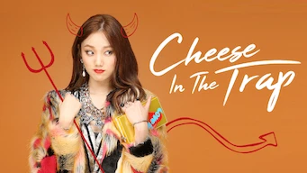
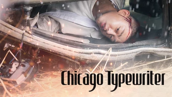
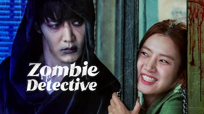
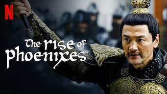

title: Accueil

#Accueil

##Derniers vus

Affiche|Information
:---:|:---
 :material-netflix:{ .rouge } ATTENTION ! - Dernier jour sur Netflix le 30/09/2021|Série : **Reply 1997** Origine: **Corée du Sud** Note: :material-star:{.gold }:material-star:{.gold }:material-star:{.gold .heart}:material-star:{.grey }:material-star:{.grey } Sortie en **2012** Nb. épisodes: **16** :kr: sous-titres en coréens  _Dans la lignée des séries "reply", c'est bien construit malgré de faux suspenses cassant le rythme, comme dans la majorité des autres séries "reply"._
 :material-netflix:{ .rouge } ATTENTION ! - Dernier jour sur Netflix le 30/09/2021|Série : **Let's Eat 2 / 식샤를 합시다 2** Origine: **Corée du Sud** Note: :material-star:{.gold }:material-star:{.gold }:material-star:{.gold }:material-star-half-full:{.gold .heart}:material-star:{.grey } Sortie en **2015** Nb. épisodes: **18** :kr: sous-titres en coréens  _Aussi bien que le premier volet, avec un scénario entièrement revu._
 :material-netflix:{ .rouge } ATTENTION ! - Dernier jour sur Netflix le 30/09/2021|Série : **Cheese in the Trap** Origine: **Corée du Sud** Note: :material-star:{.gold }:material-star:{.gold }:material-star-half-full:{.gold .heart}:material-star:{.grey }:material-star:{.grey } Sortie en **2016** Nb. épisodes: **16**  _L'idée est pas mal, mais l'évolution des pensées et des réflexions des personnages sont trop lentes, parfois peu cohérentes, voir trop serviles, en contradiction avec leur niveau d'éducation. Au final, c'est plutôt déprimant comme série._
 :material-netflix:{ .rouge } ATTENTION ! - Dernier jour sur Netflix le 30/09/2021|Série : **Chicago Typewriter / 시카고 타자기** Origine: **Corée du Sud** Note: :material-star:{.gold }:material-star:{.gold }:material-star:{.gold }:material-star-half-full:{.gold .heart}:material-star:{.grey } Sortie en **2017** Nb. épisodes: **16**  _Un scénario un peu trop alambiquées, l'ensemble pas mal mais beaucoup de longueurs._
 |Série : **Love, Death & Robots** Origine: **Etats-Unis** Note: :material-star:{.gold }:material-star:{.gold }:material-star:{.gold .heart}:material-star:{.grey }:material-star:{.grey } Sortie en **2019** Nb. épisodes: **18**  _Chaque épisode est une histoire différente. Certains épisodes sont biens, d'autres ennuyeux._
 |Série : **Zombie Detective / 좀비탐정** Origine: **Corée du Sud** Note: :material-star:{.gold }:material-star:{.gold }:material-star:{.gold .heart}:material-star:{.grey }:material-star:{.grey } Sortie en **2021** Nb. épisodes: **12**  _Un peu trop gentil, classique mais reste bien fait._
 |Série : **The Rise of Phoenixes** Origine: **Chine** Note: :material-star:{.gold }:material-star:{.gold }:material-star:{.gold }:material-star:{.gold .heart}:material-star:{.grey } Sortie en **2018** Nb. épisodes: **70**  _Excellent scénario, les 70 épisodes passent rapidement car le suspense est maintenu tout du long._
 |Film : **The Bros / 부라더** Origine: **Corée du Sud** Note: :material-star:{.gold }:material-star:{.gold }:material-star:{.gold }:material-star-half-full:{.gold .heart}:material-star:{.grey } Sortie en **2017**  _Des excellents acteurs, il faut attendre la fin du film pour pleinement l'apprécier._
 |Film : **Kenshin : L’achèvement** Origine: **Japon** Note: :material-star:{.gold }:material-star-half-full:{.gold .heart}:material-star:{.grey }:material-star:{.grey }:material-star:{.grey } Sortie en **2021**  _Bien moins bon que le premier film, tiens plus du manga, les combats ne sont absolument pas réalistes._
 |Série : **Happy And / 해피 앤드** Origine: **Corée du Sud** Note: :material-star:{.gold }:material-star:{.gold }:material-star-half-full:{.gold .heart}:material-star:{.grey }:material-star:{.grey } Sortie en **2012** Nb. épisodes: **25** :kr: sous-titres en coréens  _Enchainement de micro-série sur les femmes se retrouvant dans des situations pas possibles. Scéanarios intéressant mais la réalisation est plus ou moins bien selon les épisodes._

##En cours...

Affiche|Information
:---:|:---
 |Série : **Dear My Friends** Origine: **Corée du Sud** Sortie en **2016** Nb. épisodes: **16**  _Pour l'instant, n'a pas vraiment démarrer après un épisode ..._
 |Série : **Into the Ring / 하라는 취업은 안하고 출사표** Origine: **Corée du Sud** Sortie en **2020** Nb. épisodes: **16**  _nan_
 |Série : **Heaven's Garden / Le Jardin Céleste** Origine: **Corée du Sud** Sortie en **2011** Nb. épisodes: **30** :kr: sous-titres en coréens  _Semble pas mal... plutôt orienté vie à la campagne pour l'instant_
 |Série : **Love, Marriage and Divorce / 결혼작사 이혼작곡** Origine: **Corée du Sud** Sortie en **2021** Nb. épisodes: **16**  _Commence plutôt bien..._
 |Série : **SKY Castle** Origine: **Corée du Sud** Sortie en **2018** Nb. épisodes: **21**  _Sujet peu intéressant... en espérant que cela s'emballe._

##Top 10

Affiche|Information
:---:|:---
 |Palmarès: :material-numeric-1-circle:{.num_gold} Série : **Something in the Rain / 밥 잘 사주는 예쁜 누나** Origine: **Corée du Sud** Note: :material-star:{.gold }:material-star:{.gold }:material-star:{.gold }:material-star:{.gold }:material-star:{.gold .heart} Sortie en **2018** Nb. épisodes: **16**  _Excellent, aborde à la fois le monde du travail et un des tabous de la société coréenne._
 |Palmarès: :material-numeric-2-circle:{.num_silver} Série : **It's Okay to Not Be Okay** Origine: **Corée du Sud** Note: :material-star:{.gold }:material-star:{.gold }:material-star:{.gold }:material-star:{.gold }:material-star:{.gold .heart} Sortie en **2020** Nb. épisodes: **16** :kr: sous-titres en coréens  _Bizarre au premier abord, on tombe vite sous le charme des personnages._
 |Palmarès: :material-numeric-3-circle:{.num_copper} Série : **Crash Landing on You** Origine: **Corée du Sud** Note: :material-star:{.gold }:material-star:{.gold }:material-star:{.gold }:material-star:{.gold }:material-star:{.gold .heart} Sortie en **2019** Nb. épisodes: **16** :kr: sous-titres en coréens  _Très bon scénario, les acteurs sont excellents et la réalisation paufinée. Ca mériterait une saison 2 !_
 |Palmarès: :material-numeric-4-circle: Série : **My Mister** Origine: **Corée du Sud** Note: :material-star:{.gold }:material-star:{.gold }:material-star:{.gold }:material-star:{.gold }:material-star:{.gold .heart} Sortie en **2018** Nb. épisodes: **16**  _Comment ne pas tomber sous le charme de IU ! On a envie que la série ne s'arrête jamais._
 |Palmarès: :material-numeric-5-circle: Série : **One Spring Night** Origine: **Corée du Sud** Note: :material-star:{.gold }:material-star:{.gold }:material-star:{.gold }:material-star:{.gold }:material-star:{.gold .heart} Sortie en **2019** Nb. épisodes: **16** :kr: sous-titres en coréens  _Excellent, bonne description de la société coréennes et de certains de ses travers._
 |Palmarès: :material-numeric-6-circle: Série : **My Secret Terrius** Origine: **Corée du Sud** Note: :material-star:{.gold }:material-star:{.gold }:material-star:{.gold }:material-star:{.gold }:material-star:{.gold .heart} Sortie en **2018** Nb. épisodes: **16**  _Très bon scénario d'espionnage, les acteurs sont impeccables._
 |Palmarès: :material-numeric-7-circle: Série : **Pinocchio** Origine: **Corée du Sud** Note: :material-star:{.gold }:material-star:{.gold }:material-star:{.gold }:material-star:{.gold }:material-star:{.gold .heart} Sortie en **2014** Nb. épisodes: **20**  _Bon scénario sur les journalistes en Corée, même s'il faut quelques épisodes de description avant son démarrage._
 |Palmarès: :material-numeric-8-circle: Série : **Misaeng** Origine: **Corée du Sud** Note: :material-star:{.gold }:material-star:{.gold }:material-star:{.gold }:material-star:{.gold }:material-star:{.gold .heart} Sortie en **2014** Nb. épisodes: **20** :kr: sous-titres en coréens  _La vie en entreprise en Corée. Très bon scénario, nombreuses situations intéressantes._
 |Palmarès: :material-numeric-9-circle: Série : **Designated Survivor: 60 Days** Origine: **Corée du Sud** Note: :material-star:{.gold }:material-star:{.gold }:material-star:{.gold }:material-star:{.gold }:material-star:{.gold .heart} Sortie en **2019** Nb. épisodes: **16** :kr: sous-titres en coréens  _Bien plus intéressant que la version américaine, le contexte politique de la Corée du sud est bien plus crédible._
 |Palmarès: :material-numeric-10-circle: Série : **VIP** Origine: **Corée du Sud** Note: :material-star:{.gold }:material-star:{.gold }:material-star:{.gold }:material-star:{.gold }:material-star:{.gold .heart} Sortie en **2019** Nb. épisodes: **16**  _Pas mal de surprise au fur et à mesure des épisodes. Pour une fois, les relations sont plus réalistes, rare dans le genre K-Drama._
