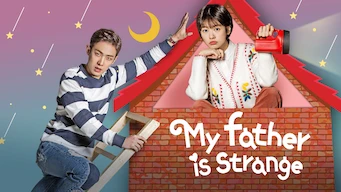
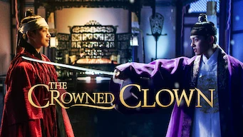
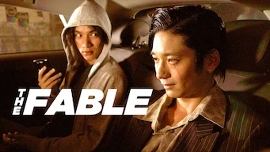
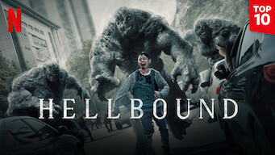

title: Accueil

#Accueil

##Derniers vus

Affiche|Information
:---:|:---
 |Série : **My Father is Strange / 아버지가 이상해** Origine: **Corée du Sud** Note: :material-star:{.gold }:material-star:{.gold }:material-star:{.gold }:material-star:{.gold }:material-star-half-full:{.gold .heart} Sortie en **2017** Nb. épisodes: **52**  _Le scénario est plutôt bien fait même si un peu trop larmoyant sur la fin, l'intrigue centrale autour de l'usurpation d'identité est plutôt bien traitée._
 |Série : **The Crowned Clown / 왕이 된 남자** Origine: **Corée du Sud** Note: :material-star:{.gold }:material-star:{.gold }:material-star:{.gold .heart}:material-star:{.grey }:material-star:{.grey } Sortie en **2019** Nb. épisodes: **16**  _Série plus fiction qu'historique, avec beaucoup de scènes peu crédibles et de grosses lenteurs. Dommage cela aurait pu être un peu moins larmoyant._
 |Film : **Sentinelle** Origine: **France** Note: :material-star:{.gold }:material-star-half-full:{.gold .heart}:material-star:{.grey }:material-star:{.grey }:material-star:{.grey } Sortie en **2021**  _Pas du tout crédible._
 |Film : **The Fable: The Killer Who Doesn't Kill / THE FABLE** Origine: **Japon** Note: :material-star:{.gold }:material-star:{.gold .heart}:material-star:{.grey }:material-star:{.grey }:material-star:{.grey } Sortie en **2019**  _Style manga, beaucoup de combats et quelques parties un peu fun._
 |Série : **Salvation** Origine: **Etats-Unis** Note: :material-star:{.gold }:material-star-half-full:{.gold .heart}:material-star:{.grey }:material-star:{.grey }:material-star:{.grey } Sortie en **2018** Nb. épisodes: **26**  _Le premier scénario est pas trop mal, mais le scénario de la 2ème saison est trop basique et ennuyeuse._
 |Palmarès: :material-numeric-9-circle: Série : **Love, Marriage and Divorce / 결혼작사 이혼작곡** Origine: **Corée du Sud** Note: :material-star:{.gold }:material-star:{.gold }:material-star:{.gold }:material-star:{.gold }:material-star:{.gold .heart} Sortie en **2021** Nb. épisodes: **32** :kr: sous-titres en coréens  _Un excellent scénario sur les relations homme-femme, avec de nombreux cas de figure mais toujours très juste._
 |Série : **The expanse** Origine: **Etats-Unis** Note: :material-star:{.gold }:material-star:{.gold }:material-star:{.gold }:material-star:{.gold }:material-star-half-full:{.gold .heart} Sortie en **2021** Nb. épisodes: **46**  _Série de science-fiction avec des effets spéciaux très bien réalisés dans un futur imaginaire assez complexe._
 |Série : **Tempted / 위대한 유혹자** Origine: **Corée du Sud** Note: :material-star:{.gold }:material-star:{.gold }:material-star:{.gold }:material-star-half-full:{.gold .heart}:material-star:{.grey } Sortie en **2018** Nb. épisodes: **16**  _Un scénario un peu trop cousu de fil blanc, et donc sans surprise, mais la réalisation est bonne et les acteurs jouent juste._
 |Série : **Hellbound / 지옥** Origine: **Corée du Sud** Note: :material-star:{.gold }:material-star:{.gold }:material-star:{.gold }:material-star:{.gold }:material-star-half-full:{.gold .heart} Sortie en **2021** Nb. épisodes: **6** :kr: sous-titres en coréens  _Excellent, une série qui montre bien les faiblesses de l'humanité et ses travers par rapport à l'inattendu. Un peu trop violent néanmoins et quelques petites erreurs._
 :material-netflix:{ .rouge }Retiré de Netflix le 14/12/2021|Film : **Seoul Searching** Origine: **Corée du Sud** Note: :material-star:{.gold }:material-star:{.gold }:material-star:{.gold }:material-star:{.gold }:material-star-half-full:{.gold .heart} Sortie en **2015**  _Un film sur les Coréens expatriés suite à la guerre de Corée et sur une jeunesse qui revient chercher ses racines en Corée; très bien fait, aborde bien les problématiques de cette jeunesse expatriée._

##En cours...

Affiche|Information
:---:|:---
 |Série : **Dear My Friends** Origine: **Corée du Sud** Sortie en **2016** Nb. épisodes: **16**  _Pour l'instant, n'a pas vraiment démarrer après un épisode ..._
 :material-netflix:{ .rouge } ATTENTION ! - Dernier jour sur Netflix le 09/01/2022|Série : **The Last Empress** Origine: **Corée du Sud** Sortie en **2018** Nb. épisodes: **26**  _Beaucoup d'incohérences dans cette Corée imaginaire avec un empereur. Dommage, avec un scémario mieux ficellé et moins de grosses ficelles, cela aurait pu être pas mal._
 |Série : **La mer de tranquilité / The Silent Sea / 고요의 바다** Origine: **Corée du Sud** Sortie en **2021** Nb. épisodes: **8**  _Science fiction, quelques erreurs pour un film qui se passe en majorité sur la lune... à suivre_

##Top 10

Affiche|Information
:---:|:---
 |Palmarès: :material-numeric-1-circle:{.num_gold} Série : **Something in the Rain / 밥 잘 사주는 예쁜 누나** Origine: **Corée du Sud** Note: :material-star:{.gold }:material-star:{.gold }:material-star:{.gold }:material-star:{.gold }:material-star:{.gold .heart} Sortie en **2018** Nb. épisodes: **16**  _Excellent, aborde à la fois le monde du travail et un des tabous de la société coréenne._
 |Palmarès: :material-numeric-2-circle:{.num_silver} Série : **It's Okay to Not Be Okay** Origine: **Corée du Sud** Note: :material-star:{.gold }:material-star:{.gold }:material-star:{.gold }:material-star:{.gold }:material-star:{.gold .heart} Sortie en **2020** Nb. épisodes: **16** :kr: sous-titres en coréens  _Bizarre au premier abord, on tombe vite sous le charme des personnages._
 |Palmarès: :material-numeric-3-circle:{.num_copper} Série : **Crash Landing on You** Origine: **Corée du Sud** Note: :material-star:{.gold }:material-star:{.gold }:material-star:{.gold }:material-star:{.gold }:material-star:{.gold .heart} Sortie en **2019** Nb. épisodes: **16** :kr: sous-titres en coréens  _Très bon scénario, les acteurs sont excellents et la réalisation paufinée. Ca mériterait une saison 2 !_
 |Palmarès: :material-numeric-4-circle: Série : **My Mister** Origine: **Corée du Sud** Note: :material-star:{.gold }:material-star:{.gold }:material-star:{.gold }:material-star:{.gold }:material-star:{.gold .heart} Sortie en **2018** Nb. épisodes: **16**  _Comment ne pas tomber sous le charme de IU ! On a envie que la série ne s'arrête jamais._
 |Palmarès: :material-numeric-5-circle: Série : **One Spring Night** Origine: **Corée du Sud** Note: :material-star:{.gold }:material-star:{.gold }:material-star:{.gold }:material-star:{.gold }:material-star:{.gold .heart} Sortie en **2019** Nb. épisodes: **16** :kr: sous-titres en coréens  _Excellent, bonne description de la société coréennes et de certains de ses travers._
 |Palmarès: :material-numeric-6-circle: Série : **My Secret Terrius** Origine: **Corée du Sud** Note: :material-star:{.gold }:material-star:{.gold }:material-star:{.gold }:material-star:{.gold }:material-star:{.gold .heart} Sortie en **2018** Nb. épisodes: **16**  _Très bon scénario d'espionnage, les acteurs sont impeccables._
 |Palmarès: :material-numeric-7-circle: Série : **Pinocchio** Origine: **Corée du Sud** Note: :material-star:{.gold }:material-star:{.gold }:material-star:{.gold }:material-star:{.gold }:material-star:{.gold .heart} Sortie en **2014** Nb. épisodes: **20**  _Bon scénario sur les journalistes en Corée, même s'il faut quelques épisodes de description avant son démarrage._
 |Palmarès: :material-numeric-8-circle: Série : **Misaeng** Origine: **Corée du Sud** Note: :material-star:{.gold }:material-star:{.gold }:material-star:{.gold }:material-star:{.gold }:material-star:{.gold .heart} Sortie en **2014** Nb. épisodes: **20** :kr: sous-titres en coréens  _La vie en entreprise en Corée. Très bon scénario, nombreuses situations intéressantes._
 |Palmarès: :material-numeric-9-circle: Série : **Love, Marriage and Divorce / 결혼작사 이혼작곡** Origine: **Corée du Sud** Note: :material-star:{.gold }:material-star:{.gold }:material-star:{.gold }:material-star:{.gold }:material-star:{.gold .heart} Sortie en **2021** Nb. épisodes: **32** :kr: sous-titres en coréens  _Un excellent scénario sur les relations homme-femme, avec de nombreux cas de figure mais toujours très juste._
 |Palmarès: :material-numeric-10-circle: Série : **Designated Survivor: 60 Days** Origine: **Corée du Sud** Note: :material-star:{.gold }:material-star:{.gold }:material-star:{.gold }:material-star:{.gold }:material-star:{.gold .heart} Sortie en **2019** Nb. épisodes: **16** :kr: sous-titres en coréens  _Bien plus intéressant que la version américaine, le contexte politique de la Corée du sud est bien plus crédible._
