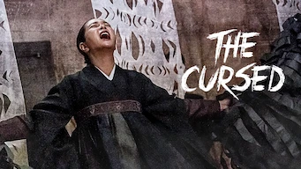
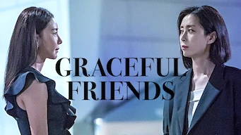
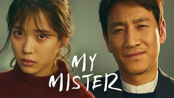

title: Accueil

# Accueil

## Derniers vus

Affiche|Information
:---:|:---
 |Série : **Her Private Life / 그녀의 사생활** Origine: **Corée du Sud** Note: :material-star:{.gold .heart}:material-star:{.gold .heart}:material-star:{.gold .heart}:material-star-outline:{.grey }:material-star-outline:{.grey } Sortie en **2019** Nb. épisodes: **16**  _Comédie légère avec pour toile de fond les excès des fans de la K-pop._
 |Série : **Reine du Sud** Origine: **Etats-Unis** Note: :material-star:{.gold .heart}:material-star:{.gold .heart}:material-star-outline:{.grey }:material-star-outline:{.grey }:material-star-outline:{.grey } Sortie en **2021** Nb. épisodes: **62**  _Histoire de narcotrafiquants entre le Mexique et les États-Unis, avec des personnages et des scènes bien trop caricaturales, une stratégie proche du zéro absolu et un tout petit peu de réflexion._
 |Film : **Cold Blood Legacy - La mémoire du sang** Origine: **France** Note: :material-star:{.gold .heart}:material-star:{.gold .heart}:material-star:{.gold .heart}:material-star-outline:{.grey }:material-star-outline:{.grey } Sortie en **2019**  _Histoire de tueur à gage avec Jean Reno, l'histoire est pas mal mais le scénario trop léger._
 |Film : **Wu Assassins** Origine: **Etats-Unis** Note: :material-star:{.gold .heart}:material-star-half-full:{.gold .heart}:material-star-outline:{.grey }:material-star-outline:{.grey }:material-star-outline:{.grey } Sortie en **2019**  _Le scénario part un peu dans tous les sens, les flashback sont mal venus, l'ensemble est assez confus. Seuls les combats sont bien fait._
 |Série : **Familiar Wife / 아능 와이프** Origine: **Corée du Sud** Note: :material-star:{.gold .heart}:material-star:{.gold .heart}:material-star:{.gold .heart}:material-star:{.gold .heart}:material-star-outline:{.grey } Sortie en **2018** Nb. épisodes: **16**  _Ah si on pouvait remonter le temps et changer un petit peu notre histoire, c'est ce que propose cette série._
 |Film : **Interceptor** Origine: **Australie** Note: :material-star-half-full:{.gold .heart}:material-star-outline:{.grey }:material-star-outline:{.grey }:material-star-outline:{.grey }:material-star-outline:{.grey } Sortie en **2022**  _C'est du déjà vu, rien de nouveau. Le niveau zéro du film d'action._
 |Film : **My Best Friend's Wedding** Origine: **Chine** Note: :material-star:{.gold .heart}:material-star:{.gold .heart}:material-star:{.gold .heart}:material-star-outline:{.grey }:material-star-outline:{.grey } Sortie en **2016**  _Le mariage de son meilleur ami, déjà traité mais plutôt bien fait._
 |Série : **Business Proposal / 사내 맞선** Origine: **Corée du Sud** Note: :material-star:{.gold .heart}:material-star:{.gold .heart}:material-star:{.gold .heart}:material-star:{.gold .heart}:material-star-outline:{.grey } Sortie en **2022** Nb. épisodes: **12** :kr: sous-titres en coréens  _Sans doute tirer d'un webtoon, l'histoire est bien faite et cela s'enchaîne bien; néanmoins cela reste un peu trop convenu._
 |Documentaire : **Le porc : Une passion coréenne / 삼겹살 랩소디** Origine: **Corée du Sud** Note: :material-star:{.gold .heart}:material-star:{.gold .heart}:material-star-half-full:{.gold .heart}:material-star-outline:{.grey }:material-star-outline:{.grey } Sortie en **2020** Nb. épisodes: **2** :kr: sous-titres en coréens  _Documentaire sur la cuisine coréenne. Pour les amateurs de bonne chair, vegan s'abstenir._
 |Série : **The Cursed / 방법** Origine: **Corée du Sud** Note: :material-star:{.gold .heart}:material-star:{.gold .heart}:material-star:{.gold .heart}:material-star-half-full:{.gold .heart}:material-star-outline:{.grey } Sortie en **2020** Nb. épisodes: **12**  _Série fantastique autour du chamanisme et des malédictions plutôt bien fait._

## En cours...

Affiche|Information
:---:|:---
 |Documentaire : **La Soupe coréenne : Une culture en ébullition** Origine: **Corée du Sud** Sortie en **2022** Nb. épisodes: **3** :kr: sous-titres en coréens  _Intéressant vis-à-vis de la culture coréenne, mais pas plus._
 |Documentaire : **The Reservoir Game** Origine: **Corée du Sud** Sortie en **2017** Nb. épisodes: **1**  _Enquête sur la corruption en Corée du Sud._
 |Série : **Graceful Friends / 우아한 친구들** Origine: **Corée du Sud** Sortie en **2020** Nb. épisodes: **17**  _Un scénario qui tient la route et pas mal d'idée._
 |Série : **Peaky Blinders** Origine: **Royaume-Uni** Sortie en **2022** Nb. épisodes: **36**  _Beaucoup de violence gratuite et quelques situations peu cohérentes, mais les personnages sont plutôt sympa et recherchés. [Note de 3 pour les 5 premières saisons]_

## Top 10

Affiche|Information
:---:|:---
 |Palmarès: :material-numeric-1-circle:{.num_gold} Série : **Something in the Rain / 밥 잘 사주는 예쁜 누나** Origine: **Corée du Sud** Note: :material-star:{.gold .heart}:material-star:{.gold .heart}:material-star:{.gold .heart}:material-star:{.gold .heart}:material-star:{.gold .heart} Sortie en **2018** Nb. épisodes: **16**  _Excellent, aborde à la fois le monde du travail et un des tabous de la société coréenne._
 |Palmarès: :material-numeric-2-circle:{.num_silver} Série : **It's Okay to Not Be Okay** Origine: **Corée du Sud** Note: :material-star:{.gold .heart}:material-star:{.gold .heart}:material-star:{.gold .heart}:material-star:{.gold .heart}:material-star:{.gold .heart} Sortie en **2020** Nb. épisodes: **16** :kr: sous-titres en coréens  _Bizarre au premier abord, on tombe vite sous le charme des personnages._
 |Palmarès: :material-numeric-3-circle:{.num_copper} Série : **Crash Landing on You** Origine: **Corée du Sud** Note: :material-star:{.gold .heart}:material-star:{.gold .heart}:material-star:{.gold .heart}:material-star:{.gold .heart}:material-star:{.gold .heart} Sortie en **2019** Nb. épisodes: **16** :kr: sous-titres en coréens  _Très bon scénario, les acteurs sont excellents et la réalisation paufinée. Ca mériterait une saison 2 !_
 |Palmarès: :material-numeric-4-circle: Série : **My Mister** Origine: **Corée du Sud** Note: :material-star:{.gold .heart}:material-star:{.gold .heart}:material-star:{.gold .heart}:material-star:{.gold .heart}:material-star:{.gold .heart} Sortie en **2018** Nb. épisodes: **16**  _Comment ne pas tomber sous le charme de IU ! On a envie que la série ne s'arrête jamais._
 |Palmarès: :material-numeric-5-circle: Série : **One Spring Night** Origine: **Corée du Sud** Note: :material-star:{.gold .heart}:material-star:{.gold .heart}:material-star:{.gold .heart}:material-star:{.gold .heart}:material-star:{.gold .heart} Sortie en **2019** Nb. épisodes: **16** :kr: sous-titres en coréens  _Excellent, bonne description de la société coréennes et de certains de ses travers._
 |Palmarès: :material-numeric-6-circle: Série : **My Secret Terrius** Origine: **Corée du Sud** Note: :material-star:{.gold .heart}:material-star:{.gold .heart}:material-star:{.gold .heart}:material-star:{.gold .heart}:material-star:{.gold .heart} Sortie en **2018** Nb. épisodes: **16**  _Très bon scénario d'espionnage, les acteurs sont impeccables._
 |Palmarès: :material-numeric-7-circle: Série : **Pinocchio** Origine: **Corée du Sud** Note: :material-star:{.gold .heart}:material-star:{.gold .heart}:material-star:{.gold .heart}:material-star:{.gold .heart}:material-star:{.gold .heart} Sortie en **2014** Nb. épisodes: **20**  _Bon scénario sur les journalistes en Corée, même s'il faut quelques épisodes de description avant son démarrage._
 |Palmarès: :material-numeric-8-circle: Série : **Misaeng** Origine: **Corée du Sud** Note: :material-star:{.gold .heart}:material-star:{.gold .heart}:material-star:{.gold .heart}:material-star:{.gold .heart}:material-star:{.gold .heart} Sortie en **2014** Nb. épisodes: **20** :kr: sous-titres en coréens  _La vie en entreprise en Corée. Très bon scénario, nombreuses situations intéressantes._
 |Palmarès: :material-numeric-9-circle: Série : **Love, Marriage and Divorce / 결혼작사 이혼작곡** Origine: **Corée du Sud** Note: :material-star:{.gold .heart}:material-star:{.gold .heart}:material-star:{.gold .heart}:material-star:{.gold .heart}:material-star:{.gold .heart} Sortie en **2021** Nb. épisodes: **32** :kr: sous-titres en coréens  _Un excellent scénario sur les relations homme-femme, avec de nombreux cas de figure mais toujours très juste._
 |Palmarès: :material-numeric-10-circle: Série : **Designated Survivor: 60 Days** Origine: **Corée du Sud** Note: :material-star:{.gold .heart}:material-star:{.gold .heart}:material-star:{.gold .heart}:material-star:{.gold .heart}:material-star:{.gold .heart} Sortie en **2019** Nb. épisodes: **16** :kr: sous-titres en coréens  _Bien plus intéressant que la version américaine, le contexte politique de la Corée du sud est bien plus crédible._
