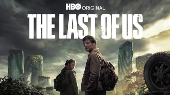

title: Accueil

# Accueil

## Derniers vus

Affiche|Information
:---:|:---
 

|Film : **Le grand partage** Origine: **France** Note: :material-star:{.gold .heart}:material-star:{.gold .heart}:material-star-half-full:{.gold .heart}:material-star-outline:{.grey }:material-star-outline:{.grey } Sortie en **2015**  _Le sens du partage en France, une notion pas si politique, finalement._
 

|Série : **The Night Agent** Origine: **Etats-Unis** Note: :material-star:{.gold .heart}:material-star:{.gold .heart}:material-star-half-full:{.gold .heart}:material-star-outline:{.grey }:material-star-outline:{.grey } Sortie de la dernière saison en **2023** Nb. épisodes: **10**  _Série d'action américaine, le scénario est bourré d'incohérence et d'approximation._
 

|Film : **Yaksha, un démon en mission / 야차** Origine: **Corée du Sud** Note: :material-star:{.gold .heart}:material-star:{.gold .heart}:material-star:{.gold .heart}:material-star:{.gold .heart}:material-star-outline:{.grey } Sortie en **2022** :kr: sous-titres en coréens  _Film d'espionnage plutôt orienté action, assez bien fait._
 

|Série : **Queenmaker / 퀸메이커** Origine: **Corée du Sud** Note: :material-star:{.gold .heart}:material-star:{.gold .heart}:material-star:{.gold .heart}:material-star-half-full:{.gold .heart}:material-star-outline:{.grey } Sortie de la dernière saison en **2023** Nb. épisodes: **11** :kr: sous-titres en coréens  _Série politique plutôt orienté élection le scénario est pas mal et cela s'enchaîne bien._
 

|Série : **Racket Boys / 라켓 소년단** Origine: **Corée du Sud** Note: :material-star:{.gold .heart}:material-star:{.gold .heart}:material-star:{.gold .heart}:material-star-outline:{.grey }:material-star-outline:{.grey } Sortie de la dernière saison en **2021** Nb. épisodes: **16** :kr: sous-titres en coréens  _Le monde du sport en Corée du Sud avec le badminton en toile de fond; une comédie plutôt agréable à voir, dans un style BD teenage._
 

|Série : **The Fall** Origine: **Royaume-Uni** Note: :material-star:{.gold .heart}:material-star:{.gold .heart}:material-star-half-full:{.gold .heart}:material-star-outline:{.grey }:material-star-outline:{.grey } Sortie de la dernière saison en **2017** Nb. épisodes: **17**  _Une enquête policière à la mode British en Irlande du Nord. De bons acteurs, mais un scénario un peu trop classique, et une fin décevante._
 

|Série : **The Last of Us** Origine: **Etats-Unis** Note: :material-star:{.gold .heart}:material-star:{.gold .heart}:material-star:{.gold .heart}:material-star-outline:{.grey }:material-star-outline:{.grey } Sortie de la dernière saison en **2023** Nb. épisodes: **9**  _Après une pandémie de micoses "tueuses", la survie s'organise et la race humaine tente de survivre; classique du genre, peu de surprise dans le scéanrio._
 

 ATTENTION ! - Dernier jour sur Netflix le 16/05/2023|Série : **Live / 라이브** Origine: **Corée du Sud** Note: :material-star:{.gold .heart}:material-star:{.gold .heart}:material-star:{.gold .heart}:material-star-outline:{.grey }:material-star-outline:{.grey } Sortie de la dernière saison en **2018** Nb. épisodes: **18**  _Le quotidien de la police de quartier en Corée du Sud, avec avec ses hauts et ses bas et un u système politique qui n'aide pas._
 

|Film : **Kill Bok-soon / 길복순** Origine: **Corée du Sud** Note: :material-star:{.gold .heart}:material-star:{.gold .heart}:material-star:{.gold .heart}:material-star-half-full:{.gold .heart}:material-star-outline:{.grey } Sortie en **2023** :kr: sous-titres en coréens  _Histoire de tueur à gage, avec un air de Kill Bill._
 

|Série : **Carnival Row** Origine: **Etats-Unis** Note: :material-star:{.gold .heart}:material-star:{.gold .heart}:material-star:{.gold .heart}:material-star:{.gold .heart}:material-star-half-full:{.gold .heart} Sortie de la dernière saison en **2023** Nb. épisodes: **18**  _Un monde fantastique à la Jules Verne, très mécanique, avec un côté féerique en plus._

## En cours...

Affiche|Information
:---:|:---
 

|Film : **AKA** Origine: **France** Sortie en **2023**  _L'infiltré, bon ou mauavis ?_
 

|Série : **L'Amour au rattrapage / 일타 스캔들** Origine: **Corée du Sud** Sortie de la dernière saison en **2023** Nb. épisodes: **16** :kr: sous-titres en coréens  _Romance au pays des cours privés._
 

|Série : **Motherland - Fort Salem** Origine: **Etats-Unis** Sortie de la dernière saison en **2021** Nb. épisodes: **20**  _Un monde où les sorcières auraient leur place._

## Top 10

Affiche|Information
:---:|:---
 

|Palmarès: :material-numeric-1-circle:{.num_gold} Série : **Something in the Rain / 밥 잘 사주는 예쁜 누나** Origine: **Corée du Sud** Note: :material-star:{.gold .heart}:material-star:{.gold .heart}:material-star:{.gold .heart}:material-star:{.gold .heart}:material-star:{.gold .heart} Sortie de la dernière saison en **2018** Nb. épisodes: **16**  _Excellent, aborde à la fois le monde du travail et un des tabous de la société coréenne._
 

|Palmarès: :material-numeric-2-circle:{.num_silver} Série : **It's Okay to Not Be Okay** Origine: **Corée du Sud** Note: :material-star:{.gold .heart}:material-star:{.gold .heart}:material-star:{.gold .heart}:material-star:{.gold .heart}:material-star:{.gold .heart} Sortie de la dernière saison en **2020** Nb. épisodes: **16** :kr: sous-titres en coréens  _Bizarre au premier abord, on tombe vite sous le charme des personnages._
 

|Palmarès: :material-numeric-3-circle:{.num_copper} Série : **Crash Landing on You** Origine: **Corée du Sud** Note: :material-star:{.gold .heart}:material-star:{.gold .heart}:material-star:{.gold .heart}:material-star:{.gold .heart}:material-star:{.gold .heart} Sortie de la dernière saison en **2019** Nb. épisodes: **16** :kr: sous-titres en coréens  _Très bon scénario, les acteurs sont excellents et la réalisation paufinée. Ca mériterait une saison 2 !_
 

|Palmarès: :material-numeric-4-circle: Série : **My Mister** Origine: **Corée du Sud** Note: :material-star:{.gold .heart}:material-star:{.gold .heart}:material-star:{.gold .heart}:material-star:{.gold .heart}:material-star:{.gold .heart} Sortie de la dernière saison en **2018** Nb. épisodes: **16**  _Comment ne pas tomber sous le charme de IU ! On a envie que la série ne s'arrête jamais._
 

|Palmarès: :material-numeric-5-circle: Série : **One Spring Night** Origine: **Corée du Sud** Note: :material-star:{.gold .heart}:material-star:{.gold .heart}:material-star:{.gold .heart}:material-star:{.gold .heart}:material-star:{.gold .heart} Sortie de la dernière saison en **2019** Nb. épisodes: **16** :kr: sous-titres en coréens  _Excellent, bonne description de la société coréennes et de certains de ses travers._
 

|Palmarès: :material-numeric-6-circle: Série : **My Secret Terrius** Origine: **Corée du Sud** Note: :material-star:{.gold .heart}:material-star:{.gold .heart}:material-star:{.gold .heart}:material-star:{.gold .heart}:material-star:{.gold .heart} Sortie de la dernière saison en **2018** Nb. épisodes: **16**  _Très bon scénario d'espionnage, les acteurs sont impeccables._
 

|Palmarès: :material-numeric-7-circle: Série : **Pinocchio** Origine: **Corée du Sud** Note: :material-star:{.gold .heart}:material-star:{.gold .heart}:material-star:{.gold .heart}:material-star:{.gold .heart}:material-star:{.gold .heart} Sortie de la dernière saison en **2014** Nb. épisodes: **20**  _Bon scénario sur les journalistes en Corée, même s'il faut quelques épisodes de description avant son démarrage._
 

|Palmarès: :material-numeric-8-circle: Série : **Misaeng** Origine: **Corée du Sud** Note: :material-star:{.gold .heart}:material-star:{.gold .heart}:material-star:{.gold .heart}:material-star:{.gold .heart}:material-star:{.gold .heart} Sortie de la dernière saison en **2014** Nb. épisodes: **20** :kr: sous-titres en coréens  _La vie en entreprise en Corée. Très bon scénario, nombreuses situations intéressantes._
 

|Palmarès: :material-numeric-9-circle: Série : **Love, Marriage and Divorce / 결혼작사 이혼작곡** Origine: **Corée du Sud** Note: :material-star:{.gold .heart}:material-star:{.gold .heart}:material-star:{.gold .heart}:material-star:{.gold .heart}:material-star:{.gold .heart} Sortie de la dernière saison en **2021** Nb. épisodes: **32** :kr: sous-titres en coréens  _Un excellent scénario sur les relations homme-femme, avec de nombreux cas de figure mais toujours très juste._
 

|Palmarès: :material-numeric-10-circle: Série : **Designated Survivor: 60 Days** Origine: **Corée du Sud** Note: :material-star:{.gold .heart}:material-star:{.gold .heart}:material-star:{.gold .heart}:material-star:{.gold .heart}:material-star:{.gold .heart} Sortie de la dernière saison en **2019** Nb. épisodes: **16** :kr: sous-titres en coréens  _Bien plus intéressant que la version américaine, le contexte politique de la Corée du sud est bien plus crédible._
