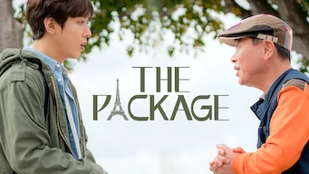

title: Accueil

#Accueil

##Derniers vus

Affiche|Information
:---:|:---
 |Série : **Search WWW / 검색어를 입력하세요 www** Origine: **Corée du Sud** Note: :material-star:{.gold }:material-star:{.gold }:material-star:{.gold }:material-star-half-full:{.gold .heart}:material-star:{.grey } Sortie en **2019** Nb. épisodes: **16**  _L'histoire est bien mais la réalisation est trop lente, certaines scènes deviennent ennuyeuses à cause de leurs longueurs. Le travail dans la société digital est aussi peu crédible, même si l'environnement de travail, lui, est représentatif._
 |Série : **The Producers / 프로듀사** Origine: **Corée du Sud** Note: :material-star:{.gold }:material-star:{.gold }:material-star:{.gold .heart}:material-star:{.grey }:material-star:{.grey } Sortie en **2015** Nb. épisodes: **12**  _Série sur le thème des producteurs d'émissions à la télévision, avec au programme triangulaires amoureuses._
 |Film : **Along with the Gods: The Two Worlds / 신과함께: 죄와벌** Origine: **Corée du Sud** Note: :material-star:{.gold }:material-star:{.gold }:material-star:{.gold }:material-star-half-full:{.gold .heart}:material-star:{.grey } Sortie en **2017** :kr: sous-titres en coréens  _Les 7 jugements  en 49 jours après sa mort, un film avec énormément d'effets spéciaux._
 |Série : **Mad Dog / 매드 독** Origine: **Corée du Sud** Note: :material-star:{.gold }:material-star:{.gold }:material-star:{.gold .heart}:material-star:{.grey }:material-star:{.grey } Sortie en **2017** Nb. épisodes: **16**  _Série avec comme toile de fond le système des assurances en Corée. Cela commence bien, mais faute de matière, des nombreuses répétitions et de plusieurs incohérences, cela finit par traîner en longueur. L'ensemble reste néanmoins agréable à voir._
 |Série : **SKY Castle / SKY 캐슬** Origine: **Corée du Sud** Note: :material-star:{.gold }:material-star:{.gold }:material-star:{.gold }:material-star:{.gold }:material-star-half-full:{.gold .heart} Sortie en **2018** Nb. épisodes: **21**  _Cette série est une critique du système éducatif en Corée et de ses abus. La série a eu beaucoup de succès et c'est justifié._
 |Série : **Homeland** Origine: **Etats-Unis** Note: :material-star:{.gold }:material-star:{.gold .heart}:material-star:{.grey }:material-star:{.grey }:material-star:{.grey } Sortie en **2018** Nb. épisodes: **96**  _Les espions Américains se baladent au Moyen-Orient, scénario peu réaliste sur une CIA complètement dépassé. Dans l'ensemble, c'est très peu crédible._
 |Série : **Under the Black Moonlight / 검은 달빛 아래서** Origine: **Corée du Sud** Note: :material-star:{.gold .heart}:material-star:{.grey }:material-star:{.grey }:material-star:{.grey }:material-star:{.grey } Sortie en **2016** Nb. épisodes: **2** :kr: sous-titres en coréens  _Cela relève plus d'un essai que d'une véritable série, plutôt surjoué par de jeunes acteurs._
 |Série : **My Name / 마이 네임** Origine: **Corée du Sud** Note: :material-star:{.gold }:material-star:{.gold }:material-star-half-full:{.gold .heart}:material-star:{.grey }:material-star:{.grey } Sortie en **2021** Nb. épisodes: **12** :kr: sous-titres en coréens  _Violence gratuite et combats irréalistes essaient de pallier un scénario américanisé bien trop léger. Du classique sans surprise, dommage les acteurs étaient plutôt bons et la réalisation réussie._
 |Série : **Love For Ten - Generation of Youth / 러브포텐 - 순정의 시대** Origine: **Corée du Sud** Note: :material-star:{.gold }:material-star:{.gold .heart}:material-star:{.grey }:material-star:{.grey }:material-star:{.grey } Sortie en **2013** Nb. épisodes: **12** :kr: sous-titres en coréens  _Micro-série à sketch, avec les lourdeurs habituelles de ce style. C'est plus une figure de style qu'une vraie série._
 :material-netflix:{ .rouge }Retiré de Netflix le 04/11/2021|Série : **The Package / 더 패키지** Origine: **Corée du Sud** Note: :material-star:{.gold }:material-star:{.gold }:material-star:{.gold }:material-star:{.gold .heart}:material-star:{.grey } Sortie en **2017** Nb. épisodes: **12**  _Un scénario qui se passe majoritairement en France, avec de très beaux paysages et lieux touristiques. Très bien fait, mais il manque un petit quelque chose, une étincelle, pour élever l'ensemble._

##En cours...

Affiche|Information
:---:|:---
 |Série : **Ice Fantasy / La Fantaisie de Glace** Origine: **Chine** Sortie en **2016** Nb. épisodes: **62**  _Belle histoire, mais mal réalisée, manquant de transition. Dommage._
 |Série : **Dear My Friends** Origine: **Corée du Sud** Sortie en **2016** Nb. épisodes: **16**  _Pour l'instant, n'a pas vraiment démarrer après un épisode ..._
 |Série : **Googbye My Wife / Goodbye Dear Wife / 굿바이 마눌** Origine: **Corée du Sud** Sortie en **2012** Nb. épisodes: **20** :kr: sous-titres en coréens  _Ca a veillit, mais le scénario promet ..._
 |Série : **Heaven's Garden / Le Jardin Céleste** Origine: **Corée du Sud** Sortie en **2011** Nb. épisodes: **30** :kr: sous-titres en coréens  _Semble pas mal... plutôt orienté vie à la campagne pour l'instant_
 |Série : **Love, Marriage and Divorce / 결혼작사 이혼작곡** Origine: **Corée du Sud** Sortie en **2021** Nb. épisodes: **32** :kr: sous-titres en coréens  _Pour la première saison, un excellent scénario sur les relations homme-femme, avec de nombreux cas de figure mais toujours très juste._
 |Série : **Peaky Blinders** Origine: **Royaume-Uni** Sortie en **2019** Nb. épisodes: **30**  _De la violence gratuite et quelques incohérences, mais les personnages sont plutôt pas mal ..._

##Top 10

Affiche|Information
:---:|:---
 |Palmarès: :material-numeric-1-circle:{.num_gold} Série : **Something in the Rain / 밥 잘 사주는 예쁜 누나** Origine: **Corée du Sud** Note: :material-star:{.gold }:material-star:{.gold }:material-star:{.gold }:material-star:{.gold }:material-star:{.gold .heart} Sortie en **2018** Nb. épisodes: **16**  _Excellent, aborde à la fois le monde du travail et un des tabous de la société coréenne._
 |Palmarès: :material-numeric-2-circle:{.num_silver} Série : **It's Okay to Not Be Okay** Origine: **Corée du Sud** Note: :material-star:{.gold }:material-star:{.gold }:material-star:{.gold }:material-star:{.gold }:material-star:{.gold .heart} Sortie en **2020** Nb. épisodes: **16** :kr: sous-titres en coréens  _Bizarre au premier abord, on tombe vite sous le charme des personnages._
 |Palmarès: :material-numeric-3-circle:{.num_copper} Série : **Crash Landing on You** Origine: **Corée du Sud** Note: :material-star:{.gold }:material-star:{.gold }:material-star:{.gold }:material-star:{.gold }:material-star:{.gold .heart} Sortie en **2019** Nb. épisodes: **16** :kr: sous-titres en coréens  _Très bon scénario, les acteurs sont excellents et la réalisation paufinée. Ca mériterait une saison 2 !_
 |Palmarès: :material-numeric-4-circle: Série : **My Mister** Origine: **Corée du Sud** Note: :material-star:{.gold }:material-star:{.gold }:material-star:{.gold }:material-star:{.gold }:material-star:{.gold .heart} Sortie en **2018** Nb. épisodes: **16**  _Comment ne pas tomber sous le charme de IU ! On a envie que la série ne s'arrête jamais._
 |Palmarès: :material-numeric-5-circle: Série : **One Spring Night** Origine: **Corée du Sud** Note: :material-star:{.gold }:material-star:{.gold }:material-star:{.gold }:material-star:{.gold }:material-star:{.gold .heart} Sortie en **2019** Nb. épisodes: **16** :kr: sous-titres en coréens  _Excellent, bonne description de la société coréennes et de certains de ses travers._
 |Palmarès: :material-numeric-6-circle: Série : **My Secret Terrius** Origine: **Corée du Sud** Note: :material-star:{.gold }:material-star:{.gold }:material-star:{.gold }:material-star:{.gold }:material-star:{.gold .heart} Sortie en **2018** Nb. épisodes: **16**  _Très bon scénario d'espionnage, les acteurs sont impeccables._
 |Palmarès: :material-numeric-7-circle: Série : **Pinocchio** Origine: **Corée du Sud** Note: :material-star:{.gold }:material-star:{.gold }:material-star:{.gold }:material-star:{.gold }:material-star:{.gold .heart} Sortie en **2014** Nb. épisodes: **20**  _Bon scénario sur les journalistes en Corée, même s'il faut quelques épisodes de description avant son démarrage._
 |Palmarès: :material-numeric-8-circle: Série : **Misaeng** Origine: **Corée du Sud** Note: :material-star:{.gold }:material-star:{.gold }:material-star:{.gold }:material-star:{.gold }:material-star:{.gold .heart} Sortie en **2014** Nb. épisodes: **20** :kr: sous-titres en coréens  _La vie en entreprise en Corée. Très bon scénario, nombreuses situations intéressantes._
 |Palmarès: :material-numeric-9-circle: Série : **Designated Survivor: 60 Days** Origine: **Corée du Sud** Note: :material-star:{.gold }:material-star:{.gold }:material-star:{.gold }:material-star:{.gold }:material-star:{.gold .heart} Sortie en **2019** Nb. épisodes: **16** :kr: sous-titres en coréens  _Bien plus intéressant que la version américaine, le contexte politique de la Corée du sud est bien plus crédible._
 |Palmarès: :material-numeric-10-circle: Série : **VIP** Origine: **Corée du Sud** Note: :material-star:{.gold }:material-star:{.gold }:material-star:{.gold }:material-star:{.gold }:material-star:{.gold .heart} Sortie en **2019** Nb. épisodes: **16**  _Pas mal de surprise au fur et à mesure des épisodes. Pour une fois, les relations sont plus réalistes, rare dans le genre K-Drama._
