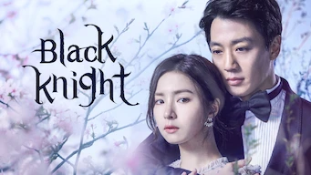

title: Accueil

#Accueil

##Derniers vus

Affiche|Information
:---:|:---
 :material-netflix:{ .rouge } ATTENTION ! - Dernier jour sur Netflix le 30/06/2021|Série : **School 2017 / 학교 2017** Origine: **Corée du Sud** Note: :material-star:{.gold }:material-star:{.gold }:material-star:{.gold }:material-star-half-full:{.gold .heart}:material-star:{.grey } Sortie en **2017** Nb. épisodes: **16** :kr: sous-titres en coréens  _Assez bon scénario, très teenage, quelques bonnes surprises, la fin laisse à désirer._
 :material-netflix:{ .rouge } ATTENTION ! - Dernier jour sur Netflix le 30/06/2021|Série : **Black Knight: The Man Who Guards Me / 흑기사** Origine: **Corée du Sud** Note: :material-star:{.gold }:material-star:{.gold }:material-star:{.gold }:material-star-half-full:{.gold .heart}:material-star:{.grey } Sortie en **2018** Nb. épisodes: **20** :kr: sous-titres en coréens  _L'histoire avait pas mal de potentiel mais elle n'a pas tenu toutes ses promesses; des longueurs dans le traitement._
 |Série : **Les 100** Origine: **Etats-Unis** Note: :material-star:{.gold }:material-star:{.gold }:material-star-half-full:{.gold .heart}:material-star:{.grey }:material-star:{.grey } Sortie en **2020** Nb. épisodes: **100**  _saison 1-4: Note de 4 saison 5-7: Note de 1 Futuriste, apocalypse, plutôt bien imaginé au début avec une remise en cause du système. Surtout bien pendant les 4 premières saisons, très null après !_
 |Série : **Rugal / 루갈** Origine: **Corée du Sud** Note: :material-star-half-full:{.gold .heart}:material-star:{.grey }:material-star:{.grey }:material-star:{.grey }:material-star:{.grey } Sortie en **2020** Nb. épisodes: **16**  _Violence gratuite, trop prévisible, les personnage sont plus stupides les uns que les autres, scénario inconsistant : les super-héros les plus bêtes de l'histoire (coréenne)._
 |Série : **Black / 블랙** Origine: **Corée du Sud** Note: :material-star:{.gold }:material-star:{.gold .heart}:material-star:{.grey }:material-star:{.grey }:material-star:{.grey } Sortie en **2017** Nb. épisodes: **18**  _Scénario très moyen, grosses ficelles, énormément de répétition, l'intrigue à tiroirs est trop tordue._
 :material-netflix:{ .rouge }Retiré de Netflix le 16/06/2021|Film : **Dernier train pour Busan / 부상행** Origine: **Corée du Sud** Note: :material-star:{.gold }:material-star:{.gold }:material-star:{.gold .heart}:material-star:{.grey }:material-star:{.grey } Sortie en **2016**  _Très bien fait pour les amateurs du genre mort-vivant, très bonne pub pour le TGV._
 |Série : **What Happens to My Family? / 가족끼리 왜이래** Origine: **Corée du Sud** Note: :material-star:{.gold }:material-star:{.gold }:material-star:{.gold .heart}:material-star:{.grey }:material-star:{.grey } Sortie en **2014** Nb. épisodes: **53**  _Très théatralisé, scénario classique mais de bonne facture, un peu long sur la fin._
 |Série : **Arthdal Chronicles** Origine: **Corée du Sud** Note: :material-star:{.gold }:material-star:{.gold }:material-star:{.gold }:material-star:{.gold .heart}:material-star:{.grey } Sortie en **2019** Nb. épisodes: **18**  _Très bon jeu de pouvoir dans un âge de bronze réinventé. En attente de la saison 2._
 |Série : **K-Pop: L'Ultime Audition / K-팝: 최강 서바이벌** Origine: **Corée du Sud** Note: :material-star:{.gold }:material-star:{.gold .heart}:material-star:{.grey }:material-star:{.grey }:material-star:{.grey } Sortie en **2012** Nb. épisodes: **14** :kr: sous-titres en coréens  _Autre tritre: "K-pop extreme survival" Trop basique, passé de mode et surtout la fin a été bâclé._
 |Série : **Vincenzo / 빈센조** Origine: **Corée du Sud** Note: :material-star:{.gold }:material-star:{.gold }:material-star:{.gold }:material-star:{.gold .heart}:material-star:{.grey } Sortie en **2021** Nb. épisodes: **20** :kr: sous-titres en coréens  _Très bien même si parfois cela prône la violence gratuite. Bon scénario._

##En cours...

Affiche|Information
:---:|:---
 |Série : **Color of Woman / 컬러 오브 우먼** Origine: **Corée du Sud** Sortie en **2012** Nb. épisodes: **20** :kr: sous-titres en coréens  _Un peu désuet, basé sur les quiproquo ..._
 |Série : **Dear My Friends** Origine: **Corée du Sud** Sortie en **2016** Nb. épisodes: **16**  _Pour l'instant, n'a pas vraiment démarrer (ép. 1)_
 :material-netflix:{ .rouge } ATTENTION ! - Dernier jour sur Netflix le 30/06/2021|Série : **Fight for My Way** Origine: **Corée du Sud** Sortie en **2017** Nb. épisodes: **16** :kr: sous-titres en coréens  _paraît très bien mais compliqué, pars un peu dans tous les sens, difficile à suivre_
 :material-netflix:{ .rouge } ATTENTION ! - Dernier jour sur Netflix le 30/06/2021|Série : **Hit The Top / 최고의 한방** Origine: **Corée du Sud** Sortie en **2017** Nb. épisodes: **16** :kr: sous-titres en coréens  _Bon scénario, cela s'enchaîne bien, les acteurs sont bons, les situatons crédibles, ..._
 :material-netflix:{ .rouge } ATTENTION ! - Dernier jour sur Netflix le 11/07/2021|Emission : **Hyori's Bed & Breakfast / 효리네 민박 2** Origine: **Corée du Sud** Sortie en **2018** Nb. épisodes: **30**  _série a commencé_
 |Série : **Le Jardin Céleste** Origine: **Corée du Sud** Sortie en **2011** Nb. épisodes: **30** :kr: sous-titres en coréens  _Autre titre : "Heaven's Garden" Semble pas mal... plutôt orienté vie à la campagne pour l'instant_
 :material-netflix:{ .rouge } ATTENTION ! - Dernier jour sur Netflix le 30/06/2021|Série : **Radio Romance** Origine: **Corée du Sud** Sortie en **2018** Nb. épisodes: **16** :kr: sous-titres en coréens  _Un scénario sur le monde de la radio et le star-system Coréen. Pour l'instant de très bonne facture !_
 |Série : **Reunited Worlds / 다시 만난 세계** Origine: **Corée du Sud** Sortie en **2017** Nb. épisodes: **20**  _Parfois un peu trop téléphoné, mais quelques bonnes surprises... On va voir où on va être emmené._

##Top 10

Affiche|Information
:---:|:---
 |Palmarès: :material-numeric-1-circle:{.num_gold} Série : **Something in the Rain** Origine: **Corée du Sud** Note: :material-star:{.gold }:material-star:{.gold }:material-star:{.gold }:material-star:{.gold }:material-star:{.gold .heart} Sortie en **2018** Nb. épisodes: **16**  _Excellent, aborde à la fois le monde du travail et un des tabous de la société coréenne._
 |Palmarès: :material-numeric-2-circle:{.num_silver} Série : **It's Okay to Not Be Okay** Origine: **Corée du Sud** Note: :material-star:{.gold }:material-star:{.gold }:material-star:{.gold }:material-star:{.gold }:material-star:{.gold .heart} Sortie en **2020** Nb. épisodes: **16** :kr: sous-titres en coréens  _Bizarre au premier abord, on tombe vite sous le charme des personnages._
 |Palmarès: :material-numeric-3-circle:{.num_copper} Série : **Crash Landing on You** Origine: **Corée du Sud** Note: :material-star:{.gold }:material-star:{.gold }:material-star:{.gold }:material-star:{.gold }:material-star:{.gold .heart} Sortie en **2019** Nb. épisodes: **16** :kr: sous-titres en coréens  _Très bon scénario, les acteurs sont excellents et la réalisation paufinée. Ca mériterait une saison 2 !_
 |Palmarès: :material-numeric-4-circle: Série : **My Mister** Origine: **Corée du Sud** Note: :material-star:{.gold }:material-star:{.gold }:material-star:{.gold }:material-star:{.gold }:material-star:{.gold .heart} Sortie en **2018** Nb. épisodes: **16**  _Comment ne pas tomber sous le charme de IU ! On a envie que la série ne s'arrête jamais._
 |Palmarès: :material-numeric-5-circle: Série : **One Spring Night** Origine: **Corée du Sud** Note: :material-star:{.gold }:material-star:{.gold }:material-star:{.gold }:material-star:{.gold }:material-star:{.gold .heart} Sortie en **2019** Nb. épisodes: **16** :kr: sous-titres en coréens  _Excellent, bonne description de la société coréennes et de ses travers._
 |Palmarès: :material-numeric-6-circle: Série : **My Secret Terrius** Origine: **Corée du Sud** Note: :material-star:{.gold }:material-star:{.gold }:material-star:{.gold }:material-star:{.gold }:material-star:{.gold .heart} Sortie en **2018** Nb. épisodes: **16**  _Très bon scénario d'espionnage, les acteurs sont impeccables._
 |Palmarès: :material-numeric-7-circle: Série : **Pinocchio** Origine: **Corée du Sud** Note: :material-star:{.gold }:material-star:{.gold }:material-star:{.gold }:material-star:{.gold }:material-star:{.gold .heart} Sortie en **2014** Nb. épisodes: **20**  _Bon scénario sur les journalistes en Corée, même s'il faut quelques épisodes de description avant son démarrage._
 |Palmarès: :material-numeric-8-circle: Série : **Misaeng** Origine: **Corée du Sud** Note: :material-star:{.gold }:material-star:{.gold }:material-star:{.gold }:material-star:{.gold }:material-star:{.gold .heart} Sortie en **2014** Nb. épisodes: **20** :kr: sous-titres en coréens  _La vie en entreprise en Corée. Très bon scénario, nombreuses situations intéressantes._
 |Palmarès: :material-numeric-9-circle: Série : **Designated Survivor: 60 Days** Origine: **Corée du Sud** Note: :material-star:{.gold }:material-star:{.gold }:material-star:{.gold }:material-star:{.gold }:material-star:{.gold .heart} Sortie en **2019** Nb. épisodes: **16** :kr: sous-titres en coréens  _Bien plus intéressant que la version américaine, le contexte politique de la Corée du sud est bien plus crédible._
 |Palmarès: :material-numeric-10-circle: Série : **VIP** Origine: **Corée du Sud** Note: :material-star:{.gold }:material-star:{.gold }:material-star:{.gold }:material-star:{.gold }:material-star:{.gold .heart} Sortie en **2019** Nb. épisodes: **16**  _Pas mal de surprise au fur et à mesure des épisodes. Pour une fois, les relations sont plus réalistes, rare dans le genre K-Drama._
