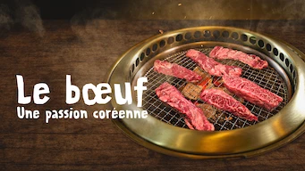

title: Accueil

# Accueil

## Derniers vus

Affiche|Information
:---:|:---
 |Série : **Le jeu de la dame** Origine: **Etats-Unis** Note: :material-star:{.gold .heart}:material-star:{.gold .heart}:material-star:{.gold .heart}:material-star-outline:{.grey }:material-star-outline:{.grey } Sortie en **2020** Nb. épisodes: **7**  _Mini-série sur une joueuse d'echecs américaine, totalement fictive issu d'un roman._
 |Série : **La Débutante de la ruelle / 편의점 샛별이** Origine: **Corée du Sud** Note: :material-star:{.gold .heart}:material-star:{.gold .heart}:material-star:{.gold .heart}:material-star:{.gold .heart}:material-star-outline:{.grey } Sortie en **2020** Nb. épisodes: **16**  _Le scénario de la série semble hésiter entre comique et romantisme, sans réellement basculer dans l'un ou l'autre. C'est la faiblesse de cette série au scénario néanmoins bien ficelé._
 |Série : **Forecasting Love and Weather / 기상청 사람들** Origine: **Corée du Sud** Note: :material-star:{.gold .heart}:material-star:{.gold .heart}:material-star:{.gold .heart}:material-star-outline:{.grey }:material-star-outline:{.grey } Sortie en **2022** Nb. épisodes: **16** :kr: sous-titres en coréens  _Cette série ne tient pas ses promesses, non seulement le couple principal est peu crédible mais aussi l'aspect météo n'est pas assez approfondie. On reste sur sa faim._
 |Film : **Let's Dance** Origine: **France** Note: :material-star:{.gold .heart}:material-star:{.gold .heart}:material-star-half-full:{.gold .heart}:material-star-outline:{.grey }:material-star-outline:{.grey } Sortie en **2019**  _Il y a des idées mais le scénario est un peu trop basique._
 |Film : **Carter / 카터** Origine: **Corée du Sud** Note: :material-star:{.gold .heart}:material-star-half-full:{.gold .heart}:material-star-outline:{.grey }:material-star-outline:{.grey }:material-star-outline:{.grey } Sortie en **2022** :kr: sous-titres en coréens  _Course poursuite sans fin et sans intérêt, la façon dont c'est filmé rend le film difficile à regarder. Surenchère dans les combats, abus de scène avec des câbles, abus de destruction en ton genre... que cela en devient ridicule et rend le résultat au final peu intéressant. Le bon scénario aurait mérité une meilleure réalisation moins surchargée._
 |Série : **Dali et le prince arrogant / Dali & Cocky Prince / 달리와 감자탕** Origine: **Corée du Sud** Note: :material-star:{.gold .heart}:material-star:{.gold .heart}:material-star:{.gold .heart}:material-star:{.gold .heart}:material-star-half-full:{.gold .heart} Sortie en **2021** Nb. épisodes: **16**  _L'intrigue est bonne, les acteurs excellents, la réalisation cohérente : que demander de plus._
 |Série : **Police University / 경찰수업** Origine: **Corée du Sud** Note: :material-star:{.gold .heart}:material-star:{.gold .heart}:material-star:{.gold .heart}:material-star:{.gold .heart}:material-star-outline:{.grey } Sortie en **2021** Nb. épisodes: **16**  _L'intrigue est un peu légère, mais cela est agréable à regarder._
 |Film : **The Old Guard** Origine: **Etats-Unis** Note: :material-star:{.gold .heart}:material-star:{.gold .heart}:material-star:{.gold .heart}:material-star-outline:{.grey }:material-star-outline:{.grey } Sortie en **2020**  _Une idée originale, mais un scénario à l'américaine toujours aussi pauvre._
 |Série : **Tomorrow / 내일** Origine: **Corée du Sud** Note: :material-star:{.gold .heart}:material-star:{.gold .heart}:material-star-half-full:{.gold .heart}:material-star-outline:{.grey }:material-star-outline:{.grey } Sortie en **2022** Nb. épisodes: **16** :kr: sous-titres en coréens  _Brigrade anti-suicide, ou presque; original, mais les scénarios ne sont pas très bons ou mal exploités._
 |Série : **Le bœuf : Une passion coréenne / 한우 랩소디** Origine: **Corée du Sud** Note: :material-star:{.gold .heart}:material-star:{.gold .heart}:material-star:{.gold .heart}:material-star-outline:{.grey }:material-star-outline:{.grey } Sortie en **2021** Nb. épisodes: **2** :kr: sous-titres en coréens  _Pour les amateurs de bonne chair, avec un passage un peu historique intéressant._

## En cours...

Affiche|Information
:---:|:---
 |Documentaire : **La Soupe coréenne : Une culture en ébullition** Origine: **Corée du Sud** Sortie en **2022** Nb. épisodes: **3** :kr: sous-titres en coréens  _Intéressant vis-à-vis de la culture culinaire coréenne._
 |Documentaire : **Les nouilles : Une passion coréenne / 냉면 랩소디** Origine: **Corée du Sud** Sortie en **2021** Nb. épisodes: **2** :kr: sous-titres en coréens  _Intéressant vis-à-vis de la culture culinaire coréenne._
 |Documentaire : **The Reservoir Game** Origine: **Corée du Sud** Sortie en **2017** Nb. épisodes: **1**  _Enquête sur la corruption en Corée du Sud._
 |Série : **Kleo** Origine: **Allemagne** Sortie en **2022** Nb. épisodes: **8**  _Les aventures d'une espionne est-allemande, plus relevé et bien fait._
 |Série : **Bad Guys: Vile City / 나쁜녀석들, 악의도시** Origine: **Corée du Sud** Sortie en **2018** Nb. épisodes: **16**  _Série trop axé sur les combats, combats eux-mêmes totalement surréalistes, l'ensemble est plutôt mal fait et cela fait un ensemble brouillon._
 |Série : **Dear My Friends** Origine: **Corée du Sud** Sortie en **2016** Nb. épisodes: **16**  _Pour l'instant, ça démarre lentement ..._
 |Série : **Extraordinary Attorney Woo / 이상한 변호사 우영우** Origine: **Corée du Sud** Sortie en **2022** Nb. épisodes: **16** :kr: sous-titres en coréens  _Autiste et avocate, thème de cette série très bien réalisée et jouée juste._
 |Série : **Oh My Baby / 오마이 베이비** Origine: **Corée du Sud** Sortie en **2020** Nb. épisodes: **16**  _Le thème est une cellibataire qui veut avoir un enfant à 40 ans. Ca comme bien, mais ça manque de rythme, le sujet reste trop léger._
 |Série : **Bienvenidos a Edén** Origine: **Espagne** Sortie en **2022** Nb. épisodes: **8**  _Un environnement bizarre et détonnant, à voir comment cela évolue au grès des épisodes... pour l'instant moins bon que Squid Game._

## Top 10

Affiche|Information
:---:|:---
 |Palmarès: :material-numeric-1-circle:{.num_gold} Série : **Something in the Rain / 밥 잘 사주는 예쁜 누나** Origine: **Corée du Sud** Note: :material-star:{.gold .heart}:material-star:{.gold .heart}:material-star:{.gold .heart}:material-star:{.gold .heart}:material-star:{.gold .heart} Sortie en **2018** Nb. épisodes: **16**  _Excellent, aborde à la fois le monde du travail et un des tabous de la société coréenne._
 |Palmarès: :material-numeric-2-circle:{.num_silver} Série : **It's Okay to Not Be Okay** Origine: **Corée du Sud** Note: :material-star:{.gold .heart}:material-star:{.gold .heart}:material-star:{.gold .heart}:material-star:{.gold .heart}:material-star:{.gold .heart} Sortie en **2020** Nb. épisodes: **16** :kr: sous-titres en coréens  _Bizarre au premier abord, on tombe vite sous le charme des personnages._
 |Palmarès: :material-numeric-3-circle:{.num_copper} Série : **Crash Landing on You** Origine: **Corée du Sud** Note: :material-star:{.gold .heart}:material-star:{.gold .heart}:material-star:{.gold .heart}:material-star:{.gold .heart}:material-star:{.gold .heart} Sortie en **2019** Nb. épisodes: **16** :kr: sous-titres en coréens  _Très bon scénario, les acteurs sont excellents et la réalisation paufinée. Ca mériterait une saison 2 !_
 |Palmarès: :material-numeric-4-circle: Série : **My Mister** Origine: **Corée du Sud** Note: :material-star:{.gold .heart}:material-star:{.gold .heart}:material-star:{.gold .heart}:material-star:{.gold .heart}:material-star:{.gold .heart} Sortie en **2018** Nb. épisodes: **16**  _Comment ne pas tomber sous le charme de IU ! On a envie que la série ne s'arrête jamais._
 |Palmarès: :material-numeric-5-circle: Série : **One Spring Night** Origine: **Corée du Sud** Note: :material-star:{.gold .heart}:material-star:{.gold .heart}:material-star:{.gold .heart}:material-star:{.gold .heart}:material-star:{.gold .heart} Sortie en **2019** Nb. épisodes: **16** :kr: sous-titres en coréens  _Excellent, bonne description de la société coréennes et de certains de ses travers._
 |Palmarès: :material-numeric-6-circle: Série : **My Secret Terrius** Origine: **Corée du Sud** Note: :material-star:{.gold .heart}:material-star:{.gold .heart}:material-star:{.gold .heart}:material-star:{.gold .heart}:material-star:{.gold .heart} Sortie en **2018** Nb. épisodes: **16**  _Très bon scénario d'espionnage, les acteurs sont impeccables._
 |Palmarès: :material-numeric-7-circle: Série : **Pinocchio** Origine: **Corée du Sud** Note: :material-star:{.gold .heart}:material-star:{.gold .heart}:material-star:{.gold .heart}:material-star:{.gold .heart}:material-star:{.gold .heart} Sortie en **2014** Nb. épisodes: **20**  _Bon scénario sur les journalistes en Corée, même s'il faut quelques épisodes de description avant son démarrage._
 |Palmarès: :material-numeric-8-circle: Série : **Misaeng** Origine: **Corée du Sud** Note: :material-star:{.gold .heart}:material-star:{.gold .heart}:material-star:{.gold .heart}:material-star:{.gold .heart}:material-star:{.gold .heart} Sortie en **2014** Nb. épisodes: **20** :kr: sous-titres en coréens  _La vie en entreprise en Corée. Très bon scénario, nombreuses situations intéressantes._
 |Palmarès: :material-numeric-9-circle: Série : **Love, Marriage and Divorce / 결혼작사 이혼작곡** Origine: **Corée du Sud** Note: :material-star:{.gold .heart}:material-star:{.gold .heart}:material-star:{.gold .heart}:material-star:{.gold .heart}:material-star:{.gold .heart} Sortie en **2021** Nb. épisodes: **32** :kr: sous-titres en coréens  _Un excellent scénario sur les relations homme-femme, avec de nombreux cas de figure mais toujours très juste._
 |Palmarès: :material-numeric-10-circle: Série : **Designated Survivor: 60 Days** Origine: **Corée du Sud** Note: :material-star:{.gold .heart}:material-star:{.gold .heart}:material-star:{.gold .heart}:material-star:{.gold .heart}:material-star:{.gold .heart} Sortie en **2019** Nb. épisodes: **16** :kr: sous-titres en coréens  _Bien plus intéressant que la version américaine, le contexte politique de la Corée du sud est bien plus crédible._
