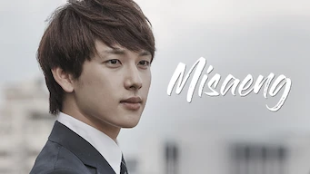

title: Accueil

# Accueil

## Derniers vus

Affiche|Information
:---:|:---
 |Série : **The Journalist** Origine: **Japon** Note: :material-star:{.gold }:material-star:{.gold }:material-star:{.gold .heart}:material-star:{.grey }:material-star:{.grey } Sortie en **2022** Nb. épisodes: **6**  _Sombre, relativement lent, plutôt psychologique, cette série décrit un monde politique complexe et sans concession._
 |Film : **The Fable / The Fable: The Killer Who Doesn't Kill** Origine: **Japon** Note: :material-star:{.gold }:material-star:{.gold }:material-star:{.gold .heart}:material-star:{.grey }:material-star:{.grey } Sortie en **2021**  _Suite du premier film, assez bien fait, et les combats sont moins surréalistes (ou alors on s'y habitue)._
 |Série : **My Only One / 하나뿐인 내편** Origine: **Corée du Sud** Note: :material-star:{.gold }:material-star:{.gold }:material-star:{.gold }:material-star-half-full:{.gold .heart}:material-star:{.grey } Sortie en **2018** Nb. épisodes: **53**  _Série avec comme thème principal la difficile vie d'une personne reconnue coupable et les aléas qui vont avec, bien réalisé dans l'ensemble avec quelques aspects un peu théâtrale, et certaines répétitions en trop._
 |Film : **Par la voix des airs / Wish You / 위시유** Origine: **Corée du Sud** Note: :material-star:{.gold }:material-star:{.gold }:material-star:{.gold .heart}:material-star:{.grey }:material-star:{.grey } Sortie en **2021** :kr: sous-titres en coréens  _Film sur fond d'histoire un peu LGBT dans le monde de la musique, plutôt bien réalisé, même les personnages secondaires sont aussi intéressants._
 |Série : **Hometown Cha-Cha-Cha / 갯마을 차차차** Origine: **Corée du Sud** Note: :material-star:{.gold }:material-star:{.gold }:material-star:{.gold }:material-star:{.gold .heart}:material-star:{.grey } Sortie en **2021** Nb. épisodes: **16** :kr: sous-titres en coréens  _La vie en bord de mer. La série commence bien mais traîne un peu en longueur sur la fin, avec pas mal de placement de produit._
 |Série : **Inspector Koo / 구경이** Origine: **Corée du Sud** Note: :material-star:{.gold }:material-star:{.gold }:material-star:{.gold }:material-star:{.gold }:material-star-half-full:{.gold .heart} Sortie en **2021** Nb. épisodes: **12**  _Très bon policier, très relevé, de très bonnes intrigues, un environnement burlesque, seules certaines situations sont un peu prévisibles._
 |Série : **To All the Guys who Loved Me / 그놈이 그놈이다** Origine: **Corée du Sud** Note: :material-star:{.gold }:material-star:{.gold }:material-star:{.gold }:material-star-half-full:{.gold .heart}:material-star:{.grey } Sortie en **2020** Nb. épisodes: **16**  _Trop de situations orientées, trop de coïncidences, dommage la série aurait dû être mieux traitée, le scénario n'est pas assez peaufiné._
 :material-netflix:{ .rouge }Retiré de Netflix le 31/01/2022|Série : **Extraordinary You / 어쩌다 발견한 하루** Origine: **Corée du Sud** Note: :material-star:{.gold }:material-star-half-full:{.gold .heart}:material-star:{.grey }:material-star:{.grey }:material-star:{.grey } Sortie en **2019** Nb. épisodes: **16**  _Quand le webtoon part en vrille; une idée originale mais au finale décevante, et même par moment ennuyante, on a du mal à se passionner pour cette histoire. Assez désagréable à regarder._
 |Film : **Svaha: The Sixth Finger / 사바하** Origine: **Corée du Sud** Note: :material-star:{.gold }:material-star:{.gold }:material-star:{.gold .heart}:material-star:{.grey }:material-star:{.grey } Sortie en **2019**  _Film à suspense avec religion et des mots, bizarre et intéressant à la fois._
 :material-netflix:{ .rouge }Retiré de Netflix le 31/01/2022|Série : **The Third Charm / 제 3의 매력** Origine: **Corée du Sud** Note: :material-star:{.gold }:material-star:{.gold .heart}:material-star:{.grey }:material-star:{.grey }:material-star:{.grey } Sortie en **2018** Nb. épisodes: **16**  _Pseudo histoire d'amour de deux personnages qui ne s'aiment pas avec pas mal de lenteur sur la deuxième partie. Les rôles secondaires sont plus intéressants._

## En cours...

Affiche|Information
:---:|:---
 |Série : **Dear My Friends** Origine: **Corée du Sud** Sortie en **2016** Nb. épisodes: **16**  _Pour l'instant, n'a pas vraiment démarrer après un épisode ..._
 |Série : **Do You Like Brahms? / 브람스를 좋아하세요?** Origine: **Corée du Sud** Sortie en **2020** Nb. épisodes: **16**  _nan_
 |Série : **The King's Affection / 연모** Origine: **Corée du Sud** Sortie en **2021** Nb. épisodes: **20** :kr: sous-titres en coréens  _nan_
 |Série : **Lucifer** Origine: **Etats-Unis** Sortie en **2020** Nb. épisodes: **83**  _Le diable ... Bons premiers épisodes, mais le concept s'use au fur et à mesure._

## Top 10

Affiche|Information
:---:|:---
 |Palmarès: :material-numeric-1-circle:{.num_gold} Série : **Something in the Rain / 밥 잘 사주는 예쁜 누나** Origine: **Corée du Sud** Note: :material-star:{.gold }:material-star:{.gold }:material-star:{.gold }:material-star:{.gold }:material-star:{.gold .heart} Sortie en **2018** Nb. épisodes: **16**  _Excellent, aborde à la fois le monde du travail et un des tabous de la société coréenne._
 |Palmarès: :material-numeric-2-circle:{.num_silver} Série : **It's Okay to Not Be Okay** Origine: **Corée du Sud** Note: :material-star:{.gold }:material-star:{.gold }:material-star:{.gold }:material-star:{.gold }:material-star:{.gold .heart} Sortie en **2020** Nb. épisodes: **16** :kr: sous-titres en coréens  _Bizarre au premier abord, on tombe vite sous le charme des personnages._
 |Palmarès: :material-numeric-3-circle:{.num_copper} Série : **Crash Landing on You** Origine: **Corée du Sud** Note: :material-star:{.gold }:material-star:{.gold }:material-star:{.gold }:material-star:{.gold }:material-star:{.gold .heart} Sortie en **2019** Nb. épisodes: **16** :kr: sous-titres en coréens  _Très bon scénario, les acteurs sont excellents et la réalisation paufinée. Ca mériterait une saison 2 !_
 |Palmarès: :material-numeric-4-circle: Série : **My Mister** Origine: **Corée du Sud** Note: :material-star:{.gold }:material-star:{.gold }:material-star:{.gold }:material-star:{.gold }:material-star:{.gold .heart} Sortie en **2018** Nb. épisodes: **16**  _Comment ne pas tomber sous le charme de IU ! On a envie que la série ne s'arrête jamais._
 |Palmarès: :material-numeric-5-circle: Série : **One Spring Night** Origine: **Corée du Sud** Note: :material-star:{.gold }:material-star:{.gold }:material-star:{.gold }:material-star:{.gold }:material-star:{.gold .heart} Sortie en **2019** Nb. épisodes: **16** :kr: sous-titres en coréens  _Excellent, bonne description de la société coréennes et de certains de ses travers._
 |Palmarès: :material-numeric-6-circle: Série : **My Secret Terrius** Origine: **Corée du Sud** Note: :material-star:{.gold }:material-star:{.gold }:material-star:{.gold }:material-star:{.gold }:material-star:{.gold .heart} Sortie en **2018** Nb. épisodes: **16**  _Très bon scénario d'espionnage, les acteurs sont impeccables._
 |Palmarès: :material-numeric-7-circle: Série : **Pinocchio** Origine: **Corée du Sud** Note: :material-star:{.gold }:material-star:{.gold }:material-star:{.gold }:material-star:{.gold }:material-star:{.gold .heart} Sortie en **2014** Nb. épisodes: **20**  _Bon scénario sur les journalistes en Corée, même s'il faut quelques épisodes de description avant son démarrage._
 |Palmarès: :material-numeric-8-circle: Série : **Misaeng** Origine: **Corée du Sud** Note: :material-star:{.gold }:material-star:{.gold }:material-star:{.gold }:material-star:{.gold }:material-star:{.gold .heart} Sortie en **2014** Nb. épisodes: **20** :kr: sous-titres en coréens  _La vie en entreprise en Corée. Très bon scénario, nombreuses situations intéressantes._
 |Palmarès: :material-numeric-9-circle: Série : **Love, Marriage and Divorce / 결혼작사 이혼작곡** Origine: **Corée du Sud** Note: :material-star:{.gold }:material-star:{.gold }:material-star:{.gold }:material-star:{.gold }:material-star:{.gold .heart} Sortie en **2021** Nb. épisodes: **32** :kr: sous-titres en coréens  _Un excellent scénario sur les relations homme-femme, avec de nombreux cas de figure mais toujours très juste._
 |Palmarès: :material-numeric-10-circle: Série : **Designated Survivor: 60 Days** Origine: **Corée du Sud** Note: :material-star:{.gold }:material-star:{.gold }:material-star:{.gold }:material-star:{.gold }:material-star:{.gold .heart} Sortie en **2019** Nb. épisodes: **16** :kr: sous-titres en coréens  _Bien plus intéressant que la version américaine, le contexte politique de la Corée du sud est bien plus crédible._
