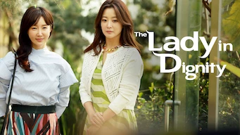
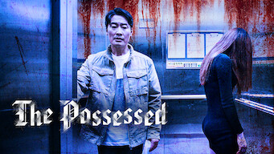

title: Accueil

# Accueil

## Derniers vus

Affiche|Information
:---:|:---
 |Série : **Poldark** Origine: **Royaume-Uni** Note: :material-star:{.gold .heart}:material-star:{.gold .heart}:material-star-half-full:{.gold .heart}:material-star-outline:{.grey }:material-star-outline:{.grey } Sortie en **2019** Nb. épisodes: **43**  _Série ayant lieu en Angleterre au moment de la Révolution française; les décors de la Cornouaille sont pas mal, mais les intrigues auraient dû être plus poussées._
 |Série : **My Runway / 마이 런웨이** Origine: **Corée du Sud** Note: :material-star:{.gold .heart}:material-star:{.gold .heart}:material-star:{.gold .heart}:material-star:{.gold .heart}:material-star-outline:{.grey } Sortie en **2016** Nb. épisodes: **6** :kr: sous-titres en coréens  _Micro-série dans le monde de la mode, avec un côté science-fiction bien exploité mais déjà vu._
 |Série : **The Lady in Dignity / 품위있는 그녀** Origine: **Corée du Sud** Note: :material-star:{.gold .heart}:material-star:{.gold .heart}:material-star:{.gold .heart}:material-star:{.gold .heart}:material-star-half-full:{.gold .heart} Sortie en **2017** Nb. épisodes: **20** :kr: sous-titres en coréens  _Excellente série sur la manipulation et les déboires que cela provoque sur une famille. Il est dommage que la chronologie des événements ne soit pas respectée, rendant inintéressante certaines scènes._
 |Série : **The Possessed / 도시괴담** Origine: **Corée du Sud** Note: :material-star:{.gold .heart}:material-star:{.gold .heart}:material-star:{.gold .heart}:material-star-outline:{.grey }:material-star-outline:{.grey } Sortie en **2020** Nb. épisodes: **8** :kr: sous-titres en coréens  _Micro-série d'épouvante, pour les amateurs du genre, plutôt bien réalisé._
 |Série : **Oats Studios : Courts-métrages** Origine: **Canada** Note: :material-star-half-full:{.gold .heart}:material-star-outline:{.grey }:material-star-outline:{.grey }:material-star-outline:{.grey }:material-star-outline:{.grey } Sortie en **2020** Nb. épisodes: **10**  _Des courts-métrages sans queue ni tête._
 |Série : **Le professeur du Cauchemar / 악몽 선생** Origine: **Corée du Sud** Note: :material-star:{.gold .heart}:material-star:{.gold .heart}:material-star-half-full:{.gold .heart}:material-star-outline:{.grey }:material-star-outline:{.grey } Sortie en **2016** Nb. épisodes: **12** :kr: sous-titres en coréens  _Micro série fantastique racontant les rêves des étudiants, rêves devenant des cauchemars._
 |Série : **Bad Banks** Origine: **Allemagne** Note: :material-star:{.gold .heart}:material-star:{.gold .heart}:material-star:{.gold .heart}:material-star-outline:{.grey }:material-star-outline:{.grey } Sortie en **2020** Nb. épisodes: **12**  _Le monde de la finance européenne avec ces magouilles et autres joyeusetés de ce type._
 :material-netflix:{ .rouge }Retiré de Netflix le 14/05/2022|Série : **Strangers From Hell / 타인은 지옥이다** Origine: **Corée du Sud** Note: :material-star:{.gold .heart}:material-star-half-full:{.gold .heart}:material-star-outline:{.grey }:material-star-outline:{.grey }:material-star-outline:{.grey } Sortie en **2019** Nb. épisodes: **10**  _Série policière très sombre, très macabre, avec une ambiance particulièrement pesante._
 |Série : **Taxi Driver / 모범택시** Origine: **Corée du Sud** Note: :material-star:{.gold .heart}:material-star:{.gold .heart}:material-star:{.gold .heart}:material-star-half-full:{.gold .heart}:material-star-outline:{.grey } Sortie en **2021** Nb. épisodes: **16**  _Ce n'est pas la finesse qui dominent dans cette série, prétexte à des combats souvent surdimensionnés; il aurait mérité un traitement plus réaliste et plus subtil, la thématique étant plutôt intéressante._
 |Série : **Hotel Del Luna / 호텔 델루나** Origine: **Corée du Sud** Note: :material-star:{.gold .heart}:material-star:{.gold .heart}:material-star:{.gold .heart}:material-star-half-full:{.gold .heart}:material-star-outline:{.grey } Sortie en **2019** Nb. épisodes: **16**  _Un hôtel, après la vie, avec différentes histoires autour des personnages; de très bons effets spéciaux mais parfois un faux rythme qui temporise un peu trop et casse le rythme._

## En cours...

Affiche|Information
:---:|:---
 |Documentaire : **Le porc : Une passion coréenne / 삼겹살 랩소디** Origine: **Corée du Sud** Sortie en **2020** Nb. épisodes: **2** :kr: sous-titres en coréens  _Documentaire sur la cuisine coréenne._
 |Série : **De bende van Jan de Lichte / Bandits des bois** Origine: **Belgique** Sortie en **2019** Nb. épisodes: **10**  _Une belle reconstitution de la Belgique du XVIIIe siècle autour des aventures d'une bande de brigrands._
 |Série : **Liver or Die / 왜그래 풍상씨** Origine: **Corée du Sud** Sortie en **2019** Nb. épisodes: **20**  _Le thème aurait pu être pas mal si les personnages n'étaient pas aussi crédules. Même les quiproquos ne sont pas très crédibles, cela donne un ensemble plus que moyen._

## Top 10

Affiche|Information
:---:|:---
 |Palmarès: :material-numeric-1-circle:{.num_gold} Série : **Something in the Rain / 밥 잘 사주는 예쁜 누나** Origine: **Corée du Sud** Note: :material-star:{.gold .heart}:material-star:{.gold .heart}:material-star:{.gold .heart}:material-star:{.gold .heart}:material-star:{.gold .heart} Sortie en **2018** Nb. épisodes: **16**  _Excellent, aborde à la fois le monde du travail et un des tabous de la société coréenne._
 |Palmarès: :material-numeric-2-circle:{.num_silver} Série : **It's Okay to Not Be Okay** Origine: **Corée du Sud** Note: :material-star:{.gold .heart}:material-star:{.gold .heart}:material-star:{.gold .heart}:material-star:{.gold .heart}:material-star:{.gold .heart} Sortie en **2020** Nb. épisodes: **16** :kr: sous-titres en coréens  _Bizarre au premier abord, on tombe vite sous le charme des personnages._
 |Palmarès: :material-numeric-3-circle:{.num_copper} Série : **Crash Landing on You** Origine: **Corée du Sud** Note: :material-star:{.gold .heart}:material-star:{.gold .heart}:material-star:{.gold .heart}:material-star:{.gold .heart}:material-star:{.gold .heart} Sortie en **2019** Nb. épisodes: **16** :kr: sous-titres en coréens  _Très bon scénario, les acteurs sont excellents et la réalisation paufinée. Ca mériterait une saison 2 !_
 |Palmarès: :material-numeric-4-circle: Série : **My Mister** Origine: **Corée du Sud** Note: :material-star:{.gold .heart}:material-star:{.gold .heart}:material-star:{.gold .heart}:material-star:{.gold .heart}:material-star:{.gold .heart} Sortie en **2018** Nb. épisodes: **16**  _Comment ne pas tomber sous le charme de IU ! On a envie que la série ne s'arrête jamais._
 |Palmarès: :material-numeric-5-circle: Série : **One Spring Night** Origine: **Corée du Sud** Note: :material-star:{.gold .heart}:material-star:{.gold .heart}:material-star:{.gold .heart}:material-star:{.gold .heart}:material-star:{.gold .heart} Sortie en **2019** Nb. épisodes: **16** :kr: sous-titres en coréens  _Excellent, bonne description de la société coréennes et de certains de ses travers._
 |Palmarès: :material-numeric-6-circle: Série : **My Secret Terrius** Origine: **Corée du Sud** Note: :material-star:{.gold .heart}:material-star:{.gold .heart}:material-star:{.gold .heart}:material-star:{.gold .heart}:material-star:{.gold .heart} Sortie en **2018** Nb. épisodes: **16**  _Très bon scénario d'espionnage, les acteurs sont impeccables._
 |Palmarès: :material-numeric-7-circle: Série : **Pinocchio** Origine: **Corée du Sud** Note: :material-star:{.gold .heart}:material-star:{.gold .heart}:material-star:{.gold .heart}:material-star:{.gold .heart}:material-star:{.gold .heart} Sortie en **2014** Nb. épisodes: **20**  _Bon scénario sur les journalistes en Corée, même s'il faut quelques épisodes de description avant son démarrage._
 |Palmarès: :material-numeric-8-circle: Série : **Misaeng** Origine: **Corée du Sud** Note: :material-star:{.gold .heart}:material-star:{.gold .heart}:material-star:{.gold .heart}:material-star:{.gold .heart}:material-star:{.gold .heart} Sortie en **2014** Nb. épisodes: **20** :kr: sous-titres en coréens  _La vie en entreprise en Corée. Très bon scénario, nombreuses situations intéressantes._
 |Palmarès: :material-numeric-9-circle: Série : **Love, Marriage and Divorce / 결혼작사 이혼작곡** Origine: **Corée du Sud** Note: :material-star:{.gold .heart}:material-star:{.gold .heart}:material-star:{.gold .heart}:material-star:{.gold .heart}:material-star:{.gold .heart} Sortie en **2021** Nb. épisodes: **32** :kr: sous-titres en coréens  _Un excellent scénario sur les relations homme-femme, avec de nombreux cas de figure mais toujours très juste._
 |Palmarès: :material-numeric-10-circle: Série : **Designated Survivor: 60 Days** Origine: **Corée du Sud** Note: :material-star:{.gold .heart}:material-star:{.gold .heart}:material-star:{.gold .heart}:material-star:{.gold .heart}:material-star:{.gold .heart} Sortie en **2019** Nb. épisodes: **16** :kr: sous-titres en coréens  _Bien plus intéressant que la version américaine, le contexte politique de la Corée du sud est bien plus crédible._
