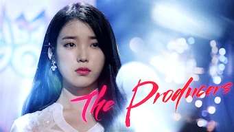

title: Accueil

#Accueil

##Derniers vus

Affiche|Information
:---:|:---
 :material-netflix:{ .rouge } ATTENTION ! - Dernier jour sur Netflix le 14/12/2021|Film : **Seoul Searching** Origine: **Corée du Sud** Note: :material-star:{.gold }:material-star:{.gold }:material-star:{.gold }:material-star:{.gold }:material-star-half-full:{.gold .heart} Sortie en **2015**  _Un film sur les Coréens expatriés suite à la guerre de Corée et sur une jeunesse qui revient chercher ses racines en Corée; très bien fait, aborde bien les problématiques de cette jeunesse expatriée._
 |Série : **Hello, Me! / 안녕? 나야! ** Origine: **Corée du Sud** Note: :material-star:{.gold }:material-star:{.gold }:material-star:{.gold }:material-star:{.gold }:material-star-half-full:{.gold .heart} Sortie en **2021** Nb. épisodes: **16** :kr: sous-titres en coréens  _Après un démarrage des plus normal, on bascule dans le fantastique. La série est bien construite, et c'est plutôt une réussite._
 :material-netflix:{ .rouge } ATTENTION ! - Dernier jour sur Netflix le 14/12/2021|Série : **Ice Fantasy / La Fantaisie de Glace** Origine: **Chine** Note: :material-star:{.gold }:material-star:{.gold .heart}:material-star:{.grey }:material-star:{.grey }:material-star:{.grey } Sortie en **2016** Nb. épisodes: **62**  _L'intérêt de l'histoire d'heroic fantasy et la qualité des acteurs s'effacent malheureusement devant un scénario et surtout un montage de piètre qualité._
 :material-netflix:{ .rouge } ATTENTION ! - Dernier jour sur Netflix le 14/12/2021|Série : **Heaven's Garden / Le Jardin Céleste / 곰배령** Origine: **Corée du Sud** Note: :material-star:{.gold }:material-star:{.gold }:material-star:{.gold }:material-star-half-full:{.gold .heart}:material-star:{.grey } Sortie en **2011** Nb. épisodes: **30** :kr: sous-titres en coréens  _La vie à la campagne est le fond de cette histoire, avec comme thème principal la famille. Plutôt bien fait avec quelques longueurs expliquant le nombre important d'épisodes._
 :material-netflix:{ .rouge } ATTENTION ! - Dernier jour sur Netflix le 14/12/2021|Série : **Googbye My Wife / Goodbye Dear Wife / 굿바이 마눌** Origine: **Corée du Sud** Note: :material-star:{.gold }:material-star:{.gold }:material-star:{.gold .heart}:material-star:{.grey }:material-star:{.grey } Sortie en **2012** Nb. épisodes: **20** :kr: sous-titres en coréens  _Ca a veillit, et si l'histoire est très bien, le script n'est pas très bon avec certaines longueurs, et certains personnages étant trop exubérants._
 |Série : **Strongest Deliveryman / 최강 배달꾼** Origine: **Corée du Sud** Note: :material-star:{.gold }:material-star:{.gold }:material-star:{.gold }:material-star-half-full:{.gold .heart}:material-star:{.grey } Sortie en **2017** Nb. épisodes: **16** :kr: sous-titres en coréens  _Le monde des livreurs à scooter, plutôt bien décrit avec quelques lourdeurs sur la durée, le scénario ayant quelques lacunes mais rien de méchant._
 |Série : **Peaky Blinders** Origine: **Royaume-Uni** Note: :material-star:{.gold }:material-star:{.gold }:material-star:{.gold .heart}:material-star:{.grey }:material-star:{.grey } Sortie en **2019** Nb. épisodes: **30**  _De la violence gratuite et quelques incohérences, mais les personnages sont plutôt pas mal ..._
 |Série : **Search WWW / 검색어를 입력하세요 www** Origine: **Corée du Sud** Note: :material-star:{.gold }:material-star:{.gold }:material-star:{.gold }:material-star-half-full:{.gold .heart}:material-star:{.grey } Sortie en **2019** Nb. épisodes: **16**  _L'histoire est bien mais la réalisation est trop lente, certaines scènes deviennent ennuyeuses à cause de leurs longueurs. Le travail dans la société digital est aussi peu crédible, même si l'environnement de travail, lui, est représentatif._
 |Série : **The Producers / 프로듀사** Origine: **Corée du Sud** Note: :material-star:{.gold }:material-star:{.gold }:material-star:{.gold .heart}:material-star:{.grey }:material-star:{.grey } Sortie en **2015** Nb. épisodes: **12**  _Série sur le thème des producteurs d'émissions à la télévision, avec au programme triangulaires amoureuses._
 |Film : **Along with the Gods: The Two Worlds / 신과함께: 죄와벌** Origine: **Corée du Sud** Note: :material-star:{.gold }:material-star:{.gold }:material-star:{.gold }:material-star-half-full:{.gold .heart}:material-star:{.grey } Sortie en **2017** :kr: sous-titres en coréens  _Les 7 jugements  en 49 jours après sa mort, un film avec énormément d'effets spéciaux._

##En cours...

Affiche|Information
:---:|:---
 |Série : **Dear My Friends** Origine: **Corée du Sud** Sortie en **2016** Nb. épisodes: **16**  _Pour l'instant, n'a pas vraiment démarrer après un épisode ..._
 |Série : **Hellbound** Origine: **Corée du Sud** Sortie en **2021** Nb. épisodes: **8**  _nan_
 |Série : **Love, Marriage and Divorce / 결혼작사 이혼작곡** Origine: **Corée du Sud** Sortie en **2021** Nb. épisodes: **32** :kr: sous-titres en coréens  _Pour la première saison, un excellent scénario sur les relations homme-femme, avec de nombreux cas de figure mais toujours très juste._
 |Série : **Tempted / 위대한 유혹자** Origine: **Corée du Sud** Sortie en **2018** Nb. épisodes: **16**  _nan_

##Top 10

Affiche|Information
:---:|:---
 |Palmarès: :material-numeric-1-circle:{.num_gold} Série : **Something in the Rain / 밥 잘 사주는 예쁜 누나** Origine: **Corée du Sud** Note: :material-star:{.gold }:material-star:{.gold }:material-star:{.gold }:material-star:{.gold }:material-star:{.gold .heart} Sortie en **2018** Nb. épisodes: **16**  _Excellent, aborde à la fois le monde du travail et un des tabous de la société coréenne._
 |Palmarès: :material-numeric-2-circle:{.num_silver} Série : **It's Okay to Not Be Okay** Origine: **Corée du Sud** Note: :material-star:{.gold }:material-star:{.gold }:material-star:{.gold }:material-star:{.gold }:material-star:{.gold .heart} Sortie en **2020** Nb. épisodes: **16** :kr: sous-titres en coréens  _Bizarre au premier abord, on tombe vite sous le charme des personnages._
 |Palmarès: :material-numeric-3-circle:{.num_copper} Série : **Crash Landing on You** Origine: **Corée du Sud** Note: :material-star:{.gold }:material-star:{.gold }:material-star:{.gold }:material-star:{.gold }:material-star:{.gold .heart} Sortie en **2019** Nb. épisodes: **16** :kr: sous-titres en coréens  _Très bon scénario, les acteurs sont excellents et la réalisation paufinée. Ca mériterait une saison 2 !_
 |Palmarès: :material-numeric-4-circle: Série : **My Mister** Origine: **Corée du Sud** Note: :material-star:{.gold }:material-star:{.gold }:material-star:{.gold }:material-star:{.gold }:material-star:{.gold .heart} Sortie en **2018** Nb. épisodes: **16**  _Comment ne pas tomber sous le charme de IU ! On a envie que la série ne s'arrête jamais._
 |Palmarès: :material-numeric-5-circle: Série : **One Spring Night** Origine: **Corée du Sud** Note: :material-star:{.gold }:material-star:{.gold }:material-star:{.gold }:material-star:{.gold }:material-star:{.gold .heart} Sortie en **2019** Nb. épisodes: **16** :kr: sous-titres en coréens  _Excellent, bonne description de la société coréennes et de certains de ses travers._
 |Palmarès: :material-numeric-6-circle: Série : **My Secret Terrius** Origine: **Corée du Sud** Note: :material-star:{.gold }:material-star:{.gold }:material-star:{.gold }:material-star:{.gold }:material-star:{.gold .heart} Sortie en **2018** Nb. épisodes: **16**  _Très bon scénario d'espionnage, les acteurs sont impeccables._
 |Palmarès: :material-numeric-7-circle: Série : **Pinocchio** Origine: **Corée du Sud** Note: :material-star:{.gold }:material-star:{.gold }:material-star:{.gold }:material-star:{.gold }:material-star:{.gold .heart} Sortie en **2014** Nb. épisodes: **20**  _Bon scénario sur les journalistes en Corée, même s'il faut quelques épisodes de description avant son démarrage._
 |Palmarès: :material-numeric-8-circle: Série : **Misaeng** Origine: **Corée du Sud** Note: :material-star:{.gold }:material-star:{.gold }:material-star:{.gold }:material-star:{.gold }:material-star:{.gold .heart} Sortie en **2014** Nb. épisodes: **20** :kr: sous-titres en coréens  _La vie en entreprise en Corée. Très bon scénario, nombreuses situations intéressantes._
 |Palmarès: :material-numeric-9-circle: Série : **Designated Survivor: 60 Days** Origine: **Corée du Sud** Note: :material-star:{.gold }:material-star:{.gold }:material-star:{.gold }:material-star:{.gold }:material-star:{.gold .heart} Sortie en **2019** Nb. épisodes: **16** :kr: sous-titres en coréens  _Bien plus intéressant que la version américaine, le contexte politique de la Corée du sud est bien plus crédible._
 |Palmarès: :material-numeric-10-circle: Série : **VIP** Origine: **Corée du Sud** Note: :material-star:{.gold }:material-star:{.gold }:material-star:{.gold }:material-star:{.gold }:material-star:{.gold .heart} Sortie en **2019** Nb. épisodes: **16**  _Pas mal de surprise au fur et à mesure des épisodes. Pour une fois, les relations sont plus réalistes, rare dans le genre K-Drama._
