title: Séries

# Les Séries
_(par pays et par ordre alphabétique)_

## Allemagne

Affiche|Information
:---:|:---
 

:material-star:{.gold .heart}:material-star:{.gold .heart}:material-star-outline:{.grey }:material-star-outline:{.grey }:material-star-outline:{.grey }|Série : **1899** Origine: **Allemagne** Sortie en **2022** Nb. épisodes: **8**  _Tout ça pour ça; bien trop complexe à suivre._
 

:material-star:{.gold .heart}:material-star:{.gold .heart}:material-star:{.gold .heart}:material-star-outline:{.grey }:material-star-outline:{.grey }|Série : **Bad Banks** Origine: **Allemagne** Sortie de la 2° saison en **2020** Nb. épisodes: **12**  _Le monde de la finance européenne avec ces magouilles et autres joyeusetés de ce type._
 

:material-star:{.gold .heart}:material-star:{.gold .heart}:material-star:{.gold .heart}:material-star:{.gold .heart}:material-star-outline:{.grey }|Série : **Biohackers** Origine: **Allemagne** Sortie en **2021** Nb. épisodes: **6**  _Série novatrice et intéressante sur les biotechnologies, il est juste dommage que les actions soient trop basées sur la chance et l'imprévu._
 

:material-star:{.gold .heart}:material-star:{.gold .heart}:material-star:{.gold .heart}:material-star:{.gold .heart}:material-star-half-full:{.gold .heart}|Série : **Kleo** Origine: **Allemagne** Sortie de la 2° saison en **2022** Nb. épisodes: **14**  _Les aventures d'une espionne est-allemande; déjanté mais très prenant._
 

:material-star:{.gold .heart}:material-star:{.gold .heart}:material-star:{.gold .heart}:material-star-outline:{.grey }:material-star-outline:{.grey }|Série : **Sleeping Dog / Schlafende Hunde** Origine: **Allemagne** Sortie en **2023** Nb. épisodes: **6**  _Série policière qui tient la route._

## Australie

Affiche|Information
:---:|:---
 

:material-star:{.gold .heart}:material-star:{.gold .heart}:material-star-half-full:{.gold .heart}:material-star-outline:{.grey }:material-star-outline:{.grey }|Série : **Pine Gap** Origine: **Australie** Sortie en **2018** Nb. épisodes: **6**  _Cette série d'espionnage bénéficie d'un scénario qui tient la route mais laisse un sentiment de déjà-vu._
 

:material-star:{.gold .heart}:material-star:{.gold .heart}:material-star:{.gold .heart}:material-star:{.gold .heart}:material-star-outline:{.grey }|Série : **Secret City** Origine: **Australie** Sortie de la 2° saison en **2016** Nb. épisodes: **12**  _Politique fiction bien monté._

## Belgique

Affiche|Information
:---:|:---
 

:material-star:{.gold .heart}:material-star:{.gold .heart}:material-star:{.gold .heart}:material-star-outline:{.grey }:material-star-outline:{.grey }|Série : **De bende van Jan de Lichte / Bandits des bois** Origine: **Belgique** Sortie en **2019** Nb. épisodes: **10**  _Une belle reconstitution de la Belgique du XVIIIe siècle autour des aventures d'une bande de brigrands._

## Canada

Affiche|Information
:---:|:---
 

:material-star-half-full:{.gold .heart}:material-star-outline:{.grey }:material-star-outline:{.grey }:material-star-outline:{.grey }:material-star-outline:{.grey }|Série : **Oats Studios : Courts-métrages** Origine: **Canada** Sortie en **2020** Nb. épisodes: **10**  _Des courts-métrages sans queue ni tête._

## Chine

Affiche|Information
:---:|:---
 

Retiré de Netflix le 14/12/2021 :material-star:{.gold .heart}:material-star:{.gold .heart}:material-star-outline:{.grey }:material-star-outline:{.grey }:material-star-outline:{.grey }|Série : **Ice Fantasy / La Fantaisie de Glace** Origine: **Chine** Sortie en **2016** Nb. épisodes: **62**  _L'intérêt de l'histoire d'heroic fantasy et la qualité des acteurs s'effacent malheureusement devant un scénario et surtout un montage de piètre qualité._
 

:material-star:{.gold .heart}:material-star:{.gold .heart}:material-star:{.gold .heart}:material-star-outline:{.grey }:material-star-outline:{.grey }|Série : **The Legend of White Snake** Origine: **Chine** Sortie en **2019** Nb. épisodes: **36**  _Un scénario avec une certaine lourdeur, qui oscille entre le conte pour enfant et le récit pseudo historique. Dommage, il aurait pu être mieux abordé, les acteurs étant bons et les trucages de qualité._
 

:material-star:{.gold .heart}:material-star:{.gold .heart}:material-star:{.gold .heart}:material-star:{.gold .heart}:material-star-half-full:{.gold .heart}|Série : **The Rational Life** Origine: **Chine** Sortie en **2021** Nb. épisodes: **35**  _Très bonne série romantique, les dialogues sont très poussés et cohérents, sans entrer dans les clichés habituels._
 

:material-star:{.gold .heart}:material-star:{.gold .heart}:material-star:{.gold .heart}:material-star:{.gold .heart}:material-star-outline:{.grey }|Série : **The Rise of Phoenixes** Origine: **Chine** Sortie en **2018** Nb. épisodes: **70**  _Excellent scénario, les 70 épisodes passent rapidement car le suspense est maintenu tout du long._
 

:material-star:{.gold .heart}:material-star:{.gold .heart}:material-star-half-full:{.gold .heart}:material-star-outline:{.grey }:material-star-outline:{.grey }|Série : **Well-Intended Love** Origine: **Chine** Sortie en **2020** Nb. épisodes: **20**  _C'est gentil, le scénario tient la route mais ça ne va pas très loin._
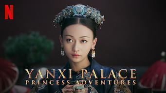 

:material-star:{.gold .heart}:material-star:{.gold .heart}:material-star-half-full:{.gold .heart}:material-star-outline:{.grey }:material-star-outline:{.grey }|Série : **Yanxi Palace: Princess Adventures** Origine: **Chine** Sortie en **2019** Nb. épisodes: **6**  _Intrigues au palais impérial chinois, de bonne facture mais trop rapide pour un sujet aussi complexe._

## Corée du Sud

Affiche|Information
:---:|:---
 

:material-star:{.gold .heart}:material-star:{.gold .heart}:material-star:{.gold .heart}:material-star-half-full:{.gold .heart}:material-star-outline:{.grey }|Série : **100 Days My Prince** Origine: **Corée du Sud** Sortie en **2018** Nb. épisodes: **16**  _Au début prometteur sur un scénario intéressant, mais finalement un traitement trop classique._
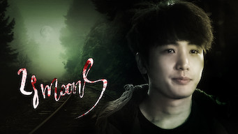 

:material-star-half-full:{.gold .heart}:material-star-outline:{.grey }:material-star-outline:{.grey }:material-star-outline:{.grey }:material-star-outline:{.grey }|Série : **28 Moons / 28개의 달** Origine: **Corée du Sud** Sortie en **2016** Nb. épisodes: **2** :kr: sous-titres en coréens  _Mini série qui relève plus d'un essai que d'un véritable k-drama, le montage est un exemple de ce qu'il ne faut pas faire._
 

:material-star:{.gold .heart}:material-star:{.gold .heart}:material-star-half-full:{.gold .heart}:material-star-outline:{.grey }:material-star-outline:{.grey }|Série : **Abyss** Origine: **Corée du Sud** Sortie en **2019** Nb. épisodes: **16**  _On se désintéresse rapidement de l'histoire et on regrette les acteurs du premier épisode._
 

Retiré de Netflix le 17/12/2022 :material-star:{.gold .heart}:material-star:{.gold .heart}:material-star:{.gold .heart}:material-star:{.gold .heart}:material-star-outline:{.grey }|Série : **Age of Youth / 청춘시대** Origine: **Corée du Sud** Sortie de la 2° saison en **2017** Nb. épisodes: **26**  _Histoire de 5 filles colocataires. Le scénario par dans tous les sens, mais c'est agréable à regarder._
 

:material-star:{.gold .heart}:material-star:{.gold .heart}:material-star:{.gold .heart}:material-star-half-full:{.gold .heart}:material-star-outline:{.grey }|Série : **L'alchimie des âmes / Alchemy of Souls / 환혼** Origine: **Corée du Sud** Sortie en **2023** Nb. épisodes: **30**  _Histoire de mage et de magie dans un monde féerique à la coréenne, les intrigues sont bonnes et le scénario assez riche, seul le montage est un peu compliqué et souvent anachronique._
 

:material-star:{.gold .heart}:material-star:{.gold .heart}:material-star:{.gold .heart}:material-star-outline:{.grey }:material-star-outline:{.grey }|Série : **Alice** Origine: **Corée du Sud** Sortie en **2020** Nb. épisodes: **16**  _Pars trop dans tous les sens, plusieurs incohérences de scénarios, choses restant inexpliquées_
 

:material-star:{.gold .heart}:material-star:{.gold .heart}:material-star:{.gold .heart}:material-star:{.gold .heart}:material-star-half-full:{.gold .heart}|Série : **Angel's Last Mission: Love** Origine: **Corée du Sud** Sortie en **2019** Nb. épisodes: **16**  _Le scénario est bien ficelé, les acteurs sont dans leur rôle, l'histoire est intéressante._
 

Retiré de Netflix le 26/02/2021 :material-star:{.gold .heart}:material-star:{.gold .heart}:material-star:{.gold .heart}:material-star:{.gold .heart}:material-star-outline:{.grey }|Série : **Angry Mom** Origine: **Corée du Sud** Sortie en **2015** Nb. épisodes: **16**  _Quelque lourdeur, mais pas mal dans l'ensemble._
 

:material-star:{.gold .heart}:material-star:{.gold .heart}:material-star-half-full:{.gold .heart}:material-star-outline:{.grey }:material-star-outline:{.grey }|Série : **Another Miss Oh / 또 오해영** Origine: **Corée du Sud** Sortie en **2016** Nb. épisodes: **18**  _L'idée est séduisante mais ça traîne en longueur._
 

:material-star:{.gold .heart}:material-star:{.gold .heart}:material-star:{.gold .heart}:material-star-outline:{.grey }:material-star-outline:{.grey }|Série : **Tale of Arang / Arang and the Magistrate** Origine: **Corée du Sud** Sortie en **2012** Nb. épisodes: **20**  _Pas mal._
 

:material-star:{.gold .heart}:material-star:{.gold .heart}:material-star:{.gold .heart}:material-star-half-full:{.gold .heart}:material-star-outline:{.grey }|Série : **Are You Human?** Origine: **Corée du Sud** Sortie en **2018** Nb. épisodes: **18**  _Excellente idée à la base, plutôt bien traitée mais il manque quelques idées supplémentaires._
 

:material-star:{.gold .heart}:material-star:{.gold .heart}:material-star:{.gold .heart}:material-star:{.gold .heart}:material-star-outline:{.grey }|Série : **Argon / 아르곤** Origine: **Corée du Sud** Sortie en **2017** Nb. épisodes: **8**  _Très bonne petite série dans le milieu des journalistes._
 

:material-star:{.gold .heart}:material-star:{.gold .heart}:material-star:{.gold .heart}:material-star:{.gold .heart}:material-star-outline:{.grey }|Série : **Arthdal Chronicles** Origine: **Corée du Sud** Sortie en **2019** Nb. épisodes: **18**  _Très bon jeu de pouvoir dans un âge de bronze réinventé. En attente de la saison 2._
 

:material-star:{.gold .heart}:material-star:{.gold .heart}:material-star:{.gold .heart}:material-star-outline:{.grey }:material-star-outline:{.grey }|Série : **Aux grands maux… / 닥터 슬럼프** Origine: **Corée du Sud** Sortie en **2024** Nb. épisodes: **16** :kr: sous-titres en coréens  _La dépression dans tous ses états, un bon drama malgré certains dialogues trop caricaturaux._
 

:material-star:{.gold .heart}:material-star:{.gold .heart}:material-star:{.gold .heart}:material-star:{.gold .heart}:material-star-outline:{.grey }|Série : **Jour et nuit / Awaken / 낮과 밤** Origine: **Corée du Sud** Sortie en **2020** Nb. épisodes: **16**  _Entre  la série policière et la série de science-fiction, avec un scénario bien ficelé et de bons acteurs._
 

:material-star:{.gold .heart}:material-star:{.gold .heart}:material-star-half-full:{.gold .heart}:material-star-outline:{.grey }:material-star-outline:{.grey }|Série : **Bad And Crazy / 배드 앤 크레이지** Origine: **Corée du Sud** Sortie en **2021** Nb. épisodes: **12**  _Le scénario est pas terrible et en plus on trouve trop facilement les solutions bien avant le personnage principal._
 

:material-star:{.gold .heart}:material-star:{.gold .heart}:material-star-half-full:{.gold .heart}:material-star-outline:{.grey }:material-star-outline:{.grey }|Série : **Bad Guys / 나쁜 놈 잡는** Origine: **Corée du Sud** Sortie en **2014** Nb. épisodes: **11**  _Un peu trop cousu de fil blanc et axé sur les combats._
 

:material-star:{.gold .heart}:material-star:{.gold .heart}:material-star-half-full:{.gold .heart}:material-star-outline:{.grey }:material-star-outline:{.grey }|Série : **Bad Guys: Vile City / 나쁜녀석들, 악의도시** Origine: **Corée du Sud** Sortie en **2018** Nb. épisodes: **16**  _Série trop axé sur les combats, combats eux-mêmes totalement surréalistes, l'ensemble est plutôt mal fait et cela fait un ensemble brouillon._
 

:material-star:{.gold .heart}:material-star:{.gold .heart}:material-star:{.gold .heart}:material-star:{.gold .heart}:material-star-outline:{.grey }|Série : **Be Melodramatic / 멜로가 체질** Origine: **Corée du Sud** Sortie en **2019** Nb. épisodes: **16**  _Les déboires de trois femmes colocataires dans le monde des médias,  avec un point de vue très féminin, à la fois étrange, surtout au début, et très accès sur des dialogues interminables..._
 

:material-star:{.gold .heart}:material-star:{.gold .heart}:material-star:{.gold .heart}:material-star:{.gold .heart}:material-star-outline:{.grey }|Série : **Beautiful Gong Shim** Origine: **Corée du Sud** Sortie en **2016** Nb. épisodes: **20**  _Le scénario est pas mal, les acteurs bons, mais cela reste quand même du classique._
 

:material-star:{.gold .heart}:material-star:{.gold .heart}:material-star-half-full:{.gold .heart}:material-star-outline:{.grey }:material-star-outline:{.grey }|Série : **Beauty Inside** Origine: **Corée du Sud** Sortie en **2018** Nb. épisodes: **16**  _Divertissant._
 

:material-star:{.gold .heart}:material-star:{.gold .heart}:material-star:{.gold .heart}:material-star-outline:{.grey }:material-star-outline:{.grey }|Série : **Because This Is My First Life** Origine: **Corée du Sud** Sortie en **2017** Nb. épisodes: **16**  _Pas mal._
 

:material-star:{.gold .heart}:material-star:{.gold .heart}:material-star:{.gold .heart}:material-star-half-full:{.gold .heart}:material-star-outline:{.grey }|Série : **Au-delà du mal / Beyond Evil / 괴물** Origine: **Corée du Sud** Sortie en **2021** Nb. épisodes: **16**  _Une série policière assez sombre mais  bien construite._
 

:material-star:{.gold .heart}:material-star:{.gold .heart}:material-star:{.gold .heart}:material-star-half-full:{.gold .heart}:material-star-outline:{.grey }|Série : **Birth of a Beauty** Origine: **Corée du Sud** Sortie en **2014** Nb. épisodes: **21**  _Très bon scénario, quelques lourdeur mais un ensemble plutôt correct._
 

:material-star:{.gold .heart}:material-star:{.gold .heart}:material-star:{.gold .heart}:material-star:{.gold .heart}:material-star-outline:{.grey }|Série : **Postnatal Care Center / Birthcare Center / 산후조리원** Origine: **Corée du Sud** Sortie en **2020** Nb. épisodes: **8**  _Ça commence sur les chapeaux de roue, et même si cela redevient assez classique, le sujet reste traité en profondeur._
 

:material-star:{.gold .heart}:material-star:{.gold .heart}:material-star-outline:{.grey }:material-star-outline:{.grey }:material-star-outline:{.grey }|Série : **Black / 블랙** Origine: **Corée du Sud** Sortie en **2017** Nb. épisodes: **18**  _Scénario très moyen, grosses ficelles, énormément de répétition, l'intrigue à tiroirs est trop tordue._
 

:material-star:{.gold .heart}:material-star:{.gold .heart}:material-star:{.gold .heart}:material-star:{.gold .heart}:material-star-outline:{.grey }|Série : **Black Dog / 블랙독** Origine: **Corée du Sud** Sortie en **2019** Nb. épisodes: **16**  _La dur vie de prof, avec une approche orientée politique intérieure du lycée._
 

Retiré de Netflix le 30/06/2021 :material-star:{.gold .heart}:material-star:{.gold .heart}:material-star:{.gold .heart}:material-star-half-full:{.gold .heart}:material-star-outline:{.grey }|Série : **Black Knight: The Man Who Guards Me / 흑기사** Origine: **Corée du Sud** Sortie en **2018** Nb. épisodes: **20** :kr: sous-titres en coréens  _L'histoire avait pas mal de potentiel mais elle n'a pas tenu toutes ses promesses; des longueurs dans le traitement._
 

:material-star:{.gold .heart}:material-star:{.gold .heart}:material-star-outline:{.grey }:material-star-outline:{.grey }:material-star-outline:{.grey }|Série : **Blood** Origine: **Corée du Sud** Sortie en **2015** Nb. épisodes: **20**  _Dommage, le sujet aurait pu être bien traité, mais le scénario a plein de lacunes, les protagonistes réagissant bêtement aux situations. Ne tient pas ces promesses._
 

:material-star:{.gold .heart}:material-star:{.gold .heart}:material-star:{.gold .heart}:material-star-outline:{.grey }:material-star-outline:{.grey }|Série : **Boys Over Flowers** Origine: **Corée du Sud** Sortie en **2009** Nb. épisodes: **25**  _Pas mal._
 

:material-star:{.gold .heart}:material-star:{.gold .heart}:material-star:{.gold .heart}:material-star-outline:{.grey }:material-star-outline:{.grey }|Série : **Brain Works / 두뇌공조** Origine: **Corée du Sud** Sortie en **2023** Nb. épisodes: **16**  _Cérébral, mais plutôt intéressant_
 

:material-star:{.gold .heart}:material-star:{.gold .heart}:material-star:{.gold .heart}:material-star-outline:{.grey }:material-star-outline:{.grey }|Série : **Bring It On, Ghost** Origine: **Corée du Sud** Sortie en **2016** Nb. épisodes: **16**  _Pas mal._
 

:material-star:{.gold .heart}:material-star:{.gold .heart}:material-star:{.gold .heart}:material-star-outline:{.grey }:material-star-outline:{.grey }|Série : **Bulgasal: Immortal Souls / 불가살** Origine: **Corée du Sud** Sortie en **2021** Nb. épisodes: **16**  _On s'attend un mix de Highlander et de Kingdom, mais au final cela reste bien pâlichon avec des longueurs a des moments où l'action devrait prévaloir._
 

:material-star:{.gold .heart}:material-star:{.gold .heart}:material-star:{.gold .heart}:material-star:{.gold .heart}:material-star-outline:{.grey }|Série : **Business Proposal / 사내 맞선** Origine: **Corée du Sud** Sortie en **2022** Nb. épisodes: **12** :kr: sous-titres en coréens  _Sans doute tirer d'un webtoon, l'histoire est bien faite et cela s'enchaîne bien; néanmoins cela reste un peu trop convenu._
 

:material-star:{.gold .heart}:material-star:{.gold .heart}:material-star:{.gold .heart}:material-star-half-full:{.gold .heart}:material-star-outline:{.grey }|Série : **Café Minamdang / 미남당** Origine: **Corée du Sud** Sortie en **2022** Nb. épisodes: **18**  _Policier qui s'enchaine bien, sur un scénario intéressant. Malheureusement certains enchaînements "jour / nuit" et certaines scènes trop statiques viennent ternir l'ensemble._
 

:material-star:{.gold .heart}:material-star:{.gold .heart}:material-star:{.gold .heart}:material-star:{.gold .heart}:material-star-outline:{.grey }|Série : **Celebrity / 셀러브리티** Origine: **Corée du Sud** Sortie en **2023** Nb. épisodes: **12** :kr: sous-titres en coréens  _Cette série aurait plutôt dû s'appeler "influenceuse", ce sujet étant particulièrement bien abordé, avec ses débordements._
 

Retiré de Netflix le 30/09/2021 :material-star:{.gold .heart}:material-star:{.gold .heart}:material-star-half-full:{.gold .heart}:material-star-outline:{.grey }:material-star-outline:{.grey }|Série : **Cheese in the Trap** Origine: **Corée du Sud** Sortie en **2016** Nb. épisodes: **16**  _L'idée est pas mal, mais l'évolution des pensées et des réflexions des personnages sont trop lentes, parfois peu cohérentes, voir trop serviles, en contradiction avec leur niveau d'éducation. Au final, c'est plutôt déprimant comme série._
 

Retiré de Netflix le 30/09/2021 :material-star:{.gold .heart}:material-star:{.gold .heart}:material-star:{.gold .heart}:material-star-half-full:{.gold .heart}:material-star-outline:{.grey }|Série : **Chicago Typewriter / 시카고 타자기** Origine: **Corée du Sud** Sortie en **2017** Nb. épisodes: **16**  _Un scénario un peu trop alambiquées, l'ensemble pas mal mais beaucoup de longueurs._
 

:material-star:{.gold .heart}:material-star:{.gold .heart}:material-star-outline:{.grey }:material-star-outline:{.grey }:material-star-outline:{.grey }|Série : **Chicken Nugget / 닭강정** Origine: **Corée du Sud** Sortie en **2024** Nb. épisodes: **10** :kr: sous-titres en coréens  _Très déconnant et déconcertant, basé sur une BD, humour Coréen._
 

:material-star:{.gold .heart}:material-star:{.gold .heart}:material-star:{.gold .heart}:material-star-outline:{.grey }:material-star-outline:{.grey }|Série : **Chief Kim** Origine: **Corée du Sud** Sortie en **2017** Nb. épisodes: **20**  _Original, plutôt divertissant mais peu de surprise._
 

:material-star:{.gold .heart}:material-star:{.gold .heart}:material-star-outline:{.grey }:material-star-outline:{.grey }:material-star-outline:{.grey }|Série : **Chief of Staff / 보좌관** Origine: **Corée du Sud** Sortie de la 2° saison en **2019** Nb. épisodes: **20**  _Le scénario est mauvais jeu de ping-pong sorti du chapeau les intrigues ne sont pas intéressantes_
 

:material-star:{.gold .heart}:material-star:{.gold .heart}:material-star:{.gold .heart}:material-star:{.gold .heart}:material-star-outline:{.grey }|Série : **Cinderella and the Four Knights** Origine: **Corée du Sud** Sortie en **2016** Nb. épisodes: **16**  _Teenage, mais bien fait, avec un scénario qui tient la route._
 

:material-star:{.gold .heart}:material-star:{.gold .heart}:material-star:{.gold .heart}:material-star-outline:{.grey }:material-star-outline:{.grey }|Série : **Clean With Passion For Now** Origine: **Corée du Sud** Sortie en **2018** Nb. épisodes: **16**  _Idée originale, démarre bien mais il manque un deuxième souffle._
 

:material-star:{.gold .heart}:material-star:{.gold .heart}:material-star:{.gold .heart}:material-star-outline:{.grey }:material-star-outline:{.grey }|Série : **Color of Woman / 컬러 오브 우먼** Origine: **Corée du Sud** Sortie en **2012** Nb. épisodes: **20** :kr: sous-titres en coréens  _Un peu désuet, basé sur les quiproquo, mais aussi sur un scénario qui tient la route._
 

:material-star:{.gold .heart}:material-star:{.gold .heart}:material-star:{.gold .heart}:material-star:{.gold .heart}:material-star-outline:{.grey }|Série : **Come and Hug Me** Origine: **Corée du Sud** Sortie en **2018** Nb. épisodes: **16**  _Beaucoup de suspence et des scènes angoissantes dans cette série policière._
 

:material-star:{.gold .heart}:material-star:{.gold .heart}:material-star:{.gold .heart}:material-star:{.gold .heart}:material-star-outline:{.grey }|Série : **Couple on the Backtrack / 고백부부** Origine: **Corée du Sud** Sortie en **2017** Nb. épisodes: **12**  _Recommencer sa vie de couple en retournant au début de celle-ci, un thème déjà vue mais traité différemment._
:material-numeric-3-circle:{.num_copper}  

:material-star:{.gold .heart}:material-star:{.gold .heart}:material-star:{.gold .heart}:material-star:{.gold .heart}:material-star:{.gold .heart}|Série : **Crash Landing on You** Origine: **Corée du Sud** Sortie en **2019** Nb. épisodes: **16** :kr: sous-titres en coréens  _Très bon scénario, les acteurs sont excellents et la réalisation paufinée. Ca mériterait une saison 2 !_
 

Retiré de Netflix le 09/02/2021 :material-star:{.gold .heart}:material-star:{.gold .heart}:material-star:{.gold .heart}:material-star:{.gold .heart}:material-star-outline:{.grey }|Série : **Cunning Single Lady** Origine: **Corée du Sud** Sortie en **2014** Nb. épisodes: **16**  _Très bien._
 

:material-star:{.gold .heart}:material-star:{.gold .heart}:material-star:{.gold .heart}:material-star:{.gold .heart}:material-star-outline:{.grey }|Série : **Daily Dose of Sunshine / 정신병동에도 아침이 와요** Origine: **Corée du Sud** Sortie en **2023** Nb. épisodes: **12** :kr: sous-titres en coréens  _Le sujet difficile de la psychiatrie abordé avec talent._
 

:material-star:{.gold .heart}:material-star:{.gold .heart}:material-star:{.gold .heart}:material-star:{.gold .heart}:material-star-half-full:{.gold .heart}|Série : **Dali et le prince arrogant / Dali & Cocky Prince / 달리와 감자탕** Origine: **Corée du Sud** Sortie en **2021** Nb. épisodes: **16**  _L'intrigue est bonne, les acteurs excellents, la réalisation cohérente : que demander de plus._
 

:material-star:{.gold .heart}:material-star:{.gold .heart}:material-star:{.gold .heart}:material-star-half-full:{.gold .heart}:material-star-outline:{.grey }|Série : **Dear My Friends / 디어 마이 프렌즈** Origine: **Corée du Sud** Sortie en **2016** Nb. épisodes: **16**  _Tranche de vie intergénérationnelle, plutôt accès sur les personnes d'un certain âge, assez réaliste et bien fait._
 

Retiré de Netflix le 31/01/2021 :material-star:{.gold .heart}:material-star:{.gold .heart}:material-star:{.gold .heart}:material-star-outline:{.grey }:material-star-outline:{.grey }|Série : **Defendant** Origine: **Corée du Sud** Sortie en **2017** Nb. épisodes: **18**  _Pas mal._
 

:material-star:{.gold .heart}:material-star:{.gold .heart}:material-star:{.gold .heart}:material-star-half-full:{.gold .heart}:material-star-outline:{.grey }|Série : **Demon Catchers** Origine: **Corée du Sud** Sortie en **2020** Nb. épisodes: **16**  _La chasse aux démons est ouverte._
 

:material-star:{.gold .heart}:material-star:{.gold .heart}:material-star:{.gold .heart}:material-star:{.gold .heart}:material-star-half-full:{.gold .heart}|Série : **Descendants of the Sun** Origine: **Corée du Sud** Sortie en **2016** Nb. épisodes: **16**  _Très bonne facture, s'enchaîne bien._
:material-numeric-10-circle:  

:material-star:{.gold .heart}:material-star:{.gold .heart}:material-star:{.gold .heart}:material-star:{.gold .heart}:material-star:{.gold .heart}|Série : **Designated Survivor: 60 Days** Origine: **Corée du Sud** Sortie en **2019** Nb. épisodes: **16** :kr: sous-titres en coréens  _Bien plus intéressant que la version américaine, le contexte politique de la Corée du sud est bien plus crédible._
 

:material-star:{.gold .heart}:material-star:{.gold .heart}:material-star:{.gold .heart}:material-star-half-full:{.gold .heart}:material-star-outline:{.grey }|Série : **Diary of a Prosecutor / 검사내전** Origine: **Corée du Sud** Sortie en **2019** Nb. épisodes: **16**  _La dure vie de procureur en Corée._
 

:material-star:{.gold .heart}:material-star:{.gold .heart}:material-star:{.gold .heart}:material-star-half-full:{.gold .heart}:material-star-outline:{.grey }|Série : **Do Do Sol Sol La La Sol / 도도솔솔라라솔** Origine: **Corée du Sud** Sortie en **2020** Nb. épisodes: **16** :kr: sous-titres en coréens  _Entre la série policière et le conte de fée, le scénario tient la route et permet une certaine découverte de la musique, mais malheureusement la fin est mauvaise._
 

:material-star:{.gold .heart}:material-star:{.gold .heart}:material-star:{.gold .heart}:material-star:{.gold .heart}:material-star-outline:{.grey }|Série : **Do You Like Brahms? / 브람스를 좋아하세요?** Origine: **Corée du Sud** Sortie en **2020** Nb. épisodes: **16**  _La musique classique tient le rôle de fond de cette série, plutôt bien réalisée avec un scénario qui tient la route._
 

:material-star:{.gold .heart}:material-star:{.gold .heart}:material-star:{.gold .heart}:material-star:{.gold .heart}:material-star-outline:{.grey }|Série : **Doctor Cha / 닥터 차정숙** Origine: **Corée du Sud** Sortie en **2023** Nb. épisodes: **16** :kr: sous-titres en coréens  _Reprendre le travail à 40 ans et découvrir les agissements de son mari._
 

:material-star:{.gold .heart}:material-star:{.gold .heart}:material-star:{.gold .heart}:material-star-half-full:{.gold .heart}:material-star-outline:{.grey }|Série : **Doctor Crush** Origine: **Corée du Sud** Sortie en **2016** Nb. épisodes: **20**  _Bien._
 

:material-star:{.gold .heart}:material-star:{.gold .heart}:material-star:{.gold .heart}:material-star:{.gold .heart}:material-star-outline:{.grey }|Série : **Doctor John** Origine: **Corée du Sud** Sortie en **2019** Nb. épisodes: **16**  _Assez classique, mais bien fait._
 

:material-star:{.gold .heart}:material-star:{.gold .heart}:material-star-outline:{.grey }:material-star-outline:{.grey }:material-star-outline:{.grey }|Série : **Doctor Prisoner** Origine: **Corée du Sud** Sortie en **2019** Nb. épisodes: **16**  _Ca commence bien, mais les erreurs s'accumulent et l'ensemble reste très moyen._
 

:material-star:{.gold .heart}:material-star:{.gold .heart}:material-star:{.gold .heart}:material-star-outline:{.grey }:material-star-outline:{.grey }|Série : **Doctor Stranger** Origine: **Corée du Sud** Sortie en **2014** Nb. épisodes: **20**  _Bon scénario, bon contexte politique, mais trop surjouer._
 

:material-star:{.gold .heart}:material-star:{.gold .heart}:material-star:{.gold .heart}:material-star-outline:{.grey }:material-star-outline:{.grey }|Série : **Don't Dare to Dream** Origine: **Corée du Sud** Sortie en **2016** Nb. épisodes: **24**  _Scénario sur la télévision coréenne présentatrice d'émission versus miss météo._
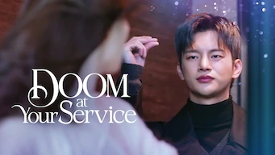 

:material-star:{.gold .heart}:material-star:{.gold .heart}:material-star-outline:{.grey }:material-star-outline:{.grey }:material-star-outline:{.grey }|Série : **Doom at Your Service / 어느 날 우리 집 현관으로 멸망이 들어왔다** Origine: **Corée du Sud** Sortie en **2021** Nb. épisodes: **16**  _Malgré quelques bons passages, on n'arrive pas à s'intéresser aux relations entre ces soi-disants dieux et ces humains._
 

:material-star:{.gold .heart}:material-star:{.gold .heart}:material-star:{.gold .heart}:material-star-half-full:{.gold .heart}:material-star-outline:{.grey }|Série : **Dr. Romantic** Origine: **Corée du Sud** Sortie de la 2° saison en **2020** Nb. épisodes: **37**  _L'idée est bonne mais passer la découverte de l'environnement, la série redevient des plus communes._
 

:material-star:{.gold .heart}:material-star:{.gold .heart}:material-star:{.gold .heart}:material-star-outline:{.grey }:material-star-outline:{.grey }|Série : **Dream High / 드림 하이** Origine: **Corée du Sud** Sortie en **2011** Nb. épisodes: **16**  _Un peu trop teenage, mais quelques bonnes surprises._
 

:material-star:{.gold .heart}:material-star:{.gold .heart}:material-star-half-full:{.gold .heart}:material-star-outline:{.grey }:material-star-outline:{.grey }|Série : **Dream High 2 / 드림하이 2** Origine: **Corée du Sud** Sortie en **2012** Nb. épisodes: **16**  _Très teenage, un scénario très différent du premier volet, quelques longueurs, un peu poussif, globalement moyen._
 

:material-star:{.gold .heart}:material-star:{.gold .heart}:material-star:{.gold .heart}:material-star-half-full:{.gold .heart}:material-star-outline:{.grey }|Série : **Encounter / 남자친구** Origine: **Corée du Sud** Sortie en **2018** Nb. épisodes: **16**  _Le scénario est pas mal avec Cuba, les dialogues sont pas mal, cela traîne un peu en longeur sur la fin._
 

:material-star:{.gold .heart}:material-star:{.gold .heart}:material-star:{.gold .heart}:material-star-outline:{.grey }:material-star-outline:{.grey }|Série : **Behind Your Touch / Enquêtes tactiles / 힙하게 hip** Origine: **Corée du Sud** Sortie en **2023** Nb. épisodes: **16** :kr: sous-titres en coréens  _Enquête policière avec un mélange de fantastique et de comique._
 

:material-star:{.gold .heart}:material-star:{.gold .heart}:material-star:{.gold .heart}:material-star-outline:{.grey }:material-star-outline:{.grey }|Série : **Eve / 이브** Origine: **Corée du Sud** Sortie en **2022** Nb. épisodes: **16**  _Un bon scénario à la base, mais une réalisation dans l'exagération, ce qui donne un résultat caricatural et mélodramatique . Dommage, car l'actrice qui joue la méchante So-Ra est très convainquante._
 

:material-star:{.gold .heart}:material-star:{.gold .heart}:material-star:{.gold .heart}:material-star-outline:{.grey }:material-star-outline:{.grey }|Série : **Extracurricular** Origine: **Corée du Sud** Sortie en **2020** Nb. épisodes: **10**  _Idée originale sur le monde de la nuit, mériterait une suite._
 

:material-star:{.gold .heart}:material-star:{.gold .heart}:material-star:{.gold .heart}:material-star:{.gold .heart}:material-star-half-full:{.gold .heart}|Série : **Extraordinary Attorney Woo / 이상한 변호사 우영우** Origine: **Corée du Sud** Sortie en **2022** Nb. épisodes: **16** :kr: sous-titres en coréens  _Autiste et avocate, thème de cette série très bien réalisée et jouée juste._
 

Retiré de Netflix le 31/01/2022 :material-star:{.gold .heart}:material-star-half-full:{.gold .heart}:material-star-outline:{.grey }:material-star-outline:{.grey }:material-star-outline:{.grey }|Série : **Extraordinary You / 어쩌다 발견한 하루** Origine: **Corée du Sud** Sortie en **2019** Nb. épisodes: **16**  _Quand le webtoon part en vrille; une idée originale mais au finale décevante, et même par moment ennuyante, on a du mal à se passionner pour cette histoire. Assez désagréable à regarder._
 

:material-star:{.gold .heart}:material-star:{.gold .heart}:material-star:{.gold .heart}:material-star:{.gold .heart}:material-star-outline:{.grey }|Série : **Familiar Wife / 아능 와이프** Origine: **Corée du Sud** Sortie en **2018** Nb. épisodes: **16**  _Ah si on pouvait remonter le temps et changer un petit peu notre histoire, c'est ce que propose cette série._
 

:material-star:{.gold .heart}:material-star:{.gold .heart}:material-star:{.gold .heart}:material-star:{.gold .heart}:material-star-outline:{.grey }|Série : **Fight for My Way / 쌈 마이웨이** Origine: **Corée du Sud** Sortie en **2017** Nb. épisodes: **16** :kr: sous-titres en coréens  _Le scénario est très bien, mais un peu compliqué car le contexte est très riche. Les acteurs sont excellents._
 

:material-star:{.gold .heart}:material-star:{.gold .heart}:material-star:{.gold .heart}:material-star:{.gold .heart}:material-star-outline:{.grey }|Série : **Find Me in Your Memory / 그 남자의 기억 법** Origine: **Corée du Sud** Sortie en **2020** Nb. épisodes: **16**  _Très bien, mais quelques longueurs sur la fin._
 

:material-star:{.gold .heart}:material-star:{.gold .heart}:material-star:{.gold .heart}:material-star-outline:{.grey }:material-star-outline:{.grey }|Série : **Flower Crew: Joseon Marriage Agency / 꽃파당** Origine: **Corée du Sud** Sortie en **2019** Nb. épisodes: **16**  _Une agence matrimoniale à l'époque Joseon, le scénario tient la route mais la réalisation est un peu légère._
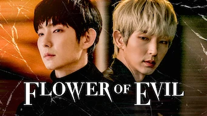 

:material-star:{.gold .heart}:material-star-half-full:{.gold .heart}:material-star-outline:{.grey }:material-star-outline:{.grey }:material-star-outline:{.grey }|Série : **La Fleur du Mal / Flower of Evil / 악의 꽃** Origine: **Corée du Sud** Sortie en **2020** Nb. épisodes: **16**  _Le scénario est assez décevant, très prédictif, et donc l'ensemble est monotone. Les personnages sont pas très futés et laissent passer plein d'occasion, sans parler de la musique trop bruyante._
 

:material-star:{.gold .heart}:material-star:{.gold .heart}:material-star:{.gold .heart}:material-star-outline:{.grey }:material-star-outline:{.grey }|Série : **Forecasting Love and Weather / 기상청 사람들** Origine: **Corée du Sud** Sortie en **2022** Nb. épisodes: **16** :kr: sous-titres en coréens  _Cette série ne tient pas ses promesses, non seulement le couple principal est peu crédible mais aussi l'aspect météo n'est pas assez approfondie. On reste sur sa faim._
 

:material-star:{.gold .heart}:material-star:{.gold .heart}:material-star-half-full:{.gold .heart}:material-star-outline:{.grey }:material-star-outline:{.grey }|Série : **Full House** Origine: **Corée du Sud** Sortie en **2004** Nb. épisodes: **16**  _Scénario original, mais il tire trop en longueur et manque de surprise._
 

:material-star:{.gold .heart}:material-star:{.gold .heart}:material-star:{.gold .heart}:material-star-half-full:{.gold .heart}:material-star-outline:{.grey }|Série : **Ghost Doctor / 고스트 닥터** Origine: **Corée du Sud** Sortie en **2024** Nb. épisodes: **16**  _Dans cette série un médecin dans le coma se transforme en fantôme, c'est le thème, cela se passe principalement dans un hôpital, malheureusement l'aspect médical est complètement bidon._
 

:material-star:{.gold .heart}:material-star:{.gold .heart}:material-star:{.gold .heart}:material-star:{.gold .heart}:material-star-outline:{.grey }|Série : **Good Doctor** Origine: **Corée du Sud** Sortie en **2013** Nb. épisodes: **20**  _Mieux que la version américiane, mieux contextualisé._
 

Retiré de Netflix le 14/12/2021 :material-star:{.gold .heart}:material-star:{.gold .heart}:material-star:{.gold .heart}:material-star-outline:{.grey }:material-star-outline:{.grey }|Série : **Googbye My Wife / Goodbye Dear Wife / 굿바이 마눌** Origine: **Corée du Sud** Sortie en **2012** Nb. épisodes: **20** :kr: sous-titres en coréens  _Ca a veillit, et si l'histoire est très bien, le script n'est pas très bon avec certaines longueurs, et certains personnages étant trop exubérants._
 

:material-star:{.gold .heart}:material-star:{.gold .heart}:material-star:{.gold .heart}:material-star-half-full:{.gold .heart}:material-star-outline:{.grey }|Série : **Graceful Friends / 우아한 친구들** Origine: **Corée du Sud** Sortie en **2020** Nb. épisodes: **17**  _Un scénario qui tient la route et pas mal d'idée; il tient néanmoins un peu trop sur une accumulation de non-dits, ce qui gâche un peu la crédibilité de l'histoire._
 

:material-star:{.gold .heart}:material-star:{.gold .heart}:material-star:{.gold .heart}:material-star-half-full:{.gold .heart}:material-star-outline:{.grey }|Série : **Haechi / 해치** Origine: **Corée du Sud** Sortie en **2019** Nb. épisodes: **24**  _Annoncé être basé sur des faits historiques, quelques lourdeurs, mais bien dans l'ensemble._
 

:material-star:{.gold .heart}:material-star:{.gold .heart}:material-star-half-full:{.gold .heart}:material-star-outline:{.grey }:material-star-outline:{.grey }|Série : **Happy And / 해피 앤드** Origine: **Corée du Sud** Sortie en **2012** Nb. épisodes: **25** :kr: sous-titres en coréens  _Enchainement de micro-série sur les femmes se retrouvant dans des situations pas possibles. Scéanarios intéressant mais la réalisation est plus ou moins bien selon les épisodes._
 

:material-star:{.gold .heart}:material-star:{.gold .heart}:material-star:{.gold .heart}:material-star:{.gold .heart}:material-star-outline:{.grey }|Série : **Healer** Origine: **Corée du Sud** Sortie en **2015** Nb. épisodes: **20**  _A mi-chemin entre policier et espionnage, bien fait, mais aurait mérité plus d'épisodes et de rebondissement._
 

:material-star:{.gold .heart}:material-star:{.gold .heart}:material-star:{.gold .heart}:material-star:{.gold .heart}:material-star-half-full:{.gold .heart}|Série : **Hellbound / 지옥** Origine: **Corée du Sud** Sortie en **2021** Nb. épisodes: **6** :kr: sous-titres en coréens  _Excellent, une série qui montre bien les faiblesses de l'humanité et ses travers par rapport à l'inattendu. Un peu trop violent néanmoins et quelques petites erreurs._
 

:material-star:{.gold .heart}:material-star:{.gold .heart}:material-star:{.gold .heart}:material-star:{.gold .heart}:material-star-half-full:{.gold .heart}|Série : **Hello, Me! / 안녕? 나야! ** Origine: **Corée du Sud** Sortie en **2021** Nb. épisodes: **16** :kr: sous-titres en coréens  _Après un démarrage des plus normal, on bascule dans le fantastique. La série est bien construite, et c'est plutôt une réussite._
 

:material-star:{.gold .heart}:material-star:{.gold .heart}:material-star:{.gold .heart}:material-star-outline:{.grey }:material-star-outline:{.grey }|Série : **Her Private Life / 그녀의 사생활** Origine: **Corée du Sud** Sortie en **2019** Nb. épisodes: **16**  _Comédie légère avec pour toile de fond les excès des fans de la K-pop._
 

:material-star:{.gold .heart}:material-star:{.gold .heart}:material-star:{.gold .heart}:material-star:{.gold .heart}:material-star-half-full:{.gold .heart}|Série : **Hi Bye, Mama!** Origine: **Corée du Sud** Sortie en **2020** Nb. épisodes: **16**  _Bien fait, l'artrice est excellente (comme toujours), même si le sujet abordé est larrmoyant._
 

Retiré de Netflix le 30/06/2021 :material-star:{.gold .heart}:material-star:{.gold .heart}:material-star:{.gold .heart}:material-star:{.gold .heart}:material-star-half-full:{.gold .heart}|Série : **Hit The Top / 최고의 한방** Origine: **Corée du Sud** Sortie en **2017** Nb. épisodes: **16** :kr: sous-titres en coréens  _Bon scénario, cela s'enchaîne bien, les acteurs sont bons, les situatons crédibles._
 

:material-star:{.gold .heart}:material-star:{.gold .heart}:material-star:{.gold .heart}:material-star-outline:{.grey }:material-star-outline:{.grey }|Série : **Homemade Love Story / 오! 삼광빌라! ** Origine: **Corée du Sud** Sortie en **2020** Nb. épisodes: **50**  _Histoire de famille, le scénario s'enchaîne et s'emboîte plutôt bien, les acteurs ayant des actions cohérentes. De bonnes idées dans l'ensemble, mais un résultat un peu trop convenu._
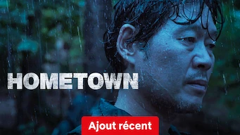 

:material-star:{.gold .heart}:material-star:{.gold .heart}:material-star-half-full:{.gold .heart}:material-star-outline:{.grey }:material-star-outline:{.grey }|Série : **Hometown / 홈타운** Origine: **Corée du Sud** Sortie en **2021** Nb. épisodes: **12**  _Enquête policière plutôt lugubre avec un scénario peut convaincant._
 

:material-star:{.gold .heart}:material-star:{.gold .heart}:material-star:{.gold .heart}:material-star:{.gold .heart}:material-star-outline:{.grey }|Série : **Hometown Cha-Cha-Cha / 갯마을 차차차** Origine: **Corée du Sud** Sortie en **2021** Nb. épisodes: **16** :kr: sous-titres en coréens  _La vie en bord de mer. La série commence bien mais traîne un peu en longueur sur la fin, avec pas mal de placement de produit._
 

:material-star:{.gold .heart}:material-star:{.gold .heart}:material-star:{.gold .heart}:material-star:{.gold .heart}:material-star-half-full:{.gold .heart}|Série : **Hospital Playlist / 의사생활** Origine: **Corée du Sud** Sortie de la 2° saison en **2020** Nb. épisodes: **24** :kr: sous-titres en coréens  _La vie de tous les jours dans un hôpital. Pas d'action à proprement parler, mais des tranches de vie._
 

Retiré de Netflix le 23/02/2021 :material-star:{.gold .heart}:material-star:{.gold .heart}:material-star:{.gold .heart}:material-star:{.gold .heart}:material-star-outline:{.grey }|Série : **Hospital ship** Origine: **Corée du Sud** Sortie en **2017** Nb. épisodes: **20**  _Classique, mais bien fait. L'air marin a toujours apporté de la fraîcheur._
 

:material-star:{.gold .heart}:material-star:{.gold .heart}:material-star:{.gold .heart}:material-star:{.gold .heart}:material-star-outline:{.grey }|Série : **Hot Stove League / 스토브리그** Origine: **Corée du Sud** Sortie en **2019** Nb. épisodes: **16**  _Le scénario est pas mal mais il manque quelque chose... on reste sur sa faim._
 

:material-star:{.gold .heart}:material-star:{.gold .heart}:material-star:{.gold .heart}:material-star-half-full:{.gold .heart}:material-star-outline:{.grey }|Série : **Hotel Del Luna / 호텔 델루나** Origine: **Corée du Sud** Sortie en **2019** Nb. épisodes: **16**  _Un hôtel, après la vie, avec différentes histoires autour des personnages; de très bons effets spéciaux mais parfois un faux rythme qui temporise un peu trop et casse le rythme._
 

:material-star:{.gold .heart}:material-star:{.gold .heart}:material-star:{.gold .heart}:material-star-half-full:{.gold .heart}:material-star-outline:{.grey }|Série : **Hwarang** Origine: **Corée du Sud** Sortie en **2016** Nb. épisodes: **20**  _Basé sur des faits historiques, mais on reste quand même sur sa faim._
 

:material-star:{.gold .heart}:material-star:{.gold .heart}:material-star:{.gold .heart}:material-star-half-full:{.gold .heart}:material-star-outline:{.grey }|Série : **Hyde, Jekyll, Me** Origine: **Corée du Sud** Sortie en **2015** Nb. épisodes: **20**  _Début bizarre mais bien dans l'ensemble._
 

:material-star:{.gold .heart}:material-star:{.gold .heart}:material-star:{.gold .heart}:material-star-half-full:{.gold .heart}:material-star-outline:{.grey }|Série : **Hyena / 하이에나** Origine: **Corée du Sud** Sortie en **2020** Nb. épisodes: **16** :kr: sous-titres en coréens  _Le début de cette série sur les avocats n'est pas terrible, mais après 3-4 épisodes ça devient bien mieux._
 

:material-star:{.gold .heart}:material-star:{.gold .heart}:material-star-half-full:{.gold .heart}:material-star-outline:{.grey }:material-star-outline:{.grey }|Série : **I Can Hear Your Voice** Origine: **Corée du Sud** Sortie en **2013** Nb. épisodes: **18**  _Très mauvaise exploitation d'une idée originale. Le scénario tombe à plat, les personnages ayant des réactions stupides, transformant leur force en faiblesse trop facilement. Aucun des procès ne tiennent la route. Dommage._
 

:material-star:{.gold .heart}:material-star:{.gold .heart}:material-star:{.gold .heart}:material-star:{.gold .heart}:material-star-outline:{.grey }|Série : **I'm not a robot** Origine: **Corée du Sud** Sortie en **2018** Nb. épisodes: **16**  _Bonne approche, excellente idée, la fin aurait pu être moins classique._
 

:material-star:{.gold .heart}:material-star:{.gold .heart}:material-star-half-full:{.gold .heart}:material-star-outline:{.grey }:material-star-outline:{.grey }|Série : **Immortal Classic** Origine: **Corée du Sud** Sortie en **2012** Nb. épisodes: **20**  _Intéressant pour le côté kimchi, Histoire un peu basique._
 

:material-star:{.gold .heart}:material-star:{.gold .heart}:material-star:{.gold .heart}:material-star-outline:{.grey }:material-star-outline:{.grey }|Série : **Inheritors** Origine: **Corée du Sud** Sortie en **2013** Nb. épisodes: **20**  _Pas mal._
 

:material-star:{.gold .heart}:material-star:{.gold .heart}:material-star:{.gold .heart}:material-star:{.gold .heart}:material-star-half-full:{.gold .heart}|Série : **Inspector Koo / 구경이** Origine: **Corée du Sud** Sortie en **2021** Nb. épisodes: **12**  _Très bon policier, très relevé, de très bonnes intrigues, un environnement burlesque, seules certaines situations sont un peu prévisibles._
 

:material-star:{.gold .heart}:material-star:{.gold .heart}:material-star:{.gold .heart}:material-star:{.gold .heart}:material-star-outline:{.grey }|Série : **Into the Ring / 하라는 취업은 안하고 출사표** Origine: **Corée du Sud** Sortie en **2020** Nb. épisodes: **16**  _Un bon scénario sur la politique locale, très bien réalisé, les acteurs sont justes; seuls quelques retournements de situation cassent un peu le crédit politique de la série._
 

:material-star:{.gold .heart}:material-star:{.gold .heart}:material-star:{.gold .heart}:material-star:{.gold .heart}:material-star-outline:{.grey }|Série : **Iris** Origine: **Corée du Sud** Sortie en **2009** Nb. épisodes: **20**  _Espionnage, bien fait. Dommage que la fin soit en contradiction avec ce qui est expliqué dans la série._
:material-numeric-2-circle:{.num_silver}  

:material-star:{.gold .heart}:material-star:{.gold .heart}:material-star:{.gold .heart}:material-star:{.gold .heart}:material-star:{.gold .heart}|Série : **It's Okay to Not Be Okay** Origine: **Corée du Sud** Sortie en **2020** Nb. épisodes: **16** :kr: sous-titres en coréens  _Bizarre au premier abord, on tombe vite sous le charme des personnages._
 

:material-star:{.gold .heart}:material-star:{.gold .heart}:material-star:{.gold .heart}:material-star:{.gold .heart}:material-star-outline:{.grey }|Série : **It's Okay, That's Love / 괜찮아 사랑이야** Origine: **Corée du Sud** Sortie en **2014** Nb. épisodes: **16** :kr: sous-titres en coréens  _Très bon traitement d'un sujet complexe, le scénario est bien. Quelques longueurs._
 

:material-star:{.gold .heart}:material-star:{.gold .heart}:material-star:{.gold .heart}:material-star:{.gold .heart}:material-star-outline:{.grey }|Série : **Itaewon Class** Origine: **Corée du Sud** Sortie en **2020** Nb. épisodes: **16**  _Bonne série sur un quartier de restaurant connu en Corée. Les premiers espidodes ne sont pas révélateurs de l'ensemble._
 

:material-star:{.gold .heart}:material-star:{.gold .heart}:material-star-half-full:{.gold .heart}:material-star-outline:{.grey }:material-star-outline:{.grey }|Série : **Jumping Girl / 점핑걸** Origine: **Corée du Sud** Sortie en **2015** Nb. épisodes: **3**  _On dirait une mini-série fait par des étudiants du cinéma. Pas trop mal si c'est le cas, sinon un peu basique._
 

:material-star:{.gold .heart}:material-star:{.gold .heart}:material-star:{.gold .heart}:material-star:{.gold .heart}:material-star-outline:{.grey }|Série : **Juvenile Justice / 소년 심판** Origine: **Corée du Sud** Sortie en **2022** Nb. épisodes: **10** :kr: sous-titres en coréens  _Les différentes histoires abordées dans cette série sont très bien construites, avec un soin particulier au niveau des dialogues._
 

:material-star:{.gold .heart}:material-star:{.gold .heart}:material-star-outline:{.grey }:material-star-outline:{.grey }:material-star-outline:{.grey }|Série : **K-pop extreme survival / K-Pop: L'Ultime Audition / K-팝: 최강 서바이벌** Origine: **Corée du Sud** Sortie en **2012** Nb. épisodes: **14** :kr: sous-titres en coréens  _Trop basique, passé de mode et surtout la fin a été bâclé._
 

Retiré de Netflix le 26/02/2021 :material-star:{.gold .heart}:material-star:{.gold .heart}:material-star:{.gold .heart}:material-star-outline:{.grey }:material-star-outline:{.grey }|Série : **Kangchi, The Beginning** Origine: **Corée du Sud** Sortie en **2013** Nb. épisodes: **24**  _Pas mal._
![Affiche de Kingdom [série]](images/nx/AAAABTKkD-K7St0O8eoils3Q2ksuYzQLL4CjQPCKly3rE-4ISHT2hxv2wPQB.jpg) 

:material-star:{.gold .heart}:material-star:{.gold .heart}:material-star:{.gold .heart}:material-star:{.gold .heart}:material-star-outline:{.grey }|Série : **Kingdom / Kingdom [série] / 킹덤** Origine: **Corée du Sud** Sortie de la 2° saison en **2020** Nb. épisodes: **12** :kr: sous-titres en coréens  _Une série d'épouvante très bien faite._
 

:material-star:{.gold .heart}:material-star:{.gold .heart}:material-star:{.gold .heart}:material-star:{.gold .heart}:material-star-outline:{.grey }|Série : **Kkondae Intern / 꼰대인턴** Origine: **Corée du Sud** Sortie en **2020** Nb. épisodes: **12**  _Bon scénario, bien réalisé, mais il manque une étincelle..._
 

:material-star:{.gold .heart}:material-star:{.gold .heart}:material-star:{.gold .heart}:material-star:{.gold .heart}:material-star:{.gold .heart}|Série : **L'Amour au rattrapage / 일타 스캔들** Origine: **Corée du Sud** Sortie en **2023** Nb. épisodes: **16** :kr: sous-titres en coréens  _Romance au pays des cours privés._
 

:material-star:{.gold .heart}:material-star:{.gold .heart}:material-star:{.gold .heart}:material-star-outline:{.grey }:material-star-outline:{.grey }|Série : **L'Empire du sourire / 킹더랜드** Origine: **Corée du Sud** Sortie en **2023** Nb. épisodes: **16** :kr: sous-titres en coréens  _Comédie romantique un peu trop classique, du déjà vu même si cela reste bien réalisée._
 

:material-star:{.gold .heart}:material-star:{.gold .heart}:material-star:{.gold .heart}:material-star:{.gold .heart}:material-star-half-full:{.gold .heart}|Série : **L'Intrigante et le Roi / 세작, 매혹된 자들** Origine: **Corée du Sud** Sortie en **2024** Nb. épisodes: **16** :kr: sous-titres en coréens  _Intrigue de Palais et jeux de pouvoir sont la base de cette série historique, très bien menée par une myriade d'excellents acteurs._
 

:material-star:{.gold .heart}:material-star:{.gold .heart}:material-star:{.gold .heart}:material-star:{.gold .heart}:material-star-outline:{.grey }|Série : **La Diva naufragée / 무인도의 디바** Origine: **Corée du Sud** Sortie en **2023** Nb. épisodes: **12** :kr: sous-titres en coréens  _Le sujet est bien traité et bien réalisé, mais reste un peu convenu._
 

:material-star:{.gold .heart}:material-star:{.gold .heart}:material-star:{.gold .heart}:material-star:{.gold .heart}:material-star-outline:{.grey }|Série : **La Débutante de la ruelle / 편의점 샛별이** Origine: **Corée du Sud** Sortie en **2020** Nb. épisodes: **16**  _Le scénario de la série semble hésiter entre comique et romantisme, sans réellement basculer dans l'un ou l'autre. C'est la faiblesse de cette série au scénario néanmoins bien ficelé._
:material-numeric-9-circle:  

:material-star:{.gold .heart}:material-star:{.gold .heart}:material-star:{.gold .heart}:material-star:{.gold .heart}:material-star:{.gold .heart}|Série : **La Reine des larmes / 눈물의 여왕** Origine: **Corée du Sud** Sortie en **2024** Nb. épisodes: **16** :kr: sous-titres en coréens  _Jeux d'intrigues et rebondissement autour du thème d'un mariage qui bas de l'aile._
 

:material-star:{.gold .heart}:material-star:{.gold .heart}:material-star:{.gold .heart}:material-star-outline:{.grey }:material-star-outline:{.grey }|Série : **Law School / 로스쿨** Origine: **Corée du Sud** Sortie en **2021** Nb. épisodes: **16** :kr: sous-titres en coréens  _Bien que le scénario soit plutôt correct, les enchaînements sont un peu trop classique, le jeu des acteurs est parfois un peu pompeux._
 

:material-star:{.gold .heart}:material-star-half-full:{.gold .heart}:material-star-outline:{.grey }:material-star-outline:{.grey }:material-star-outline:{.grey }|Série : **Lawless Lawyer / 무법 변호바** Origine: **Corée du Sud** Sortie en **2018** Nb. épisodes: **16**  _Le scénario est peu convaincant, trop surfait et les scènes au tribunal ne sont pas réalistes ou simplistes._
 

Retiré de Netflix le 14/12/2021 :material-star:{.gold .heart}:material-star:{.gold .heart}:material-star:{.gold .heart}:material-star-half-full:{.gold .heart}:material-star-outline:{.grey }|Série : **Heaven's Garden / Le Jardin Céleste / 곰배령** Origine: **Corée du Sud** Sortie en **2011** Nb. épisodes: **30** :kr: sous-titres en coréens  _La vie à la campagne est le fond de cette histoire, avec comme thème principal la famille. Plutôt bien fait avec quelques longueurs expliquant le nombre important d'épisodes._
 

:material-star:{.gold .heart}:material-star:{.gold .heart}:material-star:{.gold .heart}:material-star-outline:{.grey }:material-star-outline:{.grey }|Série : **Le Livre de notre destin / 이 연애는 불가항력** Origine: **Corée du Sud** Sortie en **2023** Nb. épisodes: **16** :kr: sous-titres en coréens  _Très bon démarrage, mais cela s'essouffle au milieu avec des suspenses qui tombent à plat._
 

:material-star:{.gold .heart}:material-star:{.gold .heart}:material-star:{.gold .heart}:material-star-outline:{.grey }:material-star-outline:{.grey }|Série : **Le bœuf : Une passion coréenne / 한우 랩소디** Origine: **Corée du Sud** Sortie en **2021** Nb. épisodes: **2** :kr: sous-titres en coréens  _Pour les amateurs de bonne chair, avec un passage un peu historique intéressant._
 

:material-star:{.gold .heart}:material-star:{.gold .heart}:material-star:{.gold .heart}:material-star-outline:{.grey }:material-star-outline:{.grey }|Série : **Miss Panda and Mr Hedgehog / Le panda et le hérisson / 판다양과 고슴도치** Origine: **Corée du Sud** Sortie en **2012** Nb. épisodes: **16** :kr: sous-titres en coréens  _Une série gentille plutôt bien faite, mais un peu désuète. Néanmoins la fin du scénario est trop "tiré par les cheveux" ._
 

:material-star:{.gold .heart}:material-star:{.gold .heart}:material-star-half-full:{.gold .heart}:material-star-outline:{.grey }:material-star-outline:{.grey }|Série : **Le professeur du Cauchemar / 악몽 선생** Origine: **Corée du Sud** Sortie en **2016** Nb. épisodes: **12** :kr: sous-titres en coréens  _Micro série fantastique racontant les rêves des étudiants, rêves devenant des cauchemars._
 

:material-star:{.gold .heart}:material-star:{.gold .heart}:material-star:{.gold .heart}:material-star-half-full:{.gold .heart}:material-star-outline:{.grey }|Série : **Legal High / 리갈 히이** Origine: **Corée du Sud** Sortie en **2019** Nb. épisodes: **16**  _Série basée sur des procès contre une grande société avec un ton assez nouveau même si l'ensemble reste classique._
 

:material-star:{.gold .heart}:material-star:{.gold .heart}:material-star:{.gold .heart}:material-star:{.gold .heart}:material-star-outline:{.grey }|Série : **Les Liens sacrés du divorce / 신성한, 이혼** Origine: **Corée du Sud** Sortie en **2023** Nb. épisodes: **12** :kr: sous-titres en coréens  _La justice autour des divorces et les stratégies d'un avocat, assez bien construit et réalisé._
 

:material-star:{.gold .heart}:material-star:{.gold .heart}:material-star:{.gold .heart}:material-star:{.gold .heart}:material-star-outline:{.grey }|Série : **Let's Eat / 식샤를 합시다** Origine: **Corée du Sud** Sortie en **2013** Nb. épisodes: **16**  _Très bien pour découvrir les plats coréens._
 

Retiré de Netflix le 30/09/2021 :material-star:{.gold .heart}:material-star:{.gold .heart}:material-star:{.gold .heart}:material-star-half-full:{.gold .heart}:material-star-outline:{.grey }|Série : **Let's Eat 2 / 식샤를 합시다 2** Origine: **Corée du Sud** Sortie en **2015** Nb. épisodes: **18** :kr: sous-titres en coréens  _Aussi bien que le premier volet, avec un scénario entièrement revu._
 

:material-star:{.gold .heart}:material-star:{.gold .heart}:material-star:{.gold .heart}:material-star-half-full:{.gold .heart}:material-star-outline:{.grey }|Série : **Life / 라이프** Origine: **Corée du Sud** Sortie en **2018** Nb. épisodes: **16**  _Intrigue politico-financière dans un hôpital de Séoul plutôt bien construite. Ambiance plutôt sombre dans le milieu hospitalier avec un affrontement médecine (patient) contre rentabilité (client)._
 

:material-star:{.gold .heart}:material-star:{.gold .heart}:material-star:{.gold .heart}:material-star:{.gold .heart}:material-star-half-full:{.gold .heart}|Série : **Little Women / 작은 아씨들** Origine: **Corée du Sud** Sortie en **2022** Nb. épisodes: **12** :kr: sous-titres en coréens  _Le scénario est bien car très original, mais l'ambiance est vraiment pesante dans les premiers épisodes. Comme souvent il faut quelques épisodes avant que cela démarre vraiment._
 

Retiré de Netflix le 16/05/2023 :material-star:{.gold .heart}:material-star:{.gold .heart}:material-star:{.gold .heart}:material-star-outline:{.grey }:material-star-outline:{.grey }|Série : **Live / 라이브** Origine: **Corée du Sud** Sortie en **2018** Nb. épisodes: **18**  _Le quotidien de la police de quartier en Corée du Sud, avec avec ses hauts et ses bas et un u système politique qui n'aide pas._
 

:material-star:{.gold .heart}:material-star:{.gold .heart}:material-star:{.gold .heart}:material-star:{.gold .heart}:material-star-half-full:{.gold .heart}|Série : **Live Up To Your Name** Origine: **Corée du Sud** Sortie en **2017** Nb. épisodes: **16**  _Excellent, de très bonnes idées, le scénario est bons. On aurait aimé plus d'épisodes._
 

:material-star:{.gold .heart}:material-star:{.gold .heart}:material-star:{.gold .heart}:material-star-outline:{.grey }:material-star-outline:{.grey }|Série : **Liver or Die / 왜그래 풍상씨** Origine: **Corée du Sud** Sortie en **2019** Nb. épisodes: **20**  _Le thème aurait pu être pas mal si les personnages n'étaient pas aussi crédules et naïfs. Même les quiproquos ne sont pas très crédibles, cela donne un ensemble plus que moyen._
 

:material-star:{.gold .heart}:material-star:{.gold .heart}:material-star-outline:{.grey }:material-star-outline:{.grey }:material-star-outline:{.grey }|Série : **Love For Ten - Generation of Youth / 러브포텐 - 순정의 시대** Origine: **Corée du Sud** Sortie en **2013** Nb. épisodes: **12** :kr: sous-titres en coréens  _Micro-série à sketch, avec les lourdeurs habituelles de ce style. C'est plus une figure de style qu'une vraie série._
 

:material-star:{.gold .heart}:material-star:{.gold .heart}:material-star:{.gold .heart}:material-star-half-full:{.gold .heart}:material-star-outline:{.grey }|Série : **Love and Marriage** Origine: **Corée du Sud** Sortie en **2014** Nb. épisodes: **16**  _Bonne série sur les rapports humains._
 

:material-star:{.gold .heart}:material-star:{.gold .heart}:material-star:{.gold .heart}:material-star:{.gold .heart}:material-star-outline:{.grey }|Série : **Love in the Moonlight** Origine: **Corée du Sud** Sortie en **2016** Nb. épisodes: **18**  _Très bonne romance à l'époque de Joseon, avec une spécifité sur le monde des eunuques._
 

:material-star:{.gold .heart}:material-star:{.gold .heart}:material-star:{.gold .heart}:material-star:{.gold .heart}:material-star-outline:{.grey }|Série : **Love to Hate You / 연애대전** Origine: **Corée du Sud** Sortie en **2023** Nb. épisodes: **10** :kr: sous-titres en coréens  _Série qui démarre sur les chapeaux de roue et qui continue comme cela sur les épisodes suivants; une très bonne surprise une analyse des relations hommes-femmes assez pétillantes._
 

:material-star:{.gold .heart}:material-star:{.gold .heart}:material-star:{.gold .heart}:material-star:{.gold .heart}:material-star-half-full:{.gold .heart}|Série : **Love, Marriage and Divorce / 결혼작사 이혼작곡** Origine: **Corée du Sud** Sortie de la 3° saison en **2022** Nb. épisodes: **48** :kr: sous-titres en coréens  _Un excellent scénario sur les relations homme-femme, avec de nombreux cas de figure mais toujours très juste. Malheureusement une 3e saison moins subtile, dont certains acteurs et surtout réalisateurs ont changé, vient gâcher l'ambiance._
 

:material-star:{.gold .heart}:material-star:{.gold .heart}:material-star-half-full:{.gold .heart}:material-star-outline:{.grey }:material-star-outline:{.grey }|Série : **Lovely Horribly** Origine: **Corée du Sud** Sortie en **2018** Nb. épisodes: **16**  _Aurait pu être bon, mais reste moyen._
 

:material-star:{.gold .heart}:material-star:{.gold .heart}:material-star:{.gold .heart}:material-star-outline:{.grey }:material-star-outline:{.grey }|Série : **Lovestruck in the City / 도시남녀의 사랑법** Origine: **Corée du Sud** Sortie en **2020** Nb. épisodes: **17** :kr: sous-titres en coréens  _Les relations de couple dans tous leurs états, léger et abordé de façon atypique._
 

:material-star:{.gold .heart}:material-star:{.gold .heart}:material-star:{.gold .heart}:material-star-outline:{.grey }:material-star-outline:{.grey }|Série : **Mad Dog / 매드 독** Origine: **Corée du Sud** Sortie en **2017** Nb. épisodes: **16**  _Série avec comme toile de fond le système des assurances en Corée. Cela commence bien, mais faute de matière, des nombreuses répétitions et de plusieurs incohérences, cela finit par traîner en longueur. L'ensemble reste néanmoins agréable à voir._
 

:material-star:{.gold .heart}:material-star:{.gold .heart}:material-star:{.gold .heart}:material-star:{.gold .heart}:material-star:{.gold .heart}|Série : **La cinglée du quartier / Mad for Each Other / 이구역의 미친** Origine: **Corée du Sud** Sortie en **2021** Nb. épisodes: **13** :kr: sous-titres en coréens  _Excellent, très bien fait. Les acteurs sont parfaits._
 

:material-star-half-full:{.gold .heart}:material-star-outline:{.grey }:material-star-outline:{.grey }:material-star-outline:{.grey }:material-star-outline:{.grey }|Série : **Magic Phone / 마법의 핸드폰** Origine: **Corée du Sud** Sortie en **2016** Nb. épisodes: **2** :kr: sous-titres en coréens  _Mini série sans doute fait par des étudiants en art cinématographique. Plutôt décousu, scénario très basique à l'emporte-pièce._
 

:material-star:{.gold .heart}:material-star:{.gold .heart}:material-star:{.gold .heart}:material-star:{.gold .heart}:material-star-outline:{.grey }|Série : **Man to Man** Origine: **Corée du Sud** Sortie en **2017** Nb. épisodes: **16**  _Bonne série d'espionnage._
 

:material-star:{.gold .heart}:material-star:{.gold .heart}:material-star:{.gold .heart}:material-star:{.gold .heart}:material-star-outline:{.grey }|Série : **Marriage Contract** Origine: **Corée du Sud** Sortie en **2016** Nb. épisodes: **16**  _Sujet difficile, mais la réalisation et les acteurs sont excellents._
 

:material-star:{.gold .heart}:material-star:{.gold .heart}:material-star:{.gold .heart}:material-star:{.gold .heart}:material-star-outline:{.grey }|Série : **Master's Sun** Origine: **Corée du Sud** Sortie en **2013** Nb. épisodes: **17**  _Une approche des fantômes intéressante, très bien fait, le scénario tient la route._
 

:material-star:{.gold .heart}:material-star:{.gold .heart}:material-star-outline:{.grey }:material-star-outline:{.grey }:material-star-outline:{.grey }|Série : **Memories of the Alhambra** Origine: **Corée du Sud** Sortie en **2018** Nb. épisodes: **16**  _Trop répétitif, ennuyeux, dommage_
 

:material-star:{.gold .heart}:material-star:{.gold .heart}:material-star-half-full:{.gold .heart}:material-star-outline:{.grey }:material-star-outline:{.grey }|Série : **Military Prosecutor Doberman / 군검사 도베르만** Origine: **Corée du Sud** Sortie en **2022** Nb. épisodes: **16**  _Malgré de bons ingrédients, l'ensemble est décevant avec une histoire qui aurait mérité des personnages moins caricaturaux et un traitement moins simpliste._
 

:material-star:{.gold .heart}:material-star:{.gold .heart}:material-star:{.gold .heart}:material-star:{.gold .heart}:material-star-outline:{.grey }|Série : **Mine / 마인** Origine: **Corée du Sud** Sortie en **2021** Nb. épisodes: **16** :kr: sous-titres en coréens  _Très bonne série, malgré une chronologie des séquences qui apporte de la confusion. Elle aurait mérité un meilleur montage._
 

:material-star:{.gold .heart}:material-star:{.gold .heart}:material-star:{.gold .heart}:material-star:{.gold .heart}:material-star-outline:{.grey }|Série : **Miraculous Brothers / 기적의 형제** Origine: **Corée du Sud** Sortie en **2023** Nb. épisodes: **16**  _Une bonne intrigue policière avec un peu de science-fiction et une intrigue s'imbrique bien._
:material-numeric-8-circle:  

:material-star:{.gold .heart}:material-star:{.gold .heart}:material-star:{.gold .heart}:material-star:{.gold .heart}:material-star:{.gold .heart}|Série : **Misaeng** Origine: **Corée du Sud** Sortie en **2014** Nb. épisodes: **20** :kr: sous-titres en coréens  _La vie en entreprise en Corée. Très bon scénario, nombreuses situations intéressantes._
 

:material-star:{.gold .heart}:material-star:{.gold .heart}:material-star:{.gold .heart}:material-star-outline:{.grey }:material-star-outline:{.grey }|Série : **Miss Night and Day / 낮과 밤이 다른 그녀** Origine: **Corée du Sud** Sortie en **2024** Nb. épisodes: **16** :kr: sous-titres en coréens  _Les aventures d'une étudiante maudite dans le monde judiciaire,de bons acteurs mais un peu lent._
 

:material-star:{.gold .heart}:material-star:{.gold .heart}:material-star:{.gold .heart}:material-star:{.gold .heart}:material-star-outline:{.grey }|Série : **Missing: The Other Side / 미씽: 그들이 있었다** Origine: **Corée du Sud** Sortie en **2020** Nb. épisodes: **12**  _Les personnes disparues sans laisser de trace est le sujet de cette série, avec un côté "fantôme". Le scénario tient la route, avec quelques erreurs de logique, mais agréable à regarder dans l'ensemble._
 

:material-star:{.gold .heart}:material-star:{.gold .heart}:material-star:{.gold .heart}:material-star:{.gold .heart}:material-star-outline:{.grey }|Série : **Misty** Origine: **Corée du Sud** Sortie en **2018** Nb. épisodes: **16**  _Bonne série sur les relations humaines._
 

:material-star:{.gold .heart}:material-star:{.gold .heart}:material-star:{.gold .heart}:material-star:{.gold .heart}:material-star-outline:{.grey }|Série : **Mon amour venu des étoiles** Origine: **Corée du Sud** Sortie en **2013** Nb. épisodes: **21**  _Malgré un premier épisode un peu poussif, ça s'enchaine bien. L'ensemble est plutôt pas mal._
 

:material-star:{.gold .heart}:material-star:{.gold .heart}:material-star:{.gold .heart}:material-star-outline:{.grey }:material-star-outline:{.grey }|Série : **My Demon / Mon démon / 마이데몬** Origine: **Corée du Sud** Sortie en **2023** Nb. épisodes: **16** :kr: sous-titres en coréens  _Bon démarrage, mais trop édulcorer par la suite._
 

Retiré de Netflix le 26/02/2021 :material-star:{.gold .heart}:material-star:{.gold .heart}:material-star:{.gold .heart}:material-star:{.gold .heart}:material-star-half-full:{.gold .heart}|Série : **Money Flower** Origine: **Corée du Sud** Sortie en **2018** Nb. épisodes: **24**  _Contexte et jeu de pouvoir de très bonne facture. Les solutions arrivent un peu trop sortie du chapeau._
 

:material-star:{.gold .heart}:material-star:{.gold .heart}:material-star:{.gold .heart}:material-star-outline:{.grey }:material-star-outline:{.grey }|Série : **Move to Heaven / 무브 투 헤븐** Origine: **Corée du Sud** Sortie en **2021** Nb. épisodes: **10** :kr: sous-titres en coréens  _L'art du nettoyage poussé dans ses limites, mais en dehors du contexte cela reste classique._
 

:material-star:{.gold .heart}:material-star:{.gold .heart}:material-star:{.gold .heart}:material-star:{.gold .heart}:material-star-half-full:{.gold .heart}|Série : **Mr. Queen / 철인왕후** Origine: **Corée du Sud** Sortie en **2020** Nb. épisodes: **20**  _Excellente série, absolument pas basée sur des faits historiques et incluant une sorte de voyage dans le passé, avec un scénario sans faute et  agréable à voir._
 

:material-star:{.gold .heart}:material-star:{.gold .heart}:material-star:{.gold .heart}:material-star:{.gold .heart}:material-star-half-full:{.gold .heart}|Série : **Mr. Sunshine / 미스터 션샤인** Origine: **Corée du Sud** Sortie en **2018** Nb. épisodes: **24**  _Série historique sur un amour platonique, de très beau arrêt sur image, seule la fin est trop orientée._
 

:material-star:{.gold .heart}:material-star:{.gold .heart}:material-star:{.gold .heart}:material-star:{.gold .heart}:material-star-half-full:{.gold .heart}|Série : **Ms. Hammurabi** Origine: **Corée du Sud** Sortie en **2018** Nb. épisodes: **16**  _Très bien, mais si c'est un peu trop classique sur la fin._
 

:material-star:{.gold .heart}:material-star:{.gold .heart}:material-star:{.gold .heart}:material-star:{.gold .heart}:material-star-outline:{.grey }|Série : **My Country: The New Age** Origine: **Corée du Sud** Sortie en **2019** Nb. épisodes: **16**  _Série historique très bien faite._
 

:material-star:{.gold .heart}:material-star:{.gold .heart}:material-star:{.gold .heart}:material-star:{.gold .heart}:material-star-half-full:{.gold .heart}|Série : **My Father is Strange / 아버지가 이상해** Origine: **Corée du Sud** Sortie en **2017** Nb. épisodes: **52**  _Le scénario est plutôt bien fait même si un peu trop larmoyant sur la fin, l'intrigue centrale autour de l'usurpation d'identité est plutôt bien traitée._
 

:material-star:{.gold .heart}:material-star:{.gold .heart}:material-star:{.gold .heart}:material-star:{.gold .heart}:material-star-outline:{.grey }|Série : **My Fellow Citizens** Origine: **Corée du Sud** Sortie en **2019** Nb. épisodes: **18**  _Très bonne série, avec d'excellents acteurs._
 

:material-star:{.gold .heart}:material-star:{.gold .heart}:material-star:{.gold .heart}:material-star-outline:{.grey }:material-star-outline:{.grey }|Série : **My Girlfriend Is a Gumiho** Origine: **Corée du Sud** Sortie en **2010** Nb. épisodes: **16**  _Aspect légende intéressant, on aprend plein de chose. Il aurait mérité un scénario plus développé._
 

:material-star:{.gold .heart}:material-star:{.gold .heart}:material-star:{.gold .heart}:material-star:{.gold .heart}:material-star-half-full:{.gold .heart}|Série : **My Golden Life / 황금빛 내 인생** Origine: **Corée du Sud** Sortie en **2017** Nb. épisodes: **52**  _Série longue au multiple rebondissement. Pour l'instant la meilleure série de 50 épisodes. Le casting de l'acteur principal masculin pêche un peu._
 

:material-star:{.gold .heart}:material-star:{.gold .heart}:material-star:{.gold .heart}:material-star-half-full:{.gold .heart}:material-star-outline:{.grey }|Série : **My Holo Love** Origine: **Corée du Sud** Sortie en **2020** Nb. épisodes: **12**  _Une bonne série, un bon traitement mais relativement classique._
 

:material-star:{.gold .heart}:material-star:{.gold .heart}:material-star:{.gold .heart}:material-star:{.gold .heart}:material-star-half-full:{.gold .heart}|Série : **My Husband Oh Jak Doo** Origine: **Corée du Sud** Sortie en **2018** Nb. épisodes: **24**  _Moins de surprise sur la fin de la série. Dommage._
 

:material-star:{.gold .heart}:material-star:{.gold .heart}:material-star:{.gold .heart}:material-star:{.gold .heart}:material-star-outline:{.grey }|Série : **My ID is Gangnam Beauty / 내아이디는 강남미인** Origine: **Corée du Sud** Sortie en **2018** Nb. épisodes: **16**  _Les relations amoureuses à la fac, la série aborde légèrement la chirurgie esthétique et ces controverses. Bien fait, bon scénario, peut-être un peu trop classique._
 

:material-star:{.gold .heart}:material-star:{.gold .heart}:material-star:{.gold .heart}:material-star-half-full:{.gold .heart}:material-star-outline:{.grey }|Série : **My Little Baby / 마이 리틀 베이비** Origine: **Corée du Sud** Sortie en **2016** Nb. épisodes: **16** :kr: sous-titres en coréens  _Comédie légère sur l'éducation des enfants en base âge. Quelques bonnes surprises pour un scénario assez classique._
:material-numeric-4-circle:  

:material-star:{.gold .heart}:material-star:{.gold .heart}:material-star:{.gold .heart}:material-star:{.gold .heart}:material-star:{.gold .heart}|Série : **My Mister** Origine: **Corée du Sud** Sortie en **2018** Nb. épisodes: **16**  _Comment ne pas tomber sous le charme de IU ! On a envie que la série ne s'arrête jamais._
 

:material-star:{.gold .heart}:material-star:{.gold .heart}:material-star-half-full:{.gold .heart}:material-star-outline:{.grey }:material-star-outline:{.grey }|Série : **My Name / 마이 네임** Origine: **Corée du Sud** Sortie en **2021** Nb. épisodes: **12** :kr: sous-titres en coréens  _Violence gratuite et combats irréalistes essaient de pallier un scénario américanisé bien trop léger. Du classique sans surprise, dommage les acteurs étaient plutôt bons et la réalisation réussie._
 

:material-star:{.gold .heart}:material-star:{.gold .heart}:material-star:{.gold .heart}:material-star-half-full:{.gold .heart}:material-star-outline:{.grey }|Série : **My Only One / 하나뿐인 내편** Origine: **Corée du Sud** Sortie en **2018** Nb. épisodes: **53**  _Série avec comme thème principal la difficile vie d'une personne reconnue coupable et les aléas qui vont avec, bien réalisé dans l'ensemble avec quelques aspects un peu théâtrale, et certaines répétitions en trop._
 

:material-star:{.gold .heart}:material-star:{.gold .heart}:material-star:{.gold .heart}:material-star:{.gold .heart}:material-star-outline:{.grey }|Série : **My Runway / 마이 런웨이** Origine: **Corée du Sud** Sortie en **2016** Nb. épisodes: **6** :kr: sous-titres en coréens  _Micro-série dans le monde de la mode, avec un côté science-fiction bien exploité mais déjà vu._
 

:material-star:{.gold .heart}:material-star:{.gold .heart}:material-star:{.gold .heart}:material-star-half-full:{.gold .heart}:material-star-outline:{.grey }|Série : **My Sassy Girl** Origine: **Corée du Sud** Sortie en **2017** Nb. épisodes: **16**  _Série historique basé sur les quiproquos, avec de bons acteurs à la clé._
 

:material-star:{.gold .heart}:material-star-outline:{.grey }:material-star-outline:{.grey }:material-star-outline:{.grey }:material-star-outline:{.grey }|Série : **My Secret Romance** Origine: **Corée du Sud** Sortie en **2017** Nb. épisodes: **14**  _"Grosse ficelle" et scénario trop prédictif._
:material-numeric-6-circle:  

:material-star:{.gold .heart}:material-star:{.gold .heart}:material-star:{.gold .heart}:material-star:{.gold .heart}:material-star:{.gold .heart}|Série : **My Secret Terrius** Origine: **Corée du Sud** Sortie en **2018** Nb. épisodes: **16**  _Très bon scénario d'espionnage, les acteurs sont impeccables._
 

:material-star:{.gold .heart}:material-star:{.gold .heart}:material-star:{.gold .heart}:material-star-half-full:{.gold .heart}:material-star-outline:{.grey }|Série : **My Shy Boss** Origine: **Corée du Sud** Sortie en **2017** Nb. épisodes: **16**  _Bonne série sur un asocial qui va s'ouvrir au monde._
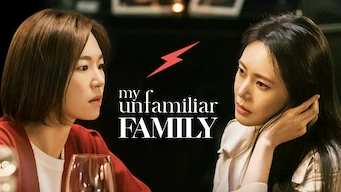 

Retiré de Netflix le 21/07/2024 :material-star:{.gold .heart}:material-star:{.gold .heart}:material-star:{.gold .heart}:material-star:{.gold .heart}:material-star-half-full:{.gold .heart}|Série : **My Unfamiliar Family / (아는 건 별로 없지만) 가족입니다** Origine: **Corée du Sud** Sortie en **2020** Nb. épisodes: **16**  _Cette série décrit ce que représente la famille en Corée, basé sur un scénario qui aborde plusieurs thèmes sur ce sujet._
 

:material-star:{.gold .heart}:material-star:{.gold .heart}:material-star:{.gold .heart}:material-star:{.gold .heart}:material-star-outline:{.grey }|Série : **Mystic Pop-up Bar** Origine: **Corée du Sud** Sortie en **2020** Nb. épisodes: **12**  _Un peu spécial comme scénario, mais on accroche au bout de 2-3 épisodes._
 

:material-star:{.gold .heart}:material-star:{.gold .heart}:material-star:{.gold .heart}:material-star:{.gold .heart}:material-star-outline:{.grey }|Série : **Never Give Up / 구필수는 없다** Origine: **Corée du Sud** Sortie en **2022** Nb. épisodes: **16** :kr: sous-titres en coréens  _Un scénario bien construit, bien ficelé, plein de bonne humeur mais qui reste cependant un peu trop convenu._
 

:material-star:{.gold .heart}:material-star:{.gold .heart}:material-star:{.gold .heart}:material-star-outline:{.grey }:material-star-outline:{.grey }|Série : **Nice Guy / 착한남자** Origine: **Corée du Sud** Sortie en **2012** Nb. épisodes: **20**  _"Stupid Guy" aurait été un titre plus approprié. Dommage, il aurait mérité un scénario plus subtil._
 

:material-star:{.gold .heart}:material-star:{.gold .heart}:material-star:{.gold .heart}:material-star-outline:{.grey }:material-star-outline:{.grey }|Série : **Oh My Baby / 오마이 베이비** Origine: **Corée du Sud** Sortie en **2020** Nb. épisodes: **16**  _Le thème est une cellibataire qui veut avoir un enfant à 40 ans. Ca comme bien, mais ça manque un peu de rythme, le traitement du sujet reste trop succinct._
 

:material-star:{.gold .heart}:material-star:{.gold .heart}:material-star:{.gold .heart}:material-star-outline:{.grey }:material-star-outline:{.grey }|Série : **Oh My Ghostess** Origine: **Corée du Sud** Sortie en **2015** Nb. épisodes: **16**  _Pas mal._
 

:material-star:{.gold .heart}:material-star:{.gold .heart}:material-star:{.gold .heart}:material-star:{.gold .heart}:material-star-half-full:{.gold .heart}|Série : **Oh My Venus** Origine: **Corée du Sud** Sortie en **2016** Nb. épisodes: **16**  _Au premier abord, le sujet ne semblait pas intéressant. Mais c'est très bien fait, le scénario est excellent, les acteurs aussi._
 

:material-star:{.gold .heart}:material-star:{.gold .heart}:material-star:{.gold .heart}:material-star:{.gold .heart}:material-star-half-full:{.gold .heart}|Série : **Once Again** Origine: **Corée du Sud** Sortie en **2020** Nb. épisodes: **50**  _Bon scénario, un peu long sur la fin._
 

:material-star:{.gold .heart}:material-star:{.gold .heart}:material-star:{.gold .heart}:material-star-outline:{.grey }:material-star-outline:{.grey }|Série : **Once Upon a Small Town / 어쩌다 전원일기** Origine: **Corée du Sud** Sortie en **2022** Nb. épisodes: **12** :kr: sous-titres en coréens  _Petite série avec une triangulaire classique, les personnages y étant attachants mais le scénario est un peu court._
 

:material-star:{.gold .heart}:material-star-half-full:{.gold .heart}:material-star-outline:{.grey }:material-star-outline:{.grey }:material-star-outline:{.grey }|Série : **One More Time / 헤어진 다음날** Origine: **Corée du Sud** Sortie en **2016** Nb. épisodes: **8** :kr: sous-titres en coréens  _Un montage de faible qualité incluant une musique rendant les dialogues inaudibles produit un ensemble peu concluant._
:material-numeric-5-circle:  

:material-star:{.gold .heart}:material-star:{.gold .heart}:material-star:{.gold .heart}:material-star:{.gold .heart}:material-star:{.gold .heart}|Série : **One Spring Night** Origine: **Corée du Sud** Sortie en **2019** Nb. épisodes: **16** :kr: sous-titres en coréens  _Excellent, bonne description de la société coréennes et de certains de ses travers._
 

:material-star:{.gold .heart}:material-star:{.gold .heart}:material-star:{.gold .heart}:material-star:{.gold .heart}:material-star-outline:{.grey }|Série : **Une femme unique / One the Woman / 운 더 우먼** Origine: **Corée du Sud** Sortie en **2021** Nb. épisodes: **16**  _Bon scénario, ça s'enchaîne bien, l'actrice principale est excellente, que demander de plus._
 

:material-star:{.gold .heart}:material-star:{.gold .heart}:material-star:{.gold .heart}:material-star:{.gold .heart}:material-star-half-full:{.gold .heart}|Série : **Our Blues /  우리들의 블루스** Origine: **Corée du Sud** Sortie en **2022** Nb. épisodes: **20**  _Une série sur l'amitié et la famille, sur l'île de Jeju, avec un casting impressionnant !_
 

:material-star:{.gold .heart}:material-star:{.gold .heart}:material-star-half-full:{.gold .heart}:material-star-outline:{.grey }:material-star-outline:{.grey }|Série : **Part-Time Idol / 비정규직 아이돌** Origine: **Corée du Sud** Sortie en **2017** Nb. épisodes: **5** :kr: sous-titres en coréens  _Parodie sous forme de micro série "cliché" sur le monde de la K-pop._
 

:material-star:{.gold .heart}:material-star:{.gold .heart}:material-star:{.gold .heart}:material-star-half-full:{.gold .heart}:material-star-outline:{.grey }|Série : **Partners for Justice / 검법남녀** Origine: **Corée du Sud** Sortie de la 2° saison en **2019** Nb. épisodes: **32**  _Des personnages intéressant, mais le beau rôle est toujours tourné vers la police scientifique provoquant certaines incohérences._
 

:material-star:{.gold .heart}:material-star:{.gold .heart}:material-star-outline:{.grey }:material-star-outline:{.grey }:material-star-outline:{.grey }|Série : **Pasta / 파스타** Origine: **Corée du Sud** Sortie en **2010** Nb. épisodes: **20**  _Rencontre d'un imbécile misogyne et d'une idiote en cuisine. La série peine par manque de personnage crédible._
 

:material-star:{.gold .heart}:material-star:{.gold .heart}:material-star:{.gold .heart}:material-star-outline:{.grey }:material-star-outline:{.grey }|Série : **Persona / ㅔ르소나** Origine: **Corée du Sud** Sortie en **2019** Nb. épisodes: **4** :kr: sous-titres en coréens  _Mini-série expérimentale avec comme actrice principale IU, sur des thèmes qui nous poussent à la réflexion._
:material-numeric-7-circle:  

:material-star:{.gold .heart}:material-star:{.gold .heart}:material-star:{.gold .heart}:material-star:{.gold .heart}:material-star:{.gold .heart}|Série : **Pinocchio** Origine: **Corée du Sud** Sortie en **2014** Nb. épisodes: **20**  _Bon scénario sur les journalistes en Corée, même s'il faut quelques épisodes de description avant son démarrage._
 

:material-star:{.gold .heart}:material-star:{.gold .heart}:material-star:{.gold .heart}:material-star:{.gold .heart}:material-star-outline:{.grey }|Série : **Police University / 경찰수업** Origine: **Corée du Sud** Sortie en **2021** Nb. épisodes: **16**  _L'intrigue est un peu légère, mais cela est agréable à regarder._
 

:material-star:{.gold .heart}:material-star:{.gold .heart}:material-star:{.gold .heart}:material-star-outline:{.grey }:material-star-outline:{.grey }|Série : **President** Origine: **Corée du Sud** Sortie en **2010** Nb. épisodes: **20**  _La politique, mets trop éloignée de la réalité._
 

:material-star:{.gold .heart}:material-star:{.gold .heart}:material-star:{.gold .heart}:material-star:{.gold .heart}:material-star-outline:{.grey }|Série : **Prison Playbook** Origine: **Corée du Sud** Sortie en **2017** Nb. épisodes: **16**  _Bien fait, mais un peu trop de solution "sortie du chapeau"._
 

:material-star:{.gold .heart}:material-star:{.gold .heart}:material-star:{.gold .heart}:material-star:{.gold .heart}:material-star-outline:{.grey }|Série : **Private Lives** Origine: **Corée du Sud** Sortie en **2020** Nb. épisodes: **16**  _Très bonne série dans le monde de l'escroquerie._
 

Retiré de Netflix le 30/06/2021 :material-star:{.gold .heart}:material-star:{.gold .heart}:material-star:{.gold .heart}:material-star-outline:{.grey }:material-star-outline:{.grey }|Série : **Queen for Seven Days / 7일의 왕비** Origine: **Corée du Sud** Sortie en **2017** Nb. épisodes: **20** :kr: sous-titres en coréens  _L'intrigue est pas mal. La psychologie des personnages aussi, mais il y a quelques longueurs, surtout à la fin. Les "méchants" sont un peu trop surjoués, ce qui gâche leur crédibilité. Les 5 premières minutes du premier épisode gâchent la majorité des suspenses._
 

:material-star:{.gold .heart}:material-star:{.gold .heart}:material-star:{.gold .heart}:material-star-half-full:{.gold .heart}:material-star-outline:{.grey }|Série : **Queenmaker / 퀸메이커** Origine: **Corée du Sud** Sortie en **2023** Nb. épisodes: **11** :kr: sous-titres en coréens  _Série politique plutôt orienté élection le scénario est pas mal et cela s'enchaîne bien._
 

:material-star:{.gold .heart}:material-star:{.gold .heart}:material-star:{.gold .heart}:material-star-outline:{.grey }:material-star-outline:{.grey }|Série : **Racket Boys / 라켓 소년단** Origine: **Corée du Sud** Sortie en **2021** Nb. épisodes: **16** :kr: sous-titres en coréens  _Le monde du sport en Corée du Sud avec le badminton en toile de fond; une comédie plutôt agréable à voir, dans un style BD teenage._
 

Retiré de Netflix le 30/06/2021 :material-star:{.gold .heart}:material-star:{.gold .heart}:material-star:{.gold .heart}:material-star-half-full:{.gold .heart}:material-star-outline:{.grey }|Série : **Radio Romance / 라디오 로맨스** Origine: **Corée du Sud** Sortie en **2018** Nb. épisodes: **16** :kr: sous-titres en coréens  _Un scénario sur le monde de la radio et le star-system Coréen. De très bonne facture, mets le scénario manque de rythme. Dommage._
 

:material-star:{.gold .heart}:material-star:{.gold .heart}:material-star:{.gold .heart}:material-star:{.gold .heart}:material-star-outline:{.grey }|Série : **Rain or Shine / 그냥 사랑하는 사이** Origine: **Corée du Sud** Sortie en **2017** Nb. épisodes: **16**  _La reconstruction des personnes victime d'un effondrement de batiment. Sujet difficile, mais plutôt bien traité avec un scénario qui tient la route._
 

:material-star:{.gold .heart}:material-star:{.gold .heart}:material-star-half-full:{.gold .heart}:material-star-outline:{.grey }:material-star-outline:{.grey }|Série : **The Real Has Come!  / Rattrapés par la réalité ! / 진짜가 나타났다!** Origine: **Corée du Sud** Sortie en **2023** Nb. épisodes: **50**  _Une histoire familiale avec un scénario beaucoup trop imbriqué et au final peu crédible, avec des personnages trop naïfs et des situations  habituelles et prévisibles._
 

:material-star:{.gold .heart}:material-star:{.gold .heart}:material-star:{.gold .heart}:material-star:{.gold .heart}:material-star-outline:{.grey }|Série : **Rebel: Thief Who Stole the People** Origine: **Corée du Sud** Sortie en **2017** Nb. épisodes: **30**  _Très bonne série._
 

:material-star:{.gold .heart}:material-star:{.gold .heart}:material-star:{.gold .heart}:material-star-half-full:{.gold .heart}:material-star-outline:{.grey }|Série : **Record of Youth / 청춘기록** Origine: **Corée du Sud** Sortie en **2020** Nb. épisodes: **16** :kr: sous-titres en coréens  _La gestion de carrière des acteurs et le chao qui l'accompagne est le thème principal de cette série dispose d'un scénario complet._
 

Retiré de Netflix le 14/09/2021 :material-star-outline:{.grey }:material-star-outline:{.grey }:material-star-outline:{.grey }:material-star-outline:{.grey }:material-star-outline:{.grey }|Série : **Reign : le destin d'une reine** Origine: **Corée du Sud** Sortie de la 4° saison en **2021** Nb. épisodes: **78**  _Comment faire croire qu'un château anglais peut représenter la cour de France ! Du grand n'importe quoi en terme de décor ! Abandonner dès le 1er épisode !_
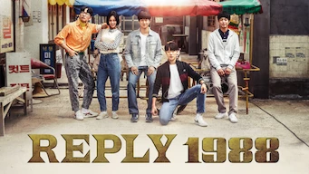 

Retiré de Netflix le 30/09/2021 :material-star:{.gold .heart}:material-star:{.gold .heart}:material-star:{.gold .heart}:material-star:{.gold .heart}:material-star-outline:{.grey }|Série : **Reply 1988 / 응답하라 1988** Origine: **Corée du Sud** Sortie en **2015** Nb. épisodes: **20**  _Sans doute le meilleur des "Reply", une "tranche de vie" dans un quatier pauvre de Séoul. Très bon scénario, malgré quelques lourdeurs communes aux autres "Reply"._
 

:material-star:{.gold .heart}:material-star:{.gold .heart}:material-star:{.gold .heart}:material-star-outline:{.grey }:material-star-outline:{.grey }|Série : **Reply 1994 / 응답하라 1994** Origine: **Corée du Sud** Sortie en **2014** Nb. épisodes: **21** :kr: sous-titres en coréens  _De l'adolescence à l'âge adulte, intéressant mais peu entraînant. Très bien pour apprendre des gros mots._
 

Retiré de Netflix le 30/09/2021 :material-star:{.gold .heart}:material-star:{.gold .heart}:material-star:{.gold .heart}:material-star-outline:{.grey }:material-star-outline:{.grey }|Série : **Reply 1997 / 응답하라 1997** Origine: **Corée du Sud** Sortie en **2012** Nb. épisodes: **16** :kr: sous-titres en coréens  _Dans la lignée des séries "reply", c'est bien construit malgré de faux suspenses cassant le rythme, comme dans la majorité des autres séries "reply"._
 

:material-star:{.gold .heart}:material-star:{.gold .heart}:material-star:{.gold .heart}:material-star:{.gold .heart}:material-star-half-full:{.gold .heart}|Série : **Welcome to Samdalri / Retour à Samdal-ri / 웰컴투 삼달리** Origine: **Corée du Sud** Sortie en **2023** Nb. épisodes: **16** :kr: sous-titres en coréens  _Très bon scénario mélangeant modernité et tradition avec un excellent casting._
 

:material-star:{.gold .heart}:material-star:{.gold .heart}:material-star:{.gold .heart}:material-star-outline:{.grey }:material-star-outline:{.grey }|Série : **Reunited Worlds / 다시 만난 세계** Origine: **Corée du Sud** Sortie en **2017** Nb. épisodes: **20**  _Les ficelles sont un peu grosses, malgré quelques bonnes surprises. L'histoire est pas mal mais le scénario aurait dû être plus subtil._
 

:material-star:{.gold .heart}:material-star:{.gold .heart}:material-star:{.gold .heart}:material-star-half-full:{.gold .heart}:material-star-outline:{.grey }|Série : **Revolutionary Love** Origine: **Corée du Sud** Sortie en **2017** Nb. épisodes: **16**  _Assez classique, mais plutôt bien imaginé avec des personnages suffisamment complexes._
 

:material-star:{.gold .heart}:material-star:{.gold .heart}:material-star:{.gold .heart}:material-star-outline:{.grey }:material-star-outline:{.grey }|Série : **Revolutionary Sisters / 오케이 광자매** Origine: **Corée du Sud** Sortie en **2021** Nb. épisodes: **50**  _Histoire de famille .. le scénario est plutôt bien fait, mais certaines scènes sont loupées et viennent alourdir l'ensemble._
 

:material-star:{.gold .heart}:material-star:{.gold .heart}:material-star:{.gold .heart}:material-star:{.gold .heart}:material-star-outline:{.grey }|Série : **Romance Is a Bonus Book** Origine: **Corée du Sud** Sortie en **2019** Nb. épisodes: **16**  _Le démarrage est un peu lent, mais cela démarre enfin dès le 2ème épisode. Très bien._
 

:material-star:{.gold .heart}:material-star:{.gold .heart}:material-star:{.gold .heart}:material-star-outline:{.grey }:material-star-outline:{.grey }|Série : **Romance in the House / 가족X멜로** Origine: **Corée du Sud** Sortie en **2024** Nb. épisodes: **12** :kr: sous-titres en coréens  _Un père longtemps absent réapparaît dans cette série un peu lente dans son action et avec de fausses surprises._
 

:material-star:{.gold .heart}:material-star:{.gold .heart}:material-star:{.gold .heart}:material-star:{.gold .heart}:material-star-outline:{.grey }|Série : **Rooftop Prince** Origine: **Corée du Sud** Sortie en **2012** Nb. épisodes: **20**  _Excellente idée de scénario, démarre très bien mais il manque quelques idées pour les derniers épisodes._
 

:material-star:{.gold .heart}:material-star:{.gold .heart}:material-star:{.gold .heart}:material-star-outline:{.grey }:material-star-outline:{.grey }|Série : **Rookie Historian Goo Hae-Ryung** Origine: **Corée du Sud** Sortie en **2019** Nb. épisodes: **20**  _Pas mal._
 

:material-star-half-full:{.gold .heart}:material-star-outline:{.grey }:material-star-outline:{.grey }:material-star-outline:{.grey }:material-star-outline:{.grey }|Série : **Rugal / 루갈** Origine: **Corée du Sud** Sortie en **2020** Nb. épisodes: **16**  _Violence gratuite, trop prévisible, les personnage sont plus stupides les uns que les autres, scénario inconsistant : les super-héros les plus bêtes de l'histoire (coréenne)._
 

:material-star:{.gold .heart}:material-star:{.gold .heart}:material-star:{.gold .heart}:material-star-outline:{.grey }:material-star-outline:{.grey }|Série : **Run On / 런온** Origine: **Corée du Sud** Sortie en **2020** Nb. épisodes: **16**  _Série qui manque un peu de rebondissements, sauvé par l'histoire du couple du peintre et de la PDG._
 

:material-star:{.gold .heart}:material-star:{.gold .heart}:material-star:{.gold .heart}:material-star:{.gold .heart}:material-star-half-full:{.gold .heart}|Série : **SKY Castle / SKY 캐슬** Origine: **Corée du Sud** Sortie en **2018** Nb. épisodes: **21**  _Cette série est une critique du système éducatif en Corée et de ses abus. La série a eu beaucoup de succès et c'est justifié._
 

:material-star:{.gold .heart}:material-star:{.gold .heart}:material-star:{.gold .heart}:material-star:{.gold .heart}:material-star-half-full:{.gold .heart}|Série : **Saimdang, Memoir of Colors** Origine: **Corée du Sud** Sortie en **2017** Nb. épisodes: **28**  _Très bonne leçon d'histoire sur un personnage attachant de la Corée._
 

:material-star:{.gold .heart}:material-star:{.gold .heart}:material-star:{.gold .heart}:material-star-outline:{.grey }:material-star-outline:{.grey }|Série : **Sans issue** Origine: **Corée du Sud** Sortie en **2014** Nb. épisodes: **20**  _La fin est pas terrible. Dommage._
 

:material-star:{.gold .heart}:material-star:{.gold .heart}:material-star:{.gold .heart}:material-star:{.gold .heart}:material-star-outline:{.grey }|Série : **Save Me / 구해 줘** Origine: **Corée du Sud** Sortie en **2017** Nb. épisodes: **16**  _Très bonne description de l'emprise des sectes, mais les séquences sont un peu trop répétitives._
 

Retiré de Netflix le 30/06/2021 :material-star:{.gold .heart}:material-star:{.gold .heart}:material-star:{.gold .heart}:material-star-half-full:{.gold .heart}:material-star-outline:{.grey }|Série : **School 2017 / 학교 2017** Origine: **Corée du Sud** Sortie en **2017** Nb. épisodes: **16** :kr: sous-titres en coréens  _Assez bon scénario, très teenage, quelques bonnes surprises, la fin laisse à désirer._
 

:material-star:{.gold .heart}:material-star:{.gold .heart}:material-star:{.gold .heart}:material-star-half-full:{.gold .heart}:material-star-outline:{.grey }|Série : **Search WWW / 검색어를 입력하세요 www** Origine: **Corée du Sud** Sortie en **2019** Nb. épisodes: **16**  _L'histoire est bien mais la réalisation est trop lente, certaines scènes deviennent ennuyeuses à cause de leurs longueurs. Le travail dans la société digital est aussi peu crédible, même si l'environnement de travail, lui, est représentatif._
 

:material-star:{.gold .heart}:material-star:{.gold .heart}:material-star:{.gold .heart}:material-star:{.gold .heart}:material-star-outline:{.grey }|Série : **Secret Garden** Origine: **Corée du Sud** Sortie en **2010** Nb. épisodes: **20**  _De très bonne facture._
 

:material-star:{.gold .heart}:material-star:{.gold .heart}:material-star:{.gold .heart}:material-star-outline:{.grey }:material-star-outline:{.grey }|Série : **Secret Royal Inspector & Joy / 어사와 조이** Origine: **Corée du Sud** Sortie en **2021** Nb. épisodes: **16**  _Une intrigue bien construite, mais le burlesque alourdit le scénario._
 

:material-star:{.gold .heart}:material-star:{.gold .heart}:material-star:{.gold .heart}:material-star-outline:{.grey }:material-star-outline:{.grey }|Série : **Sell Your Haunted House / 대박부동산** Origine: **Corée du Sud** Sortie en **2021** Nb. épisodes: **16**  _C'est bien fait, surtout les effets spéciaux, même si le scénario reste classique pour un film d'esprits vengeurs._
 

:material-star:{.gold .heart}:material-star:{.gold .heart}:material-star:{.gold .heart}:material-star-outline:{.grey }:material-star-outline:{.grey }|Série : **Sh**ting Stars / 별똥별** Origine: **Corée du Sud** Sortie en **2022** Nb. épisodes: **16**  _Le métier d'acteur, de différents points de vue, classique._
 

:material-star:{.gold .heart}:material-star:{.gold .heart}:material-star:{.gold .heart}:material-star-outline:{.grey }:material-star-outline:{.grey }|Série : **She Would Never Know / 선배, 그 립스틱 바르지 마요** Origine: **Corée du Sud** Sortie en **2021** Nb. épisodes: **16**  _Un scénario qui tient la route mais qui est parfois monotone avec un couple principal parfois peu crédible. L'ensemble reste correct._
 

:material-star:{.gold .heart}:material-star:{.gold .heart}:material-star:{.gold .heart}:material-star-outline:{.grey }:material-star-outline:{.grey }|Série : **Signal** Origine: **Corée du Sud** Sortie en **2016** Nb. épisodes: **16**  _Scénario intéressant mais des longueurs trop nombreuses._
 

:material-star:{.gold .heart}:material-star:{.gold .heart}:material-star:{.gold .heart}:material-star:{.gold .heart}:material-star-outline:{.grey }|Série : **Sisyphus** Origine: **Corée du Sud** Sortie en **2021** Nb. épisodes: **16**  _SF, très bien fait, très bon scénario, dommage que les combats avec armes à feu soient aussi peu crédible (seul bémol)_
 

Retiré de Netflix le 31/12/2020 :material-star:{.gold .heart}:material-star:{.gold .heart}:material-star:{.gold .heart}:material-star:{.gold .heart}:material-star-outline:{.grey }|Série : **Six Flying Dragons / 육룡이_나르샤** Origine: **Corée du Sud** Sortie en **2015** Nb. épisodes: **50**  _L'histoire de la Corée, à la base. A voir._
:material-numeric-1-circle:{.num_gold}  

:material-star:{.gold .heart}:material-star:{.gold .heart}:material-star:{.gold .heart}:material-star:{.gold .heart}:material-star:{.gold .heart}|Série : **Something in the Rain / 밥 잘 사주는 예쁜 누나** Origine: **Corée du Sud** Sortie en **2018** Nb. épisodes: **16**  _Excellent, aborde à la fois le monde du travail et un des tabous de la société coréenne._
 

:material-star:{.gold .heart}:material-star:{.gold .heart}:material-star:{.gold .heart}:material-star:{.gold .heart}:material-star-half-full:{.gold .heart}|Série : **Song of the Bandits / 도적 칼의 소리** Origine: **Corée du Sud** Sortie en **2023** Nb. épisodes: **9** :kr: sous-titres en coréens  _Survivre à l'occupation japonaise, série d'action plutôt bien faite, un peu courte._
 

:material-star:{.gold .heart}:material-star:{.gold .heart}:material-star:{.gold .heart}:material-star-half-full:{.gold .heart}:material-star-outline:{.grey }|Série : **Spark / 스파크** Origine: **Corée du Sud** Sortie en **2016** Nb. épisodes: **12** :kr: sous-titres en coréens  _Mini série dans le monde du show-biz, gentille mais mais trop court._
 

:material-star:{.gold .heart}:material-star:{.gold .heart}:material-star:{.gold .heart}:material-star-outline:{.grey }:material-star-outline:{.grey }|Série : **Squid Game / 오징어 게임** Origine: **Corée du Sud** Sortie en **2021** Nb. épisodes: **9** :kr: sous-titres en coréens  _Trop "téléphoné", peu de surprise, on devine facilement ce qui va se passer. Dommage, le sujet aurait dû être mieux exploiter, style Game of Thrones._
 

:material-star:{.gold .heart}:material-star:{.gold .heart}:material-star:{.gold .heart}:material-star:{.gold .heart}:material-star-half-full:{.gold .heart}|Série : **Start-Up** Origine: **Corée du Sud** Sortie en **2020** Nb. épisodes: **16**  _Bonne histoire sur le milieu de startups et leurs incubateurs. Les spécificités de la Corée en prime._
 

:material-star:{.gold .heart}:material-star:{.gold .heart}:material-star:{.gold .heart}:material-star:{.gold .heart}:material-star-outline:{.grey }|Série : **Still 17** Origine: **Corée du Sud** Sortie en **2018** Nb. épisodes: **16**  _Scénario original, très bien traité._
 

:material-star:{.gold .heart}:material-star:{.gold .heart}:material-star:{.gold .heart}:material-star-half-full:{.gold .heart}:material-star-outline:{.grey }|Série : **Stranger** Origine: **Corée du Sud** Sortie de la 2° saison en **2020** Nb. épisodes: **32**  _Les influences entre politique et justice, plutôt bien fait avec d'excellents acteurs._
 

Retiré de Netflix le 14/05/2022 :material-star:{.gold .heart}:material-star-half-full:{.gold .heart}:material-star-outline:{.grey }:material-star-outline:{.grey }:material-star-outline:{.grey }|Série : **Strangers From Hell / 타인은 지옥이다** Origine: **Corée du Sud** Sortie en **2019** Nb. épisodes: **10**  _Série policière très sombre, très macabre, avec une ambiance particulièrement pesante._
 

:material-star:{.gold .heart}:material-star:{.gold .heart}:material-star:{.gold .heart}:material-star-outline:{.grey }:material-star-outline:{.grey }|Série : **Strong Girl Bong-soon** Origine: **Corée du Sud** Sortie en **2017** Nb. épisodes: **16**  _Scénario et acteurs sont pas mal mais ça manque de relance._
 

:material-star:{.gold .heart}:material-star:{.gold .heart}:material-star:{.gold .heart}:material-star-outline:{.grey }:material-star-outline:{.grey }|Série : **Strong Girl Nam-soon / 힘쎈여자 강남순** Origine: **Corée du Sud** Sortie en **2023** Nb. épisodes: **16** :kr: sous-titres en coréens  _Léger, prenant, et surout bien mieux que les Marvel._
 

:material-star:{.gold .heart}:material-star:{.gold .heart}:material-star:{.gold .heart}:material-star-half-full:{.gold .heart}:material-star-outline:{.grey }|Série : **Strongest Deliveryman / 최강 배달꾼** Origine: **Corée du Sud** Sortie en **2017** Nb. épisodes: **16** :kr: sous-titres en coréens  _Le monde des livreurs à scooter, plutôt bien décrit avec quelques lourdeurs sur la durée, le scénario ayant quelques lacunes mais rien de méchant._
 

:material-star:{.gold .heart}:material-star:{.gold .heart}:material-star-half-full:{.gold .heart}:material-star-outline:{.grey }:material-star-outline:{.grey }|Série : **Suits** Origine: **Corée du Sud** Sortie en **2018** Nb. épisodes: **16**  _Scénario trop proche de l'américian._
 

:material-star:{.gold .heart}:material-star:{.gold .heart}:material-star:{.gold .heart}:material-star:{.gold .heart}:material-star-half-full:{.gold .heart}|Série : **Suspicious Partner** Origine: **Corée du Sud** Sortie en **2017** Nb. épisodes: **20**  _Excellent début. Plus classique ensuite._
 

:material-star:{.gold .heart}:material-star:{.gold .heart}:material-star-half-full:{.gold .heart}:material-star-outline:{.grey }:material-star-outline:{.grey }|Série : **Tale of the Nine Tailed / 구미호뎐** Origine: **Corée du Sud** Sortie en **2020** Nb. épisodes: **16**  _Histoire se passant dans un monde moderne mais où sont présents certaines divinités asiatiques, la série est agréable à regarder, bourré d'idée, mais elle laisse un goût de superficiel._
 

:material-star:{.gold .heart}:material-star:{.gold .heart}:material-star:{.gold .heart}:material-star-half-full:{.gold .heart}:material-star-outline:{.grey }|Série : **Taxi Driver / 모범택시** Origine: **Corée du Sud** Sortie en **2021** Nb. épisodes: **16**  _Ce n'est pas la finesse qui dominent dans cette série, prétexte à des combats souvent surdimensionnés; il aurait mérité un traitement plus réaliste et plus subtil, la thématique étant plutôt intéressante._
 

:material-star:{.gold .heart}:material-star:{.gold .heart}:material-star:{.gold .heart}:material-star-half-full:{.gold .heart}:material-star-outline:{.grey }|Série : **Tempted / 위대한 유혹자** Origine: **Corée du Sud** Sortie en **2018** Nb. épisodes: **16**  _Un scénario un peu trop cousu de fil blanc, et donc sans surprise, mais la réalisation est bonne et les acteurs jouent juste._
 

:material-star:{.gold .heart}:material-star:{.gold .heart}:material-star-outline:{.grey }:material-star-outline:{.grey }:material-star-outline:{.grey }|Série : **That Winter, the Wind Blows** Origine: **Corée du Sud** Sortie en **2013** Nb. épisodes: **16**  _Dommage, mauvais acteur principal, actrice par contre très bien_
 

:material-star:{.gold .heart}:material-star:{.gold .heart}:material-star:{.gold .heart}:material-star-outline:{.grey }:material-star-outline:{.grey }|Série : **The 1st Shop of Coffee Prince** Origine: **Corée du Sud** Sortie en **2007** Nb. épisodes: **17**  _Histoire autour d'un café, plutôt bien réalisé._
 

:material-star:{.gold .heart}:material-star-half-full:{.gold .heart}:material-star-outline:{.grey }:material-star-outline:{.grey }:material-star-outline:{.grey }|Série : **The Bride of Habaek** Origine: **Corée du Sud** Sortie en **2017** Nb. épisodes: **16**  _Trop lourd, trop long, trop monotone._
 

:material-star:{.gold .heart}:material-star:{.gold .heart}:material-star:{.gold .heart}:material-star-outline:{.grey }:material-star-outline:{.grey }|Série : **The Crowned Clown / 왕이 된 남자** Origine: **Corée du Sud** Sortie en **2019** Nb. épisodes: **16**  _Série plus fiction qu'historique, avec beaucoup de scènes peu crédibles et de grosses lenteurs. Dommage cela aurait pu être un peu moins larmoyant._
 

:material-star:{.gold .heart}:material-star:{.gold .heart}:material-star:{.gold .heart}:material-star-half-full:{.gold .heart}:material-star-outline:{.grey }|Série : **The Cursed / 방법** Origine: **Corée du Sud** Sortie en **2020** Nb. épisodes: **12**  _Série fantastique autour du chamanisme et des malédictions plutôt bien fait._
 

Retiré de Netflix le 23/02/2021 :material-star:{.gold .heart}:material-star:{.gold .heart}:material-star-half-full:{.gold .heart}:material-star-outline:{.grey }:material-star-outline:{.grey }|Série : **The Emperor Owner of the Mask** Origine: **Corée du Sud** Sortie en **2017** Nb. épisodes: **20**  _Dommage, le scénario aurait pu être moins lourd, surtout à la fin._
 

:material-star:{.gold .heart}:material-star:{.gold .heart}:material-star:{.gold .heart}:material-star:{.gold .heart}:material-star-outline:{.grey }|Série : **The Empress Ki** Origine: **Corée du Sud** Sortie en **2013** Nb. épisodes: **51**  _Je ne sais pas si c'est basé sur des faits historiques, mais c'est captivant._
 

:material-star:{.gold .heart}:material-star:{.gold .heart}:material-star:{.gold .heart}:material-star-outline:{.grey }:material-star-outline:{.grey }|Série : **The Fiery Priest** Origine: **Corée du Sud** Sortie en **2019** Nb. épisodes: **20**  _La messe ce n'est pas son fort._
 

:material-star:{.gold .heart}:material-star:{.gold .heart}:material-star-outline:{.grey }:material-star-outline:{.grey }:material-star-outline:{.grey }|Série : **The Girl Who Sees Scents** Origine: **Corée du Sud** Sortie en **2015** Nb. épisodes: **16**  _Bonne idée, mais très mal exploité._
 

:material-star:{.gold .heart}:material-star:{.gold .heart}:material-star:{.gold .heart}:material-star-half-full:{.gold .heart}:material-star-outline:{.grey }|Série : **The Glory / 더 글로리** Origine: **Corée du Sud** Sortie en **2022** Nb. épisodes: **16** :kr: sous-titres en coréens  _La vengeance par la manipulation, une histoire basée sur un scénario bien construit mais on reste un peu sur sa faim._
 

:material-star:{.gold .heart}:material-star:{.gold .heart}:material-star:{.gold .heart}:material-star-half-full:{.gold .heart}:material-star-outline:{.grey }|Série : **The Good Detective / 모범형사** Origine: **Corée du Sud** Sortie de la 2° saison en **2022** Nb. épisodes: **32**  _Bonne série policière avec un scénario à tiroir plutôt bien construit._
 

:material-star:{.gold .heart}:material-star:{.gold .heart}:material-star:{.gold .heart}:material-star-outline:{.grey }:material-star-outline:{.grey }|Série : **The Guest** Origine: **Corée du Sud** Sortie en **2018** Nb. épisodes: **18**  _Bizarre, étrange et superstition._
 

:material-star:{.gold .heart}:material-star:{.gold .heart}:material-star:{.gold .heart}:material-star:{.gold .heart}:material-star-half-full:{.gold .heart}|Série : **The K2** Origine: **Corée du Sud** Sortie en **2016** Nb. épisodes: **16**  _Très bonne série, de type action. Mérite une suite._
 

:material-star:{.gold .heart}:material-star:{.gold .heart}:material-star:{.gold .heart}:material-star:{.gold .heart}:material-star-outline:{.grey }|Série : **The King 2 Hearts** Origine: **Corée du Sud** Sortie en **2012** Nb. épisodes: **20**  _Très bonne série._
 

:material-star:{.gold .heart}:material-star:{.gold .heart}:material-star-half-full:{.gold .heart}:material-star-outline:{.grey }:material-star-outline:{.grey }|Série : **The King's Affection / 연모** Origine: **Corée du Sud** Sortie en **2021** Nb. épisodes: **20** :kr: sous-titres en coréens  _Beaucoup trop mièvre comme série, perd assez rapidement crédibilité avec énormément de longueur. L'intrigue est bonne mais le scénario scénario est mal construit et surtout trop prévisible._
 

:material-star:{.gold .heart}:material-star:{.gold .heart}:material-star-outline:{.grey }:material-star-outline:{.grey }:material-star-outline:{.grey }|Série : **The King: Eternal Monarch** Origine: **Corée du Sud** Sortie en **2020** Nb. épisodes: **16**  _Une bonne idée à la base, mais très mal exploitée._
 

:material-star:{.gold .heart}:material-star:{.gold .heart}:material-star:{.gold .heart}:material-star:{.gold .heart}:material-star-half-full:{.gold .heart}|Série : **The Lady in Dignity / 품위있는 그녀** Origine: **Corée du Sud** Sortie en **2017** Nb. épisodes: **20** :kr: sous-titres en coréens  _Excellente série sur la manipulation et les déboires que cela provoque sur une famille. Il est dommage que la chronologie des événements ne soit pas respectée, rendant inintéressante certaines scènes._
 

Retiré de Netflix le 09/01/2022 :material-star:{.gold .heart}:material-star:{.gold .heart}:material-star-outline:{.grey }:material-star-outline:{.grey }:material-star-outline:{.grey }|Série : **The Last Empress / 황후의 품격** Origine: **Corée du Sud** Sortie en **2018** Nb. épisodes: **26**  _Sans doute issu d'un manga, l'histoire est pas mal mais les ficelles sont trop grosses, tellement grosses que ça perd en cohérence._
 

:material-star:{.gold .heart}:material-star:{.gold .heart}:material-star:{.gold .heart}:material-star-half-full:{.gold .heart}:material-star-outline:{.grey }|Série : **The Liar and His Lover / 그녀는 거짓말을 너무 사랑해** Origine: **Corée du Sud** Sortie en **2017** Nb. épisodes: **16**  _Le scénario est un peu faible et les personnages un peu trop naïf. Cela se laisse néanmoins regarder._
 

:material-star:{.gold .heart}:material-star:{.gold .heart}:material-star-half-full:{.gold .heart}:material-star-outline:{.grey }:material-star-outline:{.grey }|Série : **The Lies Within / 모두의 거짓말** Origine: **Corée du Sud** Sortie en **2019** Nb. épisodes: **16**  _Un scénario un peu trop tiré par les cheveux, les personnages sont parfois trop naïfs._
 

:material-star:{.gold .heart}:material-star:{.gold .heart}:material-star:{.gold .heart}:material-star-half-full:{.gold .heart}:material-star-outline:{.grey }|Série : **Radieuse / The Light in Your Eyes / 눈이 부시게** Origine: **Corée du Sud** Sortie en **2019** Nb. épisodes: **12**  _Cette série est entraînante et plutôt efficace, même si elle prend des chemins détournés pour nous amener au sujet principal._
 

:material-star:{.gold .heart}:material-star:{.gold .heart}:material-star-half-full:{.gold .heart}:material-star-outline:{.grey }:material-star-outline:{.grey }|Série : **The Miracle / 미라글** Origine: **Corée du Sud** Sortie en **2016** Nb. épisodes: **12** :kr: sous-titres en coréens  _Mini série sur un scénario assez classique. Pas de véritable surprise._
 

:material-star:{.gold .heart}:material-star:{.gold .heart}:material-star:{.gold .heart}:material-star-outline:{.grey }:material-star-outline:{.grey }|Série : **The Moon That Embraces The Sun** Origine: **Corée du Sud** Sortie en **2012** Nb. épisodes: **20**  _Pas mal._
 

:material-star:{.gold .heart}:material-star:{.gold .heart}:material-star:{.gold .heart}:material-star:{.gold .heart}:material-star-half-full:{.gold .heart}|Série : **The Nokdu Flower / 녹두꽃** Origine: **Corée du Sud** Sortie en **2019** Nb. épisodes: **24**  _Très belle fresque historique sur la Corée de la fin du 19e siècle._
 

Retiré de Netflix le 04/11/2021 :material-star:{.gold .heart}:material-star:{.gold .heart}:material-star:{.gold .heart}:material-star:{.gold .heart}:material-star-outline:{.grey }|Série : **The Package / 더 패키지** Origine: **Corée du Sud** Sortie en **2017** Nb. épisodes: **12**  _Un scénario qui se passe majoritairement en France, avec de très beaux paysages et lieux touristiques. Très bien fait, mais il manque un petit quelque chose, une étincelle, pour élever l'ensemble._
 

:material-star:{.gold .heart}:material-star:{.gold .heart}:material-star-outline:{.grey }:material-star-outline:{.grey }:material-star-outline:{.grey }|Série : **The Penthouse: War in Life / 펜트하우스** Origine: **Corée du Sud** Sortie de la 3° saison en **2021** Nb. épisodes: **48**  _Série malheureusement dans l'exagération permanente, un scénario plein de lacunes avec des méchants trop méchants, des gentils trop naïfs, des actions trop extravagantes; sans oublier la police qui n'est pas à la fête, incapable de ne jamais trouver la moindre piste malgré les dizaines d'indices à disposition._
 

:material-star:{.gold .heart}:material-star:{.gold .heart}:material-star:{.gold .heart}:material-star-outline:{.grey }:material-star-outline:{.grey }|Série : **The Possessed / 도시괴담** Origine: **Corée du Sud** Sortie en **2020** Nb. épisodes: **8** :kr: sous-titres en coréens  _Micro-série d'épouvante, pour les amateurs du genre, plutôt bien réalisé._
 

:material-star:{.gold .heart}:material-star:{.gold .heart}:material-star:{.gold .heart}:material-star-outline:{.grey }:material-star-outline:{.grey }|Série : **The Producers / 프로듀사** Origine: **Corée du Sud** Sortie en **2015** Nb. épisodes: **12**  _Série sur le thème des producteurs d'émissions à la télévision, avec au programme triangulaires amoureuses._
 

:material-star:{.gold .heart}:material-star:{.gold .heart}:material-star:{.gold .heart}:material-star-outline:{.grey }:material-star-outline:{.grey }|Série : **The School Nurse Files / 보건교사 안은영** Origine: **Corée du Sud** Sortie en **2020** Nb. épisodes: **6**  _Bizarre, décaler, et donc intéressant._
 

:material-star:{.gold .heart}:material-star:{.gold .heart}:material-star:{.gold .heart}:material-star:{.gold .heart}:material-star-outline:{.grey }|Série : **The Secret Life of My Secretary** Origine: **Corée du Sud** Sortie en **2019** Nb. épisodes: **16**  _La secrétaire que l'on voudrait tous avoir._
 

:material-star:{.gold .heart}:material-star:{.gold .heart}:material-star:{.gold .heart}:material-star:{.gold .heart}:material-star-outline:{.grey }|Série : **La mer de tranquilité / The Silent Sea / 고요의 바다** Origine: **Corée du Sud** Sortie en **2021** Nb. épisodes: **8**  _Science fiction, quelques erreurs pour un film qui se passe en majorité sur la lune avec un scénario très classique, mais le contexte est très bien._
 

:material-star:{.gold .heart}:material-star:{.gold .heart}:material-star:{.gold .heart}:material-star-outline:{.grey }:material-star-outline:{.grey }|Série : **The Sound of Magic / 안나라수마나라** Origine: **Corée du Sud** Sortie en **2022** Nb. épisodes: **6** :kr: sous-titres en coréens  _Une mini série entre le conte et la comédie musicale, plutôt bien fait mais sans trop de profondeur._
 

:material-star:{.gold .heart}:material-star:{.gold .heart}:material-star-half-full:{.gold .heart}:material-star-outline:{.grey }:material-star-outline:{.grey }|Série : **The Sound of Your Heart / 마음의소리** Origine: **Corée du Sud** Sortie en **2018** Nb. épisodes: **10** :kr: sous-titres en coréens  _Style la famille Bidochon en Corée, humour très coréen._
 

:material-star:{.gold .heart}:material-star:{.gold .heart}:material-star:{.gold .heart}:material-star:{.gold .heart}:material-star-outline:{.grey }|Série : **The Tale of Nokdu** Origine: **Corée du Sud** Sortie en **2019** Nb. épisodes: **16**  _Contexte amusant, très bien fait, et pas trop loufoque._
 

Retiré de Netflix le 31/01/2022 :material-star:{.gold .heart}:material-star:{.gold .heart}:material-star-outline:{.grey }:material-star-outline:{.grey }:material-star-outline:{.grey }|Série : **The Third Charm / 제 3의 매력** Origine: **Corée du Sud** Sortie en **2018** Nb. épisodes: **16**  _Pseudo histoire d'amour de deux personnages qui ne s'aiment pas avec pas mal de lenteur sur la deuxième partie. Les rôles secondaires sont plus intéressants._
 

:material-star:{.gold .heart}:material-star:{.gold .heart}:material-star:{.gold .heart}:material-star-half-full:{.gold .heart}:material-star-outline:{.grey }|Série : **The Wind Blows / 바람이 분다** Origine: **Corée du Sud** Sortie en **2019** Nb. épisodes: **16**  _La dure réalité et la lente descente aux enfers de la maladie d'Alzheimer, sujet traité sur plusieurs points de vue, bien fait mais un peu long._
 

Retiré de Netflix le 30/09/2024 :material-star:{.gold .heart}:material-star:{.gold .heart}:material-star:{.gold .heart}:material-star-half-full:{.gold .heart}:material-star-outline:{.grey }|Série : **Through the Darkness / 악의 마음을 읽는 자들** Origine: **Corée du Sud** Sortie en **2022** Nb. épisodes: **12**  _L'histoire des premiers profilers des tueurs en serie en Corée du Sud, bien réalisé et bonne approche._
 

:material-star:{.gold .heart}:material-star:{.gold .heart}:material-star:{.gold .heart}:material-star-half-full:{.gold .heart}:material-star-outline:{.grey }|Série : **To All the Guys who Loved Me / 그놈이 그놈이다** Origine: **Corée du Sud** Sortie en **2020** Nb. épisodes: **16**  _Trop de situations orientées, trop de coïncidences, dommage la série aurait dû être mieux traitée, le scénario n'est pas assez peaufiné._
 

:material-star:{.gold .heart}:material-star:{.gold .heart}:material-star-half-full:{.gold .heart}:material-star-outline:{.grey }:material-star-outline:{.grey }|Série : **Tomorrow / 내일** Origine: **Corée du Sud** Sortie en **2022** Nb. épisodes: **16** :kr: sous-titres en coréens  _Brigrade anti-suicide, ou presque; original, mais les scénarios ne sont pas très bons ou mal exploités._
 

Retiré de Netflix le 31/12/2021 :material-star:{.gold .heart}:material-star:{.gold .heart}:material-star-outline:{.grey }:material-star-outline:{.grey }:material-star-outline:{.grey }|Série : **Tong : Souvenirs / 통 Memories** Origine: **Corée du Sud** Sortie en **2016** Nb. épisodes: **12** :kr: sous-titres en coréens  _Mini série sur les gangs à l'école, pour ceux qui aiment la baston._
 

:material-star:{.gold .heart}:material-star:{.gold .heart}:material-star:{.gold .heart}:material-star:{.gold .heart}:material-star-half-full:{.gold .heart}|Série : **Touch Your Heart / 진심이 닿다** Origine: **Corée du Sud** Sortie en **2019** Nb. épisodes: **16**  _Cette série commence comme une comédie qui semble simple mais qui est bien plus construite qu'il n'y paraît. L'actrice principale est magnifique dans ce rôle, pas si simple à jouer._
 

:material-star:{.gold .heart}:material-star:{.gold .heart}:material-star:{.gold .heart}:material-star-outline:{.grey }:material-star-outline:{.grey }|Série : **Tramway / 트롤리** Origine: **Corée du Sud** Sortie en **2022** Nb. épisodes: **16** :kr: sous-titres en coréens  _La politique en Corée du Sud, basé sur une bonne intrigue mais avec un scénario qui à quelques lacunes et surtout un personnage principal qui aurait gagné en crédibilité à ne pas être constamment névrosé._
 

:material-star:{.gold .heart}:material-star-outline:{.grey }:material-star-outline:{.grey }:material-star-outline:{.grey }:material-star-outline:{.grey }|Série : **Tunnel / 터널** Origine: **Corée du Sud** Sortie en **2017** Nb. épisodes: **16**  _La projection dans le futur du personnage est complètement raté ce qui provoque une inconsistance de la série. Le scénario en lui-même est bourré de réactions incohérentes. Seul le jeu des actrices et le sujet font éviter une note à zéro._
 

:material-star:{.gold .heart}:material-star:{.gold .heart}:material-star:{.gold .heart}:material-star:{.gold .heart}:material-star-outline:{.grey }|Série : **Twenty Again** Origine: **Corée du Sud** Sortie en **2015** Nb. épisodes: **16**  _Excellente idée, peu être un peu sous-exploité._
 

Retiré de Netflix le 26/02/2021 :material-star:{.gold .heart}:material-star:{.gold .heart}:material-star:{.gold .heart}:material-star-half-full:{.gold .heart}:material-star-outline:{.grey }|Série : **Two Cops** Origine: **Corée du Sud** Sortie en **2018** Nb. épisodes: **16**  _Pas mal._
 

Retiré de Netflix le 26/02/2021 :material-star:{.gold .heart}:material-star:{.gold .heart}:material-star:{.gold .heart}:material-star:{.gold .heart}:material-star-outline:{.grey }|Série : **Two weeks** Origine: **Corée du Sud** Sortie en **2013** Nb. épisodes: **16**  _Très bonne série._
 

:material-star:{.gold .heart}:material-star:{.gold .heart}:material-star:{.gold .heart}:material-star:{.gold .heart}:material-star-outline:{.grey }|Série : **Uncontrollably Fond / 함부로 애틋하게** Origine: **Corée du Sud** Sortie en **2016** Nb. épisodes: **20**  _Un bon scénario, malgré quelques petites erreurs et quelques longueurs sur la fin._
 

:material-star:{.gold .heart}:material-star-outline:{.grey }:material-star-outline:{.grey }:material-star-outline:{.grey }:material-star-outline:{.grey }|Série : **Under the Black Moonlight / 검은 달빛 아래서** Origine: **Corée du Sud** Sortie en **2016** Nb. épisodes: **2** :kr: sous-titres en coréens  _Cela relève plus d'un essai que d'une véritable série, plutôt surjoué par de jeunes acteurs._
 

:material-star:{.gold .heart}:material-star:{.gold .heart}:material-star:{.gold .heart}:material-star:{.gold .heart}:material-star-half-full:{.gold .heart}|Série : **Under the Queen's Umbrella / 슈룹** Origine: **Corée du Sud** Sortie en **2022** Nb. épisodes: **16** :kr: sous-titres en coréens  _Excellent scénario basé sur des intrigues de Palais, où tout s'enchaînent vite et bien._
 

:material-star:{.gold .heart}:material-star:{.gold .heart}:material-star-half-full:{.gold .heart}:material-star-outline:{.grey }:material-star-outline:{.grey }|Série : **Une famille atypique / 히어로는 아닙니다만** Origine: **Corée du Sud** Sortie en **2024** Nb. épisodes: **12** :kr: sous-titres en coréens  _Une histoire de super-héros, mais malheureusement un scénario beaucoup trop lent et peu de rebondissements._
 

:material-star:{.gold .heart}:material-star:{.gold .heart}:material-star:{.gold .heart}:material-star-outline:{.grey }:material-star-outline:{.grey }|Série : **Unlock My Boss / 사장님을 잠금해제** Origine: **Corée du Sud** Sortie en **2022** Nb. épisodes: **12** :kr: sous-titres en coréens  _Basé sur une BD, c'est plutôt bien fait mais on reste un peu sur sa faim, l'intrigue étant des plus classiques._
:material-numeric-11-circle:  

:material-star:{.gold .heart}:material-star:{.gold .heart}:material-star:{.gold .heart}:material-star:{.gold .heart}:material-star:{.gold .heart}|Série : **VIP** Origine: **Corée du Sud** Sortie en **2019** Nb. épisodes: **16**  _Pas mal de surprise au fur et à mesure des épisodes. Pour une fois, les relations sont plus réalistes, rare dans le genre K-Drama._
 

:material-star:{.gold .heart}:material-star:{.gold .heart}:material-star:{.gold .heart}:material-star:{.gold .heart}:material-star-half-full:{.gold .heart}|Série : **Vagabond** Origine: **Corée du Sud** Sortie en **2019** Nb. épisodes: **16**  _Très bonne série, de type action. Quelque fausse surprise dans le scénario. On attend la suite._
 

:material-star:{.gold .heart}:material-star:{.gold .heart}:material-star:{.gold .heart}:material-star:{.gold .heart}:material-star-outline:{.grey }|Série : **Vincenzo / 빈센조** Origine: **Corée du Sud** Sortie en **2021** Nb. épisodes: **20** :kr: sous-titres en coréens  _Très bien même si parfois cela prône la violence gratuite. Bon scénario._
 

:material-star:{.gold .heart}:material-star-outline:{.grey }:material-star-outline:{.grey }:material-star-outline:{.grey }:material-star-outline:{.grey }|Série : **Voice / 보이스** Origine: **Corée du Sud** Sortie de la 2° saison en **2018** Nb. épisodes: **28**  _Situation improbable, caricatural, lourdingue. Il a difficile d'apporter de la crédibilité au scénario._
 

:material-star:{.gold .heart}:material-star:{.gold .heart}:material-star-outline:{.grey }:material-star-outline:{.grey }:material-star-outline:{.grey }|Série : **W: Two Worlds Apart** Origine: **Corée du Sud** Sortie en **2016** Nb. épisodes: **16**  _Trop tordu._
 

:material-star:{.gold .heart}:material-star:{.gold .heart}:material-star:{.gold .heart}:material-star-outline:{.grey }:material-star-outline:{.grey }|Série : **Warm and Cozy** Origine: **Corée du Sud** Sortie en **2015** Nb. épisodes: **16**  _Pas mal._
 

:material-star:{.gold .heart}:material-star:{.gold .heart}:material-star:{.gold .heart}:material-star:{.gold .heart}:material-star-outline:{.grey }|Série : **Était-ce de l'amour ? / Was It Love? / 우리, 사랑했을까** Origine: **Corée du Sud** Sortie en **2020** Nb. épisodes: **16**  _Un peu compliqué, mais très bien fait._
 

:material-star:{.gold .heart}:material-star:{.gold .heart}:material-star:{.gold .heart}:material-star:{.gold .heart}:material-star-half-full:{.gold .heart}|Série : **Weightlifting Fairy Kim Bok Joo / 역도 요정 김복주** Origine: **Corée du Sud** Sortie en **2016** Nb. épisodes: **16**  _Cette comédie se déroule dans une fac de sport, le scénario est de bonne qualité et c'est plaisant à voir._
 

:material-star:{.gold .heart}:material-star:{.gold .heart}:material-star:{.gold .heart}:material-star-outline:{.grey }:material-star-outline:{.grey }|Série : **Welcome to Waikiki / 으라차차 와이키키** Origine: **Corée du Sud** Sortie en **2018** Nb. épisodes: **20**  _Comédie avec de bons passages mais aussi des grosses ficelles; ça commence un peu comme "trois hommes et un couffin"; on en devine toutes les actions, c'est donc sans surprise, et parfois cela devient même ennuyeux._
 

:material-star:{.gold .heart}:material-star:{.gold .heart}:material-star:{.gold .heart}:material-star-outline:{.grey }:material-star-outline:{.grey }|Série : **What Happens to My Family? / 가족끼리 왜이래** Origine: **Corée du Sud** Sortie en **2014** Nb. épisodes: **53**  _Très théatralisé, scénario classique mais de bonne facture, un peu long sur la fin._
 

Retiré de Netflix le 14/06/2024 :material-star:{.gold .heart}:material-star:{.gold .heart}:material-star-half-full:{.gold .heart}:material-star-outline:{.grey }:material-star-outline:{.grey }|Série : **When My Love Blooms / 화양연화 - 삶이 꽃이 되는 순간** Origine: **Corée du Sud** Sortie en **2020** Nb. épisodes: **16**  _Comédie romantique, plutôt intéressante, mais avec un scénario bien trop lent et beaucoup trop de clichés._
 

Retiré de Netflix le 27/03/2021 :material-star:{.gold .heart}:material-star-outline:{.grey }:material-star-outline:{.grey }:material-star-outline:{.grey }:material-star-outline:{.grey }|Série : **Whisper** Origine: **Corée du Sud** Sortie en **2017** Nb. épisodes: **17**  _Des situations ridicules qui s'enchaînent, aucun suspense._
 

:material-star:{.gold .heart}:material-star:{.gold .heart}:material-star:{.gold .heart}:material-star-half-full:{.gold .heart}:material-star-outline:{.grey }|Série : **Who Are You: School 2015 / 후 아 유: 학교 2015** Origine: **Corée du Sud** Sortie en **2015** Nb. épisodes: **16**  _Pas mal._
 

:material-star:{.gold .heart}:material-star:{.gold .heart}:material-star-half-full:{.gold .heart}:material-star-outline:{.grey }:material-star-outline:{.grey }|Série : **Witch at Court / 마녀의 법정** Origine: **Corée du Sud** Sortie en **2017** Nb. épisodes: **16**  _L'intrigue dans sa globalité est pas mal, mais le scénario est mal ficelé et tout ce qui se passe au tribunal est complètement bidon. Dommage qu'il n'y ait pas eu un consultant juridique sur cette série._
 

:material-star:{.gold .heart}:material-star:{.gold .heart}:material-star:{.gold .heart}:material-star:{.gold .heart}:material-star-outline:{.grey }|Série : **Wok of Love** Origine: **Corée du Sud** Sortie en **2018** Nb. épisodes: **19**  _Pour les amoureux de la cuisine chinoise, ça donne envie._
 

:material-star:{.gold .heart}:material-star:{.gold .heart}:material-star:{.gold .heart}:material-star:{.gold .heart}:material-star-outline:{.grey }|Série : **Would You Like a Cup of Coffee? / 커피 한잔 할까요?** Origine: **Corée du Sud** Sortie en **2021** Nb. épisodes: **12** :kr: sous-titres en coréens  _Le dur métier de barista au travers d'histoires brèves._
 

:material-star:{.gold .heart}:material-star:{.gold .heart}:material-star:{.gold .heart}:material-star-half-full:{.gold .heart}:material-star-outline:{.grey }|Série : **You Are My Spring / 너는 나의 봄** Origine: **Corée du Sud** Sortie en **2021** Nb. épisodes: **16** :kr: sous-titres en coréens  _Série policière avec un côté analyse comportementale plutôt intéressante._
 

:material-star:{.gold .heart}:material-star:{.gold .heart}:material-star:{.gold .heart}:material-star-half-full:{.gold .heart}:material-star-outline:{.grey }|Série : **You are My Destiny** Origine: **Corée du Sud** Sortie en **2014** Nb. épisodes: **20**  _Pas mal._
 

:material-star:{.gold .heart}:material-star:{.gold .heart}:material-star:{.gold .heart}:material-star-half-full:{.gold .heart}:material-star-outline:{.grey }|Série : **You're Beautiful** Origine: **Corée du Sud** Sortie en **2009** Nb. épisodes: **16**  _Trop "kitche"._
 

:material-star:{.gold .heart}:material-star:{.gold .heart}:material-star-outline:{.grey }:material-star-outline:{.grey }:material-star-outline:{.grey }|Série : **Young Lady and Gentleman / 신사와 아가씨** Origine: **Corée du Sud** Sortie en **2021** Nb. épisodes: **52**  _Les deux personnages principaux sont bien trop naïfs, voir trop stupides, pour rendre le scénario crédible. Tout est cousu de fil blanc sans surprise, limite pathétique; seuls les histoires des personnages secondaires sont intéressantes._
 

:material-star:{.gold .heart}:material-star:{.gold .heart}:material-star-half-full:{.gold .heart}:material-star-outline:{.grey }:material-star-outline:{.grey }|Série : **Youth of May / 오월의 청춘** Origine: **Corée du Sud** Sortie en **2021** Nb. épisodes: **12**  _L'histoire est située dans un contexte historique intéressant, mais les personnages sont un peu trop superficielles. A noter que les premières minutes apportent plus de confusion qu'autre chose._
 

:material-star:{.gold .heart}:material-star:{.gold .heart}:material-star:{.gold .heart}:material-star-outline:{.grey }:material-star-outline:{.grey }|Série : **Zombie Detective / 좀비탐정** Origine: **Corée du Sud** Sortie en **2021** Nb. épisodes: **12**  _Un peu trop gentil, classique mais reste bien fait._
 

:material-star:{.gold .heart}:material-star:{.gold .heart}:material-star-half-full:{.gold .heart}:material-star-outline:{.grey }:material-star-outline:{.grey }|Série : **À dire vrai / 비밀은 없어** Origine: **Corée du Sud** Sortie en **2024** Nb. épisodes: **12** :kr: sous-titres en coréens  _Ne pas pouvoir mentir à des conséquences dans le monde des télé-réalités, pas forcément bien traitées de ce drama._
 

:material-star:{.gold .heart}:material-star:{.gold .heart}:material-star:{.gold .heart}:material-star:{.gold .heart}:material-star-outline:{.grey }|Série : **Young Pal / 용팔이 / 용팔이** Origine: **Corée du Sud** Sortie en **2015** Nb. épisodes: **18**  _Très bonne série, avec toujours cette excellente actrice (Kim Tae-hee)._

## Danemark

Affiche|Information
:---:|:---
 

:material-star:{.gold .heart}:material-star:{.gold .heart}:material-star:{.gold .heart}:material-star-half-full:{.gold .heart}:material-star-outline:{.grey }|Série : **Borgen : Le pouvoir et la gloire** Origine: **Danemark** Sortie en **2022** Nb. épisodes: **8**  _La politique au Danemark et au Groenland, sur un scénario bien ficelé mais quand même inférieur aux saisons de 2012._

## Espagne

Affiche|Information
:---:|:---
 

:material-star:{.gold .heart}:material-star:{.gold .heart}:material-star:{.gold .heart}:material-star-outline:{.grey }:material-star-outline:{.grey }|Série : **Bienvenidos a Edén** Origine: **Espagne** Sortie de la 2° saison en **2022** Nb. épisodes: **16**  _Un environnement bizarre et détonnant, plutôt bien construit mais moins bon que Squid Game, surtout avec des réactions où les protagonistes sont totalement passifs et incompétents.
Saison 1 : 3,5, Saison 2: 2,5_
 

:material-star:{.gold .heart}:material-star:{.gold .heart}:material-star:{.gold .heart}:material-star:{.gold .heart}:material-star-half-full:{.gold .heart}|Série : **La casa de papel** Origine: **Espagne** Sortie de la 5° saison en **2021** Nb. épisodes: **48**  _Braquages à l'espagnol, un premier braquage très bien réalisé, un deuxième avec malheureusement pas mal d'approximation._
 

:material-star:{.gold .heart}:material-star:{.gold .heart}:material-star:{.gold .heart}:material-star-outline:{.grey }:material-star-outline:{.grey }|Série : **Un conte parfait** Origine: **Espagne** Sortie en **2023** Nb. épisodes: **5**  _Commence bien mais fin trop bizarre._

## Etats-Unis

Affiche|Information
:---:|:---
 

:material-star:{.gold .heart}:material-star:{.gold .heart}:material-star:{.gold .heart}:material-star-outline:{.grey }:material-star-outline:{.grey }|Série : **Avatar : Le dernier maître de l'air** Origine: **Etats-Unis** Sortie en **2024** Nb. épisodes: **8**  _Série issue d'un dessin animé plutôt bien réalisé, un peu trop teenage dans la mentalité._
 

:material-star:{.gold .heart}:material-star:{.gold .heart}:material-star:{.gold .heart}:material-star:{.gold .heart}:material-star-half-full:{.gold .heart}|Série : **Carnival Row** Origine: **Etats-Unis** Sortie de la 2° saison en **2023** Nb. épisodes: **18**  _Un monde fantastique à la Jules Verne, très mécanique, avec un côté féerique en plus._
 

:material-star:{.gold .heart}:material-star:{.gold .heart}:material-star-outline:{.grey }:material-star-outline:{.grey }:material-star-outline:{.grey }|Série : **Ceux qui veulent ma mort** Origine: **Etats-Unis** Sortie en **2021** Nb. épisodes: **1**  _Scénario ultra classique, sans surprise._
 

:material-star:{.gold .heart}:material-star:{.gold .heart}:material-star-half-full:{.gold .heart}:material-star-outline:{.grey }:material-star-outline:{.grey }|Série : **Citadel** Origine: **Etats-Unis** Sortie en **2023** Nb. épisodes: **6**  _Espionnage à la sauce américaine, principalement basé sur les flashback et l'action, d'un intérêt plus que mitigé car déjà vu 1000 fois._
 

:material-star:{.gold .heart}:material-star:{.gold .heart}:material-star:{.gold .heart}:material-star-outline:{.grey }:material-star-outline:{.grey }|Série : **Cowboy Bebop** Origine: **Etats-Unis** Sortie en **2021** Nb. épisodes: **10**  _Série de sciences fiction assez décalée, avec des thématiques plutôt de bonnes inspiration. Mais les combats laissent à désirer, toujours dans l'exagération._
 

:material-star:{.gold .heart}:material-star:{.gold .heart}:material-star-outline:{.grey }:material-star-outline:{.grey }:material-star-outline:{.grey }|Série : **FUBAR** Origine: **Etats-Unis** Sortie en **2023** Nb. épisodes: **8**  _De l'espionnage à l'américaine, avec une tentative avortée  de traiter certaines situations avec humour._
 

:material-star:{.gold .heart}:material-star:{.gold .heart}:material-star:{.gold .heart}:material-star:{.gold .heart}:material-star-outline:{.grey }|Série : **Fallout** Origine: **Etats-Unis** Sortie en **2024** Nb. épisodes: **8**  _Le monde tel qu'il aurait pu l'être, sorte de monde à la Jules Vernes post-apocalystique, très disruptif avec un bon scénario basé sur le jeu vidéo du même nom._
 

:material-star:{.gold .heart}:material-star:{.gold .heart}:material-star:{.gold .heart}:material-star:{.gold .heart}:material-star-half-full:{.gold .heart}|Série : **Frontier** Origine: **Etats-Unis** Sortie de la 3° saison en **2018** Nb. épisodes: **18**  _Histoire pseudo historique tde très bonne facture._
 

:material-star:{.gold .heart}:material-star:{.gold .heart}:material-star-half-full:{.gold .heart}:material-star-outline:{.grey }:material-star-outline:{.grey }|Série : **Hanna** Origine: **Etats-Unis** Sortie de la 3° saison en **2021** Nb. épisodes: **22**  _Bourrée d'incohérence, trop prévisible pour être réellement intéressant même si l'histoire de départ est basée sur le thème déjà traité de la série Dark Angel._
 

:material-star:{.gold .heart}:material-star:{.gold .heart}:material-star-outline:{.grey }:material-star-outline:{.grey }:material-star-outline:{.grey }|Série : **Homeland** Origine: **Etats-Unis** Sortie de la 8° saison en **2018** Nb. épisodes: **96**  _Les espions Américains se baladent au Moyen-Orient, scénario peu réaliste sur une CIA complètement dépassé. Dans l'ensemble, c'est très peu crédible._
 

:material-star:{.gold .heart}:material-star:{.gold .heart}:material-star-outline:{.grey }:material-star-outline:{.grey }:material-star-outline:{.grey }|Série : **Tom Clancy's Jack Ryan / Jack Ryan de Tom Clancy** Origine: **Etats-Unis** Sortie de la 4° saison en **2022** Nb. épisodes: **30**  _Série orientée service action de la CIA, les scénarios sont plutôt pas mal mais cela reste loin de la réalité, les combats ressemblant souvent à une fête foraine._
 

:material-star:{.gold .heart}:material-star:{.gold .heart}:material-star-outline:{.grey }:material-star-outline:{.grey }:material-star-outline:{.grey }|Série : **Kate** Origine: **Etats-Unis** Sortie en **2021** Nb. épisodes: **1**  _Film d'action, plutôt basique les combats sont assez moyens, l'actrice principale n'étant pas douée; seul point positif cela se passe à Tokyo._
 

:material-star:{.gold .heart}:material-star:{.gold .heart}:material-star:{.gold .heart}:material-star-half-full:{.gold .heart}:material-star-outline:{.grey }|Série : **The Diplomat / La Diplomate** Origine: **Etats-Unis** Sortie en **2023** Nb. épisodes: **8**  _La diplomatie à l'américaine, plutôt bien traité mais parfois un peu tordu._
 

:material-star:{.gold .heart}:material-star:{.gold .heart}:material-star:{.gold .heart}:material-star-outline:{.grey }:material-star-outline:{.grey }|Série : **La Défense Lincoln** Origine: **Etats-Unis** Sortie de la 3° saison en **2024** Nb. épisodes: **30**  _Histoires d'avocat à Los Angeles, bons scénarios mais cela reste des plus classiques._
 

:material-star:{.gold .heart}:material-star:{.gold .heart}:material-star:{.gold .heart}:material-star-outline:{.grey }:material-star-outline:{.grey }|Série : **The Handmaid's Tale / La Servante Écarlate** Origine: **Etats-Unis** Sortie de la 4° saison en **2021** Nb. épisodes: **45**  _Très sombre et très prémonitoire d'une dérive de la démocratie à la théocratie aux US, dans une approche plutôt féminine de la thématique._
 

:material-star:{.gold .heart}:material-star:{.gold .heart}:material-star:{.gold .heart}:material-star-outline:{.grey }:material-star-outline:{.grey }|Série : **The Wheel of Time / La roue du temps** Origine: **Etats-Unis** Sortie en **2021** Nb. épisodes: **8**  _Héroïque fantasie des plus classiques, dans le style des Terres du Milieu._
 

:material-star:{.gold .heart}:material-star:{.gold .heart}:material-star:{.gold .heart}:material-star-half-full:{.gold .heart}:material-star-outline:{.grey }|Série : **Last light / La théorie des dominos** Origine: **Etats-Unis** Sortie en **2022** Nb. épisodes: **5**  _Le monde sans pétrole, mais il faudrait prévenir le scénariste que l'énergie électrique est basée sur le nucléaire en France._
 

:material-star:{.gold .heart}:material-star:{.gold .heart}:material-star:{.gold .heart}:material-star-outline:{.grey }:material-star-outline:{.grey }|Série : **The man in the High Castle / Le Maître du Haut Château** Origine: **Etats-Unis** Sortie de la 4° saison en **2015** Nb. épisodes: **40**  _Un monde où les nazis auraient gagné la deuxième guerre mondiale et envahit les États-Unis avec les Japonais._
 

:material-star:{.gold .heart}:material-star:{.gold .heart}:material-star:{.gold .heart}:material-star:{.gold .heart}:material-star-outline:{.grey }|Série : **3 Body Problem / Le Problème à 3 corps** Origine: **Etats-Unis** Sortie en **2024** Nb. épisodes: **8**  _L'humanité face à son destin._
 

:material-star:{.gold .heart}:material-star:{.gold .heart}:material-star:{.gold .heart}:material-star-outline:{.grey }:material-star-outline:{.grey }|Série : **Le Seigneur des Anneaux : Les Anneaux de Pouvoir** Origine: **Etats-Unis** Sortie de la 2° saison en **2022** Nb. épisodes: **16**  _Avant le Seigneur des Anneaux, un peu basé sur le silmarion mais vraiment pas du même niveau que la trilogie originale._
 

:material-star:{.gold .heart}:material-star:{.gold .heart}:material-star:{.gold .heart}:material-star-outline:{.grey }:material-star-outline:{.grey }|Série : **Le jeu de la dame** Origine: **Etats-Unis** Sortie en **2020** Nb. épisodes: **7**  _Mini-série sur une joueuse d'echecs américaine, totalement fictive issu d'un roman._
 

:material-star:{.gold .heart}:material-star:{.gold .heart}:material-star-half-full:{.gold .heart}:material-star-outline:{.grey }:material-star-outline:{.grey }|Série : **Les 100** Origine: **Etats-Unis** Sortie de la 7° saison en **2020** Nb. épisodes: **100**  _Saison 1-4: Note de 4 Saison 5-7: Note de 1 Futuriste, apocalypse, plutôt bien imaginé au début avec une remise en cause du système. Surtout bien pendant les 4 premières saisons, très null après !_
 

:material-star:{.gold .heart}:material-star:{.gold .heart}:material-star:{.gold .heart}:material-star-outline:{.grey }:material-star-outline:{.grey }|Série : **Love, Death & Robots** Origine: **Etats-Unis** Sortie de la 3° saison en **2022** Nb. épisodes: **35**  _Chaque épisode est une histoire différente. Certains épisodes sont biens, d'autres ennuyeux._
 

:material-star:{.gold .heart}:material-star:{.gold .heart}:material-star-half-full:{.gold .heart}:material-star-outline:{.grey }:material-star-outline:{.grey }|Série : **Lucifer** Origine: **Etats-Unis** Sortie de la 6° saison en **2020** Nb. épisodes: **93**  _Le diable ... Bons premiers épisodes, mais le concept s'use au fur et à mesure, les deux dernières saisons étant franchement pas terribles._
 

:material-star:{.gold .heart}:material-star:{.gold .heart}:material-star:{.gold .heart}:material-star:{.gold .heart}:material-star-half-full:{.gold .heart}|Série : **Marco Polo** Origine: **Etats-Unis** Sortie de la 2° saison en **2016** Nb. épisodes: **20**  _Excellent, le contexte historique est très bien développé. Dommage que la série ait été arrêtée !_
 

:material-star:{.gold .heart}:material-star:{.gold .heart}:material-star:{.gold .heart}:material-star:{.gold .heart}:material-star-half-full:{.gold .heart}|Série : **Marco Polo: One Hundred Eyes** Origine: **Etats-Unis** Sortie en **2015** Nb. épisodes: **1**  _Episode sur un personnage spécifique, qui aurait dû être dans les premiers épisodes de la série. A voir avant la série._
 

:material-star:{.gold .heart}:material-star:{.gold .heart}:material-star:{.gold .heart}:material-star:{.gold .heart}:material-star-outline:{.grey }|Série : **Wednesday / Mercredi** Origine: **Etats-Unis** Sortie en **2022** Nb. épisodes: **8**  _La famille Adams dans toute son horreur (et c'est un compliment) !_
 

:material-star:{.gold .heart}:material-star:{.gold .heart}:material-star:{.gold .heart}:material-star-outline:{.grey }:material-star-outline:{.grey }|Série : **Messiah** Origine: **Etats-Unis** Sortie en **2020** Nb. épisodes: **10**  _Scénario captivant mais qui s'essouffle vite._
 

:material-star:{.gold .heart}:material-star:{.gold .heart}:material-star-half-full:{.gold .heart}:material-star-outline:{.grey }:material-star-outline:{.grey }|Série : **Motherland - Fort Salem** Origine: **Etats-Unis** Sortie de la 2° saison en **2021** Nb. épisodes: **20**  _Un monde où les sorcières auraient leur place._
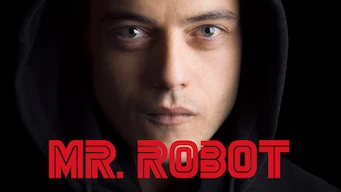 

:material-star:{.gold .heart}:material-star:{.gold .heart}:material-star:{.gold .heart}:material-star:{.gold .heart}:material-star-outline:{.grey }|Série : **Mr. Robot** Origine: **Etats-Unis** Sortie de la 4° saison en **2019** Nb. épisodes: **45**  _Le monde des hackers se percutant avec le monde de la finance, pour une fois bien décrit, et avec de vrais logiciel de hacking. Seule sa double personnalité est pesante et vient trop alourdir la narration._
 

:material-star:{.gold .heart}:material-star:{.gold .heart}:material-star:{.gold .heart}:material-star:{.gold .heart}:material-star-outline:{.grey }|Série : **Outlander** Origine: **Etats-Unis** Sortie de la 6° saison en **2020** Nb. épisodes: **75**  _Très bonne idée, plutôt bien réalisé._
 

:material-star:{.gold .heart}:material-star:{.gold .heart}:material-star:{.gold .heart}:material-star-outline:{.grey }:material-star-outline:{.grey }|Série : **Perdus dans l'espace** Origine: **Etats-Unis** Sortie de la 3° saison en **2021** Nb. épisodes: **28**  _Migration dans l'espace plutôt bien fait, même si l'histoire reste "simple"; dommage les décors auraient pu amener un scénario plus abouti._
 

:material-star:{.gold .heart}:material-star:{.gold .heart}:material-star:{.gold .heart}:material-star:{.gold .heart}:material-star-half-full:{.gold .heart}|Série : **The Peripheral / Périphériques, les mondes de Flynne** Origine: **Etats-Unis** Sortie en **2022** Nb. épisodes: **8**  _Série de science-fiction plutôt bien faite dans un monde finalement chaotique._
 

:material-star:{.gold .heart}:material-star:{.gold .heart}:material-star-outline:{.grey }:material-star-outline:{.grey }:material-star-outline:{.grey }|Série : **Reine du Sud** Origine: **Etats-Unis** Sortie de la 5° saison en **2021** Nb. épisodes: **62**  _Histoire de narcotrafiquants entre le Mexique et les États-Unis, avec des personnages et des scènes bien trop caricaturales, une stratégie proche du zéro absolu et un tout petit peu de réflexion._
 

:material-star:{.gold .heart}:material-star-half-full:{.gold .heart}:material-star-outline:{.grey }:material-star-outline:{.grey }:material-star-outline:{.grey }|Série : **Salvation** Origine: **Etats-Unis** Sortie de la 2° saison en **2018** Nb. épisodes: **26**  _Le premier scénario est pas trop mal, mais le scénario de la 2ème saison est trop basique et ennuyeuse._
 

:material-star:{.gold .heart}:material-star:{.gold .heart}:material-star:{.gold .heart}:material-star:{.gold .heart}:material-star-half-full:{.gold .heart}|Série : **Sense8** Origine: **Etats-Unis** Sortie de la 2° saison en **2018** Nb. épisodes: **24**  _Très bonne idée, par parfois un peu trop dans les combats._
 

:material-star:{.gold .heart}:material-star:{.gold .heart}:material-star-outline:{.grey }:material-star-outline:{.grey }:material-star-outline:{.grey }|Série : **Seven Seconds** Origine: **Etats-Unis** Sortie en **2018** Nb. épisodes: **10**  _Les plus mauvais flics de New York mènent l'enquête._
 

:material-star:{.gold .heart}:material-star:{.gold .heart}:material-star:{.gold .heart}:material-star-outline:{.grey }:material-star-outline:{.grey }|Série : **Shooter / Shooter, tireur d'élite** Origine: **Etats-Unis** Sortie de la 3° saison en **2018** Nb. épisodes: **31**  _La vie d'un tireur d'élite... romancé._
 

Retiré de Netflix le 31/01/2022 :material-star:{.gold .heart}:material-star:{.gold .heart}:material-star:{.gold .heart}:material-star:{.gold .heart}:material-star-outline:{.grey }|Série : **Spartacus** Origine: **Etats-Unis** Sortie de la 4° saison en **2013** Nb. épisodes: **39**  _Très bonne contextualisation des combats de gladiateurs, quelques libertés avec l'histoire mais globalement bien fait même si très sanguinolent._
 

:material-star:{.gold .heart}:material-star:{.gold .heart}:material-star-outline:{.grey }:material-star-outline:{.grey }:material-star-outline:{.grey }|Série : **Star Trek - Picard** Origine: **Etats-Unis** Sortie de la 2° saison en **2022** Nb. épisodes: **20**  _L'histoire de la série à tendance à partir un peu dans tous les sens, est trop basé sur les effets spéciaux avec des scénarios qui sont trop monotones et pas assez novateurs._
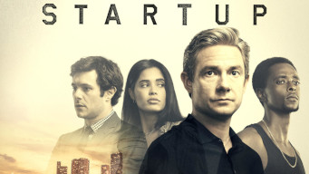 

:material-star:{.gold .heart}:material-star:{.gold .heart}:material-star:{.gold .heart}:material-star-outline:{.grey }:material-star-outline:{.grey }|Série : **Startup** Origine: **Etats-Unis** Sortie de la 3° saison en **2018** Nb. épisodes: **30**  _Quand startup e banditisme se mélangent._
 

:material-star:{.gold .heart}:material-star:{.gold .heart}:material-star-half-full:{.gold .heart}:material-star-outline:{.grey }:material-star-outline:{.grey }|Série : **Suits : avocats sur mesure** Origine: **Etats-Unis** Sortie de la 7° saison en **2019** Nb. épisodes: **108**  _Intéressant du point de vue de comment fonctionne les avovcats au Etats-Unis, mais l'histoire s'éssouffle vite; nul à partir du début de la saison 8._
 

:material-star:{.gold .heart}:material-star:{.gold .heart}:material-star-outline:{.grey }:material-star-outline:{.grey }:material-star-outline:{.grey }|Série : **The Last Ship** Origine: **Etats-Unis** Sortie de la 5° saison en **2014** Nb. épisodes: **56**  _Contexte et scénario très intéressant, mais certaines situations sont trop basiques, les personnages sont caricaturaux, sans parler des combats totalement irréalistes; dommage._
 

:material-star:{.gold .heart}:material-star:{.gold .heart}:material-star:{.gold .heart}:material-star-outline:{.grey }:material-star-outline:{.grey }|Série : **The Last of Us** Origine: **Etats-Unis** Sortie en **2023** Nb. épisodes: **9**  _Après une pandémie de micoses "tueuses", la survie s'organise et la race humaine tente de survivre; classique du genre, peu de surprise dans le scéanrio._
 

:material-star:{.gold .heart}:material-star:{.gold .heart}:material-star-half-full:{.gold .heart}:material-star-outline:{.grey }:material-star-outline:{.grey }|Série : **The Night Agent** Origine: **Etats-Unis** Sortie en **2023** Nb. épisodes: **10**  _Série d'action américaine, le scénario est bourré d'incohérence et d'approximation._
 

:material-star:{.gold .heart}:material-star:{.gold .heart}:material-star:{.gold .heart}:material-star-outline:{.grey }:material-star-outline:{.grey }|Série : **The Recruit** Origine: **Etats-Unis** Sortie en **2022** Nb. épisodes: **8**  _Espionnage à la sauce américaine sur un scénario assez riche et complexe, mais on reste très loin de ce qu'est réellement l'espionnage._
 

:material-star:{.gold .heart}:material-star:{.gold .heart}:material-star-outline:{.grey }:material-star-outline:{.grey }:material-star-outline:{.grey }|Série : **The Terminal List** Origine: **Etats-Unis** Sortie en **2022** Nb. épisodes: **8**  _Histoire d'un gros nul qui butte tout ce qui bouge. Quelques scènes de combat intéressantes, mais toujours extrême._
 

:material-star:{.gold .heart}:material-star:{.gold .heart}:material-star:{.gold .heart}:material-star:{.gold .heart}:material-star-half-full:{.gold .heart}|Série : **The Witcher** Origine: **Etats-Unis** Sortie de la 2° saison en **2019** Nb. épisodes: **16**  _Scénario original et ambiance assez proche de celle du jeu. Très bien, même si les couleurs sont trop sombres en saison 2, on ne voit rien sur certains passages._
 

:material-star:{.gold .heart}:material-star:{.gold .heart}:material-star:{.gold .heart}:material-star-outline:{.grey }:material-star-outline:{.grey }|Série : **The Witcher : L'héritage du sang** Origine: **Etats-Unis** Sortie en **2022** Nb. épisodes: **4**  _Une sorte d'introduction au monde dans lequel évolue The Witcher._
 

:material-star:{.gold .heart}:material-star:{.gold .heart}:material-star:{.gold .heart}:material-star:{.gold .heart}:material-star-half-full:{.gold .heart}|Série : **The expanse** Origine: **Etats-Unis** Sortie de la 6° saison en **2021** Nb. épisodes: **62**  _Série de science-fiction avec des effets spéciaux très bien réalisés dans un futur imaginaire assez complexe._
 

:material-star:{.gold .heart}:material-star-half-full:{.gold .heart}:material-star-outline:{.grey }:material-star-outline:{.grey }:material-star-outline:{.grey }|Série : **Treadstone** Origine: **Etats-Unis** Sortie en **2019** Nb. épisodes: **10**  _Série sur le même concept que les films de Jason Bourne, mais avec beaucoup de stéréotype et un montage très mauvais._
 

:material-star:{.gold .heart}:material-star:{.gold .heart}:material-star-outline:{.grey }:material-star-outline:{.grey }:material-star-outline:{.grey }|Série : **Extraction / Tyler Rake** Origine: **Etats-Unis** Sortie en **2020** Nb. épisodes: **1**  _Film d'action américain où les combats sont toujours aussi peu crédible._
 

:material-star:{.gold .heart}:material-star-outline:{.grey }:material-star-outline:{.grey }:material-star-outline:{.grey }:material-star-outline:{.grey }|Série : **Extraction 2 / Tyler Rake 2** Origine: **Etats-Unis** Sortie en **2023** Nb. épisodes: **1**  _Du grand n'importe quoi, enchaînement de scènes de combat toutes plus irréalistes les unes que les autres._
 

:material-star:{.gold .heart}:material-star:{.gold .heart}:material-star:{.gold .heart}:material-star-half-full:{.gold .heart}:material-star-outline:{.grey }|Série : **Vikings** Origine: **Etats-Unis** Sortie de la 6° saison en **2021** Nb. épisodes: **89**  _Bonne série sur les vikings. Les premières saisons sont très bien. A partir de la 4ème on est trop dans la surenchère et cela devient ridicule à la 6e._
 

:material-star:{.gold .heart}:material-star:{.gold .heart}:material-star-half-full:{.gold .heart}:material-star-outline:{.grey }:material-star-outline:{.grey }|Série : **Vikings: Valhalla** Origine: **Etats-Unis** Sortie de la 3° saison en **2024** Nb. épisodes: **24**  _Le monde de "Viking" en moins bien, n'apporte rien de neuf et pas mal d'anachronisme._
 

:material-star:{.gold .heart}:material-star:{.gold .heart}:material-star-half-full:{.gold .heart}:material-star-outline:{.grey }:material-star-outline:{.grey }|Série : **Warrior Nun** Origine: **Etats-Unis** Sortie de la 2° saison en **2020** Nb. épisodes: **18**  _Bonne idée à la base, mais scénarios trop classiques, trop prévisibles, la crédibilité des personnages est proche de la niaiserie._

## Finlande

Affiche|Information
:---:|:---
 

:material-star:{.gold .heart}:material-star:{.gold .heart}:material-star-half-full:{.gold .heart}:material-star-outline:{.grey }:material-star-outline:{.grey }|Série : **Deadwind** Origine: **Finlande** Sortie de la 3° saison en **2021** Nb. épisodes: **28**  _Les plus mauvais flics de Finlande enquêtent. Des scénarios plutôt bien construient, mais aucune anticipation de la part des protagonistes._

## France

Affiche|Information
:---:|:---
 

:material-star:{.gold .heart}:material-star:{.gold .heart}:material-star:{.gold .heart}:material-star:{.gold .heart}:material-star-outline:{.grey }|Série : **Anthracite** Origine: **France** Sortie en **2024** Nb. épisodes: **6**  _Un policier bien anthracite et bien ficellé._
 

:material-star:{.gold .heart}:material-star:{.gold .heart}:material-star:{.gold .heart}:material-star:{.gold .heart}:material-star-half-full:{.gold .heart}|Série : **Arcane** Origine: **France** Sortie en **2021** Nb. épisodes: **9**  _Animation très impressionnante avec un scénario plein de bonnes surprises et un graphisme splendide; à  voir absolument pour les amateurs adeptent du genre jeux vidéo._
 

:material-star:{.gold .heart}:material-star:{.gold .heart}:material-star:{.gold .heart}:material-star:{.gold .heart}:material-star-outline:{.grey }|Série : **Coeurs Noirs** Origine: **France** Sortie en **2023** Nb. épisodes: **6**  _Les forces françaises en Irak, plutôt réaliste et bien fait, malgré quelques imperfections de scénario._
 

:material-star:{.gold .heart}:material-star:{.gold .heart}:material-star:{.gold .heart}:material-star-outline:{.grey }:material-star-outline:{.grey }|Série : **Furies** Origine: **France** Sortie en **2024** Nb. épisodes: **8**  _Série française assez violente sur le grand banditisme à Paris, mais de façon totalement imaginaire._
 

:material-star:{.gold .heart}:material-star:{.gold .heart}:material-star-outline:{.grey }:material-star-outline:{.grey }:material-star-outline:{.grey }|Série : **La Révolution** Origine: **France** Sortie en **2020** Nb. épisodes: **8**  _La noirceur est dominante, l'ensemble est trop basique._
 

:material-star:{.gold .heart}:material-star:{.gold .heart}:material-star:{.gold .heart}:material-star:{.gold .heart}:material-star-outline:{.grey }|Série : **Le Brio** Origine: **France** Sortie en **2022** Nb. épisodes: **1**  _nan_
 

:material-star:{.gold .heart}:material-star:{.gold .heart}:material-star-outline:{.grey }:material-star-outline:{.grey }:material-star-outline:{.grey }|Série : **Lupin** Origine: **France** Sortie de la 3° saison en **2023** Nb. épisodes: **17**  _Bon 1er épisode, mais bien moins bon après. Il y a aussi de nombreuses d'incohérence dans le script, un comble pour du Arsène Lupin._
 

:material-star:{.gold .heart}:material-star:{.gold .heart}:material-star:{.gold .heart}:material-star:{.gold .heart}:material-star:{.gold .heart}|Série : **Nicolas Le Floch** Origine: **France** Sortie de la 6° saison en **2018** Nb. épisodes: **24**  _Enquêtes policières sous Louis XV puis Louis XVI, avec des scénarios, des personnages et des décors magnifiques, une plongée dans l'histoire._
 

:material-star:{.gold .heart}:material-star-outline:{.grey }:material-star-outline:{.grey }:material-star-outline:{.grey }:material-star-outline:{.grey }|Série : **Notre-Dame, la part du feu** Origine: **France** Sortie en **2022** Nb. épisodes: **6**  _Un scénario construit autour de l'incendie de Notre-Dame de Paris, malheureusement monté avec les pieds, bourré de flashback cassant complètement le rythme._
 

:material-star:{.gold .heart}:material-star:{.gold .heart}:material-star:{.gold .heart}:material-star-outline:{.grey }:material-star-outline:{.grey }|Série : **Pourris gâtés** Origine: **France** Sortie en **2021** Nb. épisodes: **1**  _nan_

## Israël

Affiche|Information
:---:|:---
 

:material-star:{.gold .heart}:material-star:{.gold .heart}:material-star-half-full:{.gold .heart}:material-star-outline:{.grey }:material-star-outline:{.grey }|Série : **Fauda** Origine: **Israël** Sortie de la 4° saison en **2023** Nb. épisodes: **48**  _Fête foraine en territoire palestinien, la contextualisation est bien, mais complètement pro israelien, les négociations et les filatures ne sont pas crédibles._

## Italie

Affiche|Information
:---:|:---
 

:material-star:{.gold .heart}:material-star:{.gold .heart}:material-star:{.gold .heart}:material-star:{.gold .heart}:material-star-half-full:{.gold .heart}|Série : **Lidia fait sa loi** Origine: **Italie** Sortie en **2023** Nb. épisodes: **6**  _nan_
 

:material-star:{.gold .heart}:material-star:{.gold .heart}:material-star-outline:{.grey }:material-star-outline:{.grey }:material-star-outline:{.grey }|Série : **Romulus** Origine: **Italie** Sortie en **2020** Nb. épisodes: **8**  _Série pseudo historique très sombre, trop sombre, surtout les nombreuses séquences dans la pénombre où on ne distingue rien. Dommage, surtout que seuls les 8 premières épisodes sont disponibles._

## Japon

Affiche|Information
:---:|:---
 

:material-star:{.gold .heart}:material-star:{.gold .heart}:material-star:{.gold .heart}:material-star-outline:{.grey }:material-star-outline:{.grey }|Série : **A Life : A Love** Origine: **Japon** Sortie en **2024** Nb. épisodes: **10**  _Une histoire de chirurgiens dans un hôpital, avec un scénario classique et un peu trop basique._
 

:material-star:{.gold .heart}:material-star:{.gold .heart}:material-star:{.gold .heart}:material-star-outline:{.grey }:material-star-outline:{.grey }|Série : **Alice in Borderland / 今際の国のアリス** Origine: **Japon** Sortie de la 2° saison en **2022** Nb. épisodes: **16**  _Jeux de massacre à Tokyo, des idées mais des combats somme toute assez pauvres et à l'issue prévisible._
 

:material-star:{.gold .heart}:material-star:{.gold .heart}:material-star:{.gold .heart}:material-star-outline:{.grey }:material-star-outline:{.grey }|Série : **Atelier / アンダーウェア** Origine: **Japon** Sortie en **2015** Nb. épisodes: **13**  _Le monde de la lingerie vu avec la mentalité des femmes japonaises._
 

:material-star:{.gold .heart}:material-star:{.gold .heart}:material-star-outline:{.grey }:material-star-outline:{.grey }:material-star-outline:{.grey }|Série : **Fermat's Cuisine / Fermat Kitchen / フェルマーの料理** Origine: **Japon** Sortie en **2023** Nb. épisodes: **10**  _La cuisine française au Japon, en faisant un parallèle avec les mathématiques, mais l'ensemble est malheureusement trop caricatural._
 

:material-star:{.gold .heart}:material-star:{.gold .heart}:material-star:{.gold .heart}:material-star:{.gold .heart}:material-star-half-full:{.gold .heart}|Série : **House of Ninjas** Origine: **Japon** Sortie en **2024** Nb. épisodes: **8**  _Très réaliste dans son approche pseudo-historique, et avec plein d'action; quelques surprises additionnelles et historiques auraient pu l'enrichir._
 

:material-star:{.gold .heart}:material-star:{.gold .heart}:material-star-half-full:{.gold .heart}:material-star-outline:{.grey }:material-star-outline:{.grey }|Série : **Invisible** Origine: **Japon** Sortie en **2020** Nb. épisodes: **10**  _Une série policière, plus proche du manga que d'une enquête classique, avec un démarrage intéressant, mais au final on devine trop facilement les intrigues._
 

:material-star:{.gold .heart}:material-star:{.gold .heart}:material-star-half-full:{.gold .heart}:material-star-outline:{.grey }:material-star-outline:{.grey }|Série : **Japan Sinks: People of Hope** Origine: **Japon** Sortie en **2021** Nb. épisodes: **10**  _Fiction avec pour thème le réchauffement climatique et les conséquences imprévisibles que cela entraîne._
 

:material-star:{.gold .heart}:material-star:{.gold .heart}:material-star-half-full:{.gold .heart}:material-star-outline:{.grey }:material-star-outline:{.grey }|Série : **Mob Psycho 100** Origine: **Japon** Sortie en **2018** Nb. épisodes: **12**  _Très teenaged, trop répétitif mais bien fait._
 

:material-star:{.gold .heart}:material-star:{.gold .heart}:material-star:{.gold .heart}:material-star-outline:{.grey }:material-star-outline:{.grey }|Série : **Public Affairs Office in the Sky** Origine: **Japon** Sortie en **2013** Nb. épisodes: **11**  _Série sur les relations publiques des forces armées aériennes du Japon, léger mais bien construit._
 

:material-star:{.gold .heart}:material-star:{.gold .heart}:material-star:{.gold .heart}:material-star-outline:{.grey }:material-star-outline:{.grey }|Série : **Resident Evil: Infinite Darkness** Origine: **Japon** Sortie en **2021** Nb. épisodes: **4**  _Mini-série d'animation japonais, réaliste, très bien fait mais avec très peu de surprise._
 

:material-star:{.gold .heart}:material-star:{.gold .heart}:material-star:{.gold .heart}:material-star-outline:{.grey }:material-star-outline:{.grey }|Série : **The Journalist** Origine: **Japon** Sortie en **2022** Nb. épisodes: **6**  _Sombre, relativement lent, plutôt psychologique, cette série décrit un monde politique complexe et sans concession._

## Norvège

Affiche|Information
:---:|:---
 

:material-star:{.gold .heart}:material-star:{.gold .heart}:material-star:{.gold .heart}:material-star:{.gold .heart}:material-star-half-full:{.gold .heart}|Série : **Occupied** Origine: **Norvège** Sortie de la 2° saison en **2019** Nb. épisodes: **18**  _Excellent! Très bonne idée de contexte politico-stratégique._
 

:material-star:{.gold .heart}:material-star:{.gold .heart}:material-star:{.gold .heart}:material-star:{.gold .heart}:material-star-half-full:{.gold .heart}|Série : **Occupied** Origine: **Norvège** Sortie de la 2° saison en **2015** Nb. épisodes: **18**  _Prémonitoire, la guerre de l'énergie._
 

:material-star:{.gold .heart}:material-star:{.gold .heart}:material-star:{.gold .heart}:material-star-half-full:{.gold .heart}:material-star-outline:{.grey }|Série : **Ragnarök** Origine: **Norvège** Sortie de la 3° saison en **2021** Nb. épisodes: **18**  _Transposition des légendes nordiques à l'époque actuelle. Dommage que cela ne soit pas mieux exploité !_

## Pologne

Affiche|Information
:---:|:---
 

:material-star:{.gold .heart}:material-star:{.gold .heart}:material-star:{.gold .heart}:material-star-half-full:{.gold .heart}:material-star-outline:{.grey }|Série : **La Crue** Origine: **Pologne** Sortie en **2022** Nb. épisodes: **6**  _Histoire vraie d'une inondation d'une ville en Pologne en 1997._

## Royaume-Uni

Affiche|Information
:---:|:---
 

:material-star:{.gold .heart}:material-star:{.gold .heart}:material-star:{.gold .heart}:material-star:{.gold .heart}:material-star-half-full:{.gold .heart}|Série : **Bodyguard** Origine: **Royaume-Uni** Sortie en **2018** Nb. épisodes: **6**  _Le scénario est prenant, démarre très fort. Quelques bonnes surprise à la fin._
 

:material-star:{.gold .heart}:material-star:{.gold .heart}:material-star-half-full:{.gold .heart}:material-star-outline:{.grey }:material-star-outline:{.grey }|Série : **Double piège** Origine: **Royaume-Uni** Sortie en **2024** Nb. épisodes: **8**  _Série policière un peu longue, mais avec une histoire suffisamment complexe pour réserver quelques surprises._
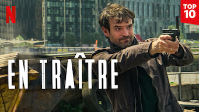 

:material-star:{.gold .heart}:material-star:{.gold .heart}:material-star-half-full:{.gold .heart}:material-star-outline:{.grey }:material-star-outline:{.grey }|Série : **En traître** Origine: **Royaume-Uni** Sortie en **2022** Nb. épisodes: **5**  _Série basée sur un scénario de jeux d'espion en Angleterre, plutôt bien réalisé mais très peu crédible sur les aspects politique et espionnage._
 

:material-star:{.gold .heart}:material-star:{.gold .heart}:material-star-half-full:{.gold .heart}:material-star-outline:{.grey }:material-star-outline:{.grey }|Série : **The Bletchley Circle: San Francisco / Enquêtes codées : San Francisco** Origine: **Royaume-Uni** Sortie en **2018** Nb. épisodes: **8**  _Enquêtes policières à San Francisco dans les années 50, dans un style qui ressemble mais reste néanmoins éloigné des 'Agatha Christie'._
 

:material-star:{.gold .heart}:material-star:{.gold .heart}:material-star:{.gold .heart}:material-star-outline:{.grey }:material-star-outline:{.grey }|Série : **Fleabag** Origine: **Royaume-Uni** Sortie de la 2° saison en **2016** Nb. épisodes: **12**  _Humour très british autour du sexe dans un échange entre le personnage principal et le téléspectateur, plutôt déjanté, réussi et amusant._
 

:material-star:{.gold .heart}:material-star:{.gold .heart}:material-star:{.gold .heart}:material-star:{.gold .heart}:material-star-outline:{.grey }|Série : **Giri / Haji** Origine: **Royaume-Uni** Sortie en **2019** Nb. épisodes: **8**  _Flics et Yakuzas voyagent à Londres et Tokyo dans un scénario qui part en vrille._
 

:material-star:{.gold .heart}:material-star:{.gold .heart}:material-star:{.gold .heart}:material-star-outline:{.grey }:material-star-outline:{.grey }|Série : **Hunted** Origine: **Royaume-Uni** Sortie en **2012** Nb. épisodes: **8**  _Espionage au travers d'une société privée, un peu trop classique et basique, mais de bons passages._
 

:material-star:{.gold .heart}:material-star:{.gold .heart}:material-star:{.gold .heart}:material-star-outline:{.grey }:material-star-outline:{.grey }|Série : **Lockwood & Co.** Origine: **Royaume-Uni** Sortie en **2023** Nb. épisodes: **8**  _Monde étrange peuplé de spectres; un peu teenadge._
 

:material-star:{.gold .heart}:material-star:{.gold .heart}:material-star:{.gold .heart}:material-star:{.gold .heart}:material-star-outline:{.grey }|Série : **Peaky Blinders** Origine: **Royaume-Uni** Sortie de la 6° saison en **2022** Nb. épisodes: **36**  _Beaucoup de violence gratuite et quelques situations peu cohérentes, mais les personnages sont plutôt sympa et recherchés._
 

:material-star:{.gold .heart}:material-star:{.gold .heart}:material-star-half-full:{.gold .heart}:material-star-outline:{.grey }:material-star-outline:{.grey }|Série : **Poldark** Origine: **Royaume-Uni** Sortie de la 5° saison en **2019** Nb. épisodes: **43**  _Série ayant lieu en Angleterre au moment de la Révolution française; les décors de la Cornouaille sont pas mal, mais les intrigues auraient dû être plus poussées._
 

:material-star:{.gold .heart}:material-star:{.gold .heart}:material-star:{.gold .heart}:material-star:{.gold .heart}:material-star:{.gold .heart}|Série : **Sherlock** Origine: **Royaume-Uni** Sortie de la 4° saison en **2017** Nb. épisodes: **13**  _Version moderne du détective, parfaitement interprétée et réalisée._
 

:material-star:{.gold .heart}:material-star:{.gold .heart}:material-star:{.gold .heart}:material-star-half-full:{.gold .heart}:material-star-outline:{.grey }|Série : **SupaCell / SupraCell** Origine: **Royaume-Uni** Sortie en **2024** Nb. épisodes: **6**  _Des super-héros londoniens, c'est certes du déjà vu mais c'est bien réalisé._
 

:material-star:{.gold .heart}:material-star:{.gold .heart}:material-star:{.gold .heart}:material-star:{.gold .heart}:material-star-outline:{.grey }|Série : **The Crown** Origine: **Royaume-Uni** Sortie de la 6° saison en **2023** Nb. épisodes: **60**  _La. Monarchie anglaise au travers de la vie de la reine Élisabeth II, bien réalisé, malgré quelques longueurs._
 

:material-star:{.gold .heart}:material-star:{.gold .heart}:material-star-half-full:{.gold .heart}:material-star-outline:{.grey }:material-star-outline:{.grey }|Série : **The Fall** Origine: **Royaume-Uni** Sortie de la 3° saison en **2017** Nb. épisodes: **17**  _Une enquête policière à la mode British en Irlande du Nord. De bons acteurs, mais un scénario un peu trop classique, et une fin décevante._
 

:material-star:{.gold .heart}:material-star:{.gold .heart}:material-star:{.gold .heart}:material-star-outline:{.grey }:material-star-outline:{.grey }|Série : **The Gentlemen** Origine: **Royaume-Uni** Sortie en **2024** Nb. épisodes: **8**  _Un duc Anglais contre les barons de la drogue._
 

:material-star:{.gold .heart}:material-star:{.gold .heart}:material-star:{.gold .heart}:material-star-half-full:{.gold .heart}:material-star-outline:{.grey }|Série : **The Last Kingdom** Origine: **Royaume-Uni** Sortie de la 5° saison en **2022** Nb. épisodes: **46**  _Histoire des vikings chez les saxons, avec une approche différent de "vikings" et une bonne contextualisation. La qualité du scénario décroît malheureusement au fur et à mesure de l'enchaîneent dss saisons._
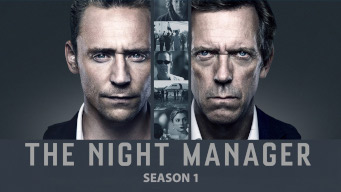 

:material-star:{.gold .heart}:material-star:{.gold .heart}:material-star:{.gold .heart}:material-star:{.gold .heart}:material-star-outline:{.grey }|Série : **The Night Manager** Origine: **Royaume-Uni** Sortie en **2016** Nb. épisodes: **6**  _Espionnage et trafic d'armes sont le thème de cette bonne série britannique._
 

:material-star:{.gold .heart}:material-star:{.gold .heart}:material-star:{.gold .heart}:material-star-outline:{.grey }:material-star-outline:{.grey }|Série : **Who is Erin Carter?** Origine: **Royaume-Uni** Sortie en **2023** Nb. épisodes: **7**  _Policier britannique de bonne facture._

## Suède

Affiche|Information
:---:|:---
 

:material-star:{.gold .heart}:material-star:{.gold .heart}:material-star:{.gold .heart}:material-star-outline:{.grey }:material-star-outline:{.grey }|Série : **The Playlist** Origine: **Suède** Sortie en **2022** Nb. épisodes: **6**  _L'histoire de la création de Spotify au travers de six personnages et de six points de vue. Approche intéressante._

## Taïwan

Affiche|Information
:---:|:---
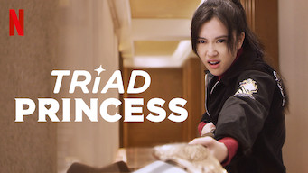 

:material-star:{.gold .heart}:material-star:{.gold .heart}:material-star-half-full:{.gold .heart}:material-star-outline:{.grey }:material-star-outline:{.grey }|Série : **Triad Princess** Origine: **Taïwan** Sortie en **2019** Nb. épisodes: **6**  _C'est gentil, plutôt bien fait mais ça reste du classique tout en restant sous-exploité._

## Turquie

Affiche|Information
:---:|:---
 

:material-star:{.gold .heart}:material-star-outline:{.grey }:material-star-outline:{.grey }:material-star-outline:{.grey }:material-star-outline:{.grey }|Série : **The Protector** Origine: **Turquie** Sortie de la 4° saison en **2020** Nb. épisodes: **32**  _"Le protecteur" est le titre de cette série, qui aurait dû s'appeler "donner des supers pouvoirs à un imbécile". Le scénario suit une stratégie équivalente à un éléphant dans un magasin de porcelaine, seuls les effets spéciaux sont pas mal. Abandonner en cours de route !_
 

:material-star:{.gold .heart}:material-star:{.gold .heart}:material-star-half-full:{.gold .heart}:material-star-outline:{.grey }:material-star-outline:{.grey }|Série : **Yakamoz S-245** Origine: **Turquie** Sortie en **2022** Nb. épisodes: **7**  _Série de science-fiction sur la fin du monde avec un scénario assez classique (série incomplète) ._
