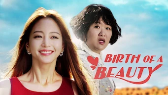
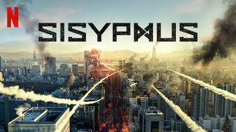

title: Séries

#Les Séries
_(par pays et par ordre alphabétique)_

##Australie

Affiche|Information
:---:|:---
 |Série : **Secret City** Origine: **Australie** Note: :material-star:{.gold }:material-star:{.gold }:material-star:{.gold }:material-star:{.gold .heart}:material-star:{.grey } Sortie en **2016** Nb. épisodes: **12**  _Politique fiction bien monté._

##Chine

Affiche|Information
:---:|:---
 |Série : **The Rational Life** Origine: **Chine** Note: :material-star:{.gold }:material-star:{.gold }:material-star:{.gold }:material-star:{.gold }:material-star-half-full:{.gold .heart} Sortie en **2021** Nb. épisodes: **35**  _Très bonne série romantique, les dialogues sont très poussés et cohérents, sans entrer dans les clichés habituels._

##Corée du Sud

Affiche|Information
:---:|:---
 |Série : **100 Days My Prince** Origine: **Corée du Sud** Note: :material-star:{.gold }:material-star:{.gold }:material-star:{.gold }:material-star-half-full:{.gold .heart}:material-star:{.grey } Sortie en **2018** Nb. épisodes: **16**  _nan_
 |Série : **Abyss** Origine: **Corée du Sud** Note: :material-star:{.gold }:material-star:{.gold }:material-star-half-full:{.gold .heart}:material-star:{.grey }:material-star:{.grey } Sortie en **2019** Nb. épisodes: **16**  _On se désintéresse rapidement de l'histoire et on regrette les acteurs du premier épisode._
 |Série : **Alice** Origine: **Corée du Sud** Note: :material-star:{.gold }:material-star:{.gold }:material-star:{.gold .heart}:material-star:{.grey }:material-star:{.grey } Sortie en **2020** Nb. épisodes: **16**  _Pars trop dans tous les sens, plusieurs incohérences de scénarios, choses restant inexpliquées_
 |Série : **Angel's Last Mission: Love** Origine: **Corée du Sud** Note: :material-star:{.gold }:material-star:{.gold }:material-star:{.gold }:material-star:{.gold }:material-star-half-full:{.gold .heart} Sortie en **2019** Nb. épisodes: **16**  _Le scénario est bien ficelé, les acteurs sont et crédibles, l'histoire est intéressante._
 :material-netflix:{ .rouge }Retiré de Netflix le 26/02/2021|Série : **Angry Mom** Origine: **Corée du Sud** Note: :material-star:{.gold }:material-star:{.gold }:material-star:{.gold }:material-star:{.gold .heart}:material-star:{.grey } Sortie en **2015** Nb. épisodes: **16**  _Quelque lourdeur, mais pas mal dans l'ensemble._
 |Série : **Another Miss Oh / 또 오해영** Origine: **Corée du Sud** Note: :material-star:{.gold }:material-star:{.gold }:material-star-half-full:{.gold .heart}:material-star:{.grey }:material-star:{.grey } Sortie en **2016** Nb. épisodes: **18**  _L'idée est séduisante mais ça traîne en longueur._
 |Série : **Arang and the Magistrate** Origine: **Corée du Sud** Note: :material-star:{.gold }:material-star:{.gold }:material-star:{.gold .heart}:material-star:{.grey }:material-star:{.grey } Sortie en **2012** Nb. épisodes: **20**  _Titre: Tale of Arang_
 |Série : **Are You Human?** Origine: **Corée du Sud** Note: :material-star:{.gold }:material-star:{.gold }:material-star:{.gold }:material-star-half-full:{.gold .heart}:material-star:{.grey } Sortie en **2018** Nb. épisodes: **18**  _nan_
 |Série : **Argon / 아르곤** Origine: **Corée du Sud** Note: :material-star:{.gold }:material-star:{.gold }:material-star:{.gold }:material-star:{.gold .heart}:material-star:{.grey } Sortie en **2017** Nb. épisodes: **8**  _Très bonne petite série dans le milieu des journalistes._
 |Série : **Arthdal Chronicles** Origine: **Corée du Sud** Note: :material-star:{.gold }:material-star:{.gold }:material-star:{.gold }:material-star:{.gold .heart}:material-star:{.grey } Sortie en **2019** Nb. épisodes: **18**  _Très bon jeu de pouvoir dans un âge de bronze réinventé. En attente de la saison 2._
 |Série : **Bad Guys / 나쁜 놈 잡는** Origine: **Corée du Sud** Note: :material-star:{.gold }:material-star:{.gold }:material-star-half-full:{.gold .heart}:material-star:{.grey }:material-star:{.grey } Sortie en **2014** Nb. épisodes: **11**  _Un peu trop cousu de fil blanc et axé sur les combats._
 |Série : **Beautiful Gong Shim** Origine: **Corée du Sud** Note: :material-star:{.gold }:material-star:{.gold }:material-star:{.gold }:material-star:{.gold .heart}:material-star:{.grey } Sortie en **2016** Nb. épisodes: **20**  _Le scénario est pas mal, les acteurs bons, mais cela reste quand même du classique._
 |Série : **Beauty Inside** Origine: **Corée du Sud** Note: :material-star:{.gold }:material-star:{.gold }:material-star-half-full:{.gold .heart}:material-star:{.grey }:material-star:{.grey } Sortie en **2018** Nb. épisodes: **16**  _Divertissant._
 |Série : **Because This Is My First Life** Origine: **Corée du Sud** Note: :material-star:{.gold }:material-star:{.gold }:material-star:{.gold .heart}:material-star:{.grey }:material-star:{.grey } Sortie en **2017** Nb. épisodes: **16**  _nan_
 |Série : **Birth of a Beauty** Origine: **Corée du Sud** Note: :material-star:{.gold }:material-star:{.gold }:material-star:{.gold }:material-star-half-full:{.gold .heart}:material-star:{.grey } Sortie en **2014** Nb. épisodes: **21**  _nan_
 |Série : **Black / 블랙** Origine: **Corée du Sud** Note: :material-star:{.gold }:material-star:{.gold .heart}:material-star:{.grey }:material-star:{.grey }:material-star:{.grey } Sortie en **2017** Nb. épisodes: **18**  _Scénario très moyen, grosses ficelles, énormément de répétition, l'intrigue à tiroirs est trop tordue._
 :material-netflix:{ .rouge }Retiré de Netflix le 30/06/2021|Série : **Black Knight: The Man Who Guards Me / 흑기사** Origine: **Corée du Sud** Note: :material-star:{.gold }:material-star:{.gold }:material-star:{.gold }:material-star-half-full:{.gold .heart}:material-star:{.grey } Sortie en **2018** Nb. épisodes: **20** :kr: sous-titres en coréens  _L'histoire avait pas mal de potentiel mais elle n'a pas tenu toutes ses promesses; des longueurs dans le traitement._
 |Série : **Blood** Origine: **Corée du Sud** Note: :material-star:{.gold }:material-star:{.gold .heart}:material-star:{.grey }:material-star:{.grey }:material-star:{.grey } Sortie en **2015** Nb. épisodes: **20**  _Dommage, le sujet aurait pu être bien traité, mais le scénario a plein de lacunes, les protagonistes réagissant bêtement aux situations. Ne tient pas ces promesses._
 |Série : **Boys Over Flowers** Origine: **Corée du Sud** Note: :material-star:{.gold }:material-star:{.gold }:material-star:{.gold .heart}:material-star:{.grey }:material-star:{.grey } Sortie en **2009** Nb. épisodes: **25**  _nan_
 |Série : **Bring It On, Ghost** Origine: **Corée du Sud** Note: :material-star:{.gold }:material-star:{.gold }:material-star:{.gold .heart}:material-star:{.grey }:material-star:{.grey } Sortie en **2016** Nb. épisodes: **16**  _nan_
 |Série : **Chief Kim** Origine: **Corée du Sud** Note: :material-star:{.gold }:material-star:{.gold }:material-star:{.gold .heart}:material-star:{.grey }:material-star:{.grey } Sortie en **2017** Nb. épisodes: **20**  _nan_
 |Série : **Chief of Staff / 보좌관** Origine: **Corée du Sud** Note: :material-star:{.gold }:material-star:{.gold .heart}:material-star:{.grey }:material-star:{.grey }:material-star:{.grey } Sortie en **2019** Nb. épisodes: **20**  _Le scénario est mauvais jeu de ping-pong sorti du chapeau les intrigues ne sont pas intéressantes_
 |Série : **Cinderella and the Four Knights** Origine: **Corée du Sud** Note: :material-star:{.gold }:material-star:{.gold }:material-star:{.gold }:material-star:{.gold .heart}:material-star:{.grey } Sortie en **2016** Nb. épisodes: **16**  _Teenage, mais bien fait, avec un scénario qui tient la route._
 |Série : **Clean With Passion For Now** Origine: **Corée du Sud** Note: :material-star:{.gold }:material-star:{.gold }:material-star:{.gold .heart}:material-star:{.grey }:material-star:{.grey } Sortie en **2018** Nb. épisodes: **16**  _nan_
 |Série : **Color of Woman / 컬러 오브 우먼** Origine: **Corée du Sud** Note: :material-star:{.gold }:material-star:{.gold }:material-star:{.gold .heart}:material-star:{.grey }:material-star:{.grey } Sortie en **2012** Nb. épisodes: **20** :kr: sous-titres en coréens  _Un peu désuet, basé sur les quiproquo, mais aussi sur un scénario qui tient la route._
 |Série : **Come and Hug Me** Origine: **Corée du Sud** Note: :material-star:{.gold }:material-star:{.gold }:material-star:{.gold }:material-star:{.gold .heart}:material-star:{.grey } Sortie en **2018** Nb. épisodes: **16**  _nan_
 |Palmarès: :material-numeric-3-circle:{.num_copper} Série : **Crash Landing on You** Origine: **Corée du Sud** Note: :material-star:{.gold }:material-star:{.gold }:material-star:{.gold }:material-star:{.gold }:material-star:{.gold .heart} Sortie en **2019** Nb. épisodes: **16** :kr: sous-titres en coréens  _Très bon scénario, les acteurs sont excellents et la réalisation paufinée. Ca mériterait une saison 2 !_
 :material-netflix:{ .rouge }Retiré de Netflix le 09/02/2021|Série : **Cunning Single Lady** Origine: **Corée du Sud** Note: :material-star:{.gold }:material-star:{.gold }:material-star:{.gold }:material-star:{.gold .heart}:material-star:{.grey } Sortie en **2014** Nb. épisodes: **16**  _nan_
 :material-netflix:{ .rouge }Retiré de Netflix le 31/01/2021|Série : **Defendant** Origine: **Corée du Sud** Note: :material-star:{.gold }:material-star:{.gold }:material-star:{.gold .heart}:material-star:{.grey }:material-star:{.grey } Sortie en **2017** Nb. épisodes: **18**  _nan_
 |Série : **Demon Catchers** Origine: **Corée du Sud** Note: :material-star:{.gold }:material-star:{.gold }:material-star:{.gold }:material-star-half-full:{.gold .heart}:material-star:{.grey } Sortie en **2020** Nb. épisodes: **16**  _nan_
 |Série : **Descendants of the Sun** Origine: **Corée du Sud** Note: :material-star:{.gold }:material-star:{.gold }:material-star:{.gold }:material-star:{.gold }:material-star-half-full:{.gold .heart} Sortie en **2016** Nb. épisodes: **16**  _Très bonne facture, s'enchaîne bien._
 |Palmarès: :material-numeric-9-circle: Série : **Designated Survivor: 60 Days** Origine: **Corée du Sud** Note: :material-star:{.gold }:material-star:{.gold }:material-star:{.gold }:material-star:{.gold }:material-star:{.gold .heart} Sortie en **2019** Nb. épisodes: **16** :kr: sous-titres en coréens  _Bien plus intéressant que la version américaine, le contexte politique de la Corée du sud est bien plus crédible._
 |Série : **Doctor Crush** Origine: **Corée du Sud** Note: :material-star:{.gold }:material-star:{.gold }:material-star:{.gold }:material-star-half-full:{.gold .heart}:material-star:{.grey } Sortie en **2016** Nb. épisodes: **20**  _nan_
 |Série : **Doctor John** Origine: **Corée du Sud** Note: :material-star:{.gold }:material-star:{.gold }:material-star:{.gold }:material-star:{.gold .heart}:material-star:{.grey } Sortie en **2019** Nb. épisodes: **16**  _Assez classique, mais bien fait._
 |Série : **Doctor Prisoner** Origine: **Corée du Sud** Note: :material-star:{.gold }:material-star:{.gold .heart}:material-star:{.grey }:material-star:{.grey }:material-star:{.grey } Sortie en **2019** Nb. épisodes: **16**  _Ca commence bien, mais les erreurs s'accumulent et l'ensemble reste très moyen._
 |Série : **Doctor Stranger** Origine: **Corée du Sud** Note: :material-star:{.gold }:material-star:{.gold }:material-star:{.gold .heart}:material-star:{.grey }:material-star:{.grey } Sortie en **2014** Nb. épisodes: **20**  _Bon scénario, bon contexte politique, mais trop surjouer._
 |Série : **Don't Dare to Dream** Origine: **Corée du Sud** Note: :material-star:{.gold }:material-star:{.gold }:material-star:{.gold .heart}:material-star:{.grey }:material-star:{.grey } Sortie en **2016** Nb. épisodes: **24**  _nan_
 |Série : **Dr. Romantic** Origine: **Corée du Sud** Note: :material-star:{.gold }:material-star:{.gold }:material-star:{.gold .heart}:material-star:{.grey }:material-star:{.grey } Sortie en **2020** Nb. épisodes: **37**  _nan_
 |Série : **Dream High / 드림 하이** Origine: **Corée du Sud** Note: :material-star:{.gold }:material-star:{.gold }:material-star:{.gold .heart}:material-star:{.grey }:material-star:{.grey } Sortie en **2011** Nb. épisodes: **16**  _Un peu trop teenage, mais quelques bonnes surprises._
 |Série : **Dream High 2 / 드림하이 2** Origine: **Corée du Sud** Note: :material-star:{.gold }:material-star:{.gold }:material-star-half-full:{.gold .heart}:material-star:{.grey }:material-star:{.grey } Sortie en **2012** Nb. épisodes: **16**  _Très teenage, un scénario très différent du premier volet, quelques longueurs, un peu poussif, globalement moyen._
 |Série : **Extracurricular** Origine: **Corée du Sud** Note: :material-star:{.gold }:material-star:{.gold }:material-star:{.gold .heart}:material-star:{.grey }:material-star:{.grey } Sortie en **2020** Nb. épisodes: **10**  _nan_
 |Série : **Fight for My Way / 쌈 마이웨이** Origine: **Corée du Sud** Note: :material-star:{.gold }:material-star:{.gold }:material-star:{.gold }:material-star:{.gold .heart}:material-star:{.grey } Sortie en **2017** Nb. épisodes: **16** :kr: sous-titres en coréens  _Le scénario est très bien, mais un peu compliqué car le contexte est très riche. Les acteurs sont excellents._
 |Série : **Find Me in Your Memory / 그 남자의 기억 법** Origine: **Corée du Sud** Note: :material-star:{.gold }:material-star:{.gold }:material-star:{.gold }:material-star:{.gold .heart}:material-star:{.grey } Sortie en **2020** Nb. épisodes: **16**  _Très bien, mais quelques longueurs sur la fin._
 |Série : **Full House** Origine: **Corée du Sud** Note: :material-star:{.gold }:material-star:{.gold }:material-star-half-full:{.gold .heart}:material-star:{.grey }:material-star:{.grey } Sortie en **2004** Nb. épisodes: **16**  _Scénario original, mais il tire trop en longueur et manque de surprise._
 |Série : **Good Doctor** Origine: **Corée du Sud** Note: :material-star:{.gold }:material-star:{.gold }:material-star:{.gold }:material-star:{.gold .heart}:material-star:{.grey } Sortie en **2013** Nb. épisodes: **20**  _Mieux que la version américiane, mieux contextualisé._
 |Série : **Haechi / 해치** Origine: **Corée du Sud** Note: :material-star:{.gold }:material-star:{.gold }:material-star:{.gold }:material-star-half-full:{.gold .heart}:material-star:{.grey } Sortie en **2019** Nb. épisodes: **24**  _Annoncé être basé sur des faits historiques, quelques lourdeurs, mais bien dans l'ensemble._
 |Série : **Happy And / 해피 앤드** Origine: **Corée du Sud** Note: :material-star:{.gold }:material-star:{.gold }:material-star-half-full:{.gold .heart}:material-star:{.grey }:material-star:{.grey } Sortie en **2012** Nb. épisodes: **25** :kr: sous-titres en coréens  _Enchainement de micro-série sur les femmes se retrouvant dans des situations pas possibles. Scéanarios intéressant mais la réalisation est plus ou moins bien selon les épisodes._
 |Série : **Healer** Origine: **Corée du Sud** Note: :material-star:{.gold }:material-star:{.gold }:material-star:{.gold }:material-star:{.gold .heart}:material-star:{.grey } Sortie en **2015** Nb. épisodes: **20**  _A mi-chemin entre policier et espionnage, bien fait, mais aurait mérité plus d'épisodes et de rebondissement._
 |Série : **Hi Bye, Mama!** Origine: **Corée du Sud** Note: :material-star:{.gold }:material-star:{.gold }:material-star:{.gold }:material-star:{.gold }:material-star-half-full:{.gold .heart} Sortie en **2020** Nb. épisodes: **16**  _Bien fait, l'artrice est excellente (comme toujours), même si le sujet abordé est larrmoyant._
 :material-netflix:{ .rouge }Retiré de Netflix le 30/06/2021|Série : **Hit The Top / 최고의 한방** Origine: **Corée du Sud** Note: :material-star:{.gold }:material-star:{.gold }:material-star:{.gold }:material-star:{.gold }:material-star-half-full:{.gold .heart} Sortie en **2017** Nb. épisodes: **16** :kr: sous-titres en coréens  _Bon scénario, cela s'enchaîne bien, les acteurs sont bons, les situatons crédibles._
 :material-netflix:{ .rouge }Retiré de Netflix le 23/02/2021|Série : **Hospital ship** Origine: **Corée du Sud** Note: :material-star:{.gold }:material-star:{.gold }:material-star:{.gold }:material-star:{.gold .heart}:material-star:{.grey } Sortie en **2017** Nb. épisodes: **20**  _Classique, mais bien fait. L'air marin a toujours apporté de la fraîcheur._
 |Série : **Hot Stove League / 스토브리그** Origine: **Corée du Sud** Note: :material-star:{.gold }:material-star:{.gold }:material-star:{.gold }:material-star:{.gold .heart}:material-star:{.grey } Sortie en **2019** Nb. épisodes: **16**  _Le scénario est pas mal mais il manque quelque chose... on reste sur sa faim._
 |Série : **Hwarang** Origine: **Corée du Sud** Note: :material-star:{.gold }:material-star:{.gold }:material-star:{.gold }:material-star-half-full:{.gold .heart}:material-star:{.grey } Sortie en **2016** Nb. épisodes: **20**  _Basé sur des faits historiques, mais on reste quand même sur sa faim._
 |Série : **Hyde, Jekyll, Me** Origine: **Corée du Sud** Note: :material-star:{.gold }:material-star:{.gold }:material-star:{.gold }:material-star-half-full:{.gold .heart}:material-star:{.grey } Sortie en **2015** Nb. épisodes: **20**  _Début bizarre mais bien dans l'ensemble._
 |Série : **I Can Hear Your Voice** Origine: **Corée du Sud** Note: :material-star:{.gold }:material-star:{.gold }:material-star-half-full:{.gold .heart}:material-star:{.grey }:material-star:{.grey } Sortie en **2013** Nb. épisodes: **18**  _Très mauvaise exploitation d'une idée originale. Le scénario tombe à plat, les personnages ayant des réactions stupides, transformant leur force en faiblesse trop facilement. Aucun des procès ne tiennent la route. Dommage._
 |Série : **I'm not a robot** Origine: **Corée du Sud** Note: :material-star:{.gold }:material-star:{.gold }:material-star:{.gold }:material-star:{.gold .heart}:material-star:{.grey } Sortie en **2018** Nb. épisodes: **16**  _Bonne approche, excellente idée, la fin aurait pu être moins classique._
 |Série : **Immortal Classic** Origine: **Corée du Sud** Note: :material-star:{.gold }:material-star:{.gold }:material-star-half-full:{.gold .heart}:material-star:{.grey }:material-star:{.grey } Sortie en **2012** Nb. épisodes: **20**  _Intéressant pour le côté kimchi, Histoire un peu basique._
 |Série : **Inheritors** Origine: **Corée du Sud** Note: :material-star:{.gold }:material-star:{.gold }:material-star:{.gold .heart}:material-star:{.grey }:material-star:{.grey } Sortie en **2013** Nb. épisodes: **20**  _nan_
 |Série : **Iris** Origine: **Corée du Sud** Note: :material-star:{.gold }:material-star:{.gold }:material-star:{.gold }:material-star:{.gold .heart}:material-star:{.grey } Sortie en **2009** Nb. épisodes: **20**  _Espionnage, bien fait. Dommage que la fin soit en contradiction avec ce qui est expliqué dans la série._
 |Palmarès: :material-numeric-2-circle:{.num_silver} Série : **It's Okay to Not Be Okay** Origine: **Corée du Sud** Note: :material-star:{.gold }:material-star:{.gold }:material-star:{.gold }:material-star:{.gold }:material-star:{.gold .heart} Sortie en **2020** Nb. épisodes: **16** :kr: sous-titres en coréens  _Bizarre au premier abord, on tombe vite sous le charme des personnages._
 |Série : **It's Okay, That's Love / 괜찮아 사랑이야** Origine: **Corée du Sud** Note: :material-star:{.gold }:material-star:{.gold }:material-star:{.gold }:material-star:{.gold .heart}:material-star:{.grey } Sortie en **2014** Nb. épisodes: **16** :kr: sous-titres en coréens  _Très bon traitement d'un sujet complexe, le scénario est bien. Quelques longueurs._
 |Série : **Itaewon Class** Origine: **Corée du Sud** Note: :material-star:{.gold }:material-star:{.gold }:material-star:{.gold }:material-star:{.gold .heart}:material-star:{.grey } Sortie en **2020** Nb. épisodes: **16**  _Bonne série sur un quartier de restaurant connu en Corée. Les premiers espidodes ne sont pas révélateurs de l'ensemble._
 |Série : **Jumping Girl / 점핑걸** Origine: **Corée du Sud** Note: :material-star:{.gold }:material-star:{.gold }:material-star-half-full:{.gold .heart}:material-star:{.grey }:material-star:{.grey } Sortie en **2015** Nb. épisodes: **3**  _On dirait une mini-série fait par des étudiants du cinéma. Pas trop mal si c'est le cas, sinon un peu basique._
 |Série : **K-Pop: L'Ultime Audition / K-팝: 최강 서바이벌** Origine: **Corée du Sud** Note: :material-star:{.gold }:material-star:{.gold .heart}:material-star:{.grey }:material-star:{.grey }:material-star:{.grey } Sortie en **2012** Nb. épisodes: **14** :kr: sous-titres en coréens  _Autre tritre: "K-pop extreme survival" Trop basique, passé de mode et surtout la fin a été bâclé._
 :material-netflix:{ .rouge }Retiré de Netflix le 26/02/2021|Série : **Kangchi, The Beginning** Origine: **Corée du Sud** Note: :material-star:{.gold }:material-star:{.gold }:material-star:{.gold .heart}:material-star:{.grey }:material-star:{.grey } Sortie en **2013** Nb. épisodes: **24**  _nan_
 |Série : **Kingdom / 킹덤** Origine: **Corée du Sud** Note: :material-star:{.gold }:material-star:{.gold }:material-star:{.gold }:material-star:{.gold .heart}:material-star:{.grey } Sortie en **2020** Nb. épisodes: **12** :kr: sous-titres en coréens  _Une série d'épouvante très bien faite._
 |Série : **Kkondae Intern / 꼰대인턴** Origine: **Corée du Sud** Note: :material-star:{.gold }:material-star:{.gold }:material-star:{.gold }:material-star:{.gold .heart}:material-star:{.grey } Sortie en **2020** Nb. épisodes: **12**  _Bon scénario, bien réalisé, mais il manque une étincelle..._
 |Série : **Law School / 로스쿨** Origine: **Corée du Sud** Note: :material-star:{.gold }:material-star:{.gold }:material-star:{.gold .heart}:material-star:{.grey }:material-star:{.grey } Sortie en **2021** Nb. épisodes: **16** :kr: sous-titres en coréens  _Bien que le scénario soit plutôt correct, les enchaînements sont un peu trop classique, le jeu des acteurs est parfois un peu pompeux._
 |Série : **Let's Eat** Origine: **Corée du Sud** Note: :material-star:{.gold }:material-star:{.gold }:material-star:{.gold }:material-star:{.gold .heart}:material-star:{.grey } Sortie en **2013** Nb. épisodes: **16**  _Très bien pour découvrir les plats coréens._
 |Série : **Live Up To Your Name** Origine: **Corée du Sud** Note: :material-star:{.gold }:material-star:{.gold }:material-star:{.gold }:material-star:{.gold }:material-star-half-full:{.gold .heart} Sortie en **2017** Nb. épisodes: **16**  _Excellent, de très bonnes idées, le scénario est bons. On aurait aimé plus d'épisodes._
 |Série : **Love and Marriage** Origine: **Corée du Sud** Note: :material-star:{.gold }:material-star:{.gold }:material-star:{.gold }:material-star-half-full:{.gold .heart}:material-star:{.grey } Sortie en **2014** Nb. épisodes: **16**  _nan_
 |Série : **Love in the Moonlight** Origine: **Corée du Sud** Note: :material-star:{.gold }:material-star:{.gold }:material-star:{.gold }:material-star:{.gold .heart}:material-star:{.grey } Sortie en **2016** Nb. épisodes: **18**  _nan_
 |Série : **Lovely Horribly** Origine: **Corée du Sud** Note: :material-star:{.gold }:material-star:{.gold }:material-star-half-full:{.gold .heart}:material-star:{.grey }:material-star:{.grey } Sortie en **2018** Nb. épisodes: **16**  _Aurait pu être bon, mais reste moyen._
 |Série : **La cinglée du quartier / Mad for Each Other / 이구역의 미친** Origine: **Corée du Sud** Note: :material-star:{.gold }:material-star:{.gold }:material-star:{.gold }:material-star:{.gold }:material-star:{.gold .heart} Sortie en **2021** Nb. épisodes: **13** :kr: sous-titres en coréens  _Excellent, très bien fait. Les acteurs sont parfaits._
 |Série : **Man to Man** Origine: **Corée du Sud** Note: :material-star:{.gold }:material-star:{.gold }:material-star:{.gold }:material-star:{.gold .heart}:material-star:{.grey } Sortie en **2017** Nb. épisodes: **16**  _Bonne série d'espionnage._
 |Série : **Marriage Contract** Origine: **Corée du Sud** Note: :material-star:{.gold }:material-star:{.gold }:material-star:{.gold }:material-star:{.gold .heart}:material-star:{.grey } Sortie en **2016** Nb. épisodes: **16**  _Sujet difficile, mais la réalisation et les acteurs sont excellents._
 |Série : **Master's Sun** Origine: **Corée du Sud** Note: :material-star:{.gold }:material-star:{.gold }:material-star:{.gold }:material-star:{.gold .heart}:material-star:{.grey } Sortie en **2013** Nb. épisodes: **17**  _Une approche des fantômes intéressante, très bien fait, le scénario tient la route._
 |Série : **Memories of the Alhambra** Origine: **Corée du Sud** Note: :material-star:{.gold }:material-star:{.gold .heart}:material-star:{.grey }:material-star:{.grey }:material-star:{.grey } Sortie en **2018** Nb. épisodes: **16**  _Trop répétitif, ennuyeux, dommage_
 |Série : **Mine / 마인** Origine: **Corée du Sud** Note: :material-star:{.gold }:material-star:{.gold }:material-star:{.gold }:material-star:{.gold .heart}:material-star:{.grey } Sortie en **2021** Nb. épisodes: **16** :kr: sous-titres en coréens  _Très bonne série, malgré une chronologie des séquences qui apporte de la confusion. Elle aurait mérité un meilleur montage._
 |Palmarès: :material-numeric-8-circle: Série : **Misaeng** Origine: **Corée du Sud** Note: :material-star:{.gold }:material-star:{.gold }:material-star:{.gold }:material-star:{.gold }:material-star:{.gold .heart} Sortie en **2014** Nb. épisodes: **20** :kr: sous-titres en coréens  _La vie en entreprise en Corée. Très bon scénario, nombreuses situations intéressantes._
 |Série : **Misty** Origine: **Corée du Sud** Note: :material-star:{.gold }:material-star:{.gold }:material-star:{.gold }:material-star:{.gold .heart}:material-star:{.grey } Sortie en **2018** Nb. épisodes: **16**  _Bonne série sur les relations humaines._
 |Série : **Mon amour venu des étoiles** Origine: **Corée du Sud** Note: :material-star:{.gold }:material-star:{.gold }:material-star:{.gold }:material-star:{.gold .heart}:material-star:{.grey } Sortie en **2013** Nb. épisodes: **21**  _Malgré un premier épisode un peu poussif, ça s'enchaine bien. L'ensemble est plutôt pas mal._
 :material-netflix:{ .rouge }Retiré de Netflix le 26/02/2021|Série : **Money Flower** Origine: **Corée du Sud** Note: :material-star:{.gold }:material-star:{.gold }:material-star:{.gold }:material-star:{.gold }:material-star-half-full:{.gold .heart} Sortie en **2018** Nb. épisodes: **24**  _Contexte et jeu de pouvoir de très bonne facture. Les solutions arrivent un peu trop sortie du chapeau._
 |Série : **Mr. Sunshine** Origine: **Corée du Sud** Note: :material-star:{.gold }:material-star:{.gold }:material-star:{.gold }:material-star:{.gold .heart}:material-star:{.grey } Sortie en **2018** Nb. épisodes: **24**  _Série historique sur un amour platonique, de très beau arrêt sur image, seule la fin est trop orientée._
 |Série : **Ms. Hammurabi** Origine: **Corée du Sud** Note: :material-star:{.gold }:material-star:{.gold }:material-star:{.gold }:material-star:{.gold }:material-star-half-full:{.gold .heart} Sortie en **2018** Nb. épisodes: **16**  _Très bien, mais si c'est un peu trop classique sur la fin._
 |Série : **My Country: The New Age** Origine: **Corée du Sud** Note: :material-star:{.gold }:material-star:{.gold }:material-star:{.gold }:material-star:{.gold .heart}:material-star:{.grey } Sortie en **2019** Nb. épisodes: **16**  _nan_
 |Série : **My Fellow Citizens** Origine: **Corée du Sud** Note: :material-star:{.gold }:material-star:{.gold }:material-star:{.gold }:material-star:{.gold .heart}:material-star:{.grey } Sortie en **2019** Nb. épisodes: **18**  _nan_
 |Série : **My Girlfriend Is a Gumiho** Origine: **Corée du Sud** Note: :material-star:{.gold }:material-star:{.gold }:material-star:{.gold .heart}:material-star:{.grey }:material-star:{.grey } Sortie en **2010** Nb. épisodes: **16**  _Aspect légende intéressant, on aprend plein de chose. Il aurait mérité un scénario plus développé._
 |Série : **My Golden Life** Origine: **Corée du Sud** Note: :material-star:{.gold }:material-star:{.gold }:material-star:{.gold }:material-star:{.gold }:material-star-half-full:{.gold .heart} Sortie en **2017** Nb. épisodes: **52**  _Série longue au multiple rebondissement. Pour l'instant la meilleure série de 50 épisodes. Le casting de l'acteur principal masculin pêche un peu._
 |Série : **My Holo Love** Origine: **Corée du Sud** Note: :material-star:{.gold }:material-star:{.gold }:material-star:{.gold }:material-star-half-full:{.gold .heart}:material-star:{.grey } Sortie en **2020** Nb. épisodes: **12**  _nan_
 |Série : **My Husband Oh Jak Doo** Origine: **Corée du Sud** Note: :material-star:{.gold }:material-star:{.gold }:material-star:{.gold }:material-star:{.gold }:material-star-half-full:{.gold .heart} Sortie en **2018** Nb. épisodes: **24**  _Moins de surprise sur la fin de la série. Dommage._
 |Série : **My Little Baby / 마이 리틀 베이비** Origine: **Corée du Sud** Note: :material-star:{.gold }:material-star:{.gold }:material-star:{.gold }:material-star-half-full:{.gold .heart}:material-star:{.grey } Sortie en **2016** Nb. épisodes: **16** :kr: sous-titres en coréens  _Comédie légère sur l'éducation des enfants en base âge. Quelques bonnes surprises pour un scénario assez classique._
 |Palmarès: :material-numeric-4-circle: Série : **My Mister** Origine: **Corée du Sud** Note: :material-star:{.gold }:material-star:{.gold }:material-star:{.gold }:material-star:{.gold }:material-star:{.gold .heart} Sortie en **2018** Nb. épisodes: **16**  _Comment ne pas tomber sous le charme de IU ! On a envie que la série ne s'arrête jamais._
 |Série : **My Sassy Girl** Origine: **Corée du Sud** Note: :material-star:{.gold }:material-star:{.gold }:material-star:{.gold }:material-star-half-full:{.gold .heart}:material-star:{.grey } Sortie en **2017** Nb. épisodes: **16**  _nan_
 |Série : **My Secret Romance** Origine: **Corée du Sud** Note: :material-star:{.gold .heart}:material-star:{.grey }:material-star:{.grey }:material-star:{.grey }:material-star:{.grey } Sortie en **2017** Nb. épisodes: **14**  _"Grosse ficelle" et scénario trop prédictif._
 |Palmarès: :material-numeric-6-circle: Série : **My Secret Terrius** Origine: **Corée du Sud** Note: :material-star:{.gold }:material-star:{.gold }:material-star:{.gold }:material-star:{.gold }:material-star:{.gold .heart} Sortie en **2018** Nb. épisodes: **16**  _Très bon scénario d'espionnage, les acteurs sont impeccables._
 |Série : **My Shy Boss** Origine: **Corée du Sud** Note: :material-star:{.gold }:material-star:{.gold }:material-star:{.gold }:material-star-half-full:{.gold .heart}:material-star:{.grey } Sortie en **2017** Nb. épisodes: **16**  _nan_
 |Série : **Mystic Pop-up Bar** Origine: **Corée du Sud** Note: :material-star:{.gold }:material-star:{.gold }:material-star:{.gold }:material-star:{.gold .heart}:material-star:{.grey } Sortie en **2020** Nb. épisodes: **12**  _UN peu spécial comme scénario, mais on accroche au bout de 2-3 épisodes._
 |Série : **Nice Guy / 착한남자** Origine: **Corée du Sud** Note: :material-star:{.gold }:material-star:{.gold }:material-star:{.gold .heart}:material-star:{.grey }:material-star:{.grey } Sortie en **2012** Nb. épisodes: **20**  _"Stupid Guy" aurait été un titre plus approprié. Dommage, il aurait mérité un scénario plus subtil._
 |Série : **Oh My Ghostess** Origine: **Corée du Sud** Note: :material-star:{.gold }:material-star:{.gold }:material-star:{.gold .heart}:material-star:{.grey }:material-star:{.grey } Sortie en **2015** Nb. épisodes: **16**  _nan_
 |Série : **Oh My Venus** Origine: **Corée du Sud** Note: :material-star:{.gold }:material-star:{.gold }:material-star:{.gold }:material-star:{.gold }:material-star-half-full:{.gold .heart} Sortie en **2016** Nb. épisodes: **16**  _Au premier abord, le sujet ne semblait pas intéressant. Mais c'est très bien fait, le scénario est excellent, les acteurs aussi._
 |Série : **Once Again** Origine: **Corée du Sud** Note: :material-star:{.gold }:material-star:{.gold }:material-star:{.gold }:material-star:{.gold }:material-star-half-full:{.gold .heart} Sortie en **2020** Nb. épisodes: **50**  _Bon scénario, un peu long sur la fin._
 |Palmarès: :material-numeric-5-circle: Série : **One Spring Night** Origine: **Corée du Sud** Note: :material-star:{.gold }:material-star:{.gold }:material-star:{.gold }:material-star:{.gold }:material-star:{.gold .heart} Sortie en **2019** Nb. épisodes: **16** :kr: sous-titres en coréens  _Excellent, bonne description de la société coréennes et de certains de ses travers._
 |Série : **Partners for Justice / 검법남녀** Origine: **Corée du Sud** Note: :material-star:{.gold }:material-star:{.gold }:material-star:{.gold }:material-star-half-full:{.gold .heart}:material-star:{.grey } Sortie en **2019** Nb. épisodes: **32**  _Des personnages intéressant, mais le beau rôle est toujours tourné vers la police scientifique provoquant certaines incohérences._
 |Série : **Pasta / 파스타** Origine: **Corée du Sud** Note: :material-star:{.gold }:material-star:{.gold .heart}:material-star:{.grey }:material-star:{.grey }:material-star:{.grey } Sortie en **2010** Nb. épisodes: **20**  _Rencontre d'un imbécile misogyne et d'une idiote en cuisine. La série peine par manque de personnage crédible._
 |Palmarès: :material-numeric-7-circle: Série : **Pinocchio** Origine: **Corée du Sud** Note: :material-star:{.gold }:material-star:{.gold }:material-star:{.gold }:material-star:{.gold }:material-star:{.gold .heart} Sortie en **2014** Nb. épisodes: **20**  _Bon scénario sur les journalistes en Corée, même s'il faut quelques épisodes de description avant son démarrage._
 |Série : **President** Origine: **Corée du Sud** Note: :material-star:{.gold }:material-star:{.gold }:material-star:{.gold .heart}:material-star:{.grey }:material-star:{.grey } Sortie en **2010** Nb. épisodes: **20**  _nan_
 |Série : **Prison Playbook** Origine: **Corée du Sud** Note: :material-star:{.gold }:material-star:{.gold }:material-star:{.gold }:material-star:{.gold .heart}:material-star:{.grey } Sortie en **2017** Nb. épisodes: **16**  _Bien fait, mais un peu trop de solution "sortie du chapeau"._
 |Série : **Private Lives** Origine: **Corée du Sud** Note: :material-star:{.gold }:material-star:{.gold }:material-star:{.gold }:material-star:{.gold .heart}:material-star:{.grey } Sortie en **2020** Nb. épisodes: **16**  _nan_
 :material-netflix:{ .rouge }Retiré de Netflix le 30/06/2021|Série : **Queen for Seven Days / 7일의 왕비** Origine: **Corée du Sud** Note: :material-star:{.gold }:material-star:{.gold }:material-star:{.gold .heart}:material-star:{.grey }:material-star:{.grey } Sortie en **2017** Nb. épisodes: **20** :kr: sous-titres en coréens  _L'intrigue est pas mal. La psychologie des personnages aussi, mais il y a quelques longueurs, surtout à la fin. Les "méchants" sont un peu trop surjoués, ce qui gâche leur crédibilité. Les 5 premières minutes du premier épisode gâchent la majorité des suspenses._
 :material-netflix:{ .rouge }Retiré de Netflix le 30/06/2021|Série : **Radio Romance / 라디오 로맨스** Origine: **Corée du Sud** Note: :material-star:{.gold }:material-star:{.gold }:material-star:{.gold }:material-star-half-full:{.gold .heart}:material-star:{.grey } Sortie en **2018** Nb. épisodes: **16** :kr: sous-titres en coréens  _Un scénario sur le monde de la radio et le star-system Coréen. De très bonne facture, mets le scénario manque de rythme. Dommage._
 |Série : **Rebel: Thief Who Stole the People** Origine: **Corée du Sud** Note: :material-star:{.gold }:material-star:{.gold }:material-star:{.gold }:material-star:{.gold .heart}:material-star:{.grey } Sortie en **2017** Nb. épisodes: **30**  _nan_
 |Série : **Reply 1994** Origine: **Corée du Sud** Note: :material-star:{.gold }:material-star:{.gold }:material-star:{.gold .heart}:material-star:{.grey }:material-star:{.grey } Sortie en **2014** Nb. épisodes: **21**  _De l'adolescence à l'âge adulte, intéressant mais peu entraînant. Très bien pour apprendre des gros mots._
 |Série : **Reunited Worlds / 다시 만난 세계** Origine: **Corée du Sud** Note: :material-star:{.gold }:material-star:{.gold }:material-star:{.gold .heart}:material-star:{.grey }:material-star:{.grey } Sortie en **2017** Nb. épisodes: **20**  _Les ficelles sont un peu grosses, malgré quelques bonnes surprises. L'histoire est pas mal mais le scénario aurait dû être plus subtil._
 |Série : **Revolutionary Love** Origine: **Corée du Sud** Note: :material-star:{.gold }:material-star:{.gold }:material-star:{.gold }:material-star-half-full:{.gold .heart}:material-star:{.grey } Sortie en **2017** Nb. épisodes: **16**  _nan_
 |Série : **Romance Is a Bonus Book** Origine: **Corée du Sud** Note: :material-star:{.gold }:material-star:{.gold }:material-star:{.gold }:material-star:{.gold .heart}:material-star:{.grey } Sortie en **2019** Nb. épisodes: **16**  _Le démarrage est un peu lent, mais cela démarre enfin dès le 2ème épisode. Très bien._
 |Série : **Rooftop Prince** Origine: **Corée du Sud** Note: :material-star:{.gold }:material-star:{.gold }:material-star:{.gold }:material-star:{.gold .heart}:material-star:{.grey } Sortie en **2012** Nb. épisodes: **20**  _Excellente idée de scénario, démarre très bien mais il manque quelques idées pour les derniers épisodes._
 |Série : **Rookie Historian Goo Hae-Ryung** Origine: **Corée du Sud** Note: :material-star:{.gold }:material-star:{.gold }:material-star:{.gold .heart}:material-star:{.grey }:material-star:{.grey } Sortie en **2019** Nb. épisodes: **20**  _nan_
 |Série : **Rugal / 루갈** Origine: **Corée du Sud** Note: :material-star-half-full:{.gold .heart}:material-star:{.grey }:material-star:{.grey }:material-star:{.grey }:material-star:{.grey } Sortie en **2020** Nb. épisodes: **16**  _Violence gratuite, trop prévisible, les personnage sont plus stupides les uns que les autres, scénario inconsistant : les super-héros les plus bêtes de l'histoire (coréenne)._
 |Série : **Run On / 런온** Origine: **Corée du Sud** Note: :material-star:{.gold }:material-star:{.gold }:material-star:{.gold .heart}:material-star:{.grey }:material-star:{.grey } Sortie en **2020** Nb. épisodes: **16**  _Série qui manque un peu de rebondissements, sauvé par l'histoire du couple du peintre et de la PDG._
 |Série : **Saimdang, Memoir of Colors** Origine: **Corée du Sud** Note: :material-star:{.gold }:material-star:{.gold }:material-star:{.gold }:material-star:{.gold }:material-star-half-full:{.gold .heart} Sortie en **2017** Nb. épisodes: **28**  _Très bonne leçon d'histoire sur un personnage attachant de la Corée._
 |Série : **Sans issue** Origine: **Corée du Sud** Note: :material-star:{.gold }:material-star:{.gold }:material-star:{.gold .heart}:material-star:{.grey }:material-star:{.grey } Sortie en **2014** Nb. épisodes: **20**  _La fin est pas terrible. Dommage._
 |Série : **Save Me / 구해 줘** Origine: **Corée du Sud** Note: :material-star:{.gold }:material-star:{.gold }:material-star:{.gold }:material-star:{.gold .heart}:material-star:{.grey } Sortie en **2017** Nb. épisodes: **16**  _Très bonne description de l'emprise des sectes, mais les séquences sont un peu trop répétitives._
 :material-netflix:{ .rouge }Retiré de Netflix le 30/06/2021|Série : **School 2017 / 학교 2017** Origine: **Corée du Sud** Note: :material-star:{.gold }:material-star:{.gold }:material-star:{.gold }:material-star-half-full:{.gold .heart}:material-star:{.grey } Sortie en **2017** Nb. épisodes: **16** :kr: sous-titres en coréens  _Assez bon scénario, très teenage, quelques bonnes surprises, la fin laisse à désirer._
 |Série : **Secret Garden** Origine: **Corée du Sud** Note: :material-star:{.gold }:material-star:{.gold }:material-star:{.gold }:material-star:{.gold .heart}:material-star:{.grey } Sortie en **2010** Nb. épisodes: **20**  _De très bonne facture._
 |Série : **Signal** Origine: **Corée du Sud** Note: :material-star:{.gold }:material-star:{.gold }:material-star:{.gold .heart}:material-star:{.grey }:material-star:{.grey } Sortie en **2016** Nb. épisodes: **16**  _Scénario intéressant mais des longueurs trop nombreuses._
 |Série : **Sisyphus** Origine: **Corée du Sud** Note: :material-star:{.gold }:material-star:{.gold }:material-star:{.gold }:material-star:{.gold .heart}:material-star:{.grey } Sortie en **2021** Nb. épisodes: **16**  _SF, très bien fait, très bon scénario, dommage que les combats avec armes à feu soient aussi peu crédible (seul bémol)_
 :material-netflix:{ .rouge }Retiré de Netflix le 31/12/2020|Série : **Six Flying Dragons / 육룡이_나르샤** Origine: **Corée du Sud** Note: :material-star:{.gold }:material-star:{.gold }:material-star:{.gold }:material-star:{.gold .heart}:material-star:{.grey } Sortie en **2015** Nb. épisodes: **50**  _L'histoire de la Corée, à la base. A voir._
 |Palmarès: :material-numeric-1-circle:{.num_gold} Série : **Something in the Rain / 밥 잘 사주는 예쁜 누나** Origine: **Corée du Sud** Note: :material-star:{.gold }:material-star:{.gold }:material-star:{.gold }:material-star:{.gold }:material-star:{.gold .heart} Sortie en **2018** Nb. épisodes: **16**  _Excellent, aborde à la fois le monde du travail et un des tabous de la société coréenne._
 |Série : **Start-Up** Origine: **Corée du Sud** Note: :material-star:{.gold }:material-star:{.gold }:material-star:{.gold }:material-star:{.gold }:material-star-half-full:{.gold .heart} Sortie en **2020** Nb. épisodes: **16**  _Bonne histoire sur le milieu de startups et leurs incubateurs. Les spécificités de la Corée en prime._
 |Série : **Still 17** Origine: **Corée du Sud** Note: :material-star:{.gold }:material-star:{.gold }:material-star:{.gold }:material-star:{.gold .heart}:material-star:{.grey } Sortie en **2018** Nb. épisodes: **16**  _Scénario original, très bien traité._
 |Série : **Stranger** Origine: **Corée du Sud** Note: :material-star:{.gold }:material-star:{.gold }:material-star:{.gold }:material-star-half-full:{.gold .heart}:material-star:{.grey } Sortie en **2020** Nb. épisodes: **32**  _nan_
 |Série : **Strong Girl Bong-soon** Origine: **Corée du Sud** Note: :material-star:{.gold }:material-star:{.gold }:material-star:{.gold .heart}:material-star:{.grey }:material-star:{.grey } Sortie en **2017** Nb. épisodes: **16**  _Scénario et acteurs sont pas mal mais ça manque de relance._
 |Série : **Suits** Origine: **Corée du Sud** Note: :material-star:{.gold }:material-star:{.gold }:material-star-half-full:{.gold .heart}:material-star:{.grey }:material-star:{.grey } Sortie en **2018** Nb. épisodes: **16**  _Scénario trop proche de l'américian._
 |Série : **Suspicious Partner** Origine: **Corée du Sud** Note: :material-star:{.gold }:material-star:{.gold }:material-star:{.gold }:material-star:{.gold }:material-star-half-full:{.gold .heart} Sortie en **2017** Nb. épisodes: **20**  _Excellent début. Plus classique ensuite._
 |Série : **That Winter, the Wind Blows** Origine: **Corée du Sud** Note: :material-star:{.gold }:material-star:{.gold .heart}:material-star:{.grey }:material-star:{.grey }:material-star:{.grey } Sortie en **2013** Nb. épisodes: **16**  _Dommage, mauvais acteur principal, actrice par contre très bien_
 |Série : **The 1st Shop of Coffee Prince** Origine: **Corée du Sud** Note: :material-star:{.gold }:material-star:{.gold }:material-star:{.gold .heart}:material-star:{.grey }:material-star:{.grey } Sortie en **2007** Nb. épisodes: **17**  _nan_
 |Série : **The Bride of Habaek** Origine: **Corée du Sud** Note: :material-star:{.gold }:material-star-half-full:{.gold .heart}:material-star:{.grey }:material-star:{.grey }:material-star:{.grey } Sortie en **2017** Nb. épisodes: **16**  _Trop lourd, trop long, trop monotone._
 :material-netflix:{ .rouge }Retiré de Netflix le 23/02/2021|Série : **The Emperor Owner of the Mask** Origine: **Corée du Sud** Note: :material-star:{.gold }:material-star:{.gold }:material-star-half-full:{.gold .heart}:material-star:{.grey }:material-star:{.grey } Sortie en **2017** Nb. épisodes: **20**  _Dommage, le scénario aurait pu être moins lourd, surtout à la fin._
 |Série : **The Empress Ki** Origine: **Corée du Sud** Note: :material-star:{.gold }:material-star:{.gold }:material-star:{.gold }:material-star:{.gold .heart}:material-star:{.grey } Sortie en **2013** Nb. épisodes: **51**  _Je ne sais pas si c'est basé sur des faits historiques, mais c'est captivant._
 |Série : **The Fiery Priest** Origine: **Corée du Sud** Note: :material-star:{.gold }:material-star:{.gold }:material-star:{.gold .heart}:material-star:{.grey }:material-star:{.grey } Sortie en **2019** Nb. épisodes: **20**  _nan_
 |Série : **The Girl Who Sees Scents** Origine: **Corée du Sud** Note: :material-star:{.gold }:material-star:{.gold .heart}:material-star:{.grey }:material-star:{.grey }:material-star:{.grey } Sortie en **2015** Nb. épisodes: **16**  _Bonne idée, mais très mal exploité._
 |Série : **The Good Detective** Origine: **Corée du Sud** Note: :material-star:{.gold }:material-star:{.gold }:material-star:{.gold }:material-star-half-full:{.gold .heart}:material-star:{.grey } Sortie en **2020** Nb. épisodes: **16**  _Bonne série policière avec un scénario à tiroir plutôt bien construit._
 |Série : **The Guest** Origine: **Corée du Sud** Note: :material-star:{.gold }:material-star:{.gold }:material-star:{.gold .heart}:material-star:{.grey }:material-star:{.grey } Sortie en **2018** Nb. épisodes: **18**  _nan_
 |Série : **The K2** Origine: **Corée du Sud** Note: :material-star:{.gold }:material-star:{.gold }:material-star:{.gold }:material-star:{.gold }:material-star-half-full:{.gold .heart} Sortie en **2016** Nb. épisodes: **16**  _Très bonne série, de type action. Mérite une suite._
 |Série : **The King 2 Hearts** Origine: **Corée du Sud** Note: :material-star:{.gold }:material-star:{.gold }:material-star:{.gold }:material-star:{.gold .heart}:material-star:{.grey } Sortie en **2012** Nb. épisodes: **20**  _nan_
 |Série : **The King: Eternal Monarch** Origine: **Corée du Sud** Note: :material-star:{.gold }:material-star:{.gold .heart}:material-star:{.grey }:material-star:{.grey }:material-star:{.grey } Sortie en **2020** Nb. épisodes: **16**  _Une bonne idée à la base, mais très mal exploitée._
 |Série : **The Liar and His Lover / 그녀는 거짓말을 너무 사랑해** Origine: **Corée du Sud** Note: :material-star:{.gold }:material-star:{.gold }:material-star:{.gold }:material-star-half-full:{.gold .heart}:material-star:{.grey } Sortie en **2017** Nb. épisodes: **16**  _Le scénario est un peu faible et les personnages un peu trop naïf. Cela se laisse néanmoins regarder._
 |Série : **The Lies Within / 모두의 거짓말** Origine: **Corée du Sud** Note: :material-star:{.gold }:material-star:{.gold }:material-star-half-full:{.gold .heart}:material-star:{.grey }:material-star:{.grey } Sortie en **2019** Nb. épisodes: **16**  _Un scénario un peu trop tiré par les cheveux, les personnages sont parfois trop naïfs._
 |Série : **The Miracle / 미라글** Origine: **Corée du Sud** Note: :material-star:{.gold }:material-star:{.gold }:material-star-half-full:{.gold .heart}:material-star:{.grey }:material-star:{.grey } Sortie en **2016** Nb. épisodes: **12** :kr: sous-titres en coréens  _Mini série sur un scénario assez classique. Pas de véritable surprise._
 |Série : **The Moon That Embraces The Sun** Origine: **Corée du Sud** Note: :material-star:{.gold }:material-star:{.gold }:material-star:{.gold .heart}:material-star:{.grey }:material-star:{.grey } Sortie en **2012** Nb. épisodes: **20**  _nan_
 |Série : **The Nokdu Flower / 녹두꽃** Origine: **Corée du Sud** Note: :material-star:{.gold }:material-star:{.gold }:material-star:{.gold }:material-star:{.gold }:material-star-half-full:{.gold .heart} Sortie en **2019** Nb. épisodes: **24**  _très belle fresque historique sur la Corée de la fin du 19e siècle._
 |Série : **The School Nurse Files / 보건교사 안은영** Origine: **Corée du Sud** Note: :material-star:{.gold }:material-star:{.gold }:material-star:{.gold .heart}:material-star:{.grey }:material-star:{.grey } Sortie en **2020** Nb. épisodes: **6**  _Bizarre, décaler, et donc intéressant._
 |Série : **The Secret Life of My Secretary** Origine: **Corée du Sud** Note: :material-star:{.gold }:material-star:{.gold }:material-star:{.gold }:material-star:{.gold .heart}:material-star:{.grey } Sortie en **2019** Nb. épisodes: **16**  _La secrétaire que l'on voudrait tous avoir._
 |Série : **The Tale of Nokdu** Origine: **Corée du Sud** Note: :material-star:{.gold }:material-star:{.gold }:material-star:{.gold }:material-star:{.gold .heart}:material-star:{.grey } Sortie en **2019** Nb. épisodes: **16**  _Contexte amusant, très bien fait, et pas trop loufoque._
 |Série : **Tunnel / 터널** Origine: **Corée du Sud** Note: :material-star:{.gold .heart}:material-star:{.grey }:material-star:{.grey }:material-star:{.grey }:material-star:{.grey } Sortie en **2017** Nb. épisodes: **16**  _La projection dans le futur du personnage est complètement raté ce qui provoque une inconsistance de la série. Le scénario en lui-même est bourré de réactions incohérentes. Seul le jeu des actrices et le sujet font éviter une note à zéro._
 |Série : **Twenty Again** Origine: **Corée du Sud** Note: :material-star:{.gold }:material-star:{.gold }:material-star:{.gold }:material-star:{.gold .heart}:material-star:{.grey } Sortie en **2015** Nb. épisodes: **16**  _Excellente idée, peu être un peu sous-exploité._
 :material-netflix:{ .rouge }Retiré de Netflix le 26/02/2021|Série : **Two Cops** Origine: **Corée du Sud** Note: :material-star:{.gold }:material-star:{.gold }:material-star:{.gold }:material-star-half-full:{.gold .heart}:material-star:{.grey } Sortie en **2018** Nb. épisodes: **16**  _nan_
 :material-netflix:{ .rouge }Retiré de Netflix le 26/02/2021|Série : **Two weeks** Origine: **Corée du Sud** Note: :material-star:{.gold }:material-star:{.gold }:material-star:{.gold }:material-star:{.gold .heart}:material-star:{.grey } Sortie en **2013** Nb. épisodes: **16**  _nan_
 |Série : **Uncontrollably Fond / 함부로 애틋하게** Origine: **Corée du Sud** Note: :material-star:{.gold }:material-star:{.gold }:material-star:{.gold }:material-star:{.gold .heart}:material-star:{.grey } Sortie en **2016** Nb. épisodes: **20**  _Un bon scénario, malgré quelques petites erreurs et quelques longueurs sur la fin._
 |Palmarès: :material-numeric-10-circle: Série : **VIP** Origine: **Corée du Sud** Note: :material-star:{.gold }:material-star:{.gold }:material-star:{.gold }:material-star:{.gold }:material-star:{.gold .heart} Sortie en **2019** Nb. épisodes: **16**  _Pas mal de surprise au fur et à mesure des épisodes. Pour une fois, les relations sont plus réalistes, rare dans le genre K-Drama._
 |Série : **Vagabond** Origine: **Corée du Sud** Note: :material-star:{.gold }:material-star:{.gold }:material-star:{.gold }:material-star:{.gold }:material-star-half-full:{.gold .heart} Sortie en **2019** Nb. épisodes: **16**  _Très bonne série, de type action. Quelque fausse surprise dans le scénario. On attend la suite._
 |Série : **Vincenzo / 빈센조** Origine: **Corée du Sud** Note: :material-star:{.gold }:material-star:{.gold }:material-star:{.gold }:material-star:{.gold .heart}:material-star:{.grey } Sortie en **2021** Nb. épisodes: **20** :kr: sous-titres en coréens  _Très bien même si parfois cela prône la violence gratuite. Bon scénario._
 |Série : **Voice** Origine: **Corée du Sud** Note: :material-star:{.gold .heart}:material-star:{.grey }:material-star:{.grey }:material-star:{.grey }:material-star:{.grey } Sortie en **2018** Nb. épisodes: **28**  _Situation improbable, bidon, lourdingue_
 |Série : **W: Two Worlds Apart** Origine: **Corée du Sud** Note: :material-star:{.gold }:material-star:{.gold .heart}:material-star:{.grey }:material-star:{.grey }:material-star:{.grey } Sortie en **2016** Nb. épisodes: **16**  _Trop tordu._
 |Série : **Warm and Cozy** Origine: **Corée du Sud** Note: :material-star:{.gold }:material-star:{.gold }:material-star:{.gold .heart}:material-star:{.grey }:material-star:{.grey } Sortie en **2015** Nb. épisodes: **16**  _nan_
 |Série : **Était-ce de l'amour ? / Was It Love? / 우리, 사랑했을까** Origine: **Corée du Sud** Note: :material-star:{.gold }:material-star:{.gold }:material-star:{.gold }:material-star:{.gold .heart}:material-star:{.grey } Sortie en **2020** Nb. épisodes: **16**  _nan_
 |Série : **What Happens to My Family? / 가족끼리 왜이래** Origine: **Corée du Sud** Note: :material-star:{.gold }:material-star:{.gold }:material-star:{.gold .heart}:material-star:{.grey }:material-star:{.grey } Sortie en **2014** Nb. épisodes: **53**  _Très théatralisé, scénario classique mais de bonne facture, un peu long sur la fin._
 :material-netflix:{ .rouge }Retiré de Netflix le 27/03/2021|Série : **Whisper** Origine: **Corée du Sud** Note: :material-star:{.gold .heart}:material-star:{.grey }:material-star:{.grey }:material-star:{.grey }:material-star:{.grey } Sortie en **2017** Nb. épisodes: **17**  _Des situations ridicules qui s'enchaînent, aucun suspense._
 |Série : **Who Are You: School 2015 / 후 아 유: 학교 2015** Origine: **Corée du Sud** Note: :material-star:{.gold }:material-star:{.gold }:material-star:{.gold }:material-star-half-full:{.gold .heart}:material-star:{.grey } Sortie en **2015** Nb. épisodes: **16**  _nan_
 |Série : **Wok of Love** Origine: **Corée du Sud** Note: :material-star:{.gold }:material-star:{.gold }:material-star:{.gold }:material-star:{.gold .heart}:material-star:{.grey } Sortie en **2018** Nb. épisodes: **19**  _Pour les amoureux de la cuisine chinoise, ça donne envie._
 |Série : **You are My Destiny** Origine: **Corée du Sud** Note: :material-star:{.gold }:material-star:{.gold }:material-star:{.gold }:material-star-half-full:{.gold .heart}:material-star:{.grey } Sortie en **2014** Nb. épisodes: **20**  _nan_
 |Série : **You're Beautiful** Origine: **Corée du Sud** Note: :material-star:{.gold }:material-star:{.gold }:material-star:{.gold }:material-star-half-full:{.gold .heart}:material-star:{.grey } Sortie en **2009** Nb. épisodes: **16**  _Trop "kitche"._
 |Série : **Young Pal / 용팔이 / 용팔이** Origine: **Corée du Sud** Note: :material-star:{.gold }:material-star:{.gold }:material-star:{.gold }:material-star:{.gold .heart}:material-star:{.grey } Sortie en **2015** Nb. épisodes: **18**  _Très bonne série, avec toujours cette excellente actrice (Kim Tae-hee)._

##Etats-Unis

Affiche|Information
:---:|:---
 |Série : **Frontier** Origine: **Etats-Unis** Note: :material-star:{.gold }:material-star:{.gold }:material-star:{.gold }:material-star:{.gold }:material-star-half-full:{.gold .heart} Sortie en **2018** Nb. épisodes: **18**  _Histoire pseudo historique tde très bonne facture._
 |Série : **Les 100** Origine: **Etats-Unis** Note: :material-star:{.gold }:material-star:{.gold }:material-star-half-full:{.gold .heart}:material-star:{.grey }:material-star:{.grey } Sortie en **2020** Nb. épisodes: **100**  _Saison 1-4: Note de 4 Saison 5-7: Note de 1 Futuriste, apocalypse, plutôt bien imaginé au début avec une remise en cause du système. Surtout bien pendant les 4 premières saisons, très null après !_
 |Série : **Marco Polo** Origine: **Etats-Unis** Note: :material-star:{.gold }:material-star:{.gold }:material-star:{.gold }:material-star:{.gold }:material-star-half-full:{.gold .heart} Sortie en **2016** Nb. épisodes: **20**  _Excellent, le contexte historique est très bien développé. Dommage que la série ait été arrêtée !_
 |Série : **Marco Polo: One Hundred Eyes** Origine: **Etats-Unis** Note: :material-star:{.gold }:material-star:{.gold }:material-star:{.gold }:material-star:{.gold }:material-star-half-full:{.gold .heart} Sortie en **2015** Nb. épisodes: **1**  _Episode sur un personnage spécifique, qui aurait dû être dans les premiers épisodes de la série. A voir avant la série._
 |Série : **Messiah** Origine: **Etats-Unis** Note: :material-star:{.gold }:material-star:{.gold }:material-star:{.gold .heart}:material-star:{.grey }:material-star:{.grey } Sortie en **2020** Nb. épisodes: **10**  _Scénario captivant mais qui s'essouffle vite._
 |Série : **Perdus dans l'espace** Origine: **Etats-Unis** Note: :material-star:{.gold }:material-star:{.gold }:material-star:{.gold }:material-star-half-full:{.gold .heart}:material-star:{.grey } Sortie en **2019** Nb. épisodes: **20**  _nan_
 |Série : **Sense8** Origine: **Etats-Unis** Note: :material-star:{.gold }:material-star:{.gold }:material-star:{.gold }:material-star:{.gold }:material-star-half-full:{.gold .heart} Sortie en **2018** Nb. épisodes: **24**  _Très bonne idée, par parfois un peu trop dans les combats._
 |Série : **The Last Kingdom** Origine: **Etats-Unis** Note: :material-star:{.gold }:material-star:{.gold }:material-star:{.gold }:material-star:{.gold }:material-star-half-full:{.gold .heart} Sortie en **2020** Nb. épisodes: **36**  _Histoire des vikings, bonne contextualisation._
 |Série : **The Witcher** Origine: **Etats-Unis** Note: :material-star:{.gold }:material-star:{.gold }:material-star:{.gold }:material-star:{.gold }:material-star:{.gold .heart} Sortie en **2019** Nb. épisodes: **8**  _Scénario original et ambiance assez proche de celle du jeu. Très bien._
 |Série : **Vikings** Origine: **Etats-Unis** Note: :material-star:{.gold }:material-star:{.gold }:material-star:{.gold }:material-star:{.gold .heart}:material-star:{.grey } Sortie en **2021** Nb. épisodes: **79**  _Bonne série sur les vikings. Les premières saisons sont très bien. A partir de la 4ème on est trop dans la surenchère._
 |Série : **Warrior Nun** Origine: **Etats-Unis** Note: :material-star:{.gold }:material-star:{.gold }:material-star-half-full:{.gold .heart}:material-star:{.grey }:material-star:{.grey } Sortie en **2020** Nb. épisodes: **10**  _Bonne idée à la base, mais scénarios trop classiques, trop prévisibles._

##France

Affiche|Information
:---:|:---
 |Série : **La Révolution** Origine: **France** Note: :material-star:{.gold }:material-star:{.gold .heart}:material-star:{.grey }:material-star:{.grey }:material-star:{.grey } Sortie en **2020** Nb. épisodes: **8**  _La noirceur est dominante, l'ensemble est trop basique._
 |Série : **Lupin** Origine: **France** Note: :material-star:{.gold }:material-star:{.gold }:material-star:{.gold .heart}:material-star:{.grey }:material-star:{.grey } Sortie en **2021** Nb. épisodes: **10**  _Bon 1er épisode, mais moins bon après._

##Japon

Affiche|Information
:---:|:---
 |Série : **Mob Psycho 100** Origine: **Japon** Note: :material-star:{.gold }:material-star:{.gold }:material-star-half-full:{.gold .heart}:material-star:{.grey }:material-star:{.grey } Sortie en **2018** Nb. épisodes: **12**  _Très teenaged, trop répétitif mais bien fait._
 |Série : **Resident Evil: Infinite Darkness** Origine: **Japon** Note: :material-star:{.gold }:material-star:{.gold }:material-star:{.gold .heart}:material-star:{.grey }:material-star:{.grey } Sortie en **2021** Nb. épisodes: **4**  _Mini-série d'animation japonais, réaliste, très bien fait mais avec très peu de surprise._

##Norvège

Affiche|Information
:---:|:---
 |Série : **Occupied** Origine: **Norvège** Note: :material-star:{.gold }:material-star:{.gold }:material-star:{.gold }:material-star:{.gold }:material-star-half-full:{.gold .heart} Sortie en **2019** Nb. épisodes: **18**  _Excellent! Très bonne idée de contexte politico-stratégique._

##Royaume-Uni

Affiche|Information
:---:|:---
 |Série : **Bodyguard** Origine: **Royaume-Uni** Note: :material-star:{.gold }:material-star:{.gold }:material-star:{.gold }:material-star:{.gold }:material-star-half-full:{.gold .heart} Sortie en **2018** Nb. épisodes: **6**  _Le scénario est prenant, démarre très fort. Quelques bonnes surprise à la fin._
 |Série : **Sherlock** Origine: **Royaume-Uni** Note: :material-star:{.gold }:material-star:{.gold }:material-star:{.gold }:material-star:{.gold }:material-star:{.gold .heart} Sortie en **2017** Nb. épisodes: **13**  _Version moderne du détective, parfaitement interprétée et réalisée._
