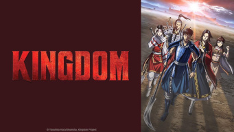

title: Séries Animés

# Les Séries Animés
_(par pays et par ordre alphabétique)_

## Etats-Unis

Affiche|Information
:---:|:---
 

:material-star:{.gold .heart}:material-star:{.gold .heart}:material-star:{.gold .heart}:material-star:{.gold .heart}:material-star:{.gold .heart}|Série Animé : **Blue Eye Samurai** Origine: **Etats-Unis** Sortie en **2023** Nb. épisodes: **8**  _Série animée dont le thème est la vengeance, et le graphisme est magnifique. Œuvre d'art._
 

:material-star:{.gold .heart}:material-star:{.gold .heart}:material-star:{.gold .heart}:material-star-half-full:{.gold .heart}:material-star-outline:{.grey }|Série Animé : **Splinter Cell: Deathwatch** Origine: **Etats-Unis** Sortie en **2025** Nb. épisodes: **8**  _Bien fait mais pas assez proche du jeu du même nom._

## France

Affiche|Information
:---:|:---
 

:material-star:{.gold .heart}:material-star:{.gold .heart}:material-star:{.gold .heart}:material-star:{.gold .heart}:material-star-outline:{.grey }|Série Animé : **Astérix & Obélix : Le Combat des Chefs** Origine: **France** Sortie en **2025** Nb. épisodes: **5**  _Respecte l'esprit des auteurs de la BD, avec quelques mises à jour bien venues._

## Japon

Affiche|Information
:---:|:---
 

:material-star:{.gold .heart}:material-star:{.gold .heart}:material-star:{.gold .heart}:material-star-outline:{.grey }:material-star-outline:{.grey }|Série Animé : **Kingdom** Origine: **Japon** Sortie de la 4° saison en **2022** Nb. épisodes: **129**  _Dessin animé sur l'histoire de la Chine au 2e siècle avant Jésus-Christ. Le dessin reste un classique du genre mais l'intérêt de celui-ci est le suivi de l'histoire et l'explication des stratégies militaires de l'époque._
 

:material-star:{.gold .heart}:material-star:{.gold .heart}:material-star-half-full:{.gold .heart}:material-star-outline:{.grey }:material-star-outline:{.grey }|Série Animé : **Le Pavillon des hommes** Origine: **Japon** Sortie en **2023** Nb. épisodes: **10**  _Dans le Japon féodal, suite à une épidémie, ce sont les femmes qui dirigent: ensemble un peu décousu même si le sujet est plutôt bien traité._
